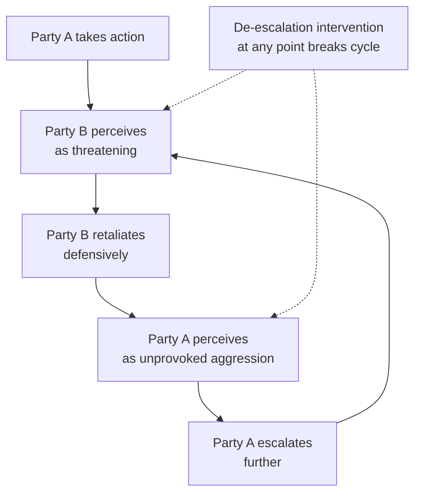

## De-Escalation Techniques

### Overview

De-escalation refers to the deliberate set of communicative, procedural, and strategic techniques used to reduce the intensity of conflict — whether an acute confrontation in a negotiating room, a crisis unfolding between states, or a broader spiral of hostile action and reaction. De-escalation is distinct from resolution: it addresses the *trajectory and intensity* of a conflict without necessarily resolving its underlying substantive causes. A successfully de-escalated conflict may still require subsequent mediation or negotiation to reach durable resolution; de-escalation's narrower goal is to prevent immediate harm and create the conditions under which resolution becomes possible.

The field draws on three overlapping bodies of knowledge: interpersonal conflict psychology (applicable to tense negotiating-room dynamics), crisis-management and deterrence theory (applicable to interstate crisis de-escalation), and conflict-cycle theory (applicable to protracted, spiraling conflicts generally).

### The Escalation-De-escalation Spiral

Conflict escalation is frequently modeled as a self-reinforcing spiral rather than a linear process: each party's defensive or retaliatory action is perceived by the other as offensive, prompting a further retaliatory response, with both sides typically perceiving themselves as reacting rather than initiating (a well-documented perceptual asymmetry sometimes called the "actor-observer" effect in this context).

**Key Points**

- Because each party typically experiences its own actions as defensive/reactive and the other's as aggressive/initiating, de-escalation efforts that assign blame to one side tend to entrench rather than interrupt the spiral
- Effective de-escalation interventions can, in principle, be introduced at multiple points in the cycle; earlier intervention generally requires less intensive effort, consistent with escalation-stage models (see Glasl's model below)

### Glasl's Nine-Stage Escalation Model

Friedrich Glasl's widely referenced model describes conflict escalation as progressing through nine stages, grouped into three tiers, with de-escalation strategies differing by tier:

| Tier | Stages | Characteristic dynamic | Typical appropriate intervention |
| --- | --- | --- | --- |
| Win-Win | 1. Hardening, 2. Debate/polemics, 3. Actions replace words | Still rational, self-regulable | Facilitation, structured dialogue |
| Win-Lose | 4. Coalition-building, 5. Loss of face, 6. Threat strategies | Zero-sum framing emerges | Mediation with directive elements |
| Lose-Lose | 7. Limited destructive strikes, 8. Fragmentation of enemy, 9. Together into the abyss | Parties willing to accept mutual harm | Power-based intervention, imposed settlement, or external coercive limitation |

**[Inference]** A key implication often drawn from Glasl's model is that the *appropriate mode of third-party intervention itself changes* by stage — facilitative mediation, effective at Stage 2 or 3, is generally regarded as insufficient once a conflict has progressed to Stage 7 or beyond, where more directive or power-backed intervention is typically considered necessary — though the precise stage thresholds are heuristic rather than empirically fixed boundaries.

### Interpersonal and Small-Group De-escalation Techniques

**Key Points**

- These techniques are directly applicable within a negotiating room, a mediation caucus, or a multilateral session that has become heated (see Chairing and Facilitating Multilateral Sessions)

**Core techniques:**

1. **Active listening and reflective paraphrasing** — demonstrating that a hostile statement has been heard accurately, which frequently reduces the emotional intensity behind it even before substantive response is offered
2. **Tactical pauses** — deliberately slowing the pace of exchange (a chair calling a short recess, a mediator requesting a caucus) to interrupt the physiological and cognitive momentum of an escalating exchange
3. **Reframing from position to interest** — restating an accusatory or absolute statement in less adversarial, interest-oriented language without altering its substance (see Facilitative Versus Evaluative Mediation Styles)
4. **Separating people from the problem** — a core principle from interest-based negotiation (Fisher and Ury) directing parties toward the substantive issue and away from personal or reputational attack
5. **Face-saving formulations** — offering language or process moves that allow a party to shift position without being seen to capitulate (critical given that "loss of face" is itself an escalation driver at Glasl's Stage 5)
6. **Moving from joint session to caucus** — removing parties from each other's direct presence when face-to-face exchange has become counterproductive, allowing a mediator to work with each side separately before re-convening

**Example**

> Heated exchange: "Your delegation has repeatedly acted in bad faith and cannot be trusted."
>
> De-escalating response (chair or mediator): "I want to make sure I understand the specific commitment that wasn't met, since that seems to be at the center of the concern. Can we identify exactly which point that is, so we can address it directly?"

This response absorbs the emotional charge, redirects toward a specific, addressable issue, and avoids validating or contesting the character accusation itself.

### Crisis and Interstate De-escalation Techniques

At the interstate level, de-escalation draws heavily on crisis-management and deterrence theory, particularly literature developed around Cold War-era crisis studies (e.g., the Cuban Missile Crisis is a canonical reference case).

**Core mechanisms:**

1. **Signaling and reassurance** — deliberate, often unilateral, actions or statements intended to communicate non-hostile intent and reduce the other side's perceived threat, without requiring formal negotiation
2. **Graduated Reciprocation in Tension-reduction (GRIT)** — a strategy proposed by Charles Osgood in which one party makes a small, publicly announced unilateral concession, explicitly invites but does not demand reciprocation, and continues a graduated series of such steps regardless of immediate reciprocity, intended to break a mutual-suspicion deadlock incrementally
3. **Back-channel communication** — discreet, deniable direct contact between parties (or through a trusted intermediary) allowing candid signaling without the domestic political costs of public statements (functionally related to Track I.5/II mechanisms — see Track II and Track III Diplomacy in Practice)
4. **Crisis hotlines and direct communication links** — institutionalized channels (the US-USSR Moscow-Washington hotline established after the Cuban Missile Crisis is the paradigmatic example) designed specifically to reduce the risk of miscalculation-driven escalation during acute crises
5. **Face-saving off-ramps** — publicly announceable formulations that allow a state to step back from an escalatory commitment without appearing to have been coerced or defeated (the removal of US Jupiter missiles from Turkey, kept confidential at the time, alongside the public Soviet missile withdrawal from Cuba, functioned partly as this kind of arrangement)

**[Inference]** GRIT-style unilateral, graduated concession strategies are theoretically well-developed but are considered by many crisis-management scholars to carry real risk if the other party interprets the initial concession as weakness rather than good faith, rather than reciprocating — this is a genuine, debated limitation of the model rather than a settled objection.

### Verbal and Rhetorical De-escalation Techniques

**Key Points**

- **"I" statements over "you" statements** — framing concerns in terms of one's own position or need rather than accusatory characterization of the other party, reducing defensive reaction
- **Avoiding absolute language** — "always," "never," and similar totalizing language tend to provoke defensive counter-assertion; more qualified language ("in this instance," "on this point") keeps the door open for distinguishing the current issue from a broader pattern
- **Explicit acknowledgment before disagreement** — briefly acknowledging a valid element of the other party's statement before introducing disagreement, which reduces the perception that the listener is being dismissed entirely
- **Tone and pacing management** — a slower, lower-register response to a heated statement can itself function de-escalatingly, independent of content, by not matching the other party's escalatory affect

### Procedural De-escalation Tools

In formal settings (multilateral sessions, formal mediation), procedural mechanisms function as de-escalation tools independent of specific verbal technique:

- **Recess or adjournment** — a chair's or mediator's authority to pause proceedings entirely, allowing emotional and physiological de-escalation time before resuming
- **Moving to smaller format** — shifting a dispute from full plenary to a smaller contact group or bilateral, removing the audience effect that can incentivize hardened public positioning (see Chairing and Facilitating Multilateral Sessions)
- **Bracketing contentious language** — provisionally setting aside a specific disputed point in a text rather than forcing immediate resolution, allowing the broader process to continue
- **Reframing via a chair's or mediator's synthesis statement** — offering neutral language that both sides can accept as an accurate (if incomplete) characterization of the state of play, reducing the pressure either side feels to restate their position more forcefully

### Common Failure Modes in De-escalation Attempts

**Key Points**

- **Premature reassurance** — offering conciliatory gestures before genuinely understanding the other party's underlying concern, which can be perceived as dismissive rather than de-escalating
- **Asymmetric blame attribution** — a third party's de-escalation attempt that implicitly or explicitly assigns fault to one side reinforces rather than interrupts the escalation spiral, given the actor-observer perceptual asymmetry noted above
- **Mistaking silence for de-escalation** — avoiding a substantive issue rather than addressing it directly can produce temporary calm while allowing underlying grievance to resurface later, often at higher intensity
- **Over-reliance on unilateral gestures without follow-through** — a GRIT-style concession that is not sustained or is reversed under domestic political pressure can damage credibility more than making no gesture at all
- **De-escalating process while ignoring structural cause** — verbal and procedural techniques can calm an immediate exchange without addressing the structural conflict driver identified through conflict analysis (see Conflict Analysis and Mapping), risking recurrence

### Related Topics

- Glasl's nine-stage escalation model in full, including intervention-mode transitions by tier
- GRIT and unilateral initiative strategies in crisis bargaining
- Crisis communication channels and hotline diplomacy (Cold War case studies)
- Face-saving and loss-of-face dynamics in negotiation
- Caucus and shuttle techniques as structural de-escalation tools
- Interest-based negotiation and the separation of people from the problem