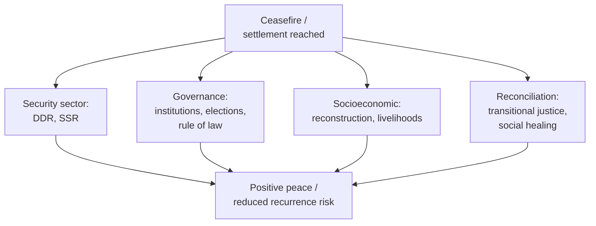

## Peacebuilding and Post-Conflict Reconciliation

### Overview

Peacebuilding is the field of practice and theory concerned with establishing durable conditions for peace after violent conflict has ended or substantially subsided, addressing the structural, institutional, and relational drivers of conflict recurrence rather than merely halting active violence. Post-conflict reconciliation is a related but analytically distinct concept focused specifically on repairing relationships between formerly warring groups or communities at the societal and interpersonal level. The two are frequently discussed together because durable peacebuilding is widely understood to depend on reconciliation processes, even though a state can achieve negative peace (absence of violence) without meaningful reconciliation having occurred.

The foundational conceptual distinction in the field, articulated by Johan Galtung, separates **negative peace** (the absence of direct violence) from **positive peace** (the presence of social justice, functioning institutions, and structural conditions that make renewed violence unlikely). Most contemporary peacebuilding theory treats positive peace as the actual target, with negative peace as a necessary but insufficient precondition.

### Boutros-Ghali's Foundational Framework

The UN's 1992 *An Agenda for Peace* (Secretary-General Boutros Boutros-Ghali) established the now-standard four-part conceptual vocabulary still used across the field:

| Term | Definition | Timing relative to conflict |
| --- | --- | --- |
| Preventive diplomacy | Action to prevent disputes from escalating into conflict | Before conflict onset |
| Peacemaking | Bringing hostile parties to agreement, chiefly through mediation and negotiation | During active conflict |
| Peacekeeping | Deployment of (often UN-mandated) forces to maintain ceasefires and create conditions for peace | Post-ceasefire, pre-durable settlement |
| Peacebuilding | Actions to identify and support structures that strengthen and solidify peace, avoiding relapse into conflict | Post-settlement, longer-term |

**[Inference]** In practice these categories overlap substantially and are rarely executed in strict sequence — peacebuilding activities (institution-building, reconciliation programming) often begin during active peacekeeping deployment rather than only after it concludes, and this overlap is now widely acknowledged in the literature rather than treated as a departure from the original framework.

### The Sequencing and Layers of Peacebuilding

**Key Points**

- Peacebuilding is multi-dimensional by design; single-track approaches (e.g., security-sector reform alone, without parallel governance or reconciliation work) are widely regarded in the literature as insufficient and vulnerable to relapse
- Lederach's "pyramid" model (below) further stresses that peacebuilding must operate across *societal levels*, not only sectors

### Lederach's Peacebuilding Pyramid

John Paul Lederach's influential model maps peacebuilding actors and activities across three tiers of society, arguing that durable peace requires engagement at all three simultaneously rather than concentration at the top alone:

| Level | Actors | Typical activity |
| --- | --- | --- |
| Top leadership (Track I) | Heads of state, military/political elites | High-level negotiations, formal peace agreements |
| Middle-range leadership (Track II) | Religious leaders, academics, NGO heads, ethnic/communal leaders | Problem-solving workshops, conflict-resolution training, insider-partial mediation |
| Grassroots leadership (Track III) | Local leaders, community developers, refugee camp leaders, indigenous NGOs | Local peace commissions, prejudice reduction, trauma healing, grassroots reconciliation |

**[Inference]** Lederach's framework is often cited as a corrective to peacebuilding practice that concentrates almost exclusively at the top-leadership level; the strength of the "middle-range" tier specifically is that actors there frequently have both social standing and physical/relational access across conflict lines that top elites lack — though the model's tripartite division, like Track I/II/III generally, is a simplification of what is often a more continuous social structure.

### Disarmament, Demobilization, and Reintegration (DDR)

A standard technical component of post-conflict peacebuilding addressing former combatants:

1. **Disarmament** — collection, documentation, and disposal of weapons held by combatants
2. **Demobilization** — formal discharge of combatants from armed groups or forces, often involving transitional cantonment
3. **Reintegration** — social and economic reintegration of former combatants into civilian life, including livelihoods support and psychosocial assistance

**[Unverified]** DDR program effectiveness varies substantially by context and is sensitive to program design details (whether reintegration support is individual or community-based, adequacy of funding continuity) — specific success-rate claims should be checked against context-specific evaluations rather than treated as generalizable.

### Security Sector Reform (SSR)

Restructuring of a post-conflict state's military, police, and justice institutions to be accountable, professional, and non-partisan — addressing situations where the security sector itself was a driver or instrument of the preceding conflict (a common dynamic in conflicts involving state repression or factionalized militaries).

### Transitional Justice Mechanisms

Transitional justice addresses how a post-conflict society accounts for past atrocities and human rights violations, generally pursuing some combination of the following mechanisms rather than a single approach:

1. **Criminal prosecutions** — domestic courts, hybrid tribunals, or international mechanisms (e.g., the International Criminal Tribunal for Rwanda) holding perpetrators individually accountable
2. **Truth commissions** — official bodies documenting patterns of past abuse, often through public testimony, prioritizing acknowledgment and historical record over punishment (South Africa's Truth and Reconciliation Commission, 1996, is the most widely cited example)
3. **Reparations** — material or symbolic compensation to victims, which can be individual (direct payments) or collective (memorials, community development)
4. **Institutional reform** — vetting and reform of institutions (police, judiciary, civil service) implicated in past abuses, to prevent recurrence
5. **Memorialization** — memorials, museums, and commemorative practices that shape collective memory of the conflict

**Example** — South Africa's TRC combined public testimony from victims with a conditional amnesty mechanism for perpetrators who made full public disclosure of politically motivated crimes, an approach explicitly prioritizing truth-telling and reconciliation over retributive prosecution. **[Unverified]** — assessments of the TRC's long-term reconciliatory impact versus its limitations (including criticism regarding uneven outcomes for victims and limited structural/economic redress) remain actively debated in the scholarly literature and should be checked against current sources rather than treated as settled.

### Reconciliation: Theoretical Models

**Key Points**

- Reconciliation is generally treated in the literature as operating at multiple levels simultaneously: interpersonal (between individual victims and perpetrators), communal (between identity groups), and national (state-level acknowledgment and institutional change)
- Reconciliation is distinguished from mere coexistence: coexistence requires only the absence of renewed violence, while reconciliation implies some degree of restored relationship, trust, or at minimum mutual acknowledgment of harm

Commonly cited components (drawing on the truth-and-reconciliation literature, notably work associated with Lederach and with reconciliation scholar David Bloomfield):

1. **Truth** — acknowledgment of what occurred, from both/all sides where applicable
2. **Justice** — some form of accountability, whether retributive, restorative, or a hybrid
3. **Mercy/forgiveness** — a voluntary process on the part of victims, which reconciliation frameworks generally treat as something that cannot be externally imposed or mandated
4. **Peace/security** — a stable enough environment for the preceding elements to be pursued without fear of renewed violence

**[Inference]** These four elements are frequently presented as being in productive tension with one another (truth-telling can complicate reconciliation if it reopens wounds without accompanying justice mechanisms; pursuit of retributive justice can itself impede reconciliation if perceived as victor's justice) — the literature generally treats balancing these tensions as a context-specific design challenge rather than one with a universal resolution.

### Restorative versus Retributive Justice Approaches

| Dimension | Retributive | Restorative |
| --- | --- | --- |
| Central question | What law was broken, who did it, what punishment is deserved? | Who was harmed, what are their needs, whose obligation is it to repair? |
| Primary actors | State, prosecutor, defendant | Victim, offender, affected community |
| Typical mechanism | Criminal trial | Truth commission, community-based mechanisms (e.g., Rwanda's gacaca courts) |
| Underlying goal | Accountability and deterrence | Relationship repair and social reintegration |

### Local and Traditional Reconciliation Mechanisms

Many post-conflict societies draw on pre-existing customary or traditional dispute-resolution and reconciliation practices, integrated with (or operating alongside) formal transitional justice mechanisms:

- **Gacaca courts** (Rwanda) — community-based hearings adapted from a traditional dispute-resolution practice, used at scale to process genocide-related cases too numerous for the formal judicial system
- **Mato oput** (Acholi communities, northern Uganda) — a traditional reconciliation ritual involving acknowledgment, compensation, and a shared bitter-root ceremony symbolizing restored relationship, applied in some post-LRA-conflict reintegration contexts
- **Bashingantahe** (Burundi) — a traditional council-based mediation and reconciliation institution

**[Unverified]** The scale, fidelity, and effectiveness of adapting traditional mechanisms to mass-atrocity contexts (as opposed to their original interpersonal or small-community scope) is contested in the literature; claims about their success should be checked against context-specific scholarship.

### Common Failure Modes in Peacebuilding and Reconciliation

**Key Points**

- **Negative-peace plateau** — treating cessation of violence as the finish line, without pursuing the structural and relational work required for positive peace, leaving root causes (see Conflict Analysis and Mapping) unaddressed and recurrence risk elevated
- **Elite-level settlement without grassroots buy-in** — a Track I peace agreement not accompanied by middle-range and grassroots reconciliation work (per Lederach's pyramid) is more vulnerable to renewed communal-level tension or spoiler exploitation
- **Justice-reconciliation trade-off mismanagement** — pursuing either pure retribution or blanket amnesty without a context-sensitive balance can undermine either accountability or social healing, respectively
- **Externally-imposed timelines** — donor or international funding cycles that impose short program timeframes on processes (trauma healing, institutional trust-building) that inherently require a much longer horizon
- **Insufficient attention to economic dimensions** — reconciliation and institutional reform efforts that neglect livelihoods and economic reintegration (particularly of former combatants) can leave a durable material grievance capable of reigniting conflict

### Related Topics

- Galtung's negative versus positive peace distinction in full
- Lederach's peacebuilding pyramid and middle-range leadership theory
- Transitional justice mechanism design and sequencing
- DDR and SSR program architecture
- Traditional and customary reconciliation mechanisms (gacaca, mato oput)
- Track II/III diplomacy's role in grassroots reconciliation
- Conflict analysis as a precondition for peacebuilding program design