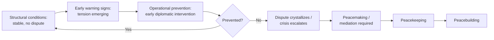

## Preventive Diplomacy

### Overview

Preventive diplomacy is the branch of diplomatic practice concerned with action taken to prevent disputes from arising between parties, to prevent existing disputes from escalating into violent conflict, and to limit the spread of conflict once it occurs. It sits first in the conceptual sequence established by Boutros-Ghali's 1992 *An Agenda for Peace* (preventive diplomacy → peacemaking → peacekeeping → peacebuilding), and is generally regarded as the most cost-effective point of intervention, since it operates before the sunk costs, casualties, and hardened attitudes of active conflict have accumulated. Its central practical difficulty is precisely the inverse of that advantage: successful prevention produces a non-event (a crisis that did not occur), which makes political prioritization, resourcing, and evaluation of preventive diplomacy chronically difficult relative to visible crisis response.

### Conceptual Placement and Scope

**Key Points**

- Preventive diplomacy is distinguished from **conflict prevention** more broadly (which includes structural, long-term measures — development, governance reform, addressing root causes identified through conflict analysis) by its focus on direct diplomatic and political action aimed at an identifiable, emerging dispute
- It is distinguished from **peacemaking** by timing: peacemaking operates once conflict is already active; preventive diplomacy operates before violent conflict has broken out, or in the early stages of a dispute before large-scale violence occurs
- Preventive diplomacy is often further split into **structural prevention** (addressing underlying, long-term drivers) and **operational prevention** (short-term measures responding to an emerging, specific crisis) — a distinction formalized in the Carnegie Commission on Preventing Deadly Conflict's influential 1997 report

### The Prevention Spectrum

**[Inference]** The boundary between "structural prevention" and general development or governance assistance is not sharply defined in the literature — much of what is termed structural conflict prevention overlaps substantially with good governance and development programming more broadly, and is distinguished mainly by whether conflict risk is an explicit design criterion for the intervention.

### Core Tools and Mechanisms

#### Early Warning Systems

Systematic monitoring and analysis intended to detect rising tension or violence risk before it escalates. Early warning systems typically combine:

- **Structural indicators** — governance quality, economic inequality, demographic pressure, and other slow-moving risk factors correlated with conflict onset in comparative research
- **Dynamic/trigger indicators** — real-time monitoring of events, rhetoric, troop movements, and other proximate signals of escalation
- **Analytical/response linkage** — the mechanism connecting a warning signal to an actual decision to act, frequently identified in the literature as the weakest link in the chain (the "early warning–early action gap")

Prominent institutional examples include the UN's Department of Political and Peacebuilding Affairs regional early-warning functions, the African Union's Continental Early Warning System, and NGO-run systems such as the International Crisis Group's country and regional analysis.

**[Inference]** The persistent "early warning–early action gap" identified across the literature is generally attributed less to a lack of analytical capacity to detect emerging crises and more to the political, resourcing, and bureaucratic obstacles that prevent warnings from translating into timely diplomatic engagement — a governance and incentive problem rather than a purely technical/informational one.

#### Fact-Finding and Special Envoys

Deployment of a neutral fact-finding mission or a special envoy/representative to engage directly with parties in an emerging dispute, gather information, and open or maintain channels of communication before positions harden. UN Secretary-General "good offices" missions and Special Envoys/Representatives (e.g., for specific country or regional situations) are the paradigmatic institutional form of this tool.

#### Preventive Deployment

The deployment of a monitoring or lightly armed force to a border or contested area specifically to deter escalation, distinct from post-conflict peacekeeping in that it precedes rather than follows major violence. The UN Preventive Deployment Force (UNPREDEP) in Macedonia (1995–1999) is the most commonly cited case of an explicitly preventive (as opposed to post-conflict) peacekeeping deployment.

#### Confidence-Building Measures (CBMs)

Reciprocal or unilateral measures intended to reduce mutual threat perception and build trust incrementally between parties before a dispute escalates:

- Military CBMs — advance notification of exercises, observation arrangements, hotlines (functionally related to the crisis-communication tools discussed under de-escalation)
- Political/diplomatic CBMs — regular consultation mechanisms, joint commissions, cultural and economic exchange
- The OSCE's extensive CBM regime (developed from the 1975 Helsinki process) is the most institutionally developed example of systematized CBMs applied preventively among states

#### Preventive Mediation and Quiet Diplomacy

Distinguished from crisis mediation by its lower profile and earlier timing — engagement conducted discreetly, often without public announcement, to help parties resolve an emerging dispute before it becomes a matter of public positioning (which, per escalation-dynamics theory, tends to harden positions — see De-Escalation Techniques). Quiet diplomacy relies heavily on the credibility and access of the intervening party, frequently a respected individual, regional organization, or state without a direct stake in the dispute's outcome.

#### Sanctions and Conditionality as Preventive Tools

Threatened (rather than imposed) sanctions, or conditional incentives tied to de-escalatory behavior, can function preventively when applied early enough to shape a party's calculus before a course of action is locked in — functioning as a form of Zartman's "manipulative leverage" (see Mediation Theory and Third-Party Intervention) deployed pre-emptively rather than during active mediation.

### Institutional Actors in Preventive Diplomacy

| Actor type | Example institutions | Typical role |
| --- | --- | --- |
| Universal international organization | UN (Secretary-General's good offices, DPPA) | Global-reach fact-finding, envoys, mediation support |
| Regional organization | AU, OSCE, ASEAN, OAS | Regional early warning, norms-based peer pressure, regional mediation |
| Individual states | Major or middle powers with regional credibility | Bilateral quiet diplomacy, offering good offices |
| Non-governmental/Track II | International Crisis Group, Carter Center, HD Centre | Independent early warning analysis, unofficial mediation and dialogue facilitation |

### Structural versus Operational Prevention: Comparative Table

| Dimension | Structural prevention | Operational prevention |
| --- | --- | --- |
| Time horizon | Long-term (years to decades) | Short-term (weeks to months) |
| Target | Root causes: governance, inequality, institutional exclusion | A specific, identifiable emerging dispute or crisis |
| Typical tools | Development assistance, institution-building, governance reform | Envoys, fact-finding, quiet mediation, preventive deployment |
| Evaluation difficulty | Very high — effects diffuse and long-delayed | High, but somewhat more attributable to a specific averted crisis |

### The Political Economy Problem of Prevention

**Key Points**

- Because successful prevention produces a non-event, it is structurally difficult to demonstrate its value to funders, publics, or legislatures compared with visible crisis response or post-conflict reconstruction, which is a widely discussed structural bias against preventive investment in international institutions and donor governments
- This creates a persistent resourcing asymmetry: international attention and funding tend to flow disproportionately toward active crises and post-conflict reconstruction relative to preventive engagement, even though preventive diplomacy is generally understood in the field to be substantially less costly than crisis response or reconstruction
- Sovereignty concerns compound this problem: states are often reluctant to permit external preventive engagement in what they characterize as internal or bilateral matters, since inviting preventive diplomacy can itself be read domestically or internationally as an admission that a serious problem exists

### Common Failure Modes

**Key Points**

- **Warning without action** — early warning analysis correctly identifying rising risk, but without institutional or political mechanisms translating the warning into diplomatic engagement (the "early warning–early action gap")
- **Premature publicity** — preventive diplomacy conducted too visibly, triggering the same public-positioning and face-saving dynamics that quiet diplomacy is specifically designed to avoid
- **Sovereignty resistance** — a party's rejection of preventive engagement as illegitimate interference, particularly where the intervening actor lacks sufficient trust or perceived impartiality (see the impartiality/leverage distinction discussed under mediation theory)
- **Misdiagnosis of dispute maturity** — intervening with tools appropriate to an early-stage dispute (quiet diplomacy, CBMs) in a situation that has already progressed further along an escalation trajectory (see Glasl's model under De-Escalation Techniques), where more directive intervention would be required
- **Resourcing discontinuity** — preventive engagement that begins promisingly but loses funding or political attention once the immediate warning signal fades, without addressing underlying structural drivers

### Related Topics

- Boutros-Ghali's *An Agenda for Peace* and the four-part peace-operations vocabulary
- Early warning system design and the early warning–early action gap
- Confidence-building measures and the OSCE/Helsinki model
- Quiet diplomacy and special envoy practice
- Conflict analysis and mapping as an input to structural prevention design
- Ripeness theory's relevance to timing preventive mediation