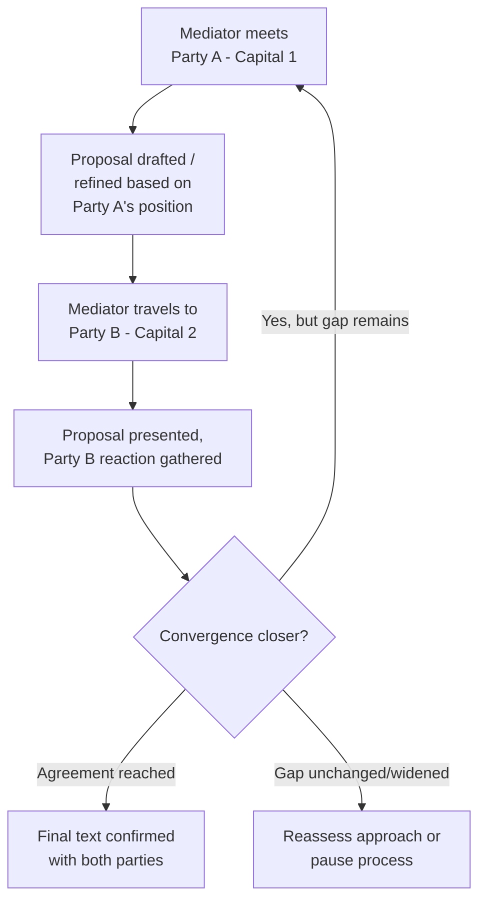

## Shuttle Diplomacy

### Overview

Shuttle diplomacy is a negotiation and mediation modality in which a third party physically or communicatively moves back and forth between disputing parties who are unwilling or unable to negotiate face-to-face, relaying proposals, testing reactions, and narrowing gaps without requiring the parties to be in the same room — or, in its strictest form, without requiring them to communicate directly at all. The term entered common diplomatic vocabulary through US Secretary of State Henry Kissinger's intensive personal mediation between Israel and its neighbors following the 1973 Yom Kippur War, though the underlying technique — proximity-based, indirect mediated communication — predates the term and remains a standard tool across contemporary mediation practice.

### Definitional Distinctions

**Key Points**

- Shuttle diplomacy is a subtype of **proximity talks**, a broader category in which parties remain physically separated (in different rooms, buildings, or cities) while a mediator moves between them; "shuttle diplomacy" specifically emphasizes the mediator's own travel and high personal involvement in carrying proposals
- It is distinguished from **direct/joint-session negotiation**, where parties communicate face-to-face with a mediator present as facilitator, and from pure **good offices**, where the third party merely provides a channel without actively shaping content
- It should not be confused with **back-channel diplomacy** (see Preventive Diplomacy and Track II and Track III Diplomacy in Practice), which emphasizes discretion and deniability; shuttle diplomacy can be either public and highly visible (as Kissinger's was) or conducted with substantial discretion, depending on the political context

### Why Parties Accept Shuttle Diplomacy

Shuttle diplomacy is typically employed when direct engagement carries costs or risks that indirect engagement avoids:

1. **Non-recognition** — parties that do not formally recognize each other (or wish to avoid the domestic political signal of appearing to negotiate directly) can engage substantively without the optics of direct contact
2. **Loss-of-face avoidance** — proposals and concessions can be tested and revised through the mediator before either side commits publicly, reducing the reputational cost of a rejected or unpopular offer (functionally similar to the single negotiating text technique — see Mediation Theory and Third-Party Intervention)
3. **Deep mistrust or active hostility** — where direct contact risks provocation, breakdown, or physical security concerns, especially amid or immediately after active conflict
4. **Domestic political constraints** — leaders facing hostile domestic audiences can avoid the appearance of direct concession-making to an adversary, attributing any movement in position to the mediator's proposal rather than to bilateral negotiation

**[Inference]** The mediator's physical travel between capitals — as opposed to using cables, phone calls, or video links — is often understood in the literature to carry symbolic and confidence-building value beyond its purely informational function: sustained personal presence signals the mediator's investment and can itself build the trust needed for parties to take proposals seriously, though this is a difficult-to-verify psychological claim about historical cases (i.e., a plausible inference rather than a rigorously established finding) rather than a strictly logistical necessity in an era of instant communication.

### Kissinger's 1973–1975 Shuttle Diplomacy: Structural Case Study

Following the Yom Kippur War, Kissinger conducted an extended series of personal trips between Jerusalem, Cairo, Damascus, and other regional capitals to negotiate disengagement agreements between Israel and Egypt, and Israel and Syria, in the absence of a framework for direct Arab-Israeli negotiation at that time.

**Key Points from the case**

- The process was conducted over an extended period involving dozens of individual flights and meetings, rather than a single intensive session — shuttle diplomacy of this kind is frequently a sustained, iterative process rather than a rapid technique
- Kissinger held significant informational leverage (per Zartman and Touval's framework — see Mediation Theory and Third-Party Intervention): as the only party in direct contact with both sides' unfiltered positions, he could identify overlapping zones of acceptability that neither side could see directly
- The approach produced incremental disengagement agreements (Sinai I and II, and the Israeli-Syrian disengagement agreement) rather than a comprehensive settlement — a pattern consistent with shuttle diplomacy's general strength at incremental, sequenced agreements over single comprehensive breakthroughs

### Mechanics and Techniques

**Core techniques specific to the shuttle format:**

1. **Selective information relay** — the mediator controls what is communicated to each side, choosing how to frame, sequence, and contextualize each party's position to the other (raising the informational-leverage and manipulation-risk considerations discussed below)
2. **Trial balloons** — floating a proposed formulation to one side as a hypothetical ("what if the language read...") without attributing it to the other party, testing reaction before any actual commitment is sought
3. **Incremental convergence tracking** — the mediator maintains a private, evolving sense of the "zone of possible agreement" that neither party can see in full, updating it after each leg of the shuttle
4. **Sequenced concession management** — structuring the order in which issues are raised with each side to build momentum from easier, more tractable points toward harder ones
5. **Symbolic pacing** — the frequency, duration, and visibility of trips can itself communicate urgency, seriousness, or patience, functioning as a form of process-level signaling independent of the substantive content carried

### Comparative Position Among Mediation Modalities

| Modality | Physical/direct contact between parties | Mediator's control over information flow | Typical use case |
| --- | --- | --- | --- |
| Direct/joint session | Full | Low — parties hear each other directly | Established relationship, workable trust |
| Proximity talks (general) | None during sessions | High | Deep mistrust, non-recognition |
| Shuttle diplomacy | None; mediator travels between separate locations | Very high | Non-recognition, active/recent hostility, high loss-of-face sensitivity |
| Single negotiating text | Variable | High on drafting, lower on live exchange | Complex multilateral text negotiation (see Camp David example under Mediation Theory) |

### Advantages and Limitations

**Key Points — advantages:**

- Enables negotiation between parties who cannot or will not meet directly, making it sometimes the *only* viable channel available
- Substantially reduces face-saving risk, since proposals can be tested and withdrawn before either party is publicly committed
- Concentrates informational leverage in a single, trusted point, potentially enabling creative bridging solutions neither party could identify independently

**Key Points — limitations:**

- **Mediator-dependent bottleneck** — all communication passes through one channel, meaning the mediator's own misjudgment, fatigue, or misreading of a party's position can derail progress in ways direct communication might not
- **Reduced relationship-building between parties themselves** — because the parties never interact directly, shuttle diplomacy does little to build the direct trust or communication habits that durable post-agreement relationships typically require, arguably making it well-suited to reaching an agreement but less suited to sustaining one afterward without follow-on direct engagement
- **Resource and access intensity** — sustained shuttle diplomacy at the Kissinger scale requires extraordinary personal time investment and the standing/access to be received credibly by all parties, limiting how frequently and by whom it can be deployed
- **Risk of manipulation perception** — because the mediator controls what each side hears about the other, any perceived selective framing or misrepresentation — even if well-intentioned — can catastrophically damage mediator credibility once discovered

**[Inference]** Because shuttle diplomacy structurally withholds parties from each other's direct, unmediated exchange, it is generally considered by scholars to be best suited to reaching an initial breakthrough or disengagement agreement rather than the durable trust-building or relationship-transformation goals associated with transformative mediation (see Facilitative Versus Evaluative Mediation Styles) — a shift toward direct or Track II engagement following a shuttle-negotiated initial agreement is a commonly observed sequencing rather than a strict requirement.

### Contemporary Applications Beyond the Classical Model

- **Video and telecommunications shuttle** — modern shuttle diplomacy increasingly uses secure video links and encrypted communication in place of, or alongside, physical travel, particularly for maintaining momentum between in-person rounds
- **Multi-party shuttle in multilateral settings** — chairs of contact groups in multilateral negotiations (see Chairing and Facilitating Multilateral Sessions) frequently employ shuttle-style bilateral consultations between formal plenary sessions to test bracketed text before returning to the full room
- **UN and regional envoy shuttle practice** — UN Special Envoys and regional-organization mediators routinely use shuttle techniques as a standard tool within broader mediation processes, rather than as a standalone, named methodology distinct from ordinary mediation practice

### Common Failure Modes

**Key Points**

- **Message drift** — unintentional distortion of a party's position as it passes through repeated relay, particularly over an extended shuttle process with many iterations
- **Over-reliance without an exit path to direct engagement** — a shuttle process that never transitions toward some form of direct or semi-direct contact can leave even a successfully negotiated agreement fragile, absent the relational foundation for implementation and dispute management
- **Asymmetric access** — if one party perceives (rightly or wrongly) that the mediator has closer personal or political ties to the other side, the informational-leverage advantage central to shuttle diplomacy's effectiveness can instead become a source of distrust
- **Fatigue-driven error** — the intensive personal and logistical demands of sustained shuttle diplomacy can degrade a mediator's judgment or attention to nuance over an extended process

### Related Topics

- Zartman and Touval's leverage framework as applied to shuttle mediators
- Proximity talks and caucus-based mediation more broadly
- Kissinger's 1973–1975 Middle East disengagement negotiations as an extended case study
- Single negotiating text technique as a related indirect-drafting tool
- Track I.5 and back-channel diplomacy's relationship to shuttle formats
- Transitioning from shuttle-negotiated agreements to durable direct engagement