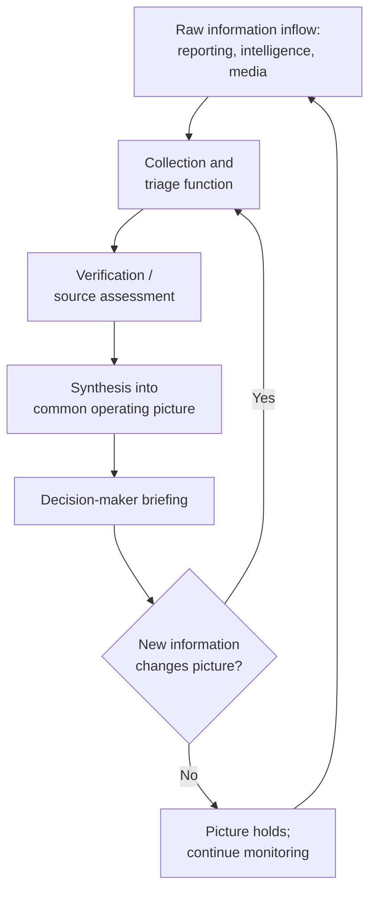

## Crisis Diagnosis and Situational Awareness

### Overview

Crisis diagnosis is the analytical process by which decision-makers and their advisory staff determine, under conditions of urgency and incomplete information, what kind of situation they are actually facing — its nature, scale, trajectory, and stakes — before deciding how to respond. Situational awareness is the ongoing cognitive and organizational capacity to maintain an accurate, current picture of a rapidly evolving crisis as new information arrives. The two are tightly linked: diagnosis is a point-in-time judgment, while situational awareness is the sustained process that keeps that judgment current as a crisis unfolds. Both are foundational to crisis diplomacy because most consequential crisis errors in the historical record are diagnostic rather than merely tactical — decision-makers who correctly execute a response to a misdiagnosed situation still produce poor outcomes.

### Defining a Diplomatic/International Crisis

The academic literature (notably work associated with Charles Hermann and later crisis-management scholars such as Alexander George) generally converges on three defining structural features of a crisis, as distinct from routine foreign-policy decision-making:

1. **High threat to important values or interests** — the stakes are perceived as significant, not routine
2. **Short decision time** — the situation compresses the normal deliberative timeframe, often to hours or days rather than weeks or months
3. **Surprise or unanticipated onset** — the situation was not, or not fully, anticipated by the standard planning process, though the degree of surprise varies considerably by case

$$\text{Crisis} = f(\text{Threat}, \text{Time compression}, \text{Surprise})$$

**[Inference]** These three dimensions are best understood as a continuum rather than a strict threshold — situations can exhibit high threat and severe time compression with little surprise (a long-anticipated deadline crisis), or high surprise with lower immediate threat — and practitioners should treat the definition as a diagnostic lens rather than a binary classifier for whether "crisis mode" formally applies.

### The Diagnostic Task: Core Questions

**Key Points**

- Diagnosis is not merely "what happened" but "what kind of situation is this," since the answer determines which response repertoire, decision-making structure, and time horizon are appropriate
- A recurring documented failure mode across crisis case studies is applying the wrong analogical frame (treating a novel situation as a recurrence of a previous, superficially similar crisis) — sometimes termed the "lessons of the last war" problem, discussed further below

Standard diagnostic questions crisis staffs work through, typically in the earliest hours:

1. **What is actually known versus assumed?** — separating confirmed fact from inference, rumor, or extrapolation, which is frequently blurred under time pressure
2. **Who are the relevant actors, and what are their apparent objectives?** — an early actor-mapping exercise analogous to, but more compressed than, the stakeholder mapping used in conflict analysis (see Conflict Analysis and Mapping)
3. **Is this an isolated incident or part of a broader pattern?** — determining whether the triggering event is a discrete occurrence or a signal of a larger unfolding process
4. **What is the trajectory — is the situation likely to escalate, stabilize, or de-escalate absent intervention?**
5. **What decision timeline is actually available**, as distinct from the timeline that feels psychologically urgent — a distinction crisis-management scholars stress because perceived time pressure frequently exceeds actual available decision time
6. **What historical precedents are being invoked, explicitly or implicitly, and are they actually analogous?**

### Situational Awareness as an Organizational Process

Situational awareness is not merely an individual cognitive state but an organizational one, requiring deliberate structures to sustain accuracy as information volume and velocity increase during a crisis.

**Key Points**

- **The common operating picture (COP)** — a term drawn from military and emergency-management practice, referring to a single, shared, continuously updated situational summary accessible to all relevant decision-makers, intended to prevent different parts of an organization from acting on inconsistent understandings of the same crisis
- **Redundant verification** — cross-checking information from multiple independent sources before it is treated as confirmed, particularly critical in the early, high-noise phase of a crisis when initial reporting is disproportionately likely to be incomplete or inaccurate
- **Explicit uncertainty labeling** — mature crisis-management practice distinguishes confirmed information, credible-but-unconfirmed reporting, and speculation in briefings, rather than presenting all inputs with uniform confidence

### Cognitive Biases Affecting Crisis Diagnosis

The crisis-decision-making literature (drawing heavily on Irving Janis's groupthink research and Robert Jervis's work on perception and misperception in international politics) identifies recurring cognitive distortions that degrade diagnostic accuracy under crisis conditions:

1. **Groupthink** (Janis) — pressure toward premature consensus within a tight-knit decision group, suppressing dissenting analysis particularly when cohesion and directive leadership are high
2. **Historical analogy misapplication** — over-reliance on a salient prior crisis as an interpretive template, even where structural differences make the analogy misleading (Jervis and others discuss this extensively in the context of pre-WWI and Cold War crisis decision-making)
3. **Confirmation bias in ambiguous reporting** — interpreting ambiguous early signals as consistent with a decision-maker's prior expectations or fears, rather than neutrally
4. **Mirror-imaging** — assuming an adversary's decision calculus mirrors one's own values, risk tolerance, or strategic logic, rather than assessing the adversary's actual perspective and constraints
5. **Escalation of commitment to an initial diagnosis** — once an early diagnostic frame is adopted (and communicated, especially publicly), subsequent ambiguous information tends to be assimilated into that frame rather than prompting genuine re-diagnosis, since revising a public assessment carries political cost

**[Inference]** Much of the applied crisis-management literature treats these biases as effectively unavoidable at the individual level under time pressure, and instead directs mitigation efforts at the organizational and procedural level (structured dissent mechanisms, devil's advocacy, red-teaming) rather than relying on individual debiasing — reflecting a broader consensus in decision-science research that structural safeguards outperform individual awareness alone.

### Structural Safeguards Against Diagnostic Error

**Next Steps for building diagnostic resilience into a crisis response structure:**

1. **Institutionalize a "red team" or devil's-advocate function** — a designated individual or small group tasked specifically with challenging the emerging consensus diagnosis, formalized precisely because ad hoc dissent is often socially costly to raise voluntarily within a tight decision group
2. **Separate the intelligence/analysis function from the decision/advocacy function** — preventing the same individuals who are advocating a policy response from also controlling what information reaches decision-makers, since this conflation is a well-documented driver of confirmation-biased diagnosis
3. **Require explicit articulation of alternative hypotheses** — a structured analytic technique (related to the intelligence-community practice of "analysis of competing hypotheses") in which the diagnostic team explicitly lists and evaluates evidence against multiple candidate explanations rather than defaulting to the first plausible narrative
4. **Build in scheduled reassessment checkpoints** — fixed intervals at which the working diagnosis is explicitly revisited and either confirmed or revised, counteracting the tendency for an early frame to persist unchallenged as new information accumulates
5. **Maintain direct access to primary, unfiltered reporting** for senior decision-makers where feasible, reducing the risk of diagnostic distortion introduced by successive layers of summarization

### Time Pressure and the Compression of Deliberation

**Key Points**

- Crisis decision-making research consistently finds that the *perceived* urgency of a decision frequently exceeds the *actual* time available, and that decision-makers who take a deliberate, brief pause to verify actual time constraints often find more room for careful diagnosis than initial instinct suggests
- Alexander George's concept of **"quality control" over crisis decision-making** emphasizes deliberately building procedural safeguards into the decision process specifically because time pressure otherwise degrades the normal checks (interagency review, multiple analytic perspectives) available in non-crisis decision-making
- The Cuban Missile Crisis (1962) is widely cited in the literature as an example where deliberate slowing of the decision process — including extended ExComm deliberation over several days rather than an immediate response — is credited with enabling more careful diagnosis and a wider range of considered options than an immediate reaction would have allowed

### Diagnosis Errors: Illustrative Categories from the Historical Record

| Error type | Description | Illustrative dynamic |
| --- | --- | --- |
| Misreading intent as capability (or vice versa) | Conflating what an actor *could* do with what it *intends* to do | Overestimating hostile intent behind an ambiguous military movement |
| Analogical misapplication | Forcing a novel crisis into the template of a well-known prior case | Treating a distinct crisis as a repeat of a previous, more familiar confrontation |
| Underestimating adversary's domestic constraints | Failing to account for the other side's internal political pressures shaping their apparent behavior | Misreading defensive/domestically-driven action as offensively intended (see escalation spiral dynamics under De-Escalation Techniques) |
| Premature closure | Settling on an initial diagnosis before sufficient information has arrived, then filtering subsequent information through that frame | Early crisis assessment persisting despite disconfirming evidence arriving later |

**[Unverified]** Specific historical attributions of diagnostic failure (which crisis, whose misjudgment, precisely what alternative outcome a correct diagnosis would have produced) remain subject to extensive historiographical debate in most cited cases; the general *categories* of error above are well-established in the literature, but any single case's causal narrative should be checked against current historical scholarship rather than treated as settled.

### Related Topics

- Groupthink and structured dissent mechanisms (Janis)
- Analysis of competing hypotheses as a structured analytic technique
- Crisis communication architecture and the common operating picture
- Escalation-spiral dynamics and perception/misperception theory (Jervis)
- The Cuban Missile Crisis as a crisis-decision-making case study
- Crisis leadership and decision-making under compressed timelines