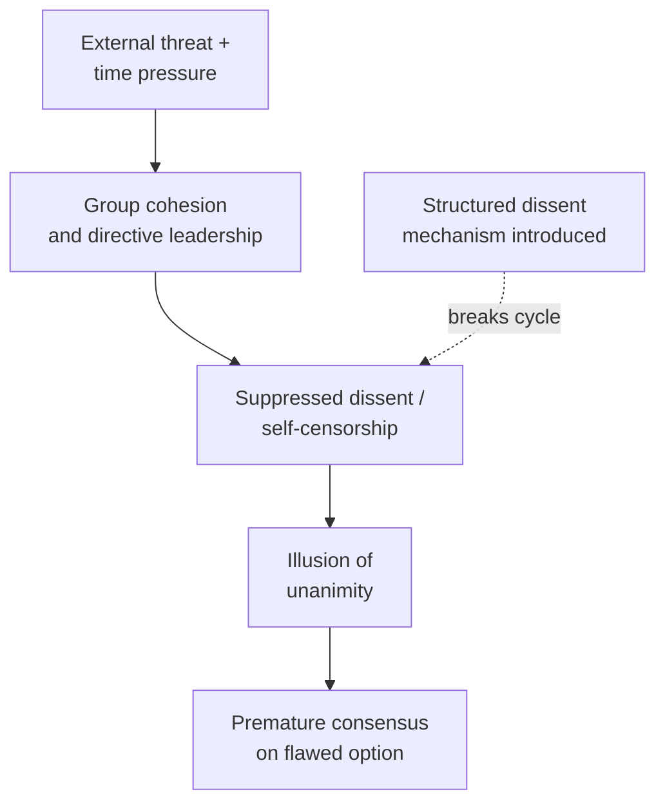

## Decision-Making Under Extreme Pressure

### Overview

Decision-making under extreme pressure examines how individuals and groups make consequential choices when normal deliberative conditions — ample time, complete information, calm affect, and stable organizational process — are severely compromised. This is a distinct field from crisis diagnosis (see Crisis Diagnosis and Situational Awareness), which asks *what is happening*; this topic addresses *how the choice itself gets made* once a working diagnosis exists, encompassing the cognitive, physiological, group-dynamic, and organizational factors that shape decision quality when stakes are high and time is short. The foundational finding across this literature, replicated across psychology, behavioral economics, and international-relations crisis studies, is that decision processes under extreme pressure differ systematically — not merely in speed but in *kind* — from decision processes under normal conditions.

### Two Modes of Cognition Under Pressure

The dual-process framework from cognitive psychology (most systematically popularized by Daniel Kahneman, building on earlier work by Keith Stanovich and others) provides the standard vocabulary for describing this shift:

|  | System 1 (fast) | System 2 (slow) |
| --- | --- | --- |
| Characteristics | Automatic, intuitive, pattern-matching, low effort | Deliberate, analytical, effortful, sequential |
| Performance under time pressure | Increasingly dominant | Increasingly crowded out |
| Strength | Fast pattern recognition drawing on prior experience/expertise | Careful weighing of novel or complex trade-offs |
| Vulnerability | Systematic biases (availability, anchoring, affect heuristic) | Requires cognitive resources and time that crisis conditions restrict |

**[Inference]** A significant strand of naturalistic decision-making research (notably Gary Klein's work on expert intuitive judgment in firefighters and military commanders) complicates a simple "System 1 is worse" narrative: for genuine domain experts, fast, intuitive (System-1-type) judgment under pressure can outperform slower deliberation, because expertise has effectively pre-compiled pattern recognition from extensive prior experience — meaning the reliability of fast judgment under pressure is highly contingent on the decision-maker's actual expertise in that specific domain, not a general property of speed itself.

### Physiological and Psychological Effects of Acute Stress on Cognition

**Key Points**

- **Attentional narrowing ("tunneling")** — under acute stress, attention tends to concentrate on the most salient or threatening stimulus, at the cost of peripheral information that may be equally relevant to a sound decision
- **Working memory degradation** — elevated stress hormones (cortisol, adrenaline) are associated with reduced working-memory capacity, impairing the ability to hold and manipulate multiple considerations simultaneously — precisely the capacity complex diplomatic trade-offs require
- **Time perception distortion** — decision-makers under acute stress frequently misjudge elapsed or available time, a documented effect relevant to the "perceived versus actual urgency" gap discussed under crisis diagnosis
- **Threat-rigidity effect** (a well-established organizational-behavior finding) — under threat, both individuals and organizations tend toward rigidity: narrowing of information channels, centralization of authority, and reduced tolerance for dissent — precisely the opposite of what open, exploratory diagnosis requires

$$\text{Decision quality} \neq f(\text{time pressure alone})$$

**[Inference]** The relationship between stress/arousal and performance is not simply linear or negative throughout its range; the classic Yerkes-Dodson framework suggests a moderate level of arousal can improve performance on simpler tasks relative to very low arousal, while performance on complex tasks (such as multidimensional diplomatic judgment) degrades much earlier as arousal rises — implying that some degree of pressure is not inherently harmful, but that complex, high-stakes diplomatic decisions are particularly vulnerable to even moderate excess stress.

### Group Decision-Making Pathologies Under Pressure

Extreme pressure affects not only individual cognition but small-group dynamics, where several well-documented pathologies become more likely:

1. **Groupthink** (Janis) — the tendency of a cohesive, insulated decision group under directive leadership and external threat to suppress dissent and converge prematurely on a shared view, discussed in detail under Crisis Diagnosis and Situational Awareness
2. **Risky shift / group polarization** — groups under certain conditions arrive at more extreme decisions (in either a riskier or more cautious direction, depending on the group's initial lean) than the average of individual members' pre-discussion positions
3. **Diffusion of responsibility** — in group settings, individual accountability for a decision can become psychologically diffused, reducing the perceived personal stake any one member has in catching an error
4. **Escalating commitment** — a group that has invested significant resources or public position in an initial course of action becomes progressively more resistant to reversing it even as evidence against it accumulates, a dynamic closely related to sunk-cost reasoning

### Structural and Procedural Countermeasures

**Next Steps for building decision structures resilient to pressure-induced degradation:**

1. **Formalize devil's advocacy / red-teaming** — designate an individual or subgroup explicitly tasked with challenging the emerging consensus, removing the social cost an individual would otherwise bear for voluntary dissent (directly addressing groupthink's dissent-suppression mechanism)
2. **Separate option-generation from option-evaluation** — generate the widest reasonable set of response options before beginning to evaluate or advocate for any one of them, reducing premature narrowing
3. **Use structured decision protocols** — checklists, decision trees, or pre-agreed criteria established *before* a crisis, so that under acute pressure the decision group is applying a pre-built structure rather than improvising process design in real time
4. **Build in mandatory reassessment intervals** — fixed points at which the chosen course of action is explicitly revisited against new information, directly countering escalating commitment
5. **Protect access to dissenting expert views**, including from outside the immediate crisis-management group, to counteract the threat-rigidity tendency toward channel-narrowing and centralization
6. **Rotate personnel or build in rest periods** for extended crises, since sustained acute stress compounds the working-memory and attentional effects described above — a factor frequently underweighted relative to its documented cognitive cost

### The Role of Pre-Established Protocol and Training

**Key Points**

- A recurring finding across naturalistic decision-making research (aviation, emergency medicine, military command, and diplomatic crisis studies alike) is that extensively rehearsed protocols and simulation training measurably improve decision quality under real pressure, precisely because they shift reliance from effortful System-2 deliberation (which degrades under stress) toward well-practiced, expertise-based System-1 pattern recognition (which, per Klein's research, holds up comparatively well under stress when genuinely well-trained)
- This underlies the extensive use of **crisis simulations and tabletop exercises** in diplomatic, military, and emergency-management training: the goal is not merely to rehearse a specific anticipated scenario, but to build the underlying pattern-recognition and team-coordination habits that transfer to genuinely novel crises
- **Pre-delegated authority and clear decision rules**, established before a crisis, reduce the amount of real-time deliberation required for lower-stakes sub-decisions, preserving cognitive and organizational bandwidth for the genuinely difficult judgment calls a crisis presents

### Individual Decision-Maker Factors

**Key Points**

- **Prior experience with structurally similar situations** is one of the most consistently cited predictors of decision quality under pressure — though this returns to the historical-analogy risk discussed under Crisis Diagnosis: experience aids pattern recognition but can also mislead if the current situation differs from the prior case in ways not immediately apparent
- **Emotional regulation capacity** — the ability to notice and manage one's own affective state during high-stakes deliberation is associated in the literature with better-calibrated risk assessment, since acute fear or anger measurably bias probability judgments (the "affect heuristic")
- **Explicit uncertainty tolerance** — decision-makers who can act on probabilistic, incomplete information without either false certainty or paralysis-inducing over-caution are generally better positioned for crisis decision-making than those who require (or falsely claim) high confidence before committing to a course of action

### Illustrative Case Reference: The Cuban Missile Crisis ExComm Process

The Kennedy administration's Executive Committee (ExComm) process during the 1962 Cuban Missile Crisis is widely cited in the decision-making literature as an example of several of the above countermeasures being applied, whether deliberately or as an emergent feature of the group's composition:

- Extended, multi-day deliberation rather than immediate reaction, deliberately expanding the *actual* decision timeframe beyond the *perceived* urgency
- A wide range of options generated (including options ultimately rejected, such as an immediate airstrike) before convergence toward the naval quarantine option
- Documented internal dissent and shifting positions among participants over the course of deliberation, rather than rapid, unchallenged consensus

**[Unverified]** Historical accounts differ on the precise degree to which ExComm avoided groupthink dynamics versus exhibited some of them at various points in the process; specific characterizations of this case should be checked against current historiography rather than treated as an uncomplicated model example, notwithstanding its frequent citation as a positive case in the decision-making literature.

### Common Failure Modes

**Key Points**

- **Mistaking perceived urgency for actual urgency**, foreclosing available deliberation time unnecessarily
- **Over-reliance on senior decision-maker intuition outside that individual's genuine domain of expertise**, where the Klein-style expert-intuition advantage does not actually apply
- **Suppressing structured dissent mechanisms precisely when they are most needed** — under the highest pressure, organizations frequently abandon the very procedural safeguards (red-teaming, option generation) designed for exactly that circumstance
- **Decision fatigue in extended crises** — sustained high-stakes decision-making without rest or rotation measurably degrades judgment quality over time, an effect frequently underestimated by decision-makers themselves
- **Failure to revisit an initial decision** as new information arrives, due to escalating commitment or the political cost of visible reversal

### Related Topics

- Crisis diagnosis, situational awareness, and the common operating picture
- Groupthink and structured dissent mechanisms (Janis)
- Naturalistic decision-making and expert intuition (Klein)
- The Yerkes-Dodson law and arousal-performance relationships
- Crisis simulation and tabletop exercise design
- The Cuban Missile Crisis ExComm process as a case study