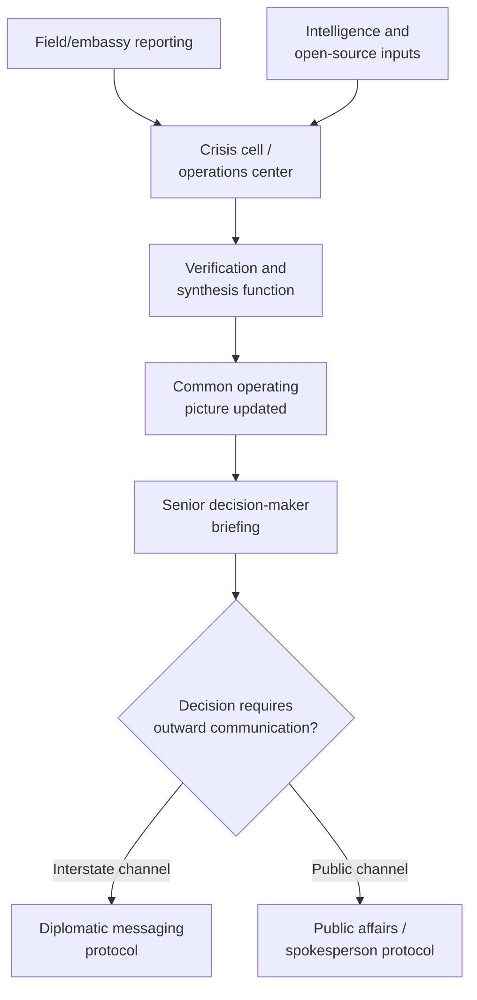

## Crisis Communication Protocols

### Overview

Crisis communication protocols are the pre-established and in-crisis procedures governing how information moves within a decision-making organization, between governments or parties to a dispute, and to external publics during a diplomatic or international crisis. This is distinct from crisis diagnosis (understanding the situation) and crisis decision-making (choosing a response) in that it addresses the *transmission* problem: how accurate information reaches the right people quickly, how decisions and intentions are communicated to adversaries or partners without being misread, and how public messaging is managed without constraining or contradicting the substantive diplomatic response underway. Poor communication protocol is a documented independent source of crisis escalation, separate from any underlying substantive disagreement — miscommunication and misperception between adversaries have driven escalation in numerous historical crises even where an underlying negotiated resolution was, in principle, available.

### Three Communication Domains in Crisis

Crisis communication protocols must address three distinct audiences and channels simultaneously, each with different requirements:

| Domain | Purpose | Key risk if mismanaged |
| --- | --- | --- |
| Internal/organizational | Move accurate information among decision-makers and staff | Distorted common operating picture, delayed decisions |
| Interstate/inter-party | Signal intent, avoid miscalculation, negotiate | Misperception-driven escalation |
| Public/media | Inform publics, manage domestic and international perception | Public statements constrain negotiating flexibility; leaks compromise sensitive channels |

**[Inference]** These three domains frequently interact in ways that create tension rather than operating independently — public statements made for domestic political reasons can foreclose negotiating options in the interstate channel, and internal leaks can prematurely surface sensitive interstate signaling to the public domain — meaning crisis communication protocol design must account for cross-domain spillover rather than treating each channel in isolation.

### Internal/Organizational Communication Architecture

**Key Points**

- Builds directly on the common operating picture (COP) concept discussed under Crisis Diagnosis and Situational Awareness: a single, continuously updated, shared situational summary that all relevant decision-makers can access, preventing fragmented or inconsistent understanding across an organization
- **Defined reporting chains** — pre-established lines of authority for who reports to whom, and who has authority to authorize outward communication, reducing improvisation under pressure
- **Redundant channels** — crisis communication infrastructure typically includes backup channels (secure phone, secure messaging, in-person courier) in case a primary channel is compromised, monitored, or fails during the crisis
- **Verification and sourcing discipline** — explicit protocols distinguishing confirmed information from unconfirmed reporting in internal briefings (see the uncertainty-labeling practice discussed under Crisis Diagnosis)

### Interstate and Inter-Party Crisis Communication

This domain is concerned specifically with signaling — ensuring that a state's or party's intentions and red lines are communicated to an adversary or counterpart clearly enough to avoid miscalculation, while managing the risk that signals themselves are misread.

**Core mechanisms:**

1. **Crisis hotlines and direct communication links** — institutionalized, dedicated channels bypassing normal diplomatic or media channels, designed to enable rapid, unambiguous, and (ideally) private communication during acute crisis moments. The Moscow-Washington hotline, established in 1963 in direct response to communication delays experienced during the Cuban Missile Crisis the previous year, is the paradigmatic example, and equivalent bilateral hotline arrangements have since been established between numerous other pairs of states
2. **Back-channel communication** — discreet, often deniable, direct contact used to convey sensitive signals or proposals without public exposure (related to Track I.5 practice discussed under Track II and Track III Diplomacy in Practice), used specifically because public statements during acute crisis carry higher miscalculation and face-saving risk
3. **Deliberate signaling through action** — military postures, deployments, or their explicit absence, used as a communicative act distinct from or alongside verbal messaging; crisis-management theory stresses that adversaries interpret actions as signals whether or not they were intended as such, making unintentional signaling (troop movements read as escalatory when intended as routine, for instance) a recognized risk
4. **Formal diplomatic notes and démarches** — traditional written diplomatic communication, slower than a hotline but creating an unambiguous, attributable record of a position or warning
5. **Third-party relay** — using a trusted mediator or intermediary state to convey messages when direct channels are unavailable, compromised, or diplomatically sensitive (functionally overlapping with shuttle diplomacy — see Shuttle Diplomacy)

**Key Points on signal clarity**

- Crisis-communication theory (drawing on Thomas Schelling's work on strategic signaling and commitment) emphasizes that ambiguous signals are a major source of unintended escalation: a warning intended as firm but measured can be read by the receiving party as either bluff (inviting further escalation) or as more threatening than intended (provoking pre-emptive response)
- **Costly signals** — actions or statements that carry a real cost to the sender if not followed through are generally regarded in the literature as more credible than cheap talk, since the sender's willingness to bear the cost itself communicates seriousness of intent
- Redundant signaling through multiple channels (public statement plus back-channel plus formal démarche, for example) is sometimes used deliberately to reduce the risk that a single channel's signal is missed, discounted, or misattributed

### Public and Media Communication Protocols

**Key Points**

- **Single authoritative spokesperson function** — crisis communication best practice generally centralizes public statements through a single, designated spokesperson or office to avoid the appearance (or reality) of contradictory official positions, which can itself become a destabilizing signal to adversaries or the public
- **Message discipline and pre-cleared talking points** — coordinating public statements across all officials likely to be asked about the crisis, to prevent an individual official's off-message or premature comment from constraining the broader diplomatic response
- **Deliberate ambiguity versus deliberate clarity** — public messaging decisions in crisis often involve an explicit choice between calibrated ambiguity (preserving negotiating flexibility, avoiding domestic audience-cost lock-in) and calibrated clarity (deterrence signaling, reassurance of allies or domestic publics) — the choice depends on the crisis's specific strategic requirements rather than there being a universally preferable default
- **Managing the "CNN effect" and real-time media pressure** — contemporary crisis communication must account for a media and social-media environment that can outpace an organization's own internal verification and decision cycle, creating pressure to respond publicly before an internal common operating picture has stabilized

### The Audience Costs Problem

A specific dynamic in the interstate/public interaction: public statements made to satisfy a domestic audience can create **audience costs** — the political price a leader would pay domestically for backing down from a public commitment — which can constrain that leader's later ability to de-escalate even if de-escalation becomes strategically preferable.

**[Inference]** Audience-costs theory (associated particularly with James Fearon's work) is influential but contested in the international-relations literature regarding how strongly and consistently it operates across regime types and specific crises; it is a well-established theoretical framework rather than an empirically uncontroversial universal law, and crisis communication protocol designers should treat the *risk* of self-imposed audience costs as a genuine consideration rather than assume its magnitude is fixed or fully predictable.

### Protocol Design: Pre-Crisis Preparation

**Next Steps for establishing crisis communication protocols before a crisis occurs:**

1. **Establish and test hotline or direct-channel infrastructure** with key counterparts before a crisis, since infrastructure and trust built in a hotline relationship during calm periods is far more reliable than attempting to establish new channels under acute pressure
2. **Pre-designate spokesperson authority and clearance procedures**, so that under time pressure the organization is following an established process rather than improvising who may speak and what may be said
3. **Build media-monitoring and rapid-response capacity** into the crisis cell structure, recognizing that public and social-media information flow now frequently outpaces traditional diplomatic reporting cycles
4. **Conduct communication-specific crisis simulations**, not only substantive decision simulations, since communication breakdowns (message garbling, channel failure, cross-domain leakage) are themselves a distinct failure mode worth rehearsing
5. **Establish clear internal protocols for handling leaks and unauthorized disclosure**, given that unauthorized public disclosure of sensitive back-channel communication is a recurring, high-consequence risk during active crisis diplomacy

### Common Failure Modes

**Key Points**

- **Ambiguous signaling misread as either bluff or threat** — the central risk Schelling-style signaling theory addresses, and a documented contributor to escalation in historical crisis case studies
- **Cross-domain leakage** — sensitive back-channel or internal deliberative content reaching public or media channels prematurely, compromising the discretion that back-channel and shuttle communication specifically depend on
- **Audience-cost lock-in** — public statements made for domestic political reasons that later constrain otherwise-desirable de-escalatory moves
- **Message fragmentation** — multiple officials making inconsistent public statements, creating confusion about the actual official position and potentially sending unintended signals to adversaries
- **Channel failure under load** — communication infrastructure (including informal or personal channels) becoming unreliable precisely when message volume and urgency are highest, if redundant channels were not established in advance
- **Conflating internal deliberative communication with external signaling** — treating internal working assessments or options papers as though they carry the same signaling weight as authorized outward communication, risking unintended escalation if such material is leaked or misattributed

### Related Topics

- The common operating picture and internal crisis-communication architecture
- Schelling's theory of strategic signaling and costly signals
- Audience costs and the domestic politics of crisis bargaining (Fearon)
- Crisis hotlines and direct communication link history (Moscow-Washington hotline)
- Back-channel and Track I.5 communication practice
- De-escalation techniques and crisis signaling under acute pressure