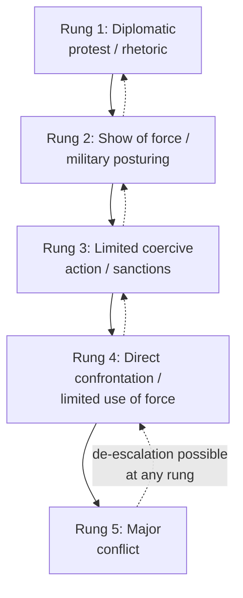

## Managing Escalation and De-Escalation Dynamics

### Overview

Managing escalation and de-escalation dynamics is the applied discipline of deliberately shaping the trajectory of an unfolding crisis — recognizing where a confrontation sits on an escalation continuum, understanding the mechanisms that drive movement along it, and selecting interventions calibrated to move the situation toward de-escalation rather than further intensification. This topic sits at the intersection of crisis diagnosis (understanding the situation), decision-making under pressure (choosing a response), and crisis communication (signaling that response) — it is specifically concerned with the *strategic management of intensity over time*, treating escalation and de-escalation not as binary states but as a dynamic, often reversible, process that skilled crisis leadership can actively steer.

This overlaps substantially with material covered under De-Escalation Techniques, but where that topic addresses interpersonal, mediation-room, and general interstate de-escalation methods, this topic focuses specifically on the crisis-leadership function: how a decision-maker or crisis team manages escalation dynamics as an integrated strategic problem across an entire unfolding crisis, often involving military, diplomatic, and domestic-political dimensions simultaneously.

### The Escalation Ladder Concept

Herman Kahn's Cold War-era concept of an **escalation ladder** remains the dominant conceptual metaphor in crisis-escalation management: a crisis can be understood as occupying a "rung" of increasing intensity, with movement both upward (escalation) and downward (de-escalation) possible, and with each rung associated with characteristic actions, risks, and available off-ramps.

**Key Points**

- A central strategic insight from ladder-based thinking is that **each rung has an associated exit ramp** — a face-saving, communicable path back down — and crisis management should deliberately preserve and signal the availability of these ramps rather than allowing a confrontation to become a one-way escalatory process
- **[Inference]** Kahn's original ladder was formulated specifically for nuclear-era superpower confrontation and used a much more granular (44-rung) scale; contemporary crisis-management practice generally uses a simplified version of the concept as a heuristic for thinking about graduated response and reversibility, rather than applying Kahn's specific historical framework literally to non-nuclear or non-superpower crises

### Horizontal versus Vertical Escalation

A key analytical distinction in contemporary escalation-management literature:

| Dimension | Horizontal escalation | Vertical escalation |
| --- | --- | --- |
| Definition | Expansion of a crisis to new geographic areas, actors, or issue domains | Intensification of action within the existing domain/actors |
| Example pattern | A bilateral dispute drawing in allies or spreading to a new theater | The same two parties increasing the intensity of existing confrontation |
| Management implication | Requires containment strategies limiting the crisis's spread | Requires calibration of response intensity and signaling restraint |

**[Inference]** Managing these two escalation types often requires different, sometimes competing, tools — a measure that limits horizontal spread (e.g., reassuring third parties to prevent their involvement) may not address vertical intensity, and vice versa — meaning crisis managers typically need to track both dimensions simultaneously rather than assuming a single de-escalation lever addresses both.

### Mechanisms Driving Escalation

Drawing on Glasl's escalation-stage model (see De-Escalation Techniques) and interstate crisis-bargaining theory, several recurring mechanisms drive movement up the escalation ladder:

1. **Action-reaction spirals** — each party's defensive or retaliatory move is read by the other as offensive, prompting further response (the escalation spiral discussed in detail under De-Escalation Techniques)
2. **Commitment and audience-cost dynamics** — public commitments made for domestic political reasons constrain a leader's later ability to step back without perceived loss of face (see Crisis Communication Protocols)
3. **Loss of central control** — as a crisis intensifies, decision authority can devolve to field commanders or lower-level actors operating with less complete situational awareness and less restraint than senior decision-makers intended, a well-documented risk in military-crisis escalation specifically
4. **Miscalculated signaling** — ambiguous or unintentionally provocative signals (see Crisis Communication Protocols) interpreted as more threatening than intended, prompting a disproportionate response
5. **Domestic political pressure for visible toughness** — leaders facing hostile domestic audiences may escalate to demonstrate resolve even where private preferences favor restraint

### Strategic Tools for Managing Escalation

**Key Points**

- **Deliberate restraint as signal** — visibly not taking an available escalatory option can itself function as a costly, credible signal of intent to de-escalate, particularly when the restraint is clearly reported to have been available and deliberately withheld
- **Calibrated, proportionate response** — matching response intensity closely to the precipitating action, avoiding both under-response (perceived as weakness, inviting further testing) and over-response (triggering unintended further escalation)
- **Preserving face-saving off-ramps** — ensuring that any escalatory step taken still leaves the other party (and oneself) a communicable, non-humiliating path to de-escalation, a principle directly continuous with Glasl's stage-5 "loss of face" dynamic
- **Compartmentalization** — deliberately containing a crisis to its original domain and actors to prevent horizontal escalation, even when tempting linkages to unrelated disputes exist
- **Reversibility of action** — favoring measures that can be visibly reversed (economic measures, force posture) over irreversible ones (kinetic action) where the situation permits, preserving future de-escalation options

### Graduated Reciprocation in Tension-Reduction (GRIT) in Extended Crisis Management

As discussed under De-Escalation Techniques, Charles Osgood's GRIT strategy — small, publicly announced, unilateral conciliatory steps that invite but do not demand reciprocation — is a specific tool applicable to managing sustained escalation dynamics over an extended crisis, rather than a single acute incident.

**[Inference]** GRIT-style unilateral initiatives carry real strategic risk in an active crisis context specifically: if timed against an adversary who reads the initial concession as weakness rather than good faith, the approach can itself trigger further escalation rather than reciprocal restraint — this is a genuine, actively debated limitation rather than a settled objection, and its applicability likely depends heavily on the adversary's own strategic culture and the crisis's specific stage.

### The Role of Third Parties in Managing Escalation Dynamics

- **Mediation and shuttle diplomacy** (see Shuttle Diplomacy) can interrupt an escalation spiral by providing an indirect channel when direct communication has become escalatory in itself
- **International organizations and regional bodies** can provide face-saving multilateral cover for de-escalatory moves that would be politically costly for either party to take unilaterally
- **Crisis hotlines and back-channels** (see Crisis Communication Protocols) allow signals of restraint or willingness to de-escalate to be conveyed without the audience-cost exposure of public statements

### Historical Illustration: The Cuban Missile Crisis as an Escalation-Management Case

The 1962 Cuban Missile Crisis is the most extensively studied case in the escalation-management literature and illustrates several of the mechanisms and tools above operating together:

- A **naval quarantine** was selected over an air strike specifically because it was calibrated (lower on the escalation ladder), reversible, and preserved decision time and de-escalation options
- **Back-channel communication** (via Robert Kennedy and Soviet Ambassador Dobrynin) supplemented formal channels, allowing sensitive face-saving arrangements (including the confidential Jupiter-missile withdrawal from Turkey) to be conveyed without public audience-cost exposure
- The public settlement terms (Soviet missile withdrawal from Cuba, US non-invasion pledge) were structured to allow both sides a communicable, non-humiliating de-escalation narrative domestically

**[Unverified]** As with other citations of this case, the precise causal weight of specific decisions (versus contingency or fortunate timing) in preventing further escalation remains subject to ongoing historiographical debate, and this case should be treated as an illustrative rather than a definitively proven model.

### Common Failure Modes

**Key Points**

- **Ladder skipping** — responding at a much higher rung than the precipitating action, removing intermediate calibration options and increasing miscalculation risk
- **Foreclosing off-ramps** — public rhetoric or commitments that eliminate face-saving de-escalation paths for either party, locking in further escalation even where private preferences favor restraint
- **Loss of central control during vertical escalation** — decision authority devolving to lower echelons faster than senior leadership can maintain situational awareness or restraint, a documented risk particularly in military crisis contexts
- **Horizontal spread through inadequate compartmentalization** — failing to actively contain a crisis, allowing third parties or adjacent disputes to become entangled and complicate de-escalation
- **Treating de-escalation as automatic once talks begin** — assuming that the initiation of communication or negotiation itself halts escalatory momentum, when in practice escalatory dynamics (including ongoing military posturing) can continue in parallel with diplomatic engagement absent deliberate management

### Related Topics

- Kahn's escalation ladder and graduated deterrence theory
- De-escalation techniques and Glasl's nine-stage escalation model
- Crisis communication protocols and signaling theory (Schelling)
- GRIT and unilateral initiative strategies
- The Cuban Missile Crisis as an integrated escalation-management case study
- Compartmentalization and horizontal-escalation containment strategy