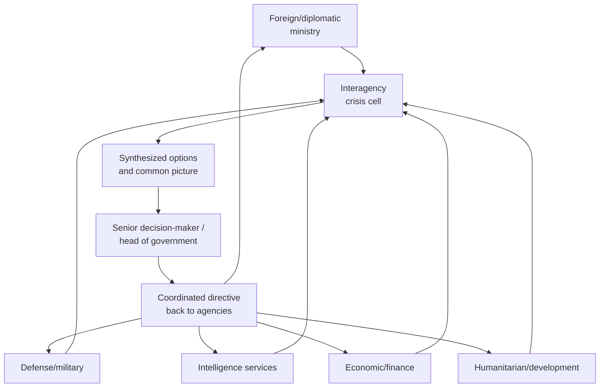

## Coordinating Interagency and International Crisis Response

### Overview

Coordinating interagency and international crisis response addresses the organizational and procedural challenge of aligning multiple distinct actors — different government agencies within a single state, and different states or international organizations across a multilateral crisis response — toward a coherent response when no single actor has full authority over the others. This is fundamentally a coordination problem distinct from the substantive diagnosis (see Crisis Diagnosis and Situational Awareness), decision-making (see Decision-Making Under Extreme Pressure), and communication (see Crisis Communication Protocols) challenges already addressed: even with accurate diagnosis, sound decisions, and clear communication within any single actor, a crisis response can fail if the various actors involved are not aligned with one another, duplicate effort, work at cross purposes, or send inconsistent signals.

The core structural difficulty is that crises rarely respect organizational or jurisdictional boundaries — a single crisis typically implicates diplomatic, defense, intelligence, economic, humanitarian, and legal dimensions simultaneously, each institutionally housed in a different agency domestically and a different specialized international body internationally, none of which has authority to direct the others.

### Interagency Coordination: Domestic Architecture

**Key Points**

- **The core problem is authority without hierarchy** — in most governments, no single crisis coordinator has direct command authority over all relevant agencies (foreign ministry, defense ministry, intelligence services, economic/finance ministry, and others); coordination must be achieved through convening authority, shared situational awareness, and negotiated consensus rather than command
- **Crisis cells / task forces** — most governments establish a dedicated, temporary interagency crisis structure (variously named a crisis cell, task force, or situation room) that brings representatives from each relevant agency into a single coordinating body for the crisis's duration, distinct from each agency's normal standing structure
- **Designated crisis coordinator or lead agency** — many systems designate either an individual (a national security advisor or equivalent) or a lead agency to chair interagency coordination, though this designated coordination authority is typically convening and synthesizing rather than directive command authority over other agencies' own resources and decisions

### Common Interagency Coordination Failure Patterns

1. **Stovepiping** — information and analysis remaining siloed within an originating agency rather than reaching the shared common operating picture, often due to classification barriers, bureaucratic incentive to control one's own information, or simple lack of established sharing protocol
2. **Duplicated or contradictory action** — different agencies independently engaging the same foreign counterpart or taking parallel action without mutual awareness, sending confused or contradictory signals externally
3. **Turf competition** — agencies competing for lead-role status or resources during a crisis, diverting energy from substantive response toward internal bureaucratic positioning
4. **Divergent risk tolerance across agencies** — a defense or intelligence agency's institutional risk calculus can differ substantially from a diplomatic agency's, producing internal disagreement about appropriate response intensity that itself consumes decision time
5. **Unclear or contested lead-agency designation** — ambiguity about which agency has convening authority for a specific crisis type (particularly relevant for crises spanning traditional jurisdictional boundaries, such as cyber incidents with both intelligence and diplomatic dimensions)

**[Inference]** Much of the academic and practitioner literature on interagency coordination (drawing on organizational-behavior research more broadly) attributes these failure patterns less to individual bad judgment and more to structural incentives: agencies are typically evaluated and resourced based on their own institutional performance, creating a persistent incentive misalignment against the kind of information-sharing and deference that effective coordination requires — meaning coordination failures are often better addressed through structural and incentive redesign than through appeals to individual cooperation.

### Structural Remedies for Interagency Coordination

**Next Steps for building resilient interagency crisis coordination:**

1. **Pre-establish clear lead-agency designation rules by crisis type**, ideally before a crisis occurs, to avoid contested authority precisely when speed matters most
2. **Build a genuinely shared, cross-agency common operating picture** (see Crisis Diagnosis and Situational Awareness) with structural incentives or requirements for information-sharing, rather than relying on voluntary cooperation against agencies' institutional incentives
3. **Conduct joint interagency crisis simulations regularly**, not only within individual agencies, since coordination habits and personal working relationships built during training measurably improve real-crisis coordination speed and trust
4. **Establish a designated convening/coordinating function** with clear scope (even where it lacks command authority), tasked specifically with synthesis and de-confliction rather than substantive decision-making, which agencies are more willing to accept than a rival decision-making authority
5. **Create pre-agreed de-confliction protocols** for situations where two agencies' independent actions might conflict, specifying required consultation before either proceeds unilaterally

### International Coordination: Architecture Among States and Organizations

International crisis coordination compounds the domestic interagency problem with the additional layer of sovereign independence: states and international organizations involved in a shared crisis response have no common superior authority at all, and coordination must be achieved entirely through negotiated alignment, shared interest, or institutional convening power.

**Key coordination mechanisms:**

1. **Lead-nation or lead-organization frameworks** — one state or organization is informally or formally designated to coordinate a multinational response (common in humanitarian crisis response, where the UN Office for the Coordination of Humanitarian Affairs — OCHA — often plays this convening role, and in some multinational military coalitions where a lead nation provides coordinating command structure)
2. **Contact groups** — a smaller subset of concerned states convened specifically to coordinate policy toward a shared crisis, allowing more efficient coordination than attempting full coordination across every interested state simultaneously (functionally related to the contact-group mechanism discussed under Chairing and Facilitating Multilateral Sessions)
3. **Regular coordination calls/meetings among key capitals** — establishing a standing rhythm of senior-level consultation among the principal concerned governments throughout a crisis, distinct from formal multilateral sessions, to maintain aligned messaging and avoid contradictory unilateral action
4. **International organization coordinating mechanisms** — UN cluster system (in humanitarian response), NATO's crisis-response planning architecture, and equivalent regional-organization mechanisms provide pre-established coordination frameworks that can be activated rather than improvised at crisis onset
5. **Burden-sharing and division-of-labor arrangements** — explicit allocation of response responsibilities among coordinating states/organizations (e.g., one state leading on diplomatic engagement, another on humanitarian assistance, another on security-sector support) to avoid duplication and gaps

### The Coordination-Sovereignty Tension

**Key Points**

- International crisis coordination differs fundamentally from domestic interagency coordination in that participating states retain full sovereign discretion to withdraw from or diverge from a coordinated position at any point, meaning coordination mechanisms function through sustained diplomatic effort and shared-interest maintenance rather than any binding structural constraint
- **Alliance and coalition management** literature emphasizes that maintaining coordinated positions across multiple sovereign states over an extended crisis requires continuous diplomatic investment specifically because each state's domestic political pressures, risk tolerance, and interests evolve independently over the crisis's duration, and initial alignment is not self-sustaining
- **Free-riding and burden-shifting risk** — in loosely coordinated multinational responses, individual states may be tempted to under-contribute relative to an agreed division of labor, particularly in costly or risky response dimensions (military commitment, financial burden-sharing), a dynamic well-documented in alliance-politics and public-goods literature

### Coordination Across the Interagency-International Boundary

**Key Points**

- A frequently underweighted coordination challenge is the interface between domestic interagency coordination and international coordination: a state's own internal interagency alignment must itself be achieved before, or in parallel with, that state's international coordination role, and internal disagreement can surface awkwardly in international settings if not resolved beforehand
- Diplomatic representatives engaged in international coordination (contact groups, coordination calls) require clear, current understanding of their own government's coordinated position, which depends on effective domestic interagency process feeding into their instructions in real time — a breakdown in domestic interagency coordination can directly undermine that state's credibility and effectiveness in international coordination

### Case Illustration: Humanitarian Crisis Coordination Architecture

The UN's humanitarian **cluster system**, established following the 2005 Humanitarian Reform process, illustrates a formalized international coordination mechanism designed specifically to address duplication and gaps in multi-organization crisis response: distinct thematic "clusters" (shelter, health, water/sanitation, protection, and others) each designate a lead agency responsible for coordinating all humanitarian actors working in that sector during a specific crisis response, creating clear sectoral accountability without requiring a single overall command authority across the many independent humanitarian organizations typically involved in a major response.

**[Unverified]** Assessments of the cluster system's effectiveness at actually reducing duplication and coverage gaps in practice vary across evaluation literature and specific crisis responses; this should be treated as an illustrative structural model rather than a demonstrated uniform success, and current evaluations should be consulted for any specific claim about its performance.

### Common Failure Modes

**Key Points**

- **Stovepiping and information silos**, both within a single government's interagency structure and across international coordinating bodies, undermining a genuinely shared understanding of the crisis
- **Contested or absent lead-agency/lead-nation designation**, producing delay or duplicated effort precisely when speed is most valuable
- **Domestic interagency disagreement surfacing in international settings**, undermining a state's credibility and coordination effectiveness
- **Free-riding in burden-sharing arrangements**, straining coalition cohesion over an extended crisis
- **Coordination fatigue in protracted crises** — the sustained diplomatic and organizational effort required to maintain alignment across many actors is resource-intensive and can degrade as a crisis extends well beyond its initially anticipated duration
- **Mistaking coordination meetings for coordinated action** — extensive consultation processes that do not translate into aligned, deconflicted action on the ground, particularly where participating actors nominally agree in meetings but continue independent action in practice

### Related Topics

- Crisis cells and situation-room structures in interagency practice
- Contact groups and lead-nation frameworks in multilateral response
- The UN humanitarian cluster system and coordination architecture
- Alliance management and burden-sharing theory
- Crisis communication protocols across interagency and international channels
- Chairing and facilitating multilateral sessions in crisis contact-group settings