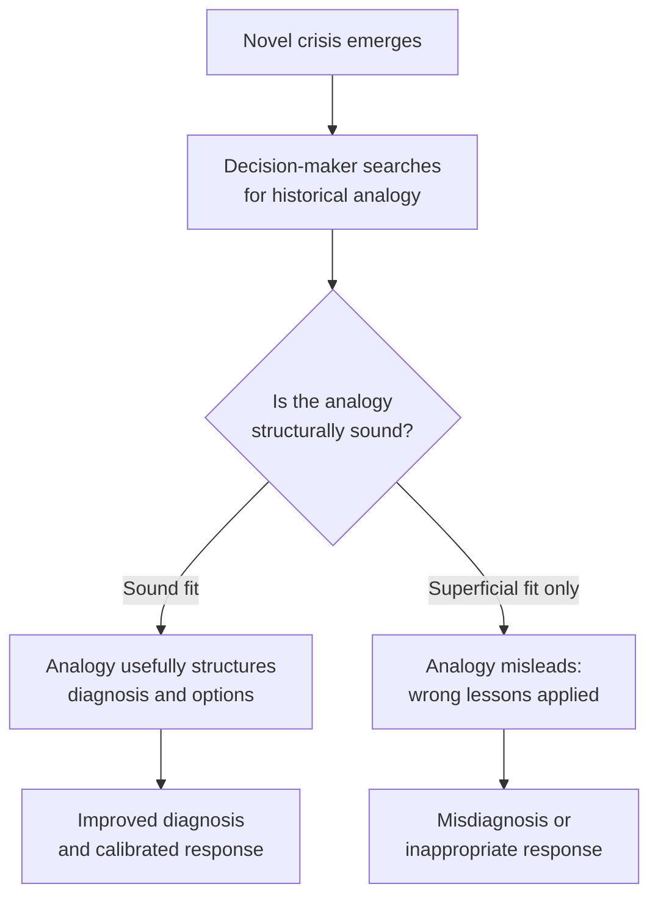

## Historical Crisis Patterns and Precedents

### Overview

The study of historical crisis patterns and precedents examines recurring structural dynamics across past international crises to extract generalizable lessons for crisis diplomacy and leadership, while remaining alert to the significant risks of misapplying historical analogy. This is a synthesizing topic that draws together diagnostic, decision-making, communication, and escalation-management concepts already covered (see Crisis Diagnosis and Situational Awareness, Decision-Making Under Extreme Pressure, Crisis Communication Protocols, and Managing Escalation and De-Escalation Dynamics) and grounds them in a body of specific historical cases that the field treats as foundational reference points. The discipline's central methodological tension is that historical cases are simultaneously indispensable (there is no other empirical basis for crisis-management theory) and inherently risky as a learning tool (each case is unique, and the specific lessons drawn are contested and vulnerable to misapplication to structurally dissimilar future situations).

### Why Historical Cases Anchor Crisis-Management Theory

**Key Points**

- International crises are comparatively rare, high-stakes, and not experimentally reproducible, meaning crisis-management theory relies heavily on structured comparative case analysis rather than the controlled studies available in some other social-science domains
- Much of the field's core vocabulary and conceptual apparatus — escalation ladders, audience costs, groupthink, ripeness theory — was developed through close analysis of a relatively small set of intensively studied cases, meaning familiarity with these canonical cases is necessary to understand the theoretical concepts' origins and intended scope
- **[Inference]** Because the canonical case set is relatively small and has been extensively re-analyzed over decades, much of what the field "knows" about crisis dynamics is filtered through particular historiographical interpretations that have themselves evolved over time (declassification of new documents has repeatedly revised understanding of, for example, the Cuban Missile Crisis) — meaning practitioners should treat even well-established case lessons as provisional rather than fixed, subject to revision as historical scholarship develops

### The Analogical Reasoning Problem

The central methodological caution in this field, discussed briefly under Crisis Diagnosis, deserves fuller treatment here: decision-makers facing a novel crisis very frequently reach for a historical analogy to structure their understanding of the situation, and the choice of analogy can decisively shape diagnosis and response — for better or worse.

**Key Points**

- Richard Neustadt and Ernest May's influential *Thinking in Time* (1986) systematically examined how US policymakers used (and misused) historical analogies in crisis decision-making, proposing structured techniques (explicitly listing what is "known," "unclear," and "presumed" when invoking a historical parallel) to reduce analogical misapplication
- The most commonly cited failure pattern is reaching for the *most emotionally or generationally salient* analogy (frequently the most recent major crisis a decision-maker personally experienced) rather than the most *structurally similar* one — a well-documented bias in the historical record of crisis decision-making
- **[Inference]** The corrective the literature generally proposes is not to abandon historical analogy (treated as neither possible nor desirable, since some comparative framework is unavoidable in human reasoning) but to make analogical reasoning explicit and examined — surfacing exactly which features of the historical case are believed to transfer to the current situation, and which structural differences might undermine the comparison — rather than relying on analogy as an unexamined background assumption

### Canonical Case Studies and Their Primary Theoretical Contributions

| Case | Approximate period | Primary theoretical contribution(s) |
| --- | --- | --- |
| July Crisis / outbreak of WWI | 1914 | Escalation spirals, alliance entrapment, mobilization dynamics outpacing diplomatic control, communication delay |
| Cuban Missile Crisis | 1962 | ExComm decision process, calibrated/reversible response, back-channel diplomacy, groupthink avoidance (contested), crisis hotline origin |
| 1973 Yom Kippur War and disengagement | 1973–1975 | Shuttle diplomacy (see Shuttle Diplomacy), incremental agreement sequencing |
| Camp David Accords | 1978 | Single negotiating text technique, sustained mediator engagement (see Mediation Theory and Third-Party Intervention) |
| Iran Hostage Crisis | 1979–1981 | Protracted crisis management, domestic audience-cost pressure, back-channel negotiation under extreme public visibility |
| Falklands/Malvinas War | 1982 | Signal misperception, failure of deterrent signaling, rapid escalation despite available diplomatic channels |
| Rwandan Genocide | 1994 | Failure of early warning-to-action translation, international coordination failure (see Coordinating Interagency and International Crisis Response) |
| Kosovo crisis | 1998–1999 | Coalition/alliance coordination under time pressure, humanitarian intervention diplomacy |

**[Unverified]** The specific theoretical "lessons" attributed to each case above reflect a widely cited but not universally agreed interpretation within the field; each case has generated substantial, ongoing historiographical and political-science debate about causation and the correct generalizable lesson, and any specific claim drawn from a case should be checked against current scholarship rather than treated as a settled, uncontested finding.

### The July Crisis (1914) as a Negative Case Study

The outbreak of World War I is the most frequently cited *cautionary* case in crisis-management literature — a crisis in which nearly every documented escalation-management failure mode discussed elsewhere in this material appears to have operated simultaneously:

- **Alliance entrapment** — pre-existing alliance commitments constrained decision-makers' flexibility, drawing successively more parties into a bilateral dispute (a historical illustration of horizontal escalation — see Managing Escalation and De-Escalation Dynamics)
- **Mobilization dynamics outpacing diplomatic control** — military mobilization timetables and their perceived irreversibility created pressure for rapid decision that compressed available deliberation time far more severely than the underlying diplomatic dispute alone would have required
- **Communication delay and signal ambiguity** — slow, indirect communication between capitals contributed to persistent misperception of other parties' intentions during the critical days of the crisis (a case frequently cited in support of establishing crisis hotlines decades later)
- **Mirror-imaging and misjudged resolve** — multiple parties are widely understood to have misjudged how other capitals would respond to their own actions, each assuming the others would back down rather than escalate

**[Inference]** The July Crisis's status as a paradigmatic escalation-failure case is well-established in the field, but historians continue to actively debate the relative causal weight of structural factors (alliance systems, mobilization schedules) versus individual decision-maker choices and misjudgments — meaning it should be used as an illustration of escalation *mechanisms* rather than as evidence for any single, uncontested causal narrative about the war's origins.

### The Cuban Missile Crisis as the Field's Central Positive Reference Case

Discussed in detail under Decision-Making Under Extreme Pressure and Managing Escalation and De-Escalation Dynamics, this case functions in the literature as the primary illustration of crisis management operating comparatively well: extended deliberation, a calibrated and reversible response option (naval quarantine over airstrike), back-channel supplementation of formal diplomacy, and face-saving off-ramps built into the eventual settlement. Its outsized influence on the field's conceptual vocabulary (many of the terms used throughout this material trace directly to analysis of this case) is itself worth noting as a methodological point: the field's foundational theory is disproportionately derived from a single, intensively documented case, which is a genuine limitation on how confidently its lessons generalize to structurally different crises.

### Patterns That Recur Across Multiple Cases

Synthesizing across the canonical case set, several patterns appear with sufficient frequency across independent cases to be treated as more robust generalizations than single-case lessons:

1. **Time compression consistently degrades decision quality** — appearing across cases as different as 1914 mobilization pressure and modern real-time-media crisis pressure
2. **Communication and signaling failures independently drive escalation**, separate from the underlying substantive dispute — a pattern robust enough across cases to have directly motivated concrete institutional responses (the Moscow-Washington hotline following 1962)
3. **Face-saving and audience-cost dynamics recur across highly different political systems and eras** — appearing in interstate crises, mediation contexts, and multilateral sessions alike, suggesting the underlying psychological/political mechanism is not specific to any one type of actor or era
4. **Early warning-to-action translation failure recurs even where analytical capacity to detect risk existed** — the Rwandan case is the most starkly cited example, but the pattern (see Preventive Diplomacy's "early warning-early action gap") appears across numerous less catastrophic cases as well
5. **Successful de-escalation consistently involves preserved off-ramps**, while failed cases consistently show foreclosed or absent face-saving exit paths for at least one party

### Using Historical Precedent Responsibly in Practice

**Next Steps for practitioners drawing on historical precedent during an active crisis:**

1. **Explicitly articulate the specific structural features** believed to link the historical case to the current situation, rather than relying on surface-level or emotionally salient similarity
2. **Actively seek disconfirming comparisons** — cases where a similar-seeming situation produced different mechanisms or outcomes, to test whether the intended analogy is actually the best available fit
3. **Distinguish "lessons" that are genuinely well-supported across multiple independent cases from lessons drawn from a single, heavily-cited case**, which carry greater risk of being idiosyncratic to that case's specific circumstances
4. **Update understanding as historical scholarship evolves** — treat even canonical cases as subject to ongoing historiographical revision rather than fixed, complete accounts
5. **Use historical cases to generate hypotheses and options, not to dictate a predetermined response** — per Neustadt and May's core methodological recommendation

### Common Failure Modes in Historical Precedent Use

**Key Points**

- **Analogical overreach** — treating superficial similarity (same region, same type of adversary) as sufficient basis for applying a historical case's specific lessons, without examining deeper structural fit
- **Recency and salience bias** — defaulting to the most recent or personally memorable crisis a decision-maker experienced, rather than the most structurally comparable historical case
- **Single-case overgeneralization** — treating a lesson well-supported in one intensively studied case (most often the Cuban Missile Crisis) as a universal principle, without checking whether it recurs across independently observed cases
- **Static historical understanding** — relying on an outdated interpretation of a canonical case that has since been substantially revised by subsequent historical scholarship or archival declassification
- **Using precedent to justify rather than inform a decision** — invoking historical analogy after a decision has effectively already been made, for legitimation rather than genuine diagnostic purposes

### Related Topics

- Neustadt and May's structured technique for analogical reasoning (*Thinking in Time*)
- The July Crisis (1914) as an escalation-failure case study
- The Cuban Missile Crisis's outsized influence on crisis-management theory
- Historiographical revision and declassification's effect on crisis case interpretation
- Early warning-to-action translation failure across cases (Rwanda, and Preventive Diplomacy generally)
- Comparative case-study methodology in international-relations research