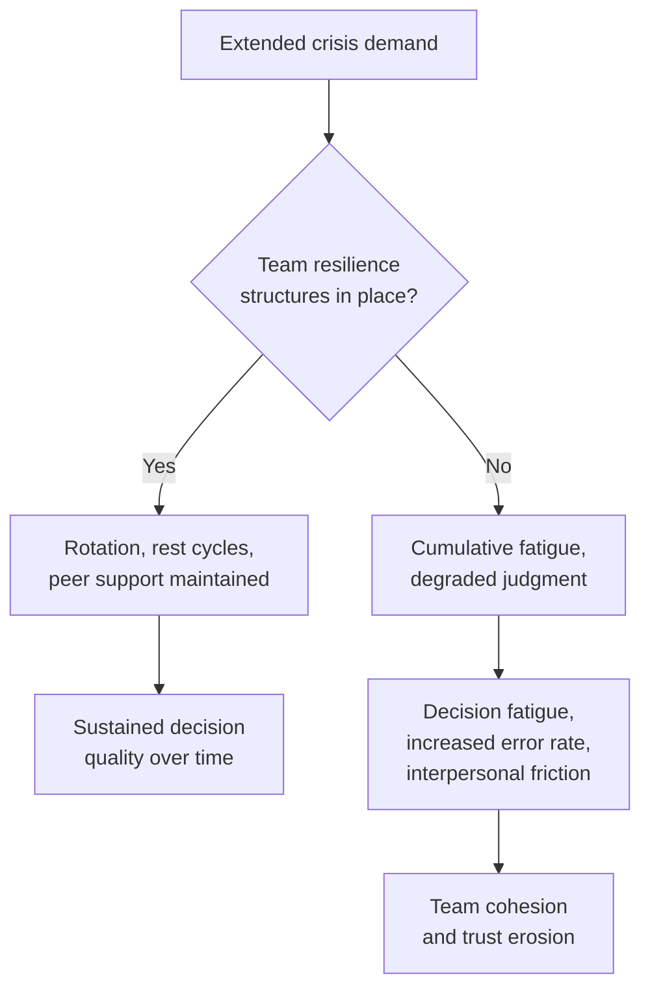

## Psychological Resilience Under Crisis Conditions

### Overview

Psychological resilience under crisis conditions refers to the capacity of individual diplomats, crisis leaders, and the teams they lead to sustain effective cognitive functioning, sound judgment, and stable interpersonal conduct across the duration of a high-stakes, high-pressure crisis, including crises that extend over days, weeks, or months rather than resolving quickly. This topic is distinct from the immediate cognitive and decision-making effects of acute stress discussed under Decision-Making Under Extreme Pressure, which addresses in-the-moment cognitive distortion; resilience is concerned with the sustained capacity to function well across an extended period of demand, including recovery and adaptation as the crisis continues, and applies to both individuals and the teams/organizations they are part of.

### Distinguishing Acute Stress Response from Sustained Resilience

**Key Points**

- **Acute stress response** — the immediate physiological and cognitive reaction to a sudden stressor (elevated cortisol/adrenaline, attentional narrowing, working-memory degradation — see Decision-Making Under Extreme Pressure), which is largely automatic and time-limited
- **Sustained resilience** — the capacity to maintain functional performance across repeated or prolonged stress exposure, which involves a different set of factors: recovery cycles, social support, meaning-making, and organizational structures that either protect or erode capacity over time
- **[Inference]** A common practical error is applying acute-stress countermeasures (structured pauses, immediate decision protocols) as though they alone address the resilience challenge of an extended crisis; sustained resilience additionally requires attention to rest, rotation, and psychological sustainability that acute-crisis decision protocols do not by themselves provide

### Individual-Level Resilience Factors

Drawing on stress-psychology and occupational-resilience research (much of it originating in military, emergency-response, and high-reliability-organization studies, subsequently applied to diplomatic and crisis-leadership contexts):

1. **Cognitive appraisal style** — how an individual interprets a stressor (as a manageable challenge versus an overwhelming threat) measurably affects both subjective experience and objective performance; this is consistent with the well-established psychological distinction between "challenge" and "threat" stress appraisals
2. **Prior relevant experience and training** — as discussed under Decision-Making Under Extreme Pressure, genuine domain expertise built through prior experience or extensive simulation improves the reliability of fast, intuitive judgment under pressure, which in turn reduces the felt burden of sustained high-stakes decision-making
3. **Physical self-regulation** — sleep, nutrition, and physical activity are consistently identified in occupational-resilience research as directly affecting cognitive endurance during extended crisis periods, though sustaining these basics is frequently the first casualty of crisis demands, creating a documented compounding effect where degraded self-care further erodes the judgment needed to protect it
4. **Emotional regulation capacity** — the ability to notice and manage one's own affective state without either suppressing useful information conveyed by emotion or being overwhelmed by it, associated in the literature with better-calibrated risk judgment under sustained pressure (connecting to the "affect heuristic" discussed under Decision-Making Under Extreme Pressure)
5. **Sense of agency and meaning** — occupational-resilience research broadly finds that a sustained sense of meaningful purpose and some degree of perceived control over one's actions (even within a highly constrained crisis environment) is associated with better-sustained performance and psychological wellbeing than a purely reactive, agency-depleted stance

### Team and Organizational Resilience Factors

**Key Points**

- **Rotation and rest scheduling** — deliberately built-in relief for crisis-team personnel during extended crises is a well-documented countermeasure to decision fatigue (touched on under Decision-Making Under Extreme Pressure), though crisis cultures frequently valorize continuous presence in ways that work against actually implementing rotation
- **Psychological safety within the team** — team members' willingness to voice dissent, admit uncertainty, or flag errors without fear of punitive response is strongly associated in organizational-behavior research (notably Amy Edmondson's work on psychological safety in high-stakes teams) with both better decision quality (directly supporting the structured-dissent countermeasures discussed under Crisis Diagnosis and Decision-Making) and better sustained team wellbeing
- **Peer support and debriefing structures** — regular, structured opportunities for team members to process the emotional and cognitive demands of crisis work, distinct from substantive operational briefings, are associated with reduced cumulative psychological strain over extended crises
- **Leadership modeling of sustainable behavior** — crisis-team leaders who visibly maintain their own rest, emotional regulation, and structured process tend to set a team-wide norm; leaders who model unsustainable continuous engagement are associated in the literature with teams that similarly neglect their own sustainability, to the team's eventual detriment

### Post-Traumatic Growth and Post-Traumatic Stress: A Balanced View

**Key Points**

- Extended exposure to high-stakes crisis work, particularly crises involving violence, humanitarian catastrophe, or significant personal risk (relevant to diplomats and crisis responders operating in conflict or disaster settings), carries genuine psychological risk, and the literature on **secondary/vicarious traumatic stress** in humanitarian and crisis-response professions is well-established
- A separate body of research on **post-traumatic growth** finds that some individuals report positive psychological change (increased sense of personal strength, deepened relationships, shifted priorities) following highly stressful or traumatic professional experiences — this is a genuine, researched phenomenon, but the literature is explicit that post-traumatic growth is not guaranteed, should not be expected or implied as a normal outcome, and does not mean the traumatic stress itself was beneficial or should be sought out
- **[Inference]** Organizational messaging that overemphasizes potential post-traumatic growth risks minimizing legitimate traumatic-stress risk and discouraging personnel from seeking support; the more clinically grounded framing treats growth as a possible but non-guaranteed outcome for some individuals under some conditions, not a substitute for taking traumatic-stress risk seriously or for providing adequate support structures

### Organizational Support Structures

**Next Steps for institutions building resilience infrastructure for crisis personnel:**

1. **Establish rotation schedules and staffing depth before a crisis occurs**, since building adequate bench strength cannot be improvised once an extended crisis is already underway
2. **Normalize access to psychological support** (peer support programs, professional counseling access) as a standard part of crisis-response infrastructure rather than an exceptional or stigmatized resource
3. **Build structured debriefing into standard crisis-response protocol**, both operational (what happened, what worked) and psychological (how personnel are coping), recognizing these serve different functions
4. **Train leadership specifically in sustainable crisis leadership practices**, given the documented modeling effect of leader behavior on team-wide resilience norms
5. **Track workload and fatigue indicators during extended crises**, rather than relying solely on self-report, given that fatigued personnel are frequently poor judges of their own degraded state — a well-documented feature of fatigue generally, not specific to crisis work

### Cultural and Institutional Variation

**[Inference]** Diplomatic and crisis-response institutional cultures vary considerably in how openly they acknowledge psychological strain and support-seeking as a normal and expected feature of high-stakes work rather than a sign of weakness or unsuitability for crisis roles; this variation plausibly affects both individual willingness to seek support and organizational investment in resilience infrastructure, though robust comparative research specifically on diplomatic institutional culture (as opposed to military or humanitarian-sector culture, which is somewhat better studied) is more limited, and specific claims here should be treated as a reasonable extrapolation rather than a well-established finding.

### Resilience and Decision Quality: The Connecting Thread

The practical justification for treating psychological resilience as a crisis-leadership competency, rather than a purely personal-welfare concern, is its direct connection to the decision-making and diagnostic quality discussed throughout this chapter:

$$\text{Sustained decision quality} = f(\text{acute cognitive function}, \text{cumulative fatigue}, \text{team psychological safety})$$

Cumulative fatigue and eroded psychological safety degrade exactly the capacities — attentional breadth, working memory, willingness to voice dissent, calibrated risk judgment — that Crisis Diagnosis and Situational Awareness and Decision-Making Under Extreme Pressure identify as essential to sound crisis judgment. Resilience infrastructure is therefore appropriately understood as a structural safeguard for decision quality across an extended crisis, functionally comparable to the red-teaming and structured-dissent mechanisms discussed elsewhere, rather than a separate wellness consideration disconnected from substantive crisis performance.

### Common Failure Modes

**Key Points**

- **Continuous-engagement culture** — institutional or personal norms that treat rest and rotation as signs of insufficient commitment, undermining resilience infrastructure even when nominally in place
- **Self-report reliance for fatigue monitoring** — depending on personnel to accurately self-assess their own degraded state, when fatigue itself is documented to impair the judgment needed for accurate self-assessment
- **Neglecting team psychological safety under pressure** — precisely when structured dissent and error-flagging are most valuable (during acute crisis), directive, high-pressure leadership styles can inadvertently suppress the psychological safety that enables them
- **Treating psychological support as exceptional rather than standard** — stigmatizing or under-resourcing support access, reducing uptake among personnel who would benefit
- **Overemphasizing post-traumatic growth narratives** at the expense of taking traumatic-stress risk seriously and providing adequate support
- **Under-investing in resilience infrastructure until an extended crisis is already underway**, when rotation depth and support structures are most valuable if established in advance

### Related Topics

- Decision fatigue and cumulative cognitive degradation in extended crises
- Psychological safety in high-stakes teams (Edmondson)
- Secondary/vicarious traumatic stress in humanitarian and crisis-response professions
- Leadership modeling and team-wide resilience norms
- Structured dissent and red-teaming as connected safeguards for decision quality
- Rotation, staffing depth, and organizational preparedness for extended crises