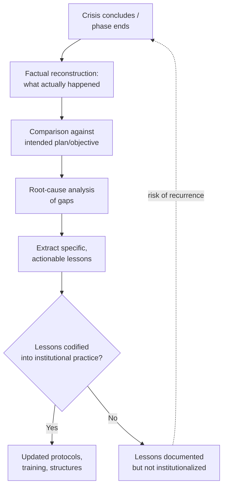

## After-Action Review and Institutional Learning

### Overview

After-action review (AAR) and institutional learning constitute the closing discipline of the crisis-management cycle: the systematic process by which an organization examines a completed (or completed phase of a) crisis response to extract accurate lessons, correct institutional practice, and improve future performance. This connects directly to Historical Crisis Patterns and Precedents, which addresses how lessons from *other* institutions' or eras' crises are used; after-action review is the mechanism by which an organization generates its *own* primary-source lessons from its own direct experience. The field's central finding is that conducting a review is necessary but insufficient — the harder and more frequently neglected problem is ensuring that accurate lessons, once identified, are actually institutionalized into changed practice rather than documented and forgotten.

### The AAR Concept: Origins and Core Principles

The after-action review format originated in a structured form within military training and operations (the US Army's AAR methodology, developed prominently through National Training Center practice from the 1970s onward, is the most widely cited institutional origin) and has since been adapted across emergency management, humanitarian response, and diplomatic/foreign-policy institutions.

**Key Points**

- **Distinguishing AAR from performance evaluation** — a properly conducted AAR is explicitly not a disciplinary or performance-grading exercise; conflating the two is widely identified in the literature as the single most damaging design error, since participants who fear that honest disclosure will be used against them will not surface the candid information the process depends on
- **Timing close to the event** — AARs are generally most effective when conducted promptly after the crisis or crisis phase concludes, while institutional memory is fresh, though this must be balanced against giving participants adequate time to have processed acute stress reactions (see Psychological Resilience Under Crisis Conditions) enough to reflect analytically rather than defensively
- **Multi-level participation** — effective AAR processes typically involve input from multiple organizational levels (senior decision-makers, operational staff, field personnel) since each level observed different aspects of the response and may have different, sometimes conflicting, assessments of what occurred and why

### The Standard AAR Structure

A widely used four-question framework structures most formal AAR processes:

1. **What was supposed to happen?** — establishing the intended plan, objective, or expected sequence of events as a baseline for comparison
2. **What actually happened?** — a factual reconstruction of events, deliberately separated from evaluation or blame at this stage
3. **Why were there differences?** — analysis of the gap between intention and outcome, addressing both what went wrong and what went right (or better than expected)
4. **What can be learned/sustained?** — extracting specific, actionable lessons, distinguishing what should change from what worked well and should be preserved

### Root-Cause versus Symptom-Level Analysis

**Key Points**

- A recurring quality distinction in AAR practice is between analysis that identifies **symptom-level** observations (a specific message was delayed, a meeting ran over time) and analysis that identifies **root-cause, structural factors** (the delayed message reflected an absent redundant-channel protocol; the meeting overrun reflected unclear chairing authority)
- Structured root-cause techniques — including simple iterative "five whys" questioning and more formal fault-tree or contributing-factor analysis — are commonly used to push AAR discussion past the first, most visible explanation toward underlying structural or procedural causes
- **[Inference]** Symptom-level AAR findings tend to generate narrow, easily implemented but limited fixes (add a specific checklist item), while root-cause findings tend to generate broader, more consequential but harder-to-implement structural changes (revise interagency coordination protocol) — meaning an AAR process should explicitly probe for root causes rather than settling for the more immediately available symptom-level explanation, even though the resulting recommendations are correspondingly harder to act on

### Common Analytical Biases Affecting AAR Quality

The same cognitive biases that affect crisis diagnosis and decision-making in real time (see Crisis Diagnosis and Situational Awareness) also affect retrospective analysis of a crisis, in some cases in mirrored or additional forms:

1. **Hindsight bias** — the well-documented tendency, once an outcome is known, to perceive that outcome as having been more predictable or obvious in advance than it actually was at the time, which can lead an AAR to unfairly characterize a reasonable decision made under genuine uncertainty as an obvious error
2. **Outcome bias** — evaluating the quality of a decision based on how it turned out rather than on the quality of the reasoning and information available at the time it was made, conflating good decisions with good outcomes (which can diverge, particularly under uncertainty)
3. **Self-serving attribution** — individuals and units tending to attribute successful outcomes to their own skill and unsuccessful outcomes to external or uncontrollable factors, which can distort a genuinely balanced accounting of what drove the response's performance
4. **Institutional face-saving pressure** — organizational incentive to characterize a response favorably (particularly where the AAR findings might be reviewed by external oversight bodies, media, or political leadership) can bias findings toward minimizing acknowledged failure

**[Inference]** Because hindsight and outcome bias are well-documented and largely unconscious, structured AAR methodology generally treats explicit countermeasures (reconstructing the actual information and uncertainty present at the time of a decision, rather than assessing it in light of the now-known outcome) as necessary rather than relying on participants' individual awareness of these biases to correct for them spontaneously.

### From Lessons Identified to Lessons Learned: The Institutionalization Problem

**Key Points**

- The crisis-management and military-doctrine literature draws a widely used distinction between **"lessons identified"** (an accurate finding documented in an AAR report) and **"lessons learned"** (a finding that has actually been institutionalized into changed doctrine, training, protocol, or structure) — and repeatedly emphasizes that the gap between the two is the field's most persistent, well-documented failure mode
- Common reasons lessons identified fail to become lessons learned:
  - **No clear institutional owner** assigned responsibility for implementing a specific recommendation
  - **Absence of a follow-up or tracking mechanism** to verify whether a recommended change was actually made
  - **Leadership or staff turnover** between the AAR and the next similar crisis, losing the institutional memory that generated the original lesson
  - **Recommendations that require resource investment** competing unsuccessfully against other institutional priorities once the acute crisis's political salience has faded
  - **Organizational incentive misalignment** (discussed under Coordinating Interagency and International Crisis Response) discouraging the kind of structural change some lessons require, particularly where implementation would reduce an agency's autonomy or resources

### Institutionalizing Lessons: Structural Mechanisms

**Next Steps for converting AAR findings into durable institutional change:**

1. **Assign named institutional ownership** for each specific recommendation, with an explicit accountability mechanism and deadline, rather than leaving implementation as a general aspiration
2. **Maintain a tracked lessons-learned database or registry** across successive crises, enabling pattern recognition across events (a recommendation appearing repeatedly across multiple independent AARs is a strong signal of an unaddressed structural issue) and reducing susceptibility to organizational memory loss from turnover
3. **Incorporate validated lessons directly into training and simulation content** (see the crisis-simulation practice discussed under Decision-Making Under Extreme Pressure), ensuring lessons are actively rehearsed rather than merely documented
4. **Conduct periodic meta-reviews across multiple AARs**, looking specifically for recurring findings across different crises, which helps distinguish genuinely structural issues from crisis-specific idiosyncrasies
5. **Protect AAR candor through institutional design** — formally separating the AAR process from performance evaluation and disciplinary processes, and where appropriate, using external or independent facilitators to reduce institutional face-saving pressure on findings

### Independent and External Review Mechanisms

**Key Points**

- Some of the most consequential institutional lessons in the historical record have come from formally independent inquiries (legislative or blue-ribbon commissions, independent inspector-general reviews) rather than internal AAR processes alone, particularly for high-profile crisis failures where internal self-review credibility is limited by the institutional face-saving pressures noted above
- Independent review carries its own trade-offs: greater perceived credibility and freedom from internal institutional incentive distortion, but often slower, more adversarial, and with less direct access to the classified or sensitive operational detail an internal review can draw on
- **[Inference]** The two mechanisms are generally best understood as complementary rather than substitutes: internal AAR processes provide rapid, detailed, operationally grounded learning close to the event, while external review provides periodic, higher-credibility structural accountability, particularly for the most consequential failures where internal incentives to minimize acknowledged fault are strongest

### Organizational Learning Culture as a Precondition

**Key Points**

- The technical AAR methodology described above functions effectively only within an organizational culture that genuinely values learning over blame-avoidance — connecting directly to the psychological safety concept discussed under Psychological Resilience Under Crisis Conditions, since personnel will not surface candid, potentially self-critical information in an AAR unless they trust that doing so will not be used punitively
- High-reliability-organization research (studies of aviation, nuclear power operations, and similar high-stakes, low-error-tolerance domains) consistently identifies a **"just culture"** — one that distinguishes honest error and reasonable judgment under uncertainty from genuine negligence or misconduct, and calibrates institutional response accordingly — as a precondition for organizations that learn effectively from crisis experience over time

### Common Failure Modes

**Key Points**

- **Conflating AAR with performance evaluation**, suppressing the candor the process depends on
- **Settling for symptom-level findings** rather than pursuing root-cause analysis, generating superficial rather than structural fixes
- **Hindsight and outcome bias distorting retrospective judgment** of decisions that were reasonable given information available at the time
- **The lessons-identified/lessons-learned gap** — accurate findings that are never actually institutionalized due to absent ownership, tracking, or resourcing
- **Loss of institutional memory through staff turnover**, particularly across the multi-year gaps that often separate major crises of a similar type
- **Excessive reliance on internal review alone** for the most consequential failures, where institutional face-saving pressure is strongest and external credibility is most needed

### Related Topics

- The lessons-identified versus lessons-learned distinction in military and crisis doctrine
- Hindsight bias and outcome bias in retrospective decision evaluation
- Just culture and high-reliability-organization theory
- Independent commissions and external crisis-failure review mechanisms
- Psychological safety as a precondition for organizational learning (Edmondson)
- Historical crisis patterns and the risk of analogical misapplication in drawing lessons