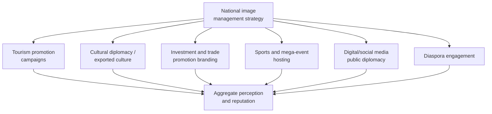

## Nation Branding and National Image Management

### Overview

Nation branding and national image management is the deliberate, strategic effort by a state (or its institutions, in coordination with non-state actors such as tourism boards, cultural agencies, and businesses) to shape how the country is perceived by foreign publics, governments, investors, and other audiences. This differs from traditional government-to-government diplomacy in its target audience and methods: rather than persuading foreign officials through direct negotiation, nation branding works through mass communication, cultural export, symbolic association, and reputation management techniques adapted substantially from commercial marketing and brand-management theory, applied to the far more complex and multi-attributed "product" of an entire country.

The field emerged as a distinct practice area in the late 1990s and 2000s, most closely associated with British place-branding consultant Simon Anholt, who both coined widely used terminology in the field and later grew skeptical of the commercial-marketing framing he had helped popularize — a tension that runs through the field's subsequent theoretical development.

### Conceptual Foundations

**Key Points**

- **Nation brand versus national image versus reputation** — the literature draws (not always consistently) distinctions between a *brand* (a deliberately constructed, managed identity), an *image* (how the country is actually perceived, which may or may not match the intended brand), and *reputation* (a more durable, accumulated judgment built over time, argued by Anholt and others to be far more resistant to short-term marketing intervention than commercial product branding)
- **The competitive identity framework** (Anholt) proposes that a nation's international standing is shaped by six interacting channels: tourism promotion, export brands, government policy, investment and immigration policy, culture and heritage, and the actions/behavior of its people — with the central claim that a nation's brand is primarily a *function of what it does*, not what it says about itself, making genuine policy and behavior the primary lever rather than communication campaigns alone
- **[Inference]** Anholt's later, more skeptical position — that most government nation-branding campaigns based on marketing/advertising techniques alone have limited durable effect — represents a significant internal critique within the field's own foundational literature, and should be understood as a genuine, still-debated tension rather than a settled consensus that nation branding as a discipline lacks value

### Measurement Instruments

Several standardized indices attempt to quantify national reputation, allowing comparison across countries and over time:

| Instrument | Focus | Approximate methodology |
| --- | --- | --- |
| Anholt-Ipsos Nation Brands Index | Overall national reputation across multiple dimensions | Survey-based perception measurement across large international sample |
| Country Brand Index (various providers) | Commercial/investment-oriented brand perception | Combination of survey and expert assessment |
| Soft power indices (e.g., various university and consultancy rankings) | Broader influence and attraction capacity | Composite of cultural, diplomatic, economic, and digital indicators |

**[Unverified]** Specific current rankings, methodological details, and the relative standing of particular countries on these indices change over time and across providers; any specific figure or ranking should be verified against the current published index rather than assumed to be static, and the underlying survey and weighting methodologies for these indices are also subject to ongoing revision and academic critique regarding their validity and comparability.

### Relationship to Soft Power Theory

Nation branding is closely related to, but analytically distinct from, Joseph Nye's concept of **soft power** — a state's ability to shape outcomes through attraction and persuasion rather than coercion or payment, resting on the attractiveness of its culture, political values, and foreign policies.

| Dimension | Nation branding | Soft power (Nye) |
| --- | --- | --- |
| Primary framing | Marketing/communication-derived | International-relations/power-theory-derived |
| Central mechanism | Managed perception and image | Genuine attraction based on values, culture, policy |
| Practitioner emphasis | Campaigns, symbols, messaging | Policy substance, cultural authenticity, institutional behavior |

**[Inference]** Much of the more rigorous contemporary literature treats nation branding as a *communications and coordination discipline* that can help convey a country's attributes more clearly and consistently, while treating soft power as the *underlying substantive resource* that branding communicates — implying that a branding campaign disconnected from genuine underlying policy or cultural substance is unlikely to produce durable reputational gain, a view broadly consistent with Anholt's competitive-identity emphasis on behavior over messaging.

### Core Practitioner Tools and Mechanisms

1. **Tourism campaigns** — often the most visible and heavily resourced branding activity, using visual and narrative marketing to shape perception of a country as a destination, frequently the entry point through which national branding strategy is first developed institutionally
2. **Cultural diplomacy and cultural export** — support for and promotion of a country's film, music, literature, cuisine, and other cultural products abroad, functioning as a form of attraction-based influence (South Korea's sustained, deliberate cultivation of its cultural export sector — the "Korean Wave" or *Hallyu* — is among the most frequently cited contemporary examples of a state actively supporting cultural export as a branding and soft-power strategy)
3. **Investment and trade promotion branding** — distinct messaging and campaigns targeted at foreign investors and business audiences, often emphasizing different attributes (stability, skilled workforce, regulatory environment) than tourism-oriented branding
4. **Mega-event hosting** — Olympic Games, World Cups, World's Fairs/Expos, and similar large international events used deliberately as a platform for concentrated global visibility and narrative-shaping (host-nation branding around such events is now a standard, extensively planned component of the bid and hosting process)
5. **Digital and social media public diplomacy** — direct communication with foreign publics through official government social media presence, digital content, and online engagement, a rapidly growing channel discussed in more depth in adjacent public-diplomacy topics
6. **Diaspora engagement** — treating diaspora populations as both an audience for and a channel of national branding, since diaspora communities can function as credible, trusted messengers to foreign publics in ways official government communication often cannot

### Institutional Architecture

**Key Points**

- Nation branding efforts typically require coordination across an unusually wide range of institutional actors — foreign ministries, tourism boards, trade and investment promotion agencies, cultural institutes, and often private-sector and diaspora organizations — creating a coordination challenge structurally similar to the interagency coordination problem discussed under Coordinating Interagency and International Crisis Response, though operating over a much longer time horizon and with less centralized urgency
- Some countries have established dedicated nation-branding agencies or councils specifically to coordinate this cross-institutional effort (examples include various national tourism-and-image coordinating bodies), while others manage it more diffusely across existing ministries and agencies without a single coordinating body
- **Cultural institutes** — government-affiliated organizations dedicated to promoting a country's language and culture abroad (the British Council, the Goethe-Institut, the Alliance Française, and the Confucius Institute network are frequently cited comparative examples) represent one of the most institutionally developed and long-standing forms of nation-branding infrastructure, though several of these institutions (the Confucius Institute network in particular) have also become subjects of considerable political controversy and host-country scrutiny in various jurisdictions

### The Behavior-Communication Gap Problem

**Key Points**

- The central, recurring critique in the nation-branding literature is the risk of a gap between a country's promoted brand image and the lived reality of its policies, governance, or international conduct — Anholt's core argument is that this gap is not merely an embarrassment risk but structurally limits what marketing-style branding communication can achieve, since foreign publics' aggregate perception is argued to track behavior and substantive experience (tourism, media coverage, trade relationships, diaspora reports) far more than official messaging
- High-profile human rights criticism, governance controversies, or foreign-policy actions inconsistent with a promoted national brand narrative are frequently cited in the literature and press commentary as producing acute reputational damage that branding campaigns alone cannot offset — sometimes termed (informally, in both scholarly and journalistic usage) "reputation laundering" or "brand-washing" when branding activity is perceived as primarily intended to obscure rather than genuinely address such gaps
- **[Inference]** This critique is most sharply applied to cases where branding investment (mega-event hosting, high-profile cultural promotion, sports sponsorship) coincides with significant, contemporaneous human-rights or governance criticism, though assessing the actual net reputational effect of such campaigns empirically is difficult, and specific claims about any particular country's branding effectiveness or intent should be treated with appropriate caution and checked against current, balanced reporting rather than assumed

### Case Illustrations of Distinct Strategic Approaches

| Approach type | Illustrative characteristic | Example pattern |
| --- | --- | --- |
| Cultural-export-led | Sustained state support for creative/cultural industries as primary soft-power vehicle | South Korea's cultural-industry support strategy |
| Mega-event-led | Concentrated investment in hosting high-visibility international events | Olympic and World Cup hosting bids explicitly tied to branding objectives |
| Reinvention/rebranding-led | Deliberate, comprehensive effort to shift an established negative or outdated national image | Post-conflict or post-transition states seeking to signal a decisive break from a prior international reputation |
| Niche-positioning-led | Concentrating branding effort on a narrow, distinctive attribute rather than broad-spectrum image campaigns | Smaller states emphasizing a specific sector strength (e.g., a particular industry, environmental leadership, or neutrality) |

**[Unverified]** The comparative effectiveness of these differing strategic approaches is not well-settled in the empirical literature, given the significant measurement difficulty in isolating branding's causal contribution to reputation change from other contemporaneous factors (broader economic performance, unrelated media coverage, geopolitical events); claims of a specific approach's success should be treated as illustrative rather than rigorously demonstrated.

### Common Failure Modes

**Key Points**

- **Slogan-and-logo-level branding without substantive backing** — treating nation branding as primarily a marketing/creative exercise (a new tourism slogan or visual identity) while neglecting the underlying policy, behavior, and institutional substance that Anholt's competitive-identity framework identifies as the actual driver of durable reputation
- **Institutional fragmentation** — uncoordinated messaging across the many agencies with a stake in national image, producing inconsistent or contradictory international signals
- **Behavior-brand mismatch** — high-profile branding investment that draws increased international scrutiny to a country's actual conduct, amplifying rather than mitigating reputational risk where a genuine gap exists
- **Overreliance on a single flagship channel** (a mega-event, a single cultural export sector) without broader, sustained institutional investment, producing a short-term visibility spike that fades without durable reputational change
- **Neglecting diaspora and traveler word-of-mouth channels**, which the literature consistently identifies as highly credible relative to official government messaging, in favor of top-down campaign communication alone

### Related Topics

- Joseph Nye's soft power theory and its relationship to nation branding
- Anholt's competitive identity framework and the Nation Brands Index
- Cultural diplomacy and cultural institute infrastructure (British Council, Goethe-Institut, Confucius Institutes)
- Mega-event hosting as a branding and soft-power vehicle
- Diaspora diplomacy and diaspora engagement strategy
- Digital public diplomacy and social media strategic communication