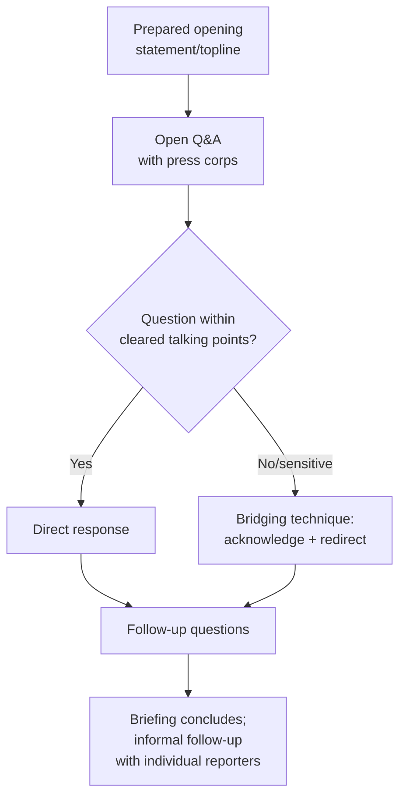

## Media Relations and Press Engagement

### Overview

Media relations and press engagement in a diplomatic context is the systematic practice of managing a government or diplomatic institution's interactions with journalists and media organizations to convey official positions accurately, respond to inquiries, shape coverage of foreign-policy events, and maintain the credibility and access relationships that make future communication possible. This differs from the broader public diplomacy and strategic communication topics elsewhere in this chapter in its specific focus on the practitioner-level relationship with the press as an intermediary institution — journalists, editors, and news organizations — rather than direct-to-public channels or long-term reputation-building efforts like nation branding.

### The Press Officer / Spokesperson Function

**Key Points**

- Most diplomatic institutions (foreign ministries, embassies, international organizations) designate specific personnel — press officers, spokespersons, public affairs officers — with defined authority to communicate officially with media, serving the same centralizing function discussed under Crisis Communication Protocols: preventing inconsistent or unauthorized statements from multiple officials
- **The distinction between "on the record," "on background," and "off the record"** is foundational vocabulary governing what a journalist may attribute and how:
  - **On the record** — statements may be directly quoted and attributed by name and title
  - **On background** — information may be used and characterized, but attributed only to a general source description ("a senior diplomat," "an official familiar with the discussions") rather than by name
  - **Off the record** — information provided for the journalist's own understanding/context only, not for publication or attribution in any form, relying entirely on mutual trust that the journalist will honor this designation
- **Deep background** — a further gradation sometimes used, where information may inform a journalist's reporting or framing but may not be attributed to any source at all, even a generic one

**[Inference]** These conventions are widely understood and generally respected norms within professional journalism in many media environments, but they are norms rather than enforceable rules — a journalist can, in principle, breach an off-the-record understanding, and the practical protection they offer rests entirely on the ongoing trust relationship and reputational consequences within the press corps rather than any binding mechanism, meaning press officers calibrate what they share off the record based on assessed trustworthiness of the specific reporter and relationship.

### The Press Briefing Format

**Core techniques:**

1. **The prepared topline/opening statement** — a carefully drafted initial statement covering the day's key messages before open questions begin, allowing the spokesperson to establish the intended frame before reactive Q&A
2. **Bridging** — a standard media-training technique for redirecting from an unwanted or sensitive question toward a prepared talking point, typically through an acknowledgment phrase ("What I can tell you is...", "The broader context here is...") that avoids appearing to simply dodge the question while still not directly answering it
3. **"Taking a question"** — a formal mechanism for declining to answer in the moment while committing to follow up once an accurate answer can be confirmed, used when a spokesperson genuinely lacks current, cleared information rather than when avoiding a sensitive topic
4. **Message discipline and repetition** — deliberately returning to the same core formulation across multiple questions and multiple briefings, since consistent phrasing (rather than varied restatement) reduces the risk of inadvertent inconsistency being read as a substantive shift in position
5. **Non-denial and calibrated ambiguity** — in sensitive situations, spokespersons frequently use formulations that neither confirm nor deny a specific claim ("I'm not in a position to discuss operational matters"), a deliberate technique distinct from an outright denial, though experienced press corps members generally recognize this pattern and may draw their own inferences from its use

### Preparing for Press Engagement

**Next Steps for structured press-engagement preparation:**

1. **Develop cleared talking points and Q&A documents in advance**, anticipating likely questions and pre-clearing responses through the appropriate internal approval chain, rather than improvising positions in real time
2. **Conduct message-testing and mock briefings/murder boards** — internal rehearsal sessions in which colleagues pose difficult or adversarial questions to test and refine responses before an actual briefing
3. **Coordinate with other relevant spokespersons** (allied governments, international organizations, other domestic agencies per Coordinating Interagency and International Crisis Response) to ensure consistent messaging where a shared position exists
4. **Establish and maintain relationships with key beat reporters** over time, since journalists covering a specific portfolio consistently develop institutional knowledge and trust relationships that shape how they interpret and contextualize official statements
5. **Monitor real-time coverage and social media reaction during and after engagement**, allowing rapid correction of misstatements or misunderstandings before they become entrenched in subsequent coverage

### Managing Difficult or Adversarial Press Engagement

**Key Points**

- **Acknowledging without capitulating** — a frequently taught technique for handling a hostile or leading question is to briefly acknowledge the premise or emotion behind the question without accepting a characterization the spokesperson disputes, before pivoting to the substantive response
- **Avoiding hypotheticals** — a standard practice of declining to answer "what if" or speculative questions about future decisions or contingencies, since any response (including a denial) can be reported as a substantive commitment or signal, regardless of the spokesperson's intent
- **Correcting factual errors promptly and directly** — when a journalist's question or a prior report contains a factual inaccuracy, addressing it head-on with corrected information tends to serve the institution's credibility better than allowing the inaccuracy to stand implicitly by focusing only on ignoring it
- **Managing "gotcha" framing** — recognizing when a question is structured to elicit a soundbite that can be decontextualized, and responding with sufficient context to reduce (though not eliminate) that risk

### Embargo and Exclusive Arrangements

- **Embargo** — providing information to journalists in advance of a specified release time, allowing more considered reporting while maintaining coordinated public release; embargoes depend on mutual trust and are occasionally broken, with reputational consequences for the breaching outlet within the press corps
- **Exclusives** — providing a story or interview opportunity to a single outlet or journalist ahead of or instead of general release, used strategically to reward relationship-building, secure more favorable or in-depth coverage, or reach a specific target audience through an outlet with particular reach or credibility with that audience

### Crisis Press Engagement: Distinct Considerations

Media relations during an active diplomatic or international crisis intersects directly with the material covered under Crisis Communication Protocols, with several crisis-specific press considerations:

- **Increased frequency and shortened preparation cycles** — crisis press engagement often requires rapid response to fast-moving developments, compressing the normal preparation and clearance processes described above
- **Heightened risk of the "CNN effect"** — real-time media coverage during a crisis can create public and political pressure that outpaces an organization's internal verification and decision cycle (discussed under Crisis Communication Protocols), placing press officers in the position of managing public expectation while substantive decisions are still being formed
- **Coordination with the interstate signaling function** — as discussed under Crisis Communication Protocols, public press statements during a crisis can function as (sometimes unintended) signals to other parties to the crisis, requiring closer-than-usual coordination between press officers and the substantive diplomatic/crisis-management function

### Digital Media and the Changing Press Landscape

**Key Points**

- Traditional press-relations practice, developed primarily around print, television, and wire-service journalism, has had to adapt to a media environment where social media platforms allow direct government-to-public communication (see Nation Branding and National Image Management and adjacent digital public diplomacy topics) alongside, and sometimes in tension with, traditional press-intermediated communication
- **Disintermediation** — the ability of officials and institutions to communicate directly with publics via social media, bypassing traditional press-relations gatekeeping, has altered (though not eliminated) the centrality of traditional press briefings and press-officer-mediated communication, creating new coordination challenges between official social media accounts and traditional press-office messaging
- **Speed and verification trade-offs** — the compressed news cycle and real-time social media environment increase pressure for rapid response, which can be in tension with the verification and clearance discipline traditional press-relations practice emphasizes, a tension directly related to the verification-versus-speed considerations discussed under Crisis Communication Protocols

### Common Failure Modes

**Key Points**

- **Inconsistent messaging across spokespersons or agencies** — undermining institutional credibility and potentially sending confused signals to foreign audiences or counterparts (see the message-fragmentation failure mode under Crisis Communication Protocols)
- **Over-reliance on non-denial and evasive formulations** — experienced press corps members recognize these patterns over time, and their overuse can itself become a story, generating coverage focused on the evasion rather than the underlying substance
- **Breaching off-the-record or embargo trust**, whether by the institution or (from the institution's perspective, when a journalist breaches it) damaging the specific working relationship and potentially the institution's broader willingness to extend such arrangements
- **Neglecting long-term relationship-building** in favor of purely transactional, crisis-driven media engagement, reducing the reservoir of trust and context that sustained beat-reporter relationships provide during difficult moments
- **Failure to correct factual errors promptly**, allowing inaccurate reporting to become entrenched in the public record and subsequent coverage
- **Treating social media and traditional press engagement as fully separate functions** rather than coordinating them, risking contradictory messaging across channels

### Related Topics

- Crisis communication protocols and the interaction between public messaging and interstate signaling
- Nation branding and the relationship between press relations and broader reputation management
- Digital public diplomacy and disintermediated government-to-public communication
- Message discipline and interagency communication coordination
- Bridging and media-training techniques for spokesperson preparation