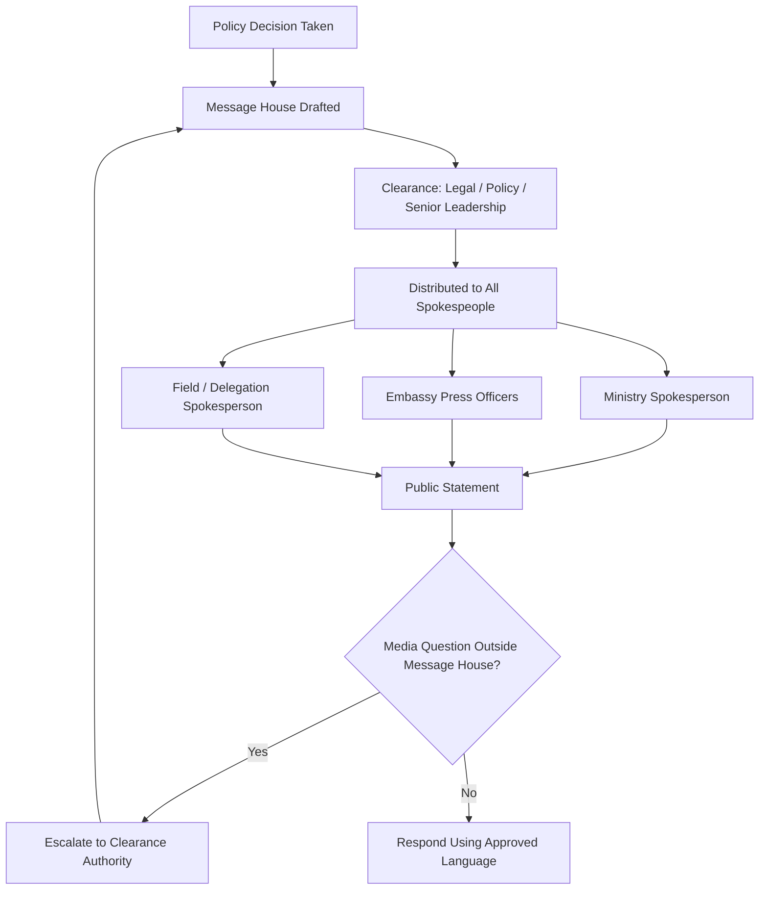

## Spokesperson Skills and Messaging Discipline

### Overview

Spokesperson skills and messaging discipline constitute the applied craft of representing an institution's position accurately, consistently, and persuasively before media, publics, and counterpart delegations. Within public diplomacy, the spokesperson functions as the visible interface between internal policy deliberation and external perception, and messaging discipline is the set of practices that keeps that interface aligned with authorized positions across time, platforms, and audiences.

### Core Competencies

#### Message Construction

- **Core Line**: A single, memorable sentence expressing the central position — the one line that would survive if nothing else were retained
- **Supporting Points**: Two to three subordinate points that substantiate the core line without diluting it
- **Bridging Language**: Verbal techniques ("what's important to understand is...", "the broader context here is...") used to redirect from an unwanted question back to prepared messaging
- **Proof Points**: Concrete facts, figures, or precedents that lend credibility to the core line

#### Delivery Skills

- **Vocal Control**: Pace, pitch modulation, and pause management to convey composure under pressure
- **Non-Verbal Discipline**: Posture, eye contact, and gesture control, particularly in televised or multilateral settings where cameras capture reaction shots
- **Active Listening**: Accurately parsing a question's intent before responding, distinguishing hostile framing from genuine information-seeking
- **On-Record Awareness**: Continuous recognition that any utterance in proximity to press, however informal, may be attributed and published

#### Message Discipline Mechanisms

- **Message House**: A structured document organizing the core message, three pillars of supporting argument, and proof points beneath each pillar, used to keep all spokespeople within an organization synchronized
- **Talking Points Clearance**: A formal internal review and sign-off process ensuring spokesperson language has been vetted by policy, legal, and senior leadership before release
- **Red Lines**: Explicitly forbidden phrases, topics, or commitments a spokesperson must never utter, typically because they would prejudge policy, reveal classified content, or create legal liability
- **Single Source of Truth**: The principle that one authorized document or briefing governs all spokesperson output for a given event, preventing contradictory statements across ministries or spokespeople

### The Message House Model (svg_diagram)

<svg xmlns="http://www.w3.org/2000/svg" viewBox="0 0 760 420" font-family="Arial, sans-serif">
<text x="380" y="28" font-size="18" font-weight="bold" text-anchor="middle" fill="#1a1a1a">Message House Structure (svg_diagram)</text>

<polygon points="380,50 620,140 140,140" fill="#2c5f7c" stroke="#1a1a1a" stroke-width="2" />
<text x="380" y="105" font-size="14" font-weight="bold" text-anchor="middle" fill="#ffffff">Core Message</text>
<text x="380" y="124" font-size="11" text-anchor="middle" fill="#ffffff">(the single sentence)</text>

<rect x="150" y="140" width="140" height="180" fill="#e8f0f4" stroke="#1a1a1a" stroke-width="2" />
<text x="220" y="165" font-size="13" font-weight="bold" text-anchor="middle" fill="#1a1a1a">Pillar 1</text>
<line x1="165" y1="180" x2="275" y2="180" stroke="#888" stroke-width="1" />
<text x="220" y="200" font-size="10" text-anchor="middle" fill="#333">Supporting</text>
<text x="220" y="215" font-size="10" text-anchor="middle" fill="#333">argument</text>
<text x="220" y="240" font-size="9" text-anchor="middle" fill="#555">Proof point A</text>
<text x="220" y="258" font-size="9" text-anchor="middle" fill="#555">Proof point B</text>
<rect x="310" y="140" width="140" height="180" fill="#e8f0f4" stroke="#1a1a1a" stroke-width="2" />
<text x="380" y="165" font-size="13" font-weight="bold" text-anchor="middle" fill="#1a1a1a">Pillar 2</text>
<line x1="325" y1="180" x2="435" y2="180" stroke="#888" stroke-width="1" />
<text x="380" y="200" font-size="10" text-anchor="middle" fill="#333">Supporting</text>
<text x="380" y="215" font-size="10" text-anchor="middle" fill="#333">argument</text>
<text x="380" y="240" font-size="9" text-anchor="middle" fill="#555">Proof point A</text>
<text x="380" y="258" font-size="9" text-anchor="middle" fill="#555">Proof point B</text>
<rect x="470" y="140" width="140" height="180" fill="#e8f0f4" stroke="#1a1a1a" stroke-width="2" />
<text x="540" y="165" font-size="13" font-weight="bold" text-anchor="middle" fill="#1a1a1a">Pillar 3</text>
<line x1="485" y1="180" x2="595" y2="180" stroke="#888" stroke-width="1" />
<text x="540" y="200" font-size="10" text-anchor="middle" fill="#333">Supporting</text>
<text x="540" y="215" font-size="10" text-anchor="middle" fill="#333">argument</text>
<text x="540" y="240" font-size="9" text-anchor="middle" fill="#555">Proof point A</text>
<text x="540" y="258" font-size="9" text-anchor="middle" fill="#555">Proof point B</text>

<rect x="140" y="320" width="480" height="50" fill="#1a1a1a" />
<text x="380" y="350" font-size="13" font-weight="bold" text-anchor="middle" fill="#ffffff">Foundation: Institutional Values / Mandate / Policy Basis</text>

<rect x="140" y="385" width="480" height="25" fill="#f4e4e4" stroke="#a33" stroke-width="1" />
<text x="380" y="402" font-size="10" text-anchor="middle" fill="#a33">Red lines apply across all pillars — never contradicted regardless of question framing</text>
</svg>

### Handling Hostile and Difficult Questions

#### The Bridging Technique

A three-step verbal pivot used when a question strays into red-line territory or off-message terrain:

1. **Acknowledge**: Briefly recognize the question without endorsing its premise ("That's a question a lot of people are asking...")
2. **Bridge**: Use a transitional phrase to redirect ("...but what's really at the heart of this is...")
3. **Deliver**: Return to the core message or a supporting pillar

#### Common Hostile Question Patterns

- **False Dichotomy**: Journalist forces a binary choice between two unfavorable options; spokesperson response should reject the framing rather than pick a side
- **Leading Question**: Question embeds an unverified assumption as fact ("Given that the ministry failed to..."); spokesperson must correct the premise before answering
- **Hypothetical Trap**: Journalist asks spokesperson to speculate on future policy or confidential deliberations; standard response is to decline speculation explicitly rather than ignore the question
- **Cumulative Pressure**: Repeated rephrasing of the same question seeking a slip; discipline requires repeating the same core answer verbatim if necessary ("message discipline through repetition")

#### No Comment Pitfalls

[Inference] Overuse of "no comment" is widely regarded in practitioner literature as implying guilt or evasion; the preferred alternative is a substantive non-answer that explains *why* detail cannot be shared (e.g., ongoing negotiations, personnel privacy, security considerations) while reaffirming the core message.

### Crisis Communication Adaptations

| Dimension | Routine Briefing | Crisis Briefing |
| --- | --- | --- |
| Message update cycle | Daily or per-event | Hourly or continuous |
| Clearance chain | Standard | Compressed / pre-delegated authority |
| Tone | Measured, informative | Empathetic, authoritative, calm |
| Primary risk | Message drift | Factual error under time pressure |
| Coordination need | Single ministry | Cross-agency, often multinational |

**Key Points**

- In crisis settings, the first statement sets the frame; corrections are costlier than delay, but silence itself becomes a message
- A designated "holding statement" — pre-approved generic language acknowledging an event without committing to unverified facts — should be prepared in advance for foreseeable crisis categories
- Spokespeople must distinguish between confirmed facts, working assumptions, and speculation, labeling each explicitly to preserve institutional credibility if facts later change

### Coordination Across Multiple Spokespeople

#### The Synchronization Problem

When multiple spokespeople represent the same institution (e.g., ministry spokesperson, embassy press officers, ambassador) or when multiple governments issue coordinated statements (joint communiqués), inconsistency between simultaneous statements is a primary diplomatic risk.

#### Coordination Mechanisms

- **Pre-Briefing Calls**: Scheduled calls among spokespeople before a major announcement to align timing and phrasing
- **Shared Digital Repository**: Centralized, access-controlled document (often within a secure intranet) holding the current-version message house, updated in real time
- **Lock/Unlock Protocol**: Formal designation of when messaging is "locked" (no deviation permitted) versus "in draft" (open to input)
- **After-Action Review**: Post-event comparison of what each spokesperson actually said against the approved message house to identify drift for future correction

### Messaging Discipline Under Multilateral Settings

In multilateral diplomacy (UN, regional bodies, summits), messaging discipline extends to:

- **National vs. Bloc Messaging**: Distinguishing when a spokesperson speaks for their own government versus a negotiating bloc or alliance, with explicit signaling of which capacity is in use
- **Translation Consistency**: Ensuring the core message retains identical meaning across working languages; idiomatic phrases in the core line are avoided because they resist clean translation
- **Off-the-Record Protocols**: Multilateral settings often use tiered attribution rules (on-the-record, on-background, deep background, off-the-record); spokespeople must track which rule applies to each conversation and audience
- **Non-Papers and Talking Points for Counterparts**: Informal, unattributable documents used to convey a position to a counterpart delegation without creating an official record

### Media Training Methodologies

#### Simulation-Based Training

- **Hot Seat Drills**: Simulated hostile press conferences with trainers playing adversarial journalists, recorded and reviewed for message adherence
- **Stress Inoculation**: Deliberately escalating question difficulty and interruption frequency to build composure under pressure
- **Message Testing**: Pre-release testing of proposed core messages against focus groups or internal red-teams to identify unintended interpretations

#### Feedback Instruments

- **Message Adherence Scoring**: Post-briefing scoring of transcript against the message house, tracking on-message percentage
- **Media Monitoring Analysis**: Comparing published coverage against intended framing to assess whether the core message survived transmission through the press

### Digital and Social Media Extension

- **Platform-Specific Adaptation**: The core message remains constant, but supporting points are recompressed for character limits, visual formats, or video length without altering substantive content
- **Real-Time Monitoring**: Continuous tracking of how a statement is being received and reframed online, enabling rapid rebuttal of mischaracterization before it hardens into narrative
- **Screenshot Permanence**: Awareness that digital statements are archivable and searchable indefinitely, raising the stakes of imprecise phrasing relative to spoken remarks

### Common Failure Modes

- **Message Fatigue**: Repeating the same phrasing so often it appears evasive or robotic; mitigated by varying supporting language while keeping the core line fixed
- **Freelancing**: A spokesperson improvising outside the cleared message house, often under journalist pressure, creating a contradiction that becomes its own story
- **Premature Commitment**: Answering hypothetical or future-policy questions in ways that bind the institution before internal deliberation concludes
- **Contradiction Across Time**: Statements consistent at the moment of utterance but inconsistent with a prior or subsequent official position, often surfaced by journalists comparing transcripts
- **Over-Precision Under Uncertainty**: Providing specific figures or timelines that later prove wrong, damaging credibility more than a vaguer but accurate statement would have

### Example

**Scenario**: A ministry spokesperson is asked at a press briefing, "Is it true your government secretly promised concessions in exchange for the release of the detainees?"

**Weak response**: "No comment on the details of the negotiation."

**Disciplined response**: "I won't get into the specifics of diplomatic exchanges that led to this outcome — that's standard practice for any negotiation of this sensitivity, and departing from it would make future releases harder to secure. What I can tell you is [core message: the detainees are home, and that outcome was the government's singular priority throughout]."

This response declines the trap (confirming or denying "secret concessions"), explains the reason for non-disclosure (protecting future negotiating leverage — a credible, non-evasive justification), and bridges back to the core message.

**Next Steps**

- Drafting and stress-testing a message house for a specific policy announcement
- Practicing bridging language through recorded hot-seat simulations
- Building a crisis holding-statement library for foreseeable event categories
- Studying attribution-tier protocols (on-record, background, deep background) in multilateral contexts
- Reviewing case studies of message discipline failures and their diplomatic consequences
- Coordinating cross-agency lock/unlock protocols for joint announcements