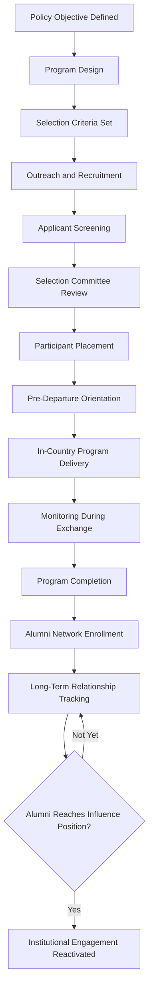

## Cultural Diplomacy and Exchange Programs

### Overview

Cultural diplomacy is the deliberate use of cultural assets, exchange, and expression to build mutual understanding, project national identity, and advance foreign policy objectives through means outside formal negotiation. Exchange programs are its principal institutional mechanism, moving people, scholars, artists, and ideas across borders to generate durable relationships and cross-cultural literacy that state-to-state diplomacy alone cannot produce.

### Conceptual Foundations

#### Relationship to Soft Power

- **Soft Power Theory**: Cultural diplomacy is a primary instrument of soft power — the ability to shape preferences through attraction and legitimacy rather than coercion or payment, as theorized by Joseph Nye
- **Attraction vs. Persuasion**: Unlike public diplomacy's messaging function, cultural diplomacy operates through demonstration and shared experience rather than argument, aiming to make a country's values self-evidently appealing
- **Long Time Horizon**: Effects are cumulative and generational rather than immediate; a cultural exchange participant may not influence policy for decades, distinguishing this instrument from rapid-response strategic communication

#### Distinguishing Cultural Diplomacy from Adjacent Fields

| Dimension | Cultural Diplomacy | Public Diplomacy | Propaganda |
| --- | --- | --- | --- |
| Primary mechanism | Exchange, exhibition, shared experience | Messaging, media engagement | One-directional persuasion |
| Directionality | Often bidirectional | Primarily outbound | Outbound only |
| Transparency of source | Usually overt | Usually overt | Often concealed or distorted |
| Time horizon | Long-term, relational | Short-to-medium term | Variable, often immediate |
| Truth standard | Authentic cultural representation | Factual accuracy expected | Subordinated to persuasive goal |

### Core Instruments

#### Educational and Professional Exchange

- **Flagship Exchange Programs**: Government-run programs (e.g., Fulbright, Chevening, DAAD scholarships) that fund students, scholars, and professionals for extended study or research abroad
- **Visitor Leadership Programs**: Short-term, curated exchange visits for emerging foreign leaders in politics, media, or civil society, designed to build relationships before they reach positions of influence
- **Alumni Networks**: Structured post-program engagement with exchange alumni, sustaining relationships and creating durable channels of influence and goodwill over careers

#### Cultural Institutes and Overseas Presence

- **National Cultural Institutes**: Government-affiliated or quasi-independent bodies (e.g., British Council, Alliance Française, Goethe-Institut, Confucius Institutes) that operate language instruction, cultural programming, and exhibitions abroad
- **Cultural Attachés**: Diplomatic staff embedded within embassies specifically tasked with cultural programming, artist and institution liaison, and local cultural landscape assessment
- **Arm's-Length Model**: A governance structure in which the institute is funded by government but operates with editorial and programming independence, intended to enhance credibility with host audiences by distancing programming from direct political control

#### Arts, Heritage, and Exhibition Diplomacy

- **Touring Exhibitions**: State-sponsored circulation of art, historical artifacts, or design collections to foreign museums, often accompanying state visits or anniversaries of bilateral relations
- **Heritage Diplomacy**: Cooperative preservation of shared or contested cultural heritage sites, sometimes used to de-escalate tension in post-conflict or contested-territory contexts
- **Cultural Property Restitution**: Return or loan of artifacts as a goodwill gesture, increasingly significant in decolonization-era diplomacy between former colonial powers and states of origin

#### Language Promotion

- **Language Institutes**: Instruction in a nation's language abroad as a long-horizon influence mechanism, since language acquisition correlates with sustained cultural affinity and elite access
- **Language Scholarships**: Funding for foreign students to study the sponsoring country's language, often as a gateway to further educational exchange

### Exchange Program Architecture

#### Design Considerations

- **Selection Criteria**: Balancing academic or professional merit against diversity of background, geographic representation, and likelihood of returning to positions of influence in the home country
- **Reciprocity**: Bidirectional exchange (both countries send and receive participants) is generally regarded as more durable and less susceptible to accusations of one-directional influence-seeking than unidirectional programs
- **Duration Trade-offs**: Longer immersion (academic-year programs) produces deeper cultural fluency and relationship depth; shorter programs (two-to-three week visitor programs) allow broader reach across more participants at lower cost per person
- **Return Requirement**: Many programs require participants to return to their home country for a minimum period post-exchange, intended to ensure the acquired relationships and knowledge benefit the home society rather than contributing to brain drain

#### Funding and Governance Models

- **Direct Government Funding**: Programs funded and administered directly by a foreign ministry or dedicated cultural agency
- **Public-Private Partnership**: Government seed funding combined with private foundation or corporate sponsorship, diversifying funding risk and sometimes enhancing perceived independence
- **Binational Commissions**: Joint bodies with representatives from both partner governments jointly governing and funding an exchange program, used for prestige flagship programs like Fulbright's country-specific commissions

### Measurement and Evaluation

#### The Attribution Problem

[Inference] Practitioner and academic literature broadly treats cultural diplomacy's causal effects on foreign policy outcomes as inherently difficult to isolate from other factors, since attitude change is diffuse, cumulative, and confounded by simultaneous exposure to media, trade relationships, and other influences.

#### Common Evaluation Frameworks

- **Output Metrics**: Participant numbers, program completion rates, institutional partnerships formed — measurable but only proxies for actual influence
- **Outcome Metrics**: Longitudinal surveys of participant attitudes toward the sponsoring country, tracked at program completion and at intervals afterward
- **Impact Metrics**: Tracking alumni career trajectories into positions of political, cultural, or economic influence, and any traceable connection between exchange relationships and later bilateral cooperation
- **Network Analysis**: Mapping alumni networks to assess density of connections and cross-referencing with bilateral engagement events to identify correlation between exchange participation and subsequent cooperation

**Key Points**

- No consensus methodology exists for converting cultural diplomacy activity into a single return-on-investment figure comparable across programs or against other diplomatic instruments
- Evaluation increasingly emphasizes relationship quality and network position over raw participant counts

### Risks and Critiques

#### Legitimacy and Perception Risks

- **Propaganda Perception**: Host populations or governments may interpret cultural institutes as instruments of political influence rather than genuine cultural exchange, particularly when program content appears to avoid politically sensitive topics about the sponsoring country
- **Elite Capture**: Exchange programs risk primarily benefiting already-privileged individuals with access to application processes, English-language proficiency, or existing elite networks, undermining broader societal reach
- **Securitization Concerns**: Some governments have restricted or expelled foreign cultural institutes (Confucius Institutes on several university campuses being a widely cited example) over concerns about surveillance, ideological content, or academic freedom infringement — [Unverified, jurisdiction-dependent] the specific legal basis and scope of such restrictions vary significantly by country and continue to evolve

#### Asymmetric Power Dynamics

- **Cultural Imperialism Critique**: Large, well-resourced nations' cultural diplomacy can overwhelm smaller nations' domestic cultural production and market space, raising concerns distinct from genuine mutual exchange
- **Reciprocity Imbalance**: Programs nominally described as bidirectional may in practice see far greater outbound flow from the wealthier partner nation, undermining the mutuality that gives cultural diplomacy its legitimacy advantage over propaganda

### Contemporary Adaptations

#### Digital Cultural Diplomacy

- **Virtual Exchange**: Video-mediated exchange programs connecting classrooms, professionals, or civil society groups without physical travel, expanding reach and reducing cost but sacrificing some depth of immersive relationship-building
- **Digital Cultural Archives**: Online availability of a nation's cultural heritage (digitized museum collections, literature, film) as a low-cost, high-reach complement to physical exchange
- **Diaspora Engagement Platforms**: Digital tools connecting diaspora communities to home-country cultural institutions, treating diaspora populations as an extension of the cultural diplomacy audience

#### Sports and Popular Culture Diplomacy

- **Sports Diplomacy**: Use of sporting exchange, hosting international competitions, or athlete diplomacy (historically exemplified by "ping-pong diplomacy" between the US and China) to open channels where formal diplomacy is constrained
- **Creative Industries Diplomacy**: Leveraging film, music, and popular media exports as informal cultural diplomacy, operating with less direct government control than formal exchange programs but often reinforcing the same soft power objectives

### Example

**Scenario**: A foreign ministry seeks to rebuild relations with a country following a period of diplomatic estrangement, where formal negotiation channels remain frozen but people-to-people trust has eroded.

**Cultural diplomacy approach**:

1. Relaunch a suspended binational exchange commission with an initial small cohort of university researchers in a politically neutral field (e.g., public health or environmental science)
2. Pair the exchange with a touring exhibition of shared cultural heritage, framed around historical connection rather than current political dispute
3. Engage returning alumni from prior exchange cohorts as informal interlocutors, leveraging existing relationship capital built before the estrangement
4. Track attitude shifts among participating institutions over a multi-year horizon as an early indicator of relationship recovery, understanding that formal diplomatic normalization is likely to lag behind cultural relationship rebuilding

This illustrates cultural diplomacy's characteristic function: operating in political space where formal diplomatic channels are constrained, using longer time horizons and lower political visibility to rebuild relational foundations.

**Next Steps**

- Comparative case study of Fulbright Program governance versus Confucius Institute governance models
- Designing a monitoring and evaluation framework for a hypothetical exchange program
- Examining heritage diplomacy in post-conflict reconciliation contexts
- Analyzing the securitization debate around foreign-funded cultural institutes on university campuses
- Exploring diaspora engagement as an emerging cultural diplomacy instrument
- Studying sports diplomacy case studies (ping-pong diplomacy, Olympic Truce initiatives)