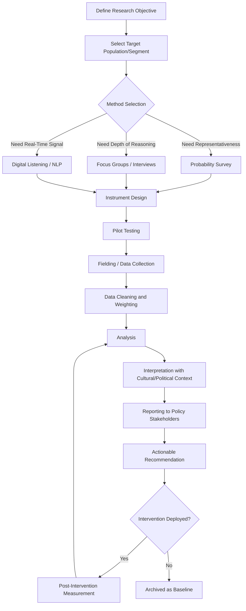

## Public Opinion Analysis Abroad

### Overview

Public opinion analysis abroad is the systematic collection, interpretation, and application of data on foreign populations' attitudes toward a state's policies, actions, and identity. It functions as the diagnostic and feedback layer underpinning public diplomacy and strategic communication, allowing practitioners to calibrate messaging, anticipate reaction, and evaluate whether diplomatic and cultural efforts are achieving their intended effect.

### Purpose Within Public Diplomacy

- **Diagnostic Function**: Establishing baseline attitudes before a campaign, program, or policy announcement to know what is actually being worked against or built upon
- **Formative Function**: Testing message concepts, framing choices, or program designs before deployment to reduce the risk of counterproductive messaging
- **Evaluative Function**: Measuring attitude change after an intervention (a campaign, exchange program, or crisis response) to assess effectiveness
- **Early-Warning Function**: Detecting emerging grievances, misinformation narratives, or shifts in sentiment that could escalate into diplomatic incidents or security concerns before they become acute

### Data Collection Methodologies

#### Quantitative Survey Research

- **Nationally Representative Surveys**: Probability-based sampling designed to generalize findings to an entire foreign population, typically the gold standard but also the most resource-intensive
- **Omnibus Surveys**: Shared-cost surveys where multiple organizations purchase space for their own questions within a single fielded questionnaire, reducing cost for narrower diplomatic inquiries
- **Panel Studies**: Repeated surveys of the same respondent cohort over time, enabling more reliable measurement of attitude change than repeated cross-sectional surveys of different respondents
- **Tracking Polls**: High-frequency, smaller-sample surveys run continuously or at short intervals to detect rapid sentiment shifts, often used around elections, crises, or major policy announcements

#### Qualitative Methods

- **Focus Groups**: Small moderated group discussions used to explore the reasoning and emotional texture behind attitudes that survey data alone cannot reveal, particularly useful for message testing
- **In-Depth Interviews**: One-on-one structured or semi-structured interviews with opinion leaders, journalists, or civil society figures, valuable for elite opinion mapping distinct from mass public opinion
- **Ethnographic and Field Research**: Extended observational engagement with communities, typically used where survey infrastructure is weak or where trust deficits make direct questioning unreliable

#### Digital and Computational Methods

- **Social Media Listening**: Automated collection and sentiment classification of public social media content to track real-time discourse volume and tone around a topic or country
- **Web Analytics**: Traffic, engagement, and referral pattern analysis on official digital properties (embassy websites, cultural institute pages) as an indirect indicator of interest and reception
- **Natural Language Processing (NLP) Sentiment Analysis**: Automated classification of text as positive, negative, or neutral toward a specified entity, applied at scale to news coverage or social content
- **Network Analysis**: Mapping influence structures among online opinion leaders to identify who is actually shaping a narrative rather than merely amplifying it

[Inference] Digital and computational methods are widely noted in practitioner literature to require careful methodological caution: social media populations are rarely representative of a country's general population, skewing toward younger, urban, and more digitally connected demographics, and platform algorithms can distort apparent sentiment distribution independent of actual underlying opinion.

### Methodological Architecture

### Sampling and Fielding Challenges Abroad

#### Access and Infrastructure Constraints

- **Sampling Frame Availability**: Reliable population registries or address-based sampling frames may not exist in all countries, forcing reliance on less rigorous quota or convenience sampling methods
- **Telephone and Internet Penetration Gaps**: Mode selection (phone, online, in-person) must account for coverage bias, since low-penetration populations are systematically excluded from phone or online-only methods
- **Authoritarian Context Constraints**: In restrictive political environments, respondents may fear retaliation for honest answers to sensitive political questions, and government permission may be required (or refused) to field surveys at all
- **Conflict and Insecurity Zones**: Fieldworker safety and access limitations in active conflict areas often force reliance on remote methods (phone, digital) with corresponding representativeness trade-offs

#### Translation and Cultural Equivalence

- **Question Translation Validity**: Direct translation of survey instruments can alter connotation or fail to capture locally salient concepts; back-translation (translating the translated version back to the original language independently to check fidelity) is a standard quality control method
- **Construct Equivalence**: Concepts central to a survey (e.g., "trust in government," "national pride") may not carry equivalent meaning or salience across cultures, requiring local adaptation rather than literal translation
- **Response Style Bias**: Cultures vary systematically in tendencies toward extreme responding, acquiescence bias, or social desirability bias, complicating direct cross-country comparison of raw survey scores

### Sensitive Question Design

- **Indirect Questioning Techniques**: Methods such as list experiments or randomized response techniques, used to estimate prevalence of socially sensitive attitudes (e.g., support for a controversial policy or leader) while protecting individual respondent anonymity
- **Social Desirability Mitigation**: Question framing and self-administered response modes (as opposed to interviewer-administered) used to reduce respondents' tendency to give answers they believe are more socially acceptable rather than their genuine view
- **Sequencing Effects**: Order of question presentation can prime or bias subsequent responses; sensitive political questions are typically placed after rapport-building neutral questions

### Institutional Actors and Sources

- **Government-Run Research Units**: Dedicated public opinion research offices within foreign ministries or public diplomacy agencies, often commissioning rather than directly fielding research
- **Commercial Polling Firms**: International survey research companies contracted for fielding, offering established local infrastructure and methodological expertise
- **Academic and Think Tank Barometers**: Recurring, publicly available cross-national survey series that provide comparative baseline data without requiring a government to commission bespoke research
- **International Organizations**: Multilateral bodies that field or aggregate cross-national opinion data, useful for benchmarking a country's standing against regional or global comparators

### Analytical Frameworks for Interpretation

#### Segmentation Approaches

- **Demographic Segmentation**: Disaggregating opinion by age, education, urban/rural residence, or region to identify where support or opposition concentrates
- **Attitudinal Segmentation**: Clustering respondents by underlying values or worldview rather than demographics, often revealing that policy attitudes track more closely with values clusters than simple demographic categories
- **Elite vs. Mass Opinion Divergence**: Systematic comparison of opinion leader/elite views against general public sentiment, since these can diverge significantly and require different engagement strategies

#### Trend and Driver Analysis

- **Time-Series Trend Analysis**: Tracking a specific attitude metric over repeated survey waves to distinguish genuine shifts from normal sampling variation
- **Driver Analysis / Regression Modeling**: Statistical modeling identifying which underlying factors (economic conditions, specific policy events, media exposure) most strongly predict overall favorability, guiding where intervention would be most effective
- **Event Association**: Correlating sentiment shifts with specific diplomatic events, news cycles, or policy announcements to assess causal plausibility, while accounting for the attribution difficulty inherent in observational data

**Key Points**

- Single-point-in-time survey results are of limited diagnostic value without a trend baseline for comparison
- Triangulation across multiple methods (survey, digital listening, qualitative interviews) produces more reliable interpretation than reliance on any single data source

### Ethical and Risk Considerations

- **Respondent Safety**: Researchers bear responsibility for protecting respondent anonymity, particularly on politically sensitive topics in restrictive environments where exposure could result in retaliation
- **Data Sovereignty and Local Law**: Cross-border data collection and storage must account for host-country data protection and privacy regulation, which varies substantially by jurisdiction
- **Perception of Surveillance**: Public opinion research conducted by or for a foreign government can itself become a diplomatic controversy if perceived by the host population or government as intelligence-gathering rather than legitimate research — transparent methodology disclosure and, where required, local institutional/ethical review are standard mitigations
- **Weaponization Risk**: Opinion data intended for genuine understanding can be misused to identify vulnerable populations for targeted disinformation rather than authentic engagement; practitioner ethics standards generally treat this as a boundary that should not be crossed

### Example

**Scenario**: A foreign ministry wants to assess whether a recent bilateral aid announcement is improving public sentiment in the recipient country ahead of a planned high-level visit.

**Approach**:

1. Pull baseline favorability data from the most recent existing tracking survey wave (pre-announcement) as the comparison point
2. Commission a rapid-turnaround tracking poll in the capital and two regional hubs within two weeks of the announcement, using consistent question wording from the baseline instrument
3. Layer in social media sentiment analysis around the announcement's news cycle to capture short-term reaction the survey's slower fielding timeline would miss
4. Conduct a small set of elite interviews with local journalists and civil society figures to understand the reasoning behind quantitative shifts (or lack thereof)
5. Segment survey results by region and demographic to identify whether aid is landing differently across recipient communities, informing where the high-level visit itinerary might have greatest relationship-building value

This illustrates the combined use of trend tracking, digital signal, and qualitative depth to produce an interpretation robust enough to inform a specific diplomatic decision, rather than relying on any single data point in isolation.

**Next Steps**

- Designing a cross-national tracking survey instrument with back-translation protocol
- Evaluating digital listening tool selection and representativeness limitations
- Studying indirect questioning techniques (list experiments) for sensitive political topics
- Building a driver-analysis model linking survey attitudes to specific policy events
- Reviewing ethical review requirements for opinion research in restrictive political environments
- Comparing elite versus mass opinion divergence in a specific bilateral relationship case study