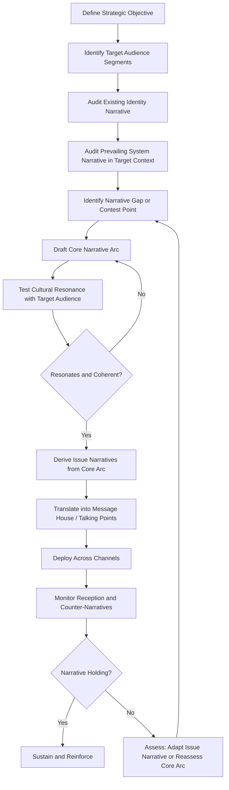

## Strategic Narrative Construction

### Overview

Strategic narrative construction is the deliberate design of coherent storylines that connect an actor's identity, actions, and goals into an interpretable framework for target audiences. Within public diplomacy, strategic narratives operate at a higher level of abstraction than individual messages: they provide the interpretive structure through which specific statements, policies, and events are understood, framing "who we are, what world we live in, and what needs to be done."

### Conceptual Foundations

#### The Three-Level Narrative Framework

Following the influential formulation developed in strategic narrative scholarship (notably Miskimmon, O'Loughlin, and Roselle), narratives operate at three interlocking levels:

- **Identity Narratives**: Stories about who an actor is — its values, history, and character — establishing the basis for why its actions should be trusted or its perspective credited
- **System Narratives**: Stories about how the world works — the nature of the international order, who the relevant actors are, and what forces are in play — providing the backdrop against which specific events are interpreted
- **Issue Narratives**: Stories about a specific policy, event, or conflict — why a particular action was taken and what it means — nested within and drawing legitimacy from the identity and system narratives above it

#### Narrative vs. Message vs. Frame

| Concept | Scope | Time Horizon | Function |
| --- | --- | --- | --- |
| Message | Single statement or talking point | Immediate, event-specific | Conveys a discrete fact or position |
| Frame | A specific interpretive lens applied to one issue | Short-to-medium term | Shapes how one issue is understood |
| Narrative | Overarching storyline connecting identity, world order, and issues | Long-term, often enduring across administrations | Provides coherence across many messages and frames over time |

**Key Points**

- A strategic narrative is not a single sentence but a structure that generates and organizes many individual messages coherently over time
- Effective public diplomacy typically requires messages and frames to nest within a consistent narrative; contradictory or shifting narratives undermine even well-crafted individual messages

### Structural Components of a Narrative

#### Classical Narrative Elements Applied to Strategy

- **Actors/Characters**: Who is cast as protagonist, antagonist, and audience within the story — a state may cast itself as guardian, victim, innovator, or liberator depending on strategic objective
- **Setting**: The implied context or era the narrative situates itself within (e.g., "a moment of historic transition," "a return to stability after crisis")
- **Plot/Causality**: The sequence of cause and effect the narrative asserts — what led to the current situation and what follows from it
- **Conflict/Tension**: The central problem or antagonist force the narrative positions the protagonist against, providing dramatic stakes and a reason for audience investment
- **Resolution/Trajectory**: The implied or stated endpoint the narrative is moving toward, giving audiences a sense of purpose and continuity

#### Narrative Coherence Requirements

- **Internal Consistency**: Elements of the narrative must not contradict each other across time or audience segment
- **Correspondence with Observable Reality**: [Inference] Practitioner literature broadly holds that narratives requiring frequent contradiction by visible facts on the ground lose credibility faster than narratives that can absorb ambiguous or mixed evidence
- **Cultural Resonance**: The narrative structure must align with pre-existing cultural templates, myths, or reference points familiar to the target audience to be readily adopted rather than perceived as foreign imposition

### Construction Process

#### Audience Segmentation for Narrative Design

- **Elite vs. Mass Audiences**: Elite audiences often require more nuanced, evidence-supported narrative variants, while mass audiences respond more strongly to emotionally resonant, simplified narrative arcs
- **In-Group vs. Contested Audiences**: Narratives directed at already-sympathetic audiences function primarily to reinforce and mobilize, while narratives directed at skeptical or adversarial-leaning audiences require greater investment in establishing credibility before persuasive content can land
- **Diaspora and Transnational Audiences**: Populations with dual cultural affiliation often require narrative variants that acknowledge complex identity rather than assuming straightforward alignment with either home or host country narrative frames

### Narrative Projection Channels

- **Leader Rhetoric**: Head-of-state and senior official speeches as the highest-visibility vehicle for articulating identity and system-level narrative elements
- **Institutional Programming**: Cultural diplomacy, exchange programs, and public diplomacy messaging operationalizing the narrative at the issue level across many discrete touchpoints
- **Media and Content Partnerships**: State media, funded content partnerships, and platform placement extending narrative reach into media ecosystems where an actor lacks direct access
- **Public Diplomacy Events**: Summits, commemorations, and symbolic events staged specifically to dramatize and reinforce narrative elements (e.g., anniversary commemorations reinforcing an identity narrative of historical partnership)

### Narrative Contestation

#### Competing and Counter-Narratives

- **Narrative Competition**: The normal condition in which multiple actors project competing narratives about the same system or issue, with audiences exposed to and selecting among them based on credibility, resonance, and repetition
- **Counter-Narrative Strategy**: Deliberate construction of a narrative specifically designed to undermine or displace an adversary's narrative, typically requiring identification of the adversary narrative's weakest or most internally contradictory element
- **Narrative Hijacking**: When an adversary or unaffiliated actor successfully reframes an actor's own narrative elements toward a different conclusion than intended, a significant risk when narrative elements are ambiguous or rely on symbols with contested meaning

#### Disinformation and Narrative Warfare

- **Narrative Laundering**: Techniques for obscuring the origin of a narrative to make it appear organically sourced rather than state-directed, increasing perceived credibility
- **Narrative Saturation**: Strategy of flooding an information environment with a preferred narrative across many channels simultaneously to establish it as the dominant interpretive frame before competing narratives gain traction
- **Wedge Narratives**: Narratives specifically designed to exploit existing social or political divisions within a target audience rather than build cross-cutting consensus — [Unverified, context-dependent] the ethical and legal boundaries around a state's use of wedge narratives against foreign populations remain actively contested in both policy and legal scholarship

### Measurement of Narrative Effectiveness

- **Narrative Adoption Tracking**: Monitoring whether target audience discourse (media coverage, social commentary, elite rhetoric) begins to reproduce the narrative's core framing language and causal claims
- **Narrative Contest Mapping**: Systematic comparison of narrative share-of-voice against competing narratives across a defined information environment over time
- **Longitudinal Identity Association**: Survey-based tracking of whether audiences associate the intended identity attributes (e.g., "reliable partner," "innovator") with the actor over successive measurement waves, linking back to public opinion analysis methodologies
- **Coherence Audits**: Periodic internal review comparing recent official statements and actions against the stated narrative to detect drift or emerging contradiction before external audiences do

### Common Failure Modes

- **Narrative-Reality Gap**: Narrative claims that diverge visibly from observable policy or action, producing credibility collapse when the gap becomes apparent to the target audience
- **Narrative Overreach**: Constructing an identity or system narrative too ambitious or totalizing to sustain consistently across the many discrete statements and actions an actor generates over time
- **Fragmented Ownership**: Different parts of a government or coalition projecting subtly inconsistent narrative variants due to lack of centralized narrative governance, producing the appearance of incoherence even when no individual statement is false
- **Static Narrative in a Changed Context**: Failure to adapt a narrative as underlying strategic circumstances shift, resulting in a narrative that persists past its credibility or relevance, particularly visible when system-level conditions (e.g., a shift in the international order) invalidate prior assumptions

### Example

**Scenario**: A mid-sized power seeks to reposition its international identity from a historically resource-exporting economy toward a technology and innovation hub, to support a broader foreign policy pivot toward deeper engagement with advanced-economy partners.

**Narrative construction approach**:

1. **Identity narrative**: Shift core self-description from "resource-rich provider" to "innovation-driven partner," selecting historical touchpoints (early scientific achievements, educational investment) that make this identity plausible rather than a sudden invention
2. **System narrative**: Position the shift within a broader claimed narrative of a "multipolar knowledge economy" in which mid-sized innovative powers gain new strategic relevance — providing the world-order backdrop that makes the identity shift strategically legible to external audiences
3. **Issue narratives**: Derive specific issue narratives — a new technology partnership agreement framed as "proof point" of the innovation identity; a scientific exchange program framed as embodiment of the same identity — each issue narrative reinforcing the identity and system levels rather than standing alone
4. **Coherence check**: Audit whether continuing resource-export economic activity contradicts the innovation narrative, and if so, develop a bridging narrative (e.g., "resource wealth funding the innovation transition") rather than allowing an unaddressed contradiction to undermine credibility
5. **Measurement**: Track whether target-audience media coverage and elite commentary begin describing the country using innovation-associated language over a multi-year horizon, rather than expecting immediate narrative adoption

This illustrates the layered construction process: an issue-level program or agreement only functions as effective strategic narrative when it is deliberately connected upward to identity and system-level narrative claims, rather than treated as an isolated communication event.

**Next Steps**

- Mapping the three-level narrative structure (identity/system/issue) for a specific real-world bilateral relationship
- Conducting a coherence audit comparing recent official statements against a stated national narrative
- Studying counter-narrative construction techniques against a specific adversarial narrative case
- Designing a narrative adoption tracking methodology using media and social discourse analysis
- Examining historical case studies of narrative overreach and subsequent credibility collapse
- Exploring the legal and ethical boundaries of wedge narrative use in foreign-directed communication