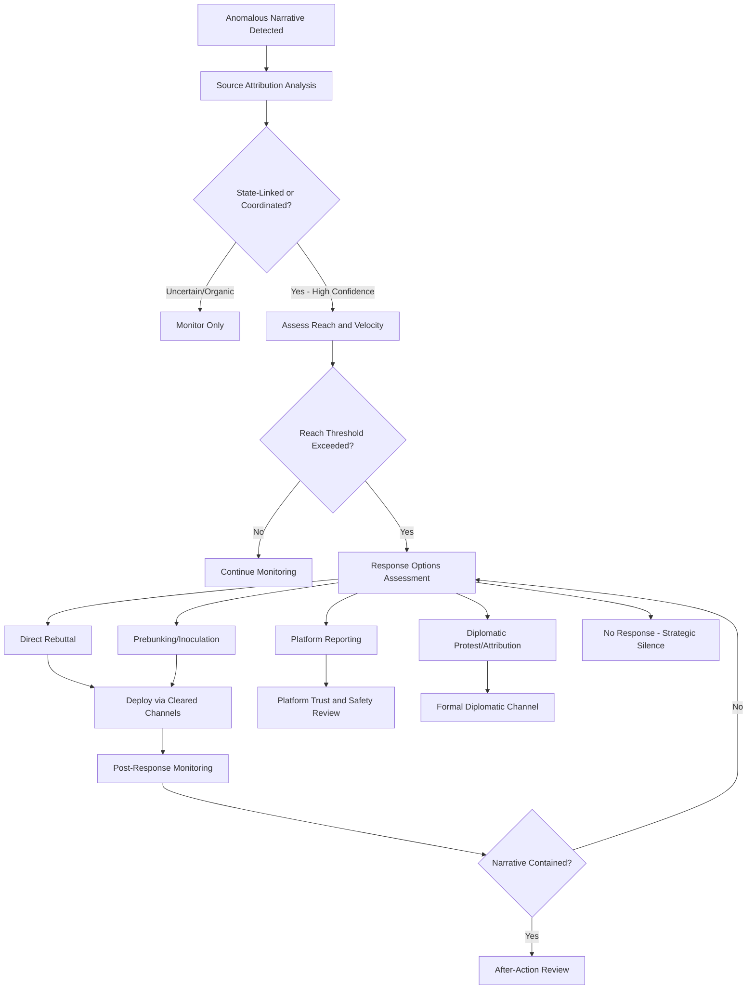

## Countering Disinformation and Propaganda

### Overview

Countering disinformation and propaganda is the set of institutional practices, analytical methods, and communication responses used to detect, assess, and mitigate deliberately false or misleading information campaigns targeting a state's population, partners, or interests. Within public diplomacy, this function sits at the defensive end of strategic communication, protecting the information environment in which narratives, messaging, and cultural diplomacy operate.

### Conceptual Definitions

#### Distinguishing Related Terms

| Term | Intent | Accuracy | Typical Source Transparency |
| --- | --- | --- | --- |
| Misinformation | Unintentional | False or misleading | Often genuinely unaware source |
| Disinformation | Deliberate | False or misleading | Often concealed or falsified |
| Malinformation | Deliberate | Factually accurate but weaponized | Genuine information used out of context to cause harm |
| Propaganda | Deliberate | May be true, false, or mixed | Source often concealed or its agenda obscured |
| Strategic Communication (own) | Deliberate | Expected to be accurate | Overt, attributed |

**Key Points**

- The defining feature distinguishing disinformation from ordinary persuasive communication is deliberate deception about either the content's veracity or its true source
- Not all propaganda is factually false — some propaganda uses accurate information selectively or misleadingly framed, which complicates purely fact-based rebuttal strategies

#### The Disinformation Ecosystem

- **Content Creation Layer**: Origination of false or misleading narratives, ranging from state-directed operations to opportunistic non-state actors
- **Amplification Layer**: Networks (bot networks, coordinated inauthentic accounts, witting or unwitting influencers) that spread content beyond its original reach
- **Laundering Layer**: Techniques obscuring true origin, such as passing content through intermediary outlets or seemingly independent local voices before it reaches target audiences
- **Reception Layer**: The target audience whose existing beliefs, media literacy, and information environment determine how readily the content is believed and further shared

### Detection and Analysis

#### Analytical Frameworks

- **ABC Framework (Actor-Behavior-Content)**: Analytical approach separating assessment of *who* is behind an operation, *how* it behaves (coordination patterns, inauthenticity indicators), and *what* content is being spread, avoiding the common error of judging an operation solely on content truthfulness
- **DISARM Framework**: [Unverified — evolving open-source framework] A structured taxonomy modeling disinformation campaign tactics, techniques, and procedures analogous to cybersecurity threat frameworks, intended to give analysts common vocabulary for describing observed campaign behavior
- **Source Triangulation**: Cross-referencing a claim against multiple independent, credible sources before either amplifying or rebutting it, reducing risk of inadvertently legitimizing fabricated content through premature response

#### Coordinated Inauthentic Behavior Indicators

- **Network Pattern Analysis**: Identifying account clusters exhibiting synchronized posting timing, near-identical content, or artificial amplification patterns inconsistent with organic user behavior
- **Account Provenance Signals**: Indicators such as account creation date clustering, profile authenticity markers, and behavioral history inconsistent with claimed identity
- **Narrative Seeding Patterns**: Tracing a narrative's earliest appearances and cross-platform migration path to identify likely origin points versus organic amplification

### Response Strategies

#### Prebunking and Inoculation

- **Inoculation Theory Application**: Preemptively exposing audiences to a weakened version of a manipulation technique before they encounter it in the wild, building cognitive resistance analogous to a medical inoculation
- **Media Literacy Programming**: Structural, long-horizon investment in target-population critical media consumption skills, reducing susceptibility to disinformation regardless of specific campaign content
- **Technique-Focused (vs. Content-Focused) Prebunking**: Teaching audiences to recognize manipulation techniques (false urgency, emotional manipulation, false dichotomies) rather than only debunking specific false claims, providing more durable and generalizable resistance

#### Debunking and Rebuttal

- **Fact-Check Response Protocols**: Structured, rapid-response verification and public correction processes, typically most effective when deployed quickly after false content begins spreading but before it achieves wide reach
- **Truth Sandwich Technique**: Communication structure that states the accurate fact first, briefly names the false claim being corrected, then restates and reinforces the accurate fact — designed to minimize the "backfire effect" risk of repetition-driven reinforcement of the false claim
- **Backfire Effect Consideration**: [Inference] A body of communication research has raised concern that direct rebuttal can sometimes inadvertently increase a false claim's familiarity and salience; more recent research is mixed on how commonly this actually occurs, meaning response design should weigh reach and audience context rather than assume rebuttal is always net-positive or always net-negative

#### Strategic Non-Response

- **Amplification Risk Assessment**: Deliberate decision not to respond to low-reach disinformation, based on assessment that a response would grant the narrative more visibility than it would otherwise achieve
- **Oxygen Denial Principle**: Practitioner heuristic holding that certain disinformation, particularly content designed to provoke reaction, is best countered by declining to engage directly, instead reinforcing one's own narrative through unrelated positive messaging

### Institutional and Multilateral Architecture

#### National-Level Structures

- **Dedicated Counter-Disinformation Units**: Specialized government bodies tasked with monitoring, analysis, and coordinated response to disinformation targeting national interests
- **Cross-Agency Coordination Mechanisms**: Structures linking foreign ministries, intelligence assessment, and communications functions, since disinformation response requires both attribution analysis and public communication capability that no single agency typically holds alone
- **Legal and Regulatory Instruments**: Domestic legislation addressing platform transparency requirements, foreign influence operation disclosure, or election-period content rules, varying substantially by jurisdiction and raising distinct free-expression considerations in democratic contexts

#### Multilateral and Cross-Border Cooperation

- **Information Sharing Networks**: Formal and informal channels among allied governments and civil society researchers for sharing indicators and analysis of cross-border disinformation campaigns
- **Platform Engagement**: Structured relationships between governments and technology platforms for reporting coordinated inauthentic behavior, subject to each platform's own policy and enforcement discretion
- **Civil Society and Academic Partnerships**: Government engagement with independent fact-checking organizations and research institutions, often preferred as a first-line response mechanism because independent verification carries greater audience credibility than direct government rebuttal

### Attribution Challenges

- **Confidence Levels in Attribution**: Attribution assessments typically carry graduated confidence levels (low/moderate/high confidence) rather than binary certainty, reflecting the inherent difficulty of definitively linking covert operations to a specific state or non-state sponsor
- **Public vs. Private Attribution**: Strategic choice between quietly sharing attribution assessments through diplomatic channels versus public attribution, the latter carrying higher diplomatic cost but greater deterrent and narrative value
- **False Flag Risk**: The possibility that an operation is deliberately designed to implicate an innocent third party, requiring analytical caution before public attribution is issued
- **Proportionality of Response**: Response calibration matching the assessed severity, confidence level, and strategic significance of an identified campaign, since over-response to low-confidence or low-impact operations carries its own credibility and escalation risks

### Measurement of Counter-Disinformation Effectiveness

- **Narrative Reach Reduction**: Tracking whether a targeted false narrative's spread velocity or total reach decreases following a countermeasure, relative to a counterfactual trajectory
- **Belief Change Measurement**: Survey-based assessment of whether target audience belief in specific false claims decreases after exposure to countermeasures, connecting to broader public opinion analysis methodology
- **Resilience Metrics**: Longitudinal assessment of population-level media literacy and susceptibility to manipulation techniques as an indicator of durable defensive capacity, independent of any single campaign
- **Platform Enforcement Tracking**: Monitoring rates of platform action (removal, labeling, account suspension) against reported coordinated inauthentic behavior as a proxy for institutional response effectiveness

**Key Points**

- Effectiveness measurement in this field faces the same attribution difficulty as public opinion analysis generally — isolating a countermeasure's specific causal effect from the broader information environment is rarely straightforward
- Reduction in narrative reach does not necessarily indicate belief change; audiences may stop encountering content without having their underlying attitudes shifted

### Ethical and Democratic Governance Considerations

- **Free Expression Boundaries**: Counter-disinformation measures in democratic contexts must be designed to avoid overreach into legitimate dissent or unpopular-but-genuine opinion, a boundary that is actively and often contentiously debated in policy and legal discourse
- **Government Credibility Risk**: State-run counter-disinformation efforts can themselves be perceived as propaganda if not conducted with procedural transparency, particularly regarding methodology and evidentiary basis for claims
- **Asymmetric Vulnerability**: Open societies with strong free-press and free-expression norms face structurally different vulnerabilities to disinformation than closed societies, since the same openness that enables democratic discourse also enables adversarial exploitation

### Example

**Scenario**: A foreign ministry's monitoring unit detects a coordinated social media narrative falsely attributing a domestic political scandal to that ministry's country, spreading rapidly across a partner nation ahead of a scheduled bilateral summit.

**Response approach**:

1. Apply ABC framework analysis: assess actor (coordinated account cluster with creation-date clustering and synchronized posting), behavior (inauthentic amplification pattern), and content (fabricated scandal claim) before determining response
2. Conduct source triangulation, confirming the underlying factual claim is fabricated through independent verification rather than assuming falsity from pattern analysis alone
3. Assess reach: narrative has moderate but growing velocity approaching a threshold likely to affect summit-related media coverage
4. Select response: rather than direct government rebuttal (risking legitimizing the narrative further), share verified analysis with independent fact-checking partners in the target country, allowing correction to emerge through a more locally credible channel
5. Simultaneously brief the partner government through diplomatic channels on the attribution assessment at appropriate confidence level, enabling coordinated awareness ahead of the summit without public escalation
6. Monitor post-response narrative trajectory and conduct after-action review regardless of outcome, feeding lessons into future detection calibration

This illustrates the layered decision process — attribution confidence, reach assessment, and channel selection — that determines whether, how, and through whom a response is deployed, rather than defaulting to immediate direct rebuttal.

**Next Steps**

- Studying the DISARM framework's tactic taxonomy for campaign analysis practice
- Designing a prebunking/media literacy program for a specific target audience segment
- Comparative analysis of public versus private attribution strategy in documented case studies
- Examining free-expression governance debates around domestic counter-disinformation legislation
- Building a coordinated inauthentic behavior detection workflow using open-source indicators
- Reviewing platform engagement protocols and their enforcement effectiveness limitations