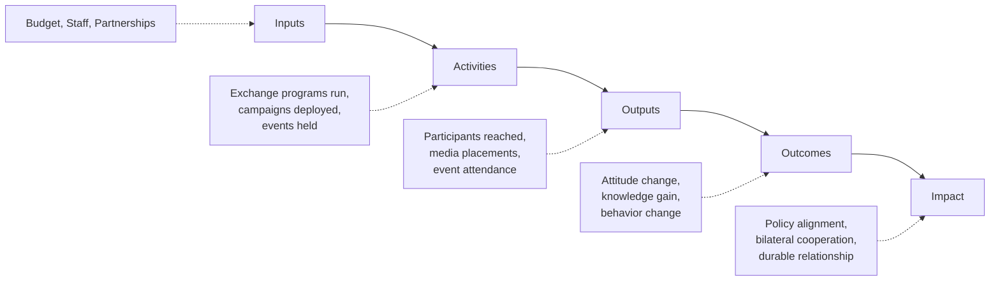

## Measuring Public Diplomacy Effectiveness

### Overview

Measuring public diplomacy effectiveness is the discipline of designing evaluation frameworks that connect public diplomacy activities — exchange programs, cultural diplomacy, strategic narrative campaigns, spokesperson engagement — to demonstrable outcomes in foreign audience attitudes, behaviors, and ultimately policy-relevant relationships. It functions as the accountability and learning layer across all other public diplomacy instruments, closing the loop between activity and impact.

### The Evaluation Challenge

#### Why Public Diplomacy Resists Simple Measurement

- **Diffuse Causality**: Attitude and behavior change results from cumulative exposure across many simultaneous influences (media, trade, personal contact, competing narratives), making isolation of any single program's causal contribution inherently difficult
- **Long Time Horizons**: Many public diplomacy effects, particularly from cultural and exchange diplomacy, manifest years or decades after initial activity, often beyond typical government budget or electoral evaluation cycles
- **Intangible Outcomes**: Core objectives such as "trust," "goodwill," or "mutual understanding" lack natural quantitative units, requiring proxy indicators that imperfectly capture the underlying construct
- **Confounding Events**: External shocks (crises, elections, unrelated bilateral incidents) can overwhelm or mask the measurable effect of a specific public diplomacy intervention within the same measurement window

**Key Points**

- No consensus "gold standard" metric exists across the field; most serious evaluation frameworks combine multiple indicator types rather than relying on a single number
- The absence of a perfect metric is not a reason to forgo measurement — it is the reason structured, multi-method evaluation frameworks exist

### The Logic Model Approach

#### Standard Results Chain

Public diplomacy evaluation frameworks typically structure measurement along a results chain moving from activity to ultimate impact:

- **Inputs**: Resources committed — budget, personnel, institutional partnerships
- **Activities**: What is actually done — programs run, campaigns deployed, exchanges administered
- **Outputs**: Immediate, directly countable products of activity — number of participants, media placements secured, event attendance
- **Outcomes**: Changes in target audience knowledge, attitude, or behavior attributable (with appropriate caveats) to the activity
- **Impact**: Longer-term, higher-order effects — shifts in bilateral relationship quality, policy alignment, or strategic position

#### Common Measurement Error: Output-Outcome Conflation

[Inference] A frequently noted failure mode in practitioner and academic evaluation literature is treating output metrics (participant counts, media impressions, social media reach) as if they were evidence of outcome-level effectiveness, when outputs measure only activity volume, not whether that activity changed anything in the target audience's mind or behavior.

### Metric Categories

#### Output Metrics (Activity-Level)

- **Reach Metrics**: Audience size exposed to a message, program, or content (impressions, attendance, participant counts)
- **Media Metrics**: Volume and placement quality of earned media coverage, press mentions, and media partnership deliverables
- **Engagement Metrics**: Digital interaction rates (shares, comments, click-through) indicating audience activity beyond passive exposure, though engagement volume alone does not indicate sentiment direction

#### Outcome Metrics (Audience-Level Change)

- **Favorability/Attitude Tracking**: Survey-measured shifts in target audience sentiment toward the sponsoring country, typically requiring pre/post or longitudinal tracking design as covered under public opinion analysis methodology
- **Knowledge and Awareness Change**: Measured gains in accurate factual understanding of the sponsoring country or its policies, distinct from favorability and sometimes more reliably measurable
- **Narrative Adoption**: The degree to which target audience discourse reproduces intended framing language, connecting to strategic narrative construction measurement approaches
- **Behavioral Indicators**: Observable behavior change such as increased trade engagement, tourism, applications to exchange programs, or civil society partnership formation, generally regarded as stronger evidence of effect than attitude survey data alone since behavior carries a cost that mere stated opinion does not

#### Relationship and Network Metrics

- **Alumni Network Density**: Mapping of exchange program alumni into positions of influence and the density of their continued connection to the sponsoring institution, as introduced under cultural diplomacy evaluation
- **Elite Access Metrics**: Tracking of relationship depth and access with target-country decision-makers and opinion leaders as a distinct category from mass public attitude
- **Institutional Partnership Durability**: Longevity and depth of formal partnerships (university linkages, sister-city agreements, joint research initiatives) as an indicator of sustained relationship infrastructure

### Evaluation Design Approaches

#### Experimental and Quasi-Experimental Methods

- **Randomized Controlled Trials (RCTs)**: Random assignment of eligible participants to program access versus a control group, providing the strongest causal evidence but rarely feasible for diplomacy programs due to ethical, political, and logistical constraints on withholding program access
- **Quasi-Experimental Designs**: Methods such as difference-in-differences or matched comparison groups (comparing outcomes in program-exposed versus similar unexposed populations) used when randomization is infeasible, offering improved causal inference over simple before/after comparison without requiring true randomization
- **Natural Experiments**: Leveraging naturally occurring variation in program exposure (e.g., funding cuts affecting some regions but not others) to approximate causal comparison conditions after the fact

#### Non-Experimental Approaches

- **Pre/Post Comparison**: Simple before-and-after measurement of the same population, useful but vulnerable to confounding from concurrent unrelated events during the measurement window
- **Theory-Based Evaluation**: Structured assessment of whether the underlying logic model's assumed causal links are individually plausible and evidenced, used when direct outcome measurement is infeasible
- **Contribution Analysis**: A structured method for building a credible case that a program contributed to an observed outcome alongside other factors, explicitly acknowledging shared attribution rather than claiming sole causation
- **Process Tracing**: Qualitative method examining the specific causal steps between an intervention and an outcome in a single case, used to build detailed evidence of mechanism even without large-sample statistical power

### Institutional Evaluation Practice

#### Governance Structures

- **Independent Evaluation Units**: Evaluation functions organizationally separated from program implementation teams, intended to reduce conflict of interest in assessing a program's own effectiveness
- **Standardized Evaluation Frameworks**: Institution-wide logic models and metric standards applied consistently across programs, enabling cross-program comparison and portfolio-level resource allocation decisions
- **Evaluation Timing Cadence**: Distinguishing formative evaluation (conducted during program implementation to enable real-time adjustment) from summative evaluation (conducted at or after program completion to assess final effectiveness)

#### Reporting to Policy Stakeholders

- **Accountability Reporting**: Evaluation output formatted for budget and legislative oversight purposes, typically emphasizing output metrics due to their concreteness and ease of year-over-year comparison
- **Learning-Oriented Reporting**: Evaluation output formatted to inform program design improvement, typically emphasizing outcome and process evidence even where less definitively quantifiable
- **Balancing Tension**: [Inference] Evaluation practitioners commonly note tension between accountability reporting's preference for simple, defensible output metrics and learning-oriented evaluation's need for more nuanced, sometimes ambiguous outcome evidence — a structural challenge in how evaluation resources get allocated across the two purposes

### Cross-Program and Portfolio-Level Measurement

- **Portfolio Benchmarking**: Comparing relative cost-effectiveness across a public diplomacy portfolio's different instrument types, while accounting for the fact that different instruments (crisis communication versus multi-year exchange programs) operate on fundamentally different time horizons and are not directly comparable on identical metrics
- **Return on Objective (ROO) Framing**: An evaluation framing alternative to financial return on investment, assessing effectiveness against specific strategic objectives set in advance rather than forcing all public diplomacy value into a monetary equivalence
- **Composite Index Approaches**: Aggregating multiple indicator types (favorability, media reach, narrative adoption, behavioral proxies) into a single composite effectiveness score for portfolio-level tracking, while retaining component-level detail for diagnostic purposes since composite scores can obscure which specific element is driving overall performance

### Common Pitfalls

- **Vanity Metrics**: Prioritizing large, easily reported numbers (total reach, follower counts) that correlate weakly with actual strategic effect, often because they are easiest to collect and report rather than because they are the most meaningful indicator
- **Attribution Overclaiming**: Presenting correlational evidence (attitude improved after a program ran) as if it were confirmed causal evidence, without adequately addressing confounding explanations
- **Survivorship Bias in Alumni Tracking**: Evaluating exchange program effectiveness primarily through successful, highly visible alumni while systematically under-tracking less prominent participants, inflating apparent program effectiveness
- **Evaluation Timing Mismatch**: Applying short-term evaluation windows to programs whose theory of change explicitly assumes long-term, cumulative effect, producing premature and potentially misleading null findings
- **Metric Fixation**: Optimizing program design toward whatever is most easily measured rather than toward the actual strategic objective, when the two diverge

### Example

**Scenario**: A public diplomacy agency is asked by its legislative oversight body to demonstrate the effectiveness of a five-year cultural exchange program ahead of a funding renewal decision, amid budget pressure favoring more easily quantified alternatives.

**Evaluation design approach**:

1. Construct a logic model explicitly linking program activities (exchange placements) through outputs (participant counts, host institution partnerships) to outcomes (alumni attitude and behavior) to impact (bilateral relationship indicators), making each causal link's underlying assumption explicit
2. Use a matched-comparison quasi-experimental design, comparing outcome measures among selected program alumni against a comparison group of similarly qualified applicants who were not selected due to capacity constraints, rather than relying on simple pre/post comparison of participants alone
3. Combine survey-based favorability tracking (outcome metric) with alumni career-trajectory and continued-engagement tracking (behavioral/relationship metric), avoiding reliance on any single indicator type
4. Apply contribution analysis to explicitly and transparently acknowledge that observed bilateral relationship improvements are plausibly linked to, but not solely caused by, the exchange program, alongside concurrent economic and diplomatic developments
5. Present findings using both accountability-oriented output summaries (for oversight reporting) and learning-oriented outcome detail (for internal program improvement), rather than forcing all evidence into a single simplified format

This illustrates the combination of logic-model structure, quasi-experimental design, and multi-metric triangulation needed to produce evaluation evidence credible enough to withstand oversight scrutiny while remaining honest about the inherent attribution limits of public diplomacy measurement.

**Next Steps**

- Designing a logic model for a specific public diplomacy program type
- Building a matched-comparison evaluation design for an existing exchange program
- Studying contribution analysis methodology as an alternative to strict causal attribution
- Comparing accountability-oriented versus learning-oriented evaluation reporting formats
- Reviewing composite index construction methods for portfolio-level effectiveness tracking
- Examining documented case studies of evaluation timing mismatch in long-horizon programs