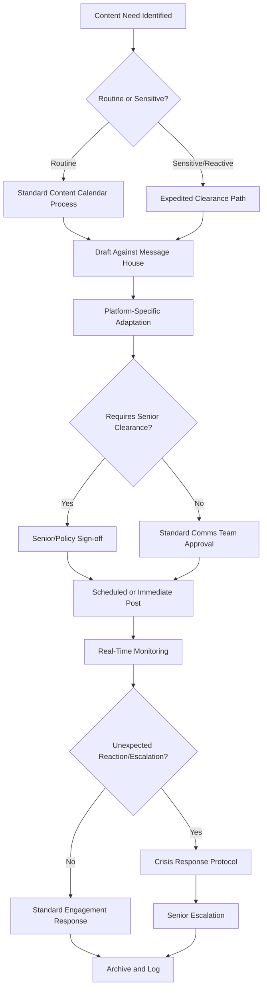

## Social Media Statecraft

### Overview

Social media statecraft is the deliberate use of social media platforms by states, diplomatic missions, and international institutions to conduct diplomacy, project influence, manage crises, and engage foreign publics directly. It represents the operationalization of public diplomacy and strategic narrative principles within a specific, technologically defined channel that compresses traditional diplomatic timelines and disintermediates the press as gatekeeper.

### Conceptual Foundations

#### Distinguishing Social Media Statecraft from Traditional Public Diplomacy

| Dimension | Traditional Public Diplomacy | Social Media Statecraft |
| --- | --- | --- |
| Speed | Days to weeks (press cycles) | Minutes to hours |
| Gatekeeping | Mediated by journalists | Direct-to-audience, disintermediated |
| Audience feedback | Delayed, aggregated (polling) | Immediate, visible (replies, shares) |
| Attribution | Official channels clearly institutional | Can blur personal/institutional voice |
| Reversibility | Retractions feasible before wide print | Screenshots create effective permanence |
| Multi-directionality | Largely one-to-many | Many-to-many, audience can respond publicly and be seen by other audiences |

**Key Points**

- Disintermediation is the central structural shift: heads of state and ministries can address foreign publics without a journalist selecting, contextualizing, or fact-checking the message before publication
- This same disintermediation removes a traditional quality-control layer, increasing both message velocity and error/escalation risk

#### Twiplomacy and Digital Diplomacy Terminology

- **Twiplomacy**: Term coined to describe the practice and study of diplomatic use of Twitter/X specifically, now used more broadly for diplomatic social media practice generally
- **Digital Diplomacy (e-Diplomacy)**: The broader umbrella term encompassing social media statecraft alongside other digital tools (secure diplomatic messaging systems, digital public opinion analysis, virtual exchange), of which social media statecraft is the most publicly visible subset
- **Platform Diplomacy**: The practice of tailoring diplomatic engagement strategy to the specific affordances, norms, and demographics of individual platforms rather than treating social media as a single undifferentiated channel

### Institutional Architecture

#### Actor Types on Diplomatic Social Media

- **Institutional Accounts**: Official ministry, embassy, or mission accounts operating under formal clearance and message discipline protocols consistent with spokesperson practice
- **Personal Accounts of Officials**: Accounts of individual diplomats or leaders, which occupy ambiguous territory between personal expression and official position — a persistent governance challenge since audiences and other states often treat personal statements as authoritative regardless of formal disclaimer
- **Multilateral Institution Accounts**: Accounts representing international organizations, requiring coordination across member-state sensitivities distinct from single-state institutional accounts
- **State Media and Affiliated Accounts**: Accounts formally or informally linked to state media apparatus, often operating with less rigid real-time clearance constraints than core diplomatic accounts but correspondingly less institutional credibility

#### Governance and Clearance Workflow

- **Pre-Cleared Content Libraries**: Banks of pre-approved messaging, graphics, and statements for foreseeable scenarios (holidays, anniversaries, anticipated events), reducing response latency
- **Delegated Posting Authority**: Formal designation of which staff may post without escalation for routine content versus which content requires senior or ministerial sign-off, calibrated to balance speed against risk
- **24/7 Monitoring Coverage**: Given the disintermediated, always-on nature of social platforms, institutional accounts of significant profile typically require monitoring coverage beyond standard business hours to catch fast-developing situations

### Platform-Specific Diplomatic Practice

#### Platform Affordance Considerations

- **Character/Format Constraints**: Platform-specific limits (short-form text, image, video, ephemeral content) shape how much nuance a diplomatic message can carry, requiring careful compression without introducing ambiguity that could be misread as policy shift
- **Audience Demographics by Platform**: Different platforms reach different demographic and geographic audience compositions, informing which platform is prioritized for which target audience segment
- **Algorithmic Visibility**: Content reach on most platforms is mediated by algorithmic ranking rather than guaranteed delivery to followers, meaning follower count alone is a weak indicator of actual message reach
- **Regional Platform Variation**: Dominant platforms vary significantly by country and region; effective social media statecraft requires presence calibrated to where the target audience actually is, not merely where the sponsoring country's own diplomatic corps is most comfortable operating

### Message Discipline in Real-Time Environments

#### Adapting Spokesperson Principles to Social Media

- **Compressed Message House Application**: The core-message-and-pillars structure from spokesperson practice must be compressed further for social formats while preserving the same underlying discipline against freelancing or contradiction
- **Reduced Clearance Latency Tolerance**: Traditional multi-stage clearance chains often cannot execute fast enough for the real-time expectations of social media engagement, driving institutional adaptation toward faster, more delegated approval structures for lower-risk content
- **Persistent Searchability Risk**: As with digital extensions of spokesperson messaging, social media statements are archivable and readily resurfaced, raising the durability stakes of imprecise phrasing relative to spoken remarks

#### Handling Real-Time Public Reaction

- **Reply and Comment Moderation Policy**: Institutional accounts require explicit, publicly stated policies on what public replies will be hidden, deleted, or left visible, balancing open engagement against platform misuse (harassment, spam, disinformation seeding in comment sections)
- **Engagement vs. Broadcast Posture**: Strategic choice between primarily broadcasting official positions versus actively engaging in public reply threads, with the latter offering greater relationship-building potential but correspondingly greater message-discipline and escalation risk

### Crisis Communication on Social Media

- **Velocity Mismatch**: Crisis events can generate public social media narrative and speculation faster than institutional clearance processes can produce an authoritative response, creating an information vacuum that unverified or adversarial content may fill first
- **Holding Statement Deployment**: Pre-approved generic acknowledgment language, introduced under spokesperson crisis practice, is particularly critical on social media given the platform's expectation of near-immediate institutional response to major events
- **Cross-Platform Consistency Requirement**: Crisis statements must be synchronized across all institutional accounts and platforms simultaneously, since any visible inconsistency is easily captured and circulated as evidence of confusion or dishonesty

### Public Diplomacy Amplification Functions

- **Direct Leader-to-Public Engagement**: Enables heads of state and senior officials to communicate directly with foreign publics during summits, state visits, or crises, generating engagement data unavailable through traditional press coverage alone
- **Narrative Reinforcement at Scale**: Social media serves as a high-frequency channel for reinforcing strategic narrative elements established through slower-moving instruments (leader rhetoric, cultural diplomacy), providing the continuous drumbeat that sustains long-horizon narrative coherence
- **Visual and Multimedia Diplomacy**: Platforms' emphasis on visual content enables diplomatic messaging through imagery and video (state visit photography, cultural content) that can convey relationship-building signals with less linguistic translation burden than text-based messaging

### Risks and Failure Modes

- **Diplomatic Incidents via Social Media**: Unauthorized, premature, or poorly phrased posts by individual officials have repeatedly produced genuine diplomatic incidents, since social platforms remove the traditional buffer of press briefing preparation and question anticipation
- **Platform Dependency Risk**: Reliance on privately owned, foreign-jurisdiction platforms for core diplomatic communication exposes states to risks from platform policy changes, account suspension, or platform unavailability in specific jurisdictions, outside the sponsoring state's control
- **Weaponized Engagement**: Public reply sections and comment threads on official diplomatic accounts can be targeted by coordinated inauthentic amplification or disinformation campaigns, requiring the detection capabilities covered under counter-disinformation practice
- **Personal-Official Voice Confusion**: Ambiguity between an official's personal opinion and stated government policy, expressed through the same account, has repeatedly created interpretive confusion among foreign governments and media requiring formal clarification
- **Escalatory Dynamics**: The public, real-time, and reply-visible nature of platform diplomacy creates incentive structures that can amplify minor disagreements into visible public disputes faster than traditional private diplomatic channels would allow, sometimes termed "megaphone diplomacy" when disputes are conducted through public posts rather than private communication

### Measurement Considerations

Social media statecraft evaluation draws directly on the broader measuring public diplomacy effectiveness framework, with platform-specific adaptations:

- **Engagement Metrics as Output, Not Outcome**: Likes, shares, and comment volume are output-level indicators of activity reach, not evidence of attitude or behavior change, consistent with the output-outcome conflation risk noted in general public diplomacy evaluation
- **Sentiment Analysis of Reply Content**: Applying NLP sentiment classification to public reply threads as a supplementary outcome indicator, while accounting for the demographic non-representativeness of social media populations relative to a country's general public
- **Narrative Adoption Tracking**: Monitoring whether platform discourse begins reproducing an institutional account's specific framing language, connecting to strategic narrative construction measurement

### Example

**Scenario**: A foreign ministry's embassy account in a partner country must respond to a rapidly developing bilateral incident (a border dispute has generated conflicting media reports) that broke on social media before any official statement was prepared.

**Response approach**:

1. Deploy a pre-approved holding statement within the first response window, acknowledging awareness of the situation and committing to a fuller statement once facts are verified, rather than remaining silent while unverified narratives circulate unchallenged
2. Activate expedited clearance path rather than standard content calendar process, given the sensitive/reactive classification
3. Coordinate cross-platform and cross-account consistency, ensuring the embassy account, foreign ministry headquarters account, and any relevant leader account post synchronized language rather than independently improvised statements
4. Monitor reply threads and broader platform discourse for coordinated inauthentic amplification of a false version of events, applying counter-disinformation detection protocols if anomalous patterns emerge
5. Once verified facts are established, issue the fuller statement using standard message house structure, compressed appropriately for platform format, and continue monitoring for narrative uptake or continued misinformation requiring further response

This illustrates the compressed but structurally analogous version of crisis spokesperson practice adapted to social media's velocity and disintermediated audience-reply environment, requiring faster clearance without abandoning message discipline.

**Next Steps**

- Designing a delegated posting authority framework balancing speed against clearance risk
- Comparing platform-specific diplomatic engagement strategy across major social platforms
- Studying documented cases of personal-versus-official account ambiguity and their diplomatic resolution
- Building a pre-cleared holding statement library for foreseeable crisis categories
- Examining "megaphone diplomacy" case studies where public platform disputes displaced private channels
- Reviewing sentiment analysis methodology limitations specific to diplomatic reply-thread monitoring