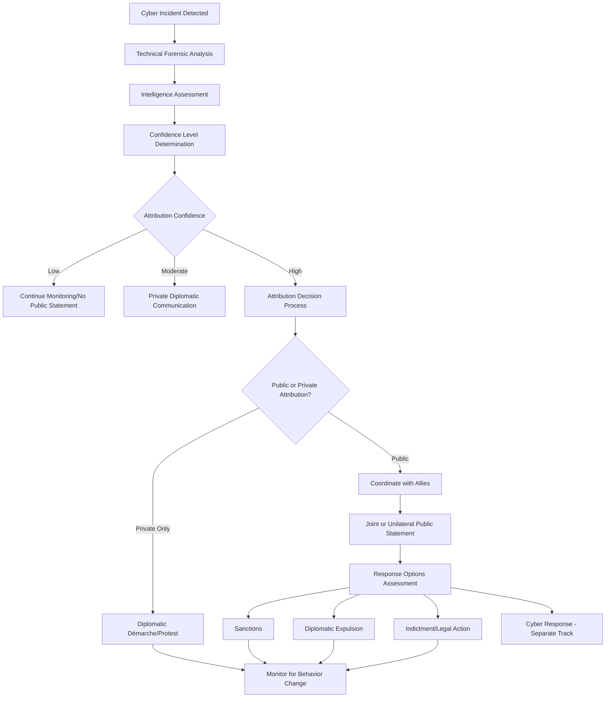

## Cyber Diplomacy and Cybersecurity Policy

### Overview

Cyber diplomacy is the application of diplomatic tools, negotiation, and international engagement to cyberspace-related issues — norm-setting, conflict prevention, attribution, and capacity building — while cybersecurity policy provides the substantive domestic and international frameworks that cyber diplomacy negotiates around, defends, and seeks to harmonize across borders. Together they constitute the governance layer through which states manage cyberspace as a domain of both strategic competition and necessary cooperation.

### Conceptual Foundations

#### Cyberspace as a Diplomatic Domain

- **Domain Characteristics**: Cyberspace is frequently characterized in policy literature as borderless in technical architecture yet subject to territorially grounded sovereign law, creating persistent friction between the domain's technical reality and the state-based international system that diplomacy operates within
- **Dual-Use Ambiguity**: Much cyber infrastructure and capability serves simultaneously civilian and potential military/intelligence purposes, complicating traditional arms-control-style diplomatic frameworks that rely on clearer civilian/military distinctions
- **Private Sector Centrality**: Unlike most diplomatic domains, the majority of relevant infrastructure (networks, platforms, critical systems) is privately owned and operated, meaning effective cyber diplomacy typically requires engagement with non-state technical and corporate actors alongside traditional state-to-state channels

#### Cyber Diplomacy vs. Cybersecurity Policy vs. Cyber Operations

| Dimension | Cyber Diplomacy | Cybersecurity Policy | Cyber Operations |
| --- | --- | --- | --- |
| Primary actor | Foreign ministry / diplomatic corps | Domestic regulatory and security agencies | Intelligence / military cyber commands |
| Primary tool | Negotiation, norm-building, attribution statements | Regulation, standards, defensive architecture | Technical offensive/defensive action |
| Visibility | Typically overt | Overt (policy) with covert enforcement elements | Often covert or deniable |
| Time horizon | Long-term norm development | Medium-term regulatory cycles | Immediate/tactical |

### Core Instruments of Cyber Diplomacy

#### Norm Development

- **Responsible State Behavior Norms**: Non-binding but diplomatically negotiated principles regarding what states should and should not do in cyberspace (e.g., not targeting critical infrastructure, not targeting computer emergency response teams), developed primarily through UN-affiliated processes
- **UN Group of Governmental Experts (GGE) and Open-Ended Working Group (OEWG)**: [Unverified — evolving multilateral process] Parallel UN-mandated processes through which member states have negotiated cumulative reports on norms, international law applicability, and confidence-building measures for state behavior in cyberspace; specific current membership, mandate status, and negotiated text should be verified against current UN documentation given the evolving nature of these processes
- **Confidence-Building Measures (CBMs)**: Diplomatic mechanisms (points of contact networks, information-sharing commitments, crisis communication channels) designed to reduce the risk of misperception or unintended escalation from cyber incidents

#### Bilateral and Minilateral Engagement

- **Cyber Dialogues**: Structured, recurring bilateral or small-group diplomatic engagements specifically dedicated to cyber issues, distinct from cyber issues raised incidentally within broader bilateral relationships
- **Capacity-Building Partnerships**: Diplomatic and technical assistance programs helping partner states develop cybersecurity institutional capacity, often serving simultaneously as genuine assistance and as a relationship-building/influence instrument analogous to other capacity-building diplomacy
- **Alliance and Coalition Coordination**: Coordinated cyber policy positioning among aligned states, including joint statements, coordinated sanctions, and shared threat intelligence arrangements

### Attribution in Cyber Diplomacy

#### Attribution Challenges Specific to Cyber Domain

- **Technical Attribution Difficulty**: Sophisticated actors routinely use false-flag techniques, compromised third-party infrastructure, and obfuscation methods specifically designed to complicate technical attribution, distinct from but analogous to the attribution challenges in counter-disinformation practice
- **Proxy and Deniability Structures**: State use of criminal groups, contractors, or loosely affiliated actors to conduct operations with a degree of plausible deniability, requiring diplomacy to address not only direct state action but state responsibility for enabling or tolerating proxy activity
- **Evidentiary Standard Disputes**: No universally agreed international legal standard exists for what evidence threshold justifies public attribution, and different states apply different institutional thresholds before making public attribution statements
- **Attribution as Diplomatic Signal**: The decision to attribute (and how — privately vs. publicly, unilaterally vs. coalition-coordinated) functions as a diplomatic signal in itself, independent of any subsequent punitive response, communicating both capability to detect and willingness to name

### International Law Application Debates

- **Sovereignty in Cyberspace**: Ongoing diplomatic and legal debate over whether and how traditional sovereignty principles apply to cyber operations that cross borders without physical territorial violation in the traditional sense
- **Use of Force Threshold**: Unresolved question of what severity of cyber operation would constitute a "use of force" or "armed attack" under international law, triggering rights to self-defense — a question of significant strategic ambiguity that states have generally been reluctant to resolve with excessive precision
- **Due Diligence Obligations**: Debated principle that states have some obligation to prevent their territory or infrastructure from being knowingly used to conduct harmful cyber operations against other states, analogous to established due diligence norms in other domains
- **Non-Binding vs. Binding Instruments**: Most cyber norms currently operate as non-binding diplomatic commitments rather than binding treaty law, reflecting states' general preference for negotiating flexibility during this still-developing area of international law, though this balance remains actively contested and could shift

### Cybersecurity Policy Frameworks (Domestic and Regulatory Basis)

#### Domestic Policy Architecture Diplomacy Must Navigate

- **Critical Infrastructure Protection Regimes**: National regulatory frameworks designating and protecting critical infrastructure sectors, which cyber diplomacy references when negotiating norms against targeting such infrastructure internationally
- **Data Localization and Cross-Border Data Flow Rules**: Domestic regulatory requirements governing where data may be stored and processed, a frequent source of diplomatic friction when trading partners' regulatory regimes diverge significantly
- **Supply Chain Security Requirements**: National-level restrictions or vetting requirements for technology vendors (particularly telecommunications and critical infrastructure equipment), which have become a significant and often contentious subject of bilateral and multilateral diplomatic negotiation

#### Regulatory Harmonization as Diplomatic Function

- **Standards Diplomacy**: Diplomatic engagement in international technical standards-setting bodies, recognizing that technical standards adopted at these bodies carry substantial downstream strategic and commercial consequence
- **Mutual Recognition Agreements**: Bilateral or multilateral agreements recognizing each other's cybersecurity certification or compliance regimes as equivalent, reducing duplicative compliance burden for cross-border digital trade
- **Adequacy and Equivalence Determinations**: Formal diplomatic and regulatory processes by which one jurisdiction recognizes another's data protection or cybersecurity regime as providing equivalent protection, enabling smoother data flow arrangements

### Cyber Incident Diplomatic Response

#### Escalation Management

- **Crisis Communication Channels**: Dedicated, pre-established diplomatic channels specifically for cyber incident communication, intended to enable rapid clarification and reduce miscalculation risk during a fast-moving technical incident, distinct from general diplomatic crisis communication channels
- **De-escalation Signaling**: Diplomatic techniques for signaling that a cyber incident is not intended as escalatory or precursor to broader conflict, particularly important given the attribution ambiguity that could otherwise drive worst-case interpretation
- **Proportionate Response Calibration**: Diplomatic and policy assessment of response proportionality, balancing deterrent value against escalation risk, informed by attribution confidence level

#### Sanctions and Punitive Diplomatic Tools

- **Cyber-Specific Sanctions Regimes**: [Unverified — jurisdiction and program specific] Various states maintain sanctions authorities specifically targeting cyber-malicious actors; specific current program scope, listed entities, and legal authority should be verified against current official designations given frequent updates
- **Indictment as Diplomatic Tool**: Criminal indictment of foreign state-linked individuals, even without realistic prospect of custody, used as a diplomatic and signaling tool to formalize attribution and impose reputational and travel costs
- **Coordinated Multilateral Response**: Alliance-coordinated joint attribution and response actions, intended to increase the diplomatic and material cost of attributed behavior beyond what any single state's unilateral response would achieve

### Capacity Building and Development Dimension

- **Cyber Capacity Building as Development Diplomacy**: Assistance programs helping developing states build cybersecurity institutional and technical capacity, framed simultaneously as development cooperation and as a vehicle for building diplomatic relationships and aligning partner states toward preferred international cyber norms
- **Digital Divide Considerations**: [Inference] Practitioner literature generally notes that capacity asymmetries between states significantly affect both vulnerability to cyber incidents and capacity to meaningfully participate in international cyber norm negotiation, raising equity considerations in how multilateral cyber diplomacy processes are structured
- **Regional Cybersecurity Cooperation Frameworks**: Regional organizations increasingly developing dedicated cybersecurity cooperation mechanisms, providing a diplomatic tier between bilateral and full multilateral engagement

### Multi-Stakeholder Governance Model

- **Multi-Stakeholder vs. Multilateral Governance Debate**: Ongoing and consequential diplomatic debate over whether internet and cyberspace governance should remain primarily multi-stakeholder (involving technical community, civil society, and private sector alongside governments) or shift toward more state-centric multilateral governance models — a debate with significant implications for how much influence non-state technical actors retain in shaping cyberspace rules
- **Private Sector Diplomatic Engagement**: Given private ownership of most cyber infrastructure, cyber diplomacy increasingly requires direct diplomatic engagement with major technology companies as consequential actors in their own right, not merely as regulated entities
- **Civil Society and Technical Community Input**: Structured mechanisms for incorporating technical community and civil society expertise into diplomatic norm-setting processes, reflecting recognition that purely state-driven processes may lack necessary technical grounding

### Measurement and Assessment Challenges

- **Norm Compliance Assessment**: Significant difficulty in assessing whether states are actually complying with negotiated non-binding norms, given the same attribution and evidentiary challenges that complicate incident response
- **Deterrence Effectiveness Measurement**: [Inference] Similar to broader public diplomacy effectiveness measurement, assessing whether diplomatic and policy responses actually deter future cyber operations faces significant causal attribution difficulty, since the absence of an incident cannot straightforwardly be attributed to successful deterrence versus simple absence of adversary intent or opportunity during the observed period
- **Relationship and Trust-Building Metrics**: Assessment of whether sustained cyber dialogues and capacity-building partnerships produce durable diplomatic relationship value, connecting to broader public diplomacy evaluation frameworks

### Example

**Scenario**: A state's critical infrastructure operator experiences a significant cyber incident, with technical forensic analysis pointing toward a moderate-confidence link to a state-affiliated actor, ahead of an already-scheduled bilateral cyber dialogue with the suspected state.

**Diplomatic response approach**:

1. Technical and intelligence agencies conduct forensic and attribution analysis, establishing a moderate rather than high confidence assessment given available evidence
2. Given moderate confidence, pursue private diplomatic communication rather than public attribution, using established crisis communication channels to raise concerns directly and assess counterpart response
3. Coordinate with allied states holding relevant technical visibility to compare attribution assessments before any public step, avoiding premature unilateral attribution that allied technical analysis might later contradict
4. Use the already-scheduled bilateral cyber dialogue as a structured venue to raise the incident formally, applying diplomatic pressure through established relationship channels rather than only through public statement
5. Maintain proportionate response calibration, reserving stronger measures (sanctions, public attribution, coordinated multilateral response) for confirmation of higher confidence or continuation/escalation of the activity, rather than immediately escalating on moderate-confidence initial assessment

This illustrates how cyber diplomacy integrates technical attribution uncertainty, alliance coordination, and existing bilateral relationship infrastructure into a calibrated response that manages escalation risk while still asserting diplomatic pressure.

**Next Steps**

- Studying the UN GGE/OEWG norm negotiation history and current process status
- Comparing public versus private attribution strategy across documented cyber incident case studies
- Examining multi-stakeholder versus multilateral internet governance debate in current diplomatic forums
- Designing a cyber capacity-building program with embedded relationship-diplomacy objectives
- Reviewing due diligence obligation debates in international cyber law scholarship
- Analyzing regional cybersecurity cooperation framework models as a bilateral/multilateral middle tier