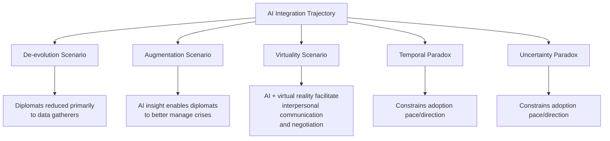

## Artificial Intelligence in Diplomatic Decision-Making

### Overview

Artificial intelligence in diplomatic decision-making refers to the integration of machine learning, natural language processing, and predictive analytics into the diplomatic workflow — from information processing and negotiation preparation to crisis anticipation and consular service delivery. It represents an emerging, rapidly evolving layer within digital diplomacy, distinct from social media statecraft and cyber diplomacy in that its primary function is augmenting the *analytical and decision* process itself rather than communication or infrastructure security.

### State of Adoption

AI integration in diplomacy is reshaping how foreign ministries operate in 2026, automating consular services, running negotiation simulations, flagging geopolitical risks weeks before they escalate, and helping smaller nations compete analytically with major powers. The U.S. State Department has rolled out its first Enterprise AI Strategy, including mandatory AI training for its officers. Multiple foreign ministries have held dedicated sessions and initiatives on the subject; a 2026 Diplomatic Forum session, for instance, addressed the geopolitical dimensions of AI, its role as a support tool for diplomatic decision-making, its applications in enhancing diplomatic mission performance, and issues of security, ethics, and diplomatic protocol. [The Future of Diplomacy: AI Integration Strategic Guide 2026 +2](https://blog.modeldiplomat.com/future-of-diplomacy-ai-integration-strategic-guide)

**Key Points**

- Adoption is uneven across foreign ministries; academic mapping of the field notes that AI adoption may vary significantly from one ministry to another, with some choosing not to adopt AI at all [Sage Journals](https://journals.sagepub.com/doi/10.1177/20570473261438571)
- A parallel, arguably more foundational shift is occurring beneath the AI headline: data infrastructure decisions diplomatic entities make are described as the real story, since data bottlenecks routinely slow diplomacy — not from a lack of information, but from insufficient infrastructure to organize, connect, and deploy that information in real time [Nextgov.com](https://www.nextgov.com/ideas/2026/02/2026-diplomacy-own-data-layer-ai-layer/411473/)

### Core Application Areas

#### Information Processing and Retrieval

- **Institutional Memory Systems**: AI tools that store and retrieve historical diplomatic records, past agreements, and negotiation history on demand; Singapore's AI tool, for example, stores and recalls past talks functioning like a digital institutional memory [StudyIQ](https://www.studyiq.com/articles/artificial-intelligence-in-diplomacy/)
- **Rapid Drafting Assistance**: AI-assisted drafting of notes, reports, and official statements, enabling ministries to prepare speeches or agreements in minutes rather than hours [StudyIQ](https://www.studyiq.com/articles/artificial-intelligence-in-diplomacy/)
- **Document Triage and Synthesis**: Large-scale processing of diplomatic cables, open-source reporting, and intelligence products to surface relevant material for decision-makers faster than manual review would allow

#### Predictive and Analytical Support

- **Geopolitical Risk Flagging**: Predictive systems designed to flag geopolitical risks weeks before they escalate, intended to extend decision-makers' warning window ahead of emerging crises [NextGen Diplomat](https://blog.modeldiplomat.com/future-of-diplomacy-ai-integration-strategic-guide)
- **Negotiation Simulation**: AI models that simulate negotiation outcomes and suggest strategies based on historical data, used in preparation for actual bilateral or multilateral negotiations [StudyIQ](https://www.studyiq.com/articles/artificial-intelligence-in-diplomacy/)
- **Strategic Data Analysis**: Broader application of AI-driven analysis across large datasets to inform strategic assessment, with the resulting data-driven insights intended to position diplomats to make better-informed and more strategic decisions, augmenting the efficacy of foreign policies and strengthening international collaboration [Diplomatist](https://diplomatist.com/2024/05/20/the-use-of-artificial-intelligence-in-foreign-ministries/)

#### Consular and Citizen Services

- **Automated Consular Support**: AI-driven chatbot and automation systems assisting citizens abroad; Japan introduced an AI-powered system in 2019 to assist citizens abroad with consular services through a chatbot answering questions and conveying vital information, improving efficiency and enabling rapid emergency response [Hermescse](https://www.hermescse.eu/en/artificial-intelligence-redefining-diplomacy-in-the-digital-age/)
- **Service Scaling**: Automation of high-volume, low-complexity consular tasks (passport renewals, visa status inquiries, travel advisories) freeing human staff capacity for higher-judgment cases

### Analytical Framework: Scenarios for AI-Driven Diplomacy

Academic literature mapping AI's potential trajectory in diplomacy has proposed three broad scenarios for how the technology could ultimately reshape the profession:

This framework outlines a De-evolution scenario in which diplomats are reduced to data gatherers, an Augmentation scenario where AI insight enables diplomats to better manage crises, and a Virtuality scenario where AI and virtual reality facilitate interpersonal communication and negotiations between diplomats. The same analysis identifies two inherent paradoxes — a temporal paradox and an uncertainty paradox — that may limit AI's use in diplomacy. [Sage Journals](https://journals.sagepub.com/doi/10.1177/20570473261438571)[Sage Journals](https://journals.sagepub.com/doi/10.1177/20570473261438571)

**Key Points**

- These scenarios are not mutually exclusive predictions but analytical lenses; actual ministry practice may exhibit elements of more than one simultaneously
- The scenario framework was derived from a review of 90 digital diplomacy articles and book chapters published between 2012 and 2025, identifying six recurring factors that shape diplomats' adoption of digital technologies across different ministries and technology types. [Sage Journals](https://journals.sagepub.com/doi/10.1177/20570473261438571)

### Risks and Limitations

#### Analytical and Accuracy Risks

- **Contextual Misinterpretation**: AI can produce flawed analysis due to incorrect pattern recognition — for example, misreading past treaty obligations or geopolitical contexts, leading to erroneous policy advice [StudyIQ](https://www.studyiq.com/articles/artificial-intelligence-in-diplomacy/)
- **Historical Pattern Overfitting**: [Inference] Given that negotiation simulation and predictive risk tools are trained substantially on historical data, there is a plausible structural risk that such tools systematically underweight genuinely novel geopolitical dynamics that lack close historical precedent — a concern consistent with general machine learning limitations rather than one specific to any single deployed system
- **Verification Burden**: The speed advantage of AI-assisted drafting and analysis shifts institutional burden toward verification and fact-checking of AI output before it informs policy, rather than eliminating human review workload entirely

#### Security and Confidentiality Risks

- **Data Sensitivity Exposure**: Diplomatic data is highly sensitive and vulnerable to cyber threats — hacking of AI systems handling negotiation data could expose national strategies [StudyIQ](https://www.studyiq.com/articles/artificial-intelligence-in-diplomacy/)
- **System Hardening Requirements**: Foreign ministries handling sensitive information face increasing vulnerability to cyber threats as digitalization increases, requiring AI systems themselves to be incorporated into the broader cybersecurity policy and defensive architecture rather than treated as a separate concern [Diplomatist](https://diplomatist.com/2024/05/20/the-use-of-artificial-intelligence-in-foreign-ministries/)
- **Third-Party Model Dependency**: Reliance on externally developed or hosted AI models for sensitive diplomatic analysis raises questions analogous to platform dependency risk in social media statecraft — exposure to a foreign or private jurisdiction's infrastructure and policy decisions outside the ministry's direct control

#### Governance and Ethical Considerations

- **Sovereign AI Considerations**: [Unverified, evolving policy area] Discourse increasingly frames a state's own AI model development and control as a strategic consideration, on the premise that a nation's AI systems reflect institutional values and legal frameworks in ways externally sourced models may not — the specific policy implications and adoption patterns of this framing continue to develop and should be verified against current national strategy documents
- **Human-in-the-Loop Requirements**: Institutional debate over what categories of diplomatic decision must retain mandatory human judgment and sign-off rather than AI-generated recommendation, particularly for decisions with escalatory or legal consequence
- **Protocol and Diplomatic Etiquette Questions**: Emerging questions around diplomatic protocol specifically as it relates to AI use are being raised alongside the more familiar security and ethics considerations [Ministry of Foreign Affairs of Bahrain](https://www.mofa.gov.bh/en/diplomatic-forum-2026-holds-session-on-artificial-intelligence-in-diplomacy)

### Institutional Adoption Patterns

- **Equalizing Potential for Smaller States**: AI is described as helping smaller nations compete analytically with major powers, potentially narrowing the traditional resource gap between well-staffed major-power foreign ministries and smaller diplomatic services with limited analytical capacity [NextGen Diplomat](https://blog.modeldiplomat.com/future-of-diplomacy-ai-integration-strategic-guide)
- **National AI Strategy Integration**: Several foreign ministries have announced dedicated efforts to integrate AI into diplomatic analysis and decision-making as part of broader national AI strategy documents [Hermescse](https://www.hermescse.eu/en/artificial-intelligence-redefining-diplomacy-in-the-digital-age/)
- **Training and Workforce Adaptation**: Mandatory AI training programs for diplomatic officers reflect a broader institutional recognition that AI competency is becoming a required diplomatic skill rather than a specialized technical add-on [NextGen Diplomat](https://blog.modeldiplomat.com/future-of-diplomacy-ai-integration-strategic-guide)
- **Infrastructure Investment Scale**: The scale of underlying AI infrastructure investment (cloud providers projected to invest substantially in AI infrastructure) underscores AI's positioning as strategic national infrastructure rather than a discrete tool [NextGen Diplomat](https://blog.modeldiplomat.com/future-of-diplomacy-ai-integration-strategic-guide)

### Relationship to Other Digital Diplomacy Functions

| AI Application | Connects To |
| --- | --- |
| Negotiation simulation | Traditional negotiation preparation, now augmented with data-driven scenario modeling |
| Geopolitical risk flagging | Crisis anticipation, feeding into crisis communication protocols |
| Sentiment/text analysis | Public opinion analysis abroad, strategic narrative monitoring |
| Automated consular chatbots | Direct citizen engagement, paralleling social media statecraft's disintermediation logic |
| Institutional memory retrieval | Historical precedent access supporting cyber diplomacy attribution and negotiation continuity |

### Measurement and Evaluation Considerations

Evaluating AI's actual contribution to diplomatic decision quality faces attribution challenges structurally similar to those covered under measuring public diplomacy effectiveness:

- **Decision Quality vs. Decision Speed**: Distinguishing whether AI integration improves the substantive quality of diplomatic decisions or merely accelerates existing decision processes, which are not equivalent outcomes
- **Counterfactual Difficulty**: Assessing whether a correctly anticipated crisis or successfully concluded negotiation would have occurred similarly without AI-assisted analysis is rarely straightforward, given the same diffuse-causality challenge present in broader public diplomacy evaluation
- **Error Cost Asymmetry**: [Inference] Given the potentially high stakes of diplomatic misjudgment, evaluation frameworks likely need to weight false-positive and false-negative AI analytical errors asymmetrically rather than applying a simple aggregate accuracy metric, though standardized approaches for doing so appear still to be emerging across the field

### Example

**Scenario**: A foreign ministry's Asia division is preparing for a sensitive bilateral negotiation on a trade dispute with an unpredictable recent history of similar negotiations.

**AI-assisted preparation approach**:

1. Use an institutional memory system to rapidly retrieve the full historical record of prior negotiations with the counterpart state on related issues, surfacing precedent the human team might not have immediately recalled
2. Run negotiation simulation modeling against historical negotiation data to generate a range of plausible counterpart negotiating strategies and likely response patterns to different opening positions
3. Apply geopolitical risk flagging tools to check whether any emerging regional developments could affect the counterpart's negotiating posture in ways not reflected in older historical data
4. Treat all AI-generated outputs as inputs to, not substitutes for, senior negotiator judgment — explicitly reviewing simulation outputs for contextual misinterpretation given the domain's noted risk of flawed pattern recognition on treaty and historical context
5. Maintain human sign-off on the final negotiating strategy and any AI-drafted talking points, consistent with human-in-the-loop governance principles for consequential diplomatic decisions

This illustrates AI's currently emerging role as a preparation and analytical accelerant rather than an autonomous decision-maker — augmenting the negotiation team's speed and breadth of historical and predictive insight while human judgment remains the final governing layer, consistent with the "Augmentation scenario" identified in the field's scenario framework.

**Next Steps**

- Studying institutional memory and negotiation simulation system architectures in specific foreign ministries
- Examining the temporal and uncertainty paradoxes constraining AI adoption pace in diplomatic institutions
- Comparing sovereign AI strategy approaches across major and middle powers
- Designing human-in-the-loop governance protocols for AI-assisted diplomatic decision categories
- Reviewing data infrastructure prerequisites underpinning effective diplomatic AI deployment
- Analyzing case studies of AI-assisted consular service deployment and citizen outcome effectiveness