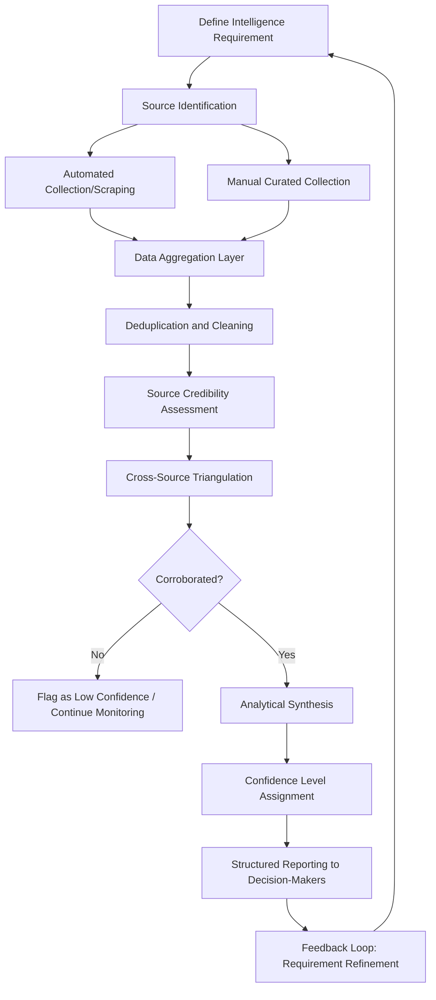

## Data-Driven Diplomacy and Open-Source Intelligence

### Overview

Data-driven diplomacy is the systematic use of large-scale data — structured institutional records, open-source information, and analytical infrastructure — to inform diplomatic assessment and decision-making. Open-source intelligence (OSINT) is its principal external-facing input stream: information collected from publicly available sources and analyzed to produce diplomatically actionable insight. Together they form the evidentiary and infrastructural foundation beneath the more visible instruments of digital diplomacy, including AI-assisted decision-making, cyber diplomacy, and public opinion analysis.

### Conceptual Foundations

#### Data Infrastructure as the Foundational Layer

Washington is captivated by artificial intelligence, but a quieter and more consequential shift is taking place inside government: AI may be the headline, but data infrastructure is the real story. Data bottlenecks routinely slow diplomacy, and the problem is rarely a lack of information — most governments produce a staggering volume of it. What is lacking is the infrastructure to organize, connect, and deploy that information in real time, and the data infrastructure decisions diplomatic entities make are described as determining whether this shift becomes a strategic advantage or a missed opportunity.

**Key Points**

- The practical framing is "own the data layer before the AI layer" — analytical and AI tools built atop poorly organized, siloed, or inaccessible institutional data underperform regardless of the sophistication of the analytical layer itself
- Data infrastructure investment is a prerequisite for, not a byproduct of, effective AI-assisted diplomatic decision-making

#### Defining Open-Source Intelligence in the Diplomatic Context

- **OSINT Definition**: Intelligence derived from publicly available information — media, government publications, academic research, commercial data, social media, satellite imagery, and other unclassified sources — distinguished from classified intelligence by its collection method and legal accessibility rather than its analytical rigor
- **Distinction from Public Opinion Analysis**: OSINT encompasses a broader information scope (economic indicators, infrastructure imagery, official documents, technical data) than public opinion analysis abroad, which focuses specifically on attitudinal and sentiment data about populations
- **Distinction from Counter-Disinformation Monitoring**: OSINT methodology overlaps substantially with disinformation detection techniques (network analysis, source triangulation) but serves a broader analytical purpose beyond identifying coordinated inauthentic behavior

### Data Sources for Diplomatic OSINT

#### Traditional Open Sources

- **Government and Official Publications**: Budgets, legislative records, official statements, and regulatory filings providing baseline factual and policy-position data
- **Media and Press Monitoring**: Systematic tracking of domestic and international media coverage relevant to bilateral relationships, policy positions, and emerging issues
- **Academic and Think Tank Output**: Research publications offering deeper contextual and historical analysis than time-pressured news coverage typically provides

#### Digital and Technical Sources

- **Satellite and Geospatial Imagery**: Commercially available satellite imagery increasingly used for diplomatically relevant assessment (infrastructure development, humanitarian conditions, military posture indicators) without requiring classified intelligence collection
- **Social Media Data**: Large-scale social media content as both a sentiment signal (connecting to public opinion analysis) and an event-detection mechanism, often surfacing breaking developments faster than traditional media reporting
- **Commercial and Economic Datasets**: Trade flow data, shipping and logistics tracking, and financial datasets offering indicators of economic relationship health and potential policy shifts
- **Technical and Infrastructure Data**: Internet traffic patterns, telecommunications data, and other technical indicators relevant to both cyber diplomacy assessment and broader situational awareness

### OSINT Analytical Workflow

#### Collection Methodology

- **Automated Collection (Scraping and APIs)**: Systematic, technical collection of large-volume data from web sources, social platforms, and public databases, enabling scale unreachable through manual review alone
- **Curated Manual Collection**: Analyst-directed collection targeting specific, high-value sources requiring human judgment to identify and assess, particularly for context-dependent or specialized information
- **Continuous vs. Requirement-Driven Collection**: Distinguishing standing, continuous monitoring (broad situational awareness) from targeted collection driven by a specific diplomatic question or upcoming decision point

#### Analytical Synthesis Standards

- **Source Credibility Grading**: Systematic assessment of source reliability based on track record, methodology transparency, and potential bias, analogous to source triangulation practices used in counter-disinformation analysis
- **Confidence Level Assignment**: Structured confidence grading (low/moderate/high) applied to OSINT-derived assessments, consistent with the graduated confidence approach used in cyber diplomacy attribution and broader intelligence analytical tradecraft
- **Corroboration Requirements**: Minimum standards for cross-source verification before an OSINT finding is elevated to a decision-relevant assessment, reducing risk of single-source error propagating into diplomatic judgment

### Institutional Architecture

#### Data Governance Structures

- **Centralized Data Platforms**: Institutional architecture consolidating diplomatic data (cables, reporting, OSINT products) into a unified, queryable system rather than siloed by bureau, mission, or program
- **Interoperability Standards**: Technical standards enabling data sharing and integration across different diplomatic systems, missions, and — where appropriate — allied government partners
- **Data Quality and Provenance Tracking**: Systematic metadata practices recording data origin, collection method, and processing history, essential for the confidence-level and credibility assessments that downstream analysis depends on

#### OSINT Units and Capability

- **Dedicated OSINT Analytical Units**: Specialized teams within foreign ministries or intelligence-adjacent bodies tasked specifically with open-source collection and analysis, distinct from classified intelligence functions
- **Cross-Functional Integration**: OSINT capability increasingly integrated across multiple diplomatic functions (crisis anticipation, negotiation preparation, public opinion assessment) rather than operating as an isolated specialist unit
- **Public-Private and Academic Partnerships**: Engagement with commercial data providers, academic research centers, and technical platforms as a means of extending analytical capability beyond what an in-house team alone could sustain

### Relationship to AI-Assisted Analysis

- **Data as AI Prerequisite**: The analytical and predictive functions covered under AI in diplomatic decision-making — geopolitical risk flagging, negotiation simulation, institutional memory retrieval — depend directly on the quality, structure, and accessibility of underlying data infrastructure
- **AI-Enhanced OSINT Processing**: Natural language processing and pattern recognition tools increasingly applied to OSINT volume management, enabling triage and synthesis of data volumes that would be infeasible for purely manual analyst review
- **Compounding Infrastructure Dependency**: [Inference] Given that AI tools trained or operating on poorly structured or siloed data are likely to underperform regardless of underlying model sophistication, the data infrastructure layer functions as a compounding constraint — weaknesses at this layer limit the achievable value of every downstream analytical or AI application built on top of it

### Diplomatic Application Areas

#### Situational Awareness and Early Warning

- **Crisis Anticipation**: OSINT-derived indicators (unusual troop movements via satellite imagery, economic distress signals, social media unrest indicators) feeding into early-warning systems ahead of formal diplomatic reporting
- **Negotiation Context-Building**: Comprehensive open-source profile development on counterpart negotiating positions, domestic political constraints, and historical pattern, supplementing formal diplomatic channels with a broader evidentiary base

#### Verification and Fact-Finding

- **Independent Verification of Claims**: Using OSINT methodology to independently verify or challenge claims made by counterpart states or in contested situations, providing an evidentiary basis distinct from reliance on official statements alone
- **Humanitarian and Conflict Monitoring**: OSINT techniques (satellite imagery analysis, social media geolocation) applied to humanitarian situation assessment and conflict monitoring where direct access is restricted or unavailable

#### Supporting Other Digital Diplomacy Functions

| Function | OSINT Contribution |
| --- | --- |
| Cyber diplomacy attribution | Technical and network-pattern OSINT feeding attribution confidence assessment |
| Counter-disinformation | Source and network analysis techniques directly shared with OSINT tradecraft |
| Public opinion analysis | Social media and digital sentiment data as a real-time complementary data stream |
| Strategic narrative monitoring | Media and discourse tracking to assess narrative adoption and competition |
| AI-assisted decision-making | Structured, high-quality data as the necessary input for reliable AI analytical output |

### Risks and Limitations

#### Data Quality and Bias Risks

- **Source Representativeness Bias**: OSINT drawing heavily from digitally accessible sources (social media, English-language media) risks systematically underrepresenting populations, regions, or perspectives with lower digital or media visibility, echoing the demographic representativeness concerns raised in public opinion analysis methodology
- **Manipulation and Poisoning Risk**: Open sources, by definition publicly accessible, are also accessible to adversarial actors seeking to seed false or misleading information specifically to distort OSINT-based analysis — a risk directly connected to disinformation and propaganda dynamics
- **Volume Without Synthesis Risk**: Large data volume does not inherently produce actionable insight; without adequate analytical synthesis capability, expanded collection can create noise and analyst overload rather than improved decision support

#### Governance and Ethical Considerations

- **Privacy and Legal Boundaries**: OSINT collection involving individuals' publicly available personal data raises privacy considerations that vary by jurisdiction and data type, requiring institutional policy on collection and retention limits even where information is technically publicly accessible
- **Distinguishing OSINT from Surveillance Perception**: Systematic, large-scale collection of publicly available information about foreign populations can be perceived by host governments or populations as surveillance activity, raising diplomatic sensitivity considerations analogous to those noted in public opinion research conducted by foreign governments
- **Data Sovereignty Considerations**: Cross-border data collection, storage, and processing must account for host-country data protection and sovereignty regulation, a consideration shared with the broader cybersecurity policy and regulatory harmonization landscape

### Measurement and Evaluation

- **Analytical Accuracy Tracking**: Retrospective assessment of whether OSINT-derived assessments and early-warning indicators proved accurate against subsequent events, building an institutional accuracy track record over time
- **Decision Impact Assessment**: Evaluating whether OSINT products demonstrably informed specific diplomatic decisions, distinct from measuring collection volume or product output alone — echoing the output-versus-outcome distinction central to measuring public diplomacy effectiveness generally
- **Timeliness Metrics**: Assessing whether OSINT products reached decision-makers with sufficient lead time to be actionable, since even accurate analysis delivered too late provides limited decision value

### Example

**Scenario**: A foreign ministry's regional bureau needs to assess the likelihood and probable trajectory of civil unrest in a partner country ahead of a scheduled high-level bilateral visit, with limited on-the-ground diplomatic reporting capacity in affected regions.

**Data-driven approach**:

1. Deploy automated collection across social media, local media, and economic indicator sources relevant to the affected regions, supplementing limited direct mission reporting
2. Apply source credibility grading to distinguish reliable local reporting from unverified or potentially seeded content, given the region's history of information manipulation
3. Cross-reference satellite imagery indicators (infrastructure activity, population movement patterns) against social-media-derived unrest signals to triangulate rather than rely on any single source category
4. Assign a structured confidence level to the resulting unrest trajectory assessment, explicitly flagging where source representativeness limitations (e.g., disproportionate urban social media coverage) may bias the picture toward better-connected populations
5. Deliver findings with sufficient lead time ahead of the visit to inform itinerary and security planning decisions, rather than as a retrospective report after decisions have already been finalized

This illustrates the layered OSINT workflow — collection, credibility assessment, triangulation, confidence grading — feeding a time-sensitive diplomatic decision, while remaining explicit about the source-representativeness limitations inherent to open-source methodology.

**Next Steps**

- Designing a centralized diplomatic data platform architecture with interoperability standards
- Building a source credibility and confidence-grading framework for institutional OSINT products
- Studying satellite imagery analysis techniques for humanitarian and conflict monitoring applications
- Examining data sovereignty and privacy governance frameworks for cross-border OSINT collection
- Comparing OSINT unit organizational models across foreign ministries
- Reviewing the data-infrastructure-before-AI-layer strategic sequencing debate in current policy literature