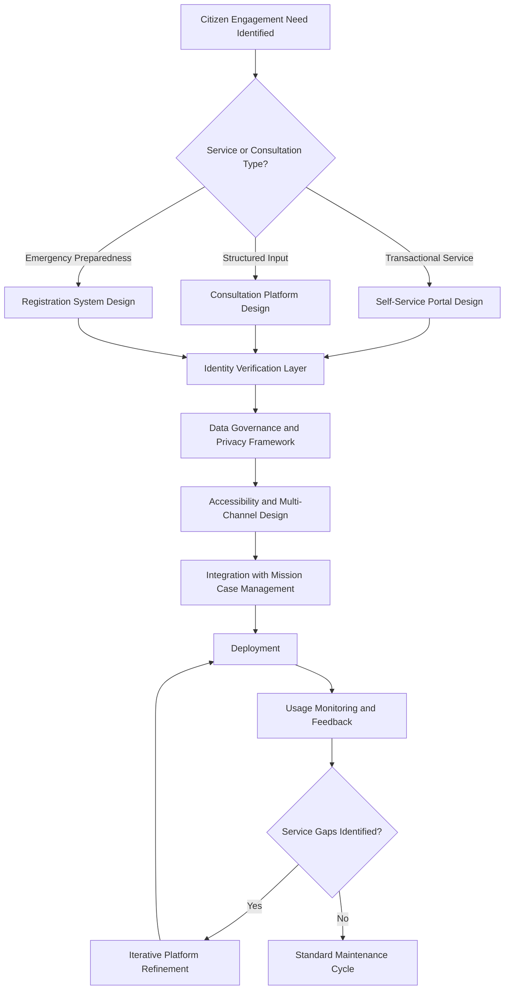

## Digital Platforms for Citizen Engagement

### Overview

Digital platforms for citizen engagement encompass the dedicated technological systems — as distinct from general social media statecraft — that foreign ministries and diplomatic missions use to interact directly with citizens: consular service portals, e-participation tools, diaspora engagement systems, and structured digital consultation mechanisms. Where social media statecraft addresses broadcast and reactive public communication, this domain covers purpose-built, often transactional or participatory platforms designed for sustained, structured citizen interaction.

### Conceptual Foundations

#### Distinguishing Citizen Engagement Platforms from Social Media Statecraft

| Dimension | Social Media Statecraft | Citizen Engagement Platforms |
| --- | --- | --- |
| Primary function | Broadcast, narrative, real-time reaction | Service delivery, consultation, structured interaction |
| Platform ownership | Third-party commercial platforms | Often government-owned/operated infrastructure |
| Interaction type | Public, one-to-many with visible replies | Often private, transactional, one-to-one |
| Data relationship | Aggregate sentiment, engagement metrics | Individual citizen records, service history |
| Typical use case | Crisis messaging, narrative reinforcement | Passport renewal, emergency registration, feedback collection |

**Key Points**

- The two domains are complementary rather than competing: a ministry typically uses social media to *direct* citizens toward a dedicated platform for actual service completion or structured input
- Citizen engagement platforms carry distinct data governance obligations that social media broadcast channels generally do not, since they process individual citizen records rather than public sentiment data

### Categories of Citizen Engagement Platforms

#### Consular Service Delivery Systems

- **Self-Service Portals**: Web and mobile platforms enabling citizens to complete passport renewals, visa applications, and document authentication without in-person mission visits, reducing both citizen burden and mission staffing pressure for routine transactions
- **Emergency Registration Systems**: Platforms allowing citizens traveling or residing abroad to register their location and contact information, enabling missions to conduct rapid outreach during crises, natural disasters, or evacuation scenarios
- **AI-Assisted Chatbot Services**: Automated conversational systems handling routine consular inquiries, extending the automated consular support introduced under AI in diplomatic decision-making into a dedicated citizen-facing interface — such systems have been used to assist citizens abroad with consular services, answering questions and conveying vital information with the aim of improving response speed during emergencies

#### E-Participation and Consultation Tools

- **Public Comment and Consultation Platforms**: Structured digital mechanisms for soliciting citizen input on policy proposals or diplomatic priorities, extending traditional public consultation processes into digital form
- **Citizen Petition Systems**: Formal digital mechanisms allowing citizens to raise issues or request government response, often with defined response-threshold and accountability mechanisms
- **Participatory Budgeting and Priority-Setting Tools**: Platforms allowing citizen input into resource allocation decisions relevant to diplomatic and development programming, extending participatory governance principles into the foreign-affairs domain

#### Diaspora Engagement Platforms

- **Diaspora Registries and Networks**: Digital platforms connecting a state with citizens living abroad, extending the diaspora engagement function introduced under cultural diplomacy into a dedicated technical infrastructure
- **Diaspora Investment and Contribution Portals**: Platforms facilitating diaspora economic engagement (remittances, investment, philanthropic contribution) with home-country development or diplomatic initiatives
- **Voting and Civic Participation Systems**: Digital or digitally-supported mechanisms enabling overseas citizens to participate in home-country civic processes, subject to varying national legal frameworks on overseas voting eligibility and method

### Platform Architecture Considerations

#### Identity and Access Design

- **Identity Verification Standards**: Robust identity verification is required for platforms handling sensitive personal or travel document data, balancing security against accessibility for citizens who may lack certain digital identity credentials
- **Multi-Channel Accessibility**: Platform design accounting for citizens with limited internet access, disability-related accessibility needs, or limited digital literacy, typically requiring parallel non-digital service channels rather than digital-only delivery
- **Cross-Border Authentication Complexity**: Citizens accessing services from foreign jurisdictions may face authentication challenges (e.g., unavailable local verification infrastructure) requiring platform design accommodating diverse access contexts

#### Data Governance Requirements

- **Personal Data Protection Standards**: Citizen engagement platforms process sensitive personal data (travel documents, location, financial information for diaspora platforms) requiring data protection standards typically more stringent than public-facing social media engagement
- **Cross-Jurisdictional Data Handling**: Platforms serving citizens abroad must navigate both home-country data protection law and the data protection regime of the country where the citizen is physically located, an added complexity layer connecting to the data sovereignty considerations raised in cybersecurity policy and OSINT governance
- **Retention and Purpose Limitation**: Institutional policy governing how long citizen data is retained and restricting its use to the stated service purpose, particularly important for emergency registration data that could otherwise be repurposed for unrelated monitoring functions without clear citizen consent

### Integration with Broader Digital Diplomacy Functions

#### Feeding Public Opinion Analysis

- **Platform Usage as Behavioral Data**: Citizen engagement platform usage patterns (service request volume, consultation participation rates) offer behavioral indicators distinct from and potentially more reliable than stated-opinion survey data, connecting to the outcome-metric methodology discussed under measuring public diplomacy effectiveness
- **Consultation Response Analysis**: Structured citizen input collected through consultation platforms provides a qualitative data source complementing the broader public opinion analysis toolkit, though typically representing self-selected rather than representative respondent populations

#### Crisis Communication Integration

- **Emergency Registration as Crisis Infrastructure**: Registration platform data becomes operationally critical during crisis response, enabling targeted outreach consistent with the crisis communication protocols covered under spokesperson skills and social media statecraft
- **Coordinated Multi-Channel Crisis Messaging**: Effective crisis response requires synchronized messaging across social media broadcast channels and direct platform notification to registered citizens, since the two channels reach different citizen populations with different levels of message specificity

### Common Design and Governance Failure Modes

- **Digital-Only Exclusion Risk**: Platforms designed without adequate non-digital fallback channels risk excluding citizens with limited digital access, disproportionately affecting elderly, low-income, or rural populations
- **Fragmented Platform Proliferation**: Multiple uncoordinated platforms built for narrow specific purposes (separate systems for passport services, emergency registration, and diaspora engagement) creating citizen confusion and duplicated verification burden, where a more unified platform architecture would better serve users
- **Underinvestment in Maintenance**: [Inference] Practitioner discussion of government digital service platforms broadly notes a common pattern of strong initial launch investment followed by inadequate ongoing maintenance and iteration budget, resulting in platform degradation and citizen trust erosion over time
- **Privacy Trust Deficit**: Citizen reluctance to use engagement or registration platforms due to data privacy concerns, particularly regarding potential government monitoring use of location or travel data — a trust dynamic that undermines the platform's core emergency-preparedness value if citizens decline to register out of privacy concern
- **Accessibility Neglect in Consultation Design**: Consultation platforms drawing predominantly from digitally engaged, often urban and younger populations, producing input that is not representative of the broader citizen population it nominally consults — echoing the representativeness bias concerns raised throughout public opinion and OSINT methodology

### Measurement and Evaluation

- **Service Completion Rates**: Tracking successful transaction completion (versus abandonment) as a core usability and effectiveness indicator for consular self-service platforms
- **Registration Coverage Rates**: For emergency registration systems, assessing what proportion of citizens actually present in a given jurisdiction are registered, since low coverage undermines the platform's crisis-response value regardless of the sophistication of its notification capability
- **Consultation Participation Representativeness**: Assessing whether consultation platform respondents reflect the demographic and geographic diversity of the broader citizen population, rather than relying on raw participation volume alone as a success indicator
- **Citizen Satisfaction and Trust Metrics**: Structured feedback collection on platform usability and citizen trust in data handling, feeding into the iterative platform refinement cycle

### Example

**Scenario**: A foreign ministry is redesigning its overseas citizen emergency registration system following criticism that registration rates remained low ahead of a recent natural disaster affecting citizens abroad, limiting the effectiveness of crisis outreach.

**Platform redesign approach**:

1. Conduct citizen feedback research to identify why registration rates were low, distinguishing between awareness gaps, usability barriers, and privacy trust concerns rather than assuming a single cause
2. Redesign the platform with simplified multi-channel registration (web, mobile app, and SMS-based options) to accommodate citizens with varying levels of digital access and connectivity in different host countries
3. Implement clear, accessible data governance disclosure explaining exactly how registration data will and will not be used, directly addressing privacy trust deficit as a likely contributor to low prior registration
4. Integrate registration data with mission case management systems to ensure that during a future crisis, registered citizen data translates directly into operational outreach capability rather than existing as an isolated dataset
5. Establish ongoing registration coverage rate tracking as a standing metric, rather than treating platform launch as project completion, addressing the maintenance underinvestment failure mode

This illustrates how citizen engagement platform effectiveness depends on the combination of accessible design, transparent data governance, and integration with the operational systems that ultimately convert citizen data into a diplomatic protective function.

**Next Steps**

- Designing a unified consular services platform architecture consolidating fragmented service-specific systems
- Building a data governance disclosure framework addressing citizen privacy trust concerns
- Studying diaspora engagement platform models and their economic/civic participation outcomes
- Comparing multi-channel accessibility approaches for citizens with limited digital access
- Examining consultation platform representativeness bias and mitigation techniques
- Reviewing emergency registration coverage rate benchmarks and outreach effectiveness case studies