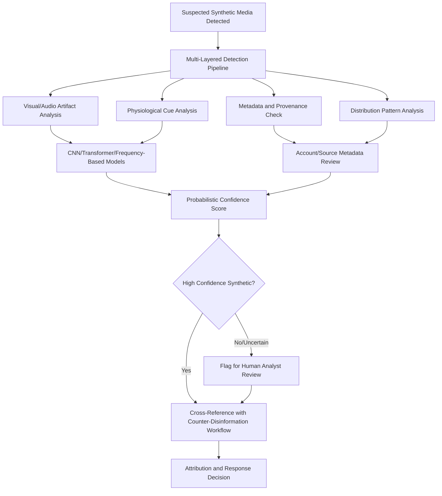

## Deepfakes, Synthetic Media, and Information Integrity

### Overview

Deepfakes and synthetic media represent a distinct and escalating category of information threat: audiovisual and textual content generated or manipulated by AI to fabricate events, statements, or appearances that never occurred. For public diplomacy and strategic communication, this domain sits at the intersection of counter-disinformation, cyber diplomacy, and spokesperson credibility management — it threatens not only specific false narratives but the broader public trust infrastructure on which authentic diplomatic communication depends.

### Conceptual Foundations

#### Defining the Threat Category

Deepfakes are synthetic audiovisual content produced by deep generative models, and have escalated into a critical threat across civilian and military domains, enabling identity fraud, disinformation campaigns, and evidence fabrication. In diplomatically relevant high-stakes environments, consequences extend to severe misinformation, market manipulation, identity fraud, and erosion of institutional trust.

- **Generation Techniques**: Key underlying generation models include generative adversarial networks (GANs), autoencoders, neural rendering, and diffusion systems, with adversarial methods increasingly used to enhance realism and challenge existing detectors
- **Distinction from Traditional Disinformation**: Where the countering disinformation and propaganda domain addresses false narratives generally (text, mischaracterized real footage, coordinated messaging), synthetic media specifically involves fabricated audiovisual or voice content depicting events or statements that did not occur
- **Malinformation Overlap**: Synthetic media can also be used to fabricate plausible-seeming versions of genuine events, blurring the disinformation/malinformation distinction established in counter-disinformation practice

#### The Democratization of Generation Capability

Multiple converging factors have sharply lowered the technical barrier to producing convincing synthetic media:

- **Consumer Tool Proliferation**: Advances in widely available generative tools mean that describing an idea, drafting a script with a large language model, and generating polished audio-visual media can now be accomplished in minutes rather than requiring specialized technical skill
- **Voice Cloning Threshold**: Voice cloning technology is described by researchers as having crossed an "indistinguishable threshold," with the perceptual tells that once gave away synthetic voices having largely disappeared
- **Scale Indicators**: Some major retailers report receiving over 1,000 AI-generated scam calls per day, illustrating the operational scale synthetic media generation has reached even outside diplomatic contexts specifically

**Key Points**

- The capacity to generate coherent, storyline-driven deepfakes at scale has effectively been democratized, meaning the threat is no longer confined to sophisticated, well-resourced state actors
- This combination of surging quantity and near-indistinguishable quality creates serious detection challenges, especially in a fragmented-attention media environment where content moves faster than it can be verified

### Diplomatic Risk Categories

#### Direct Attacks on Diplomatic Credibility

- **Fabricated Statements**: Synthetic audio or video depicting officials making statements they never made, capable of triggering genuine diplomatic incidents before verification can occur, given the disintermediated speed dynamics already present in social media statecraft
- **Fabricated Events**: Synthetic imagery or video depicting diplomatically significant events (troop movements, meetings, incidents) that did not occur, complicating both crisis response and the attribution processes relevant to cyber diplomacy
- **Evidence Fabrication**: Use of synthetic media to create false evidentiary material in disputes, treaty compliance questions, or conflict situations, undermining the evidentiary basis diplomatic negotiation and international law application typically rely upon

#### Electoral and Political Interference

- There is growing evidence that deepfakes negatively affect voters' perceptions of targeted candidates, with elections across many countries in 2026 raising concern about democratic backsliding risk from the compounding speed and scale of synthetic media
- Documented cases include synthetic audio content released shortly before polling day in at least one national election, and a substantial volume of AI-generated synthetic images used in another country to attack political candidates
- [Unverified — evidence remains mixed] Evidence on whether deepfakes are more persuasive or impactful than traditional disinformation techniques specifically remains genuinely contested in current research, and claims of decisive electoral impact should be treated with corresponding caution

#### Conflict and Information Warfare Context

- Documented conflict-zone use of synthetic media has occurred, though such deepfakes reportedly remain less sophisticated and comparatively easy to dismiss in some observed cases; this is nonetheless cited as a warning of the consequences of failing to attribute or condemn fabricated material promptly, since inaction leaves militaries, civilians, and policymakers vulnerable to psychological manipulation

### Detection Methodologies

#### Technical Detection Approaches

- **Visual and Digital Artifact Detection**: Techniques leveraging visual artifacts, digital patterns, and physiological cues (unnatural blinking, inconsistent lighting, audio-visual sync errors) commonly used in detection, with major approaches built on convolutional neural network (CNN), transformer, and frequency-based analysis methods
- **Multimodal Forensic Tools**: Detection increasingly requires multimodal forensic tools combining multiple analytical layers, since simply examining pixel-level artifacts alone is no longer considered adequate given generation quality improvements
- **Multi-Layered Pipeline Necessity**: Multi-layered detection pipelines combining several methods are more effective than any single detection method, and platform-level interventions can slow synthetic media spread when properly deployed

#### Distribution Pattern Analysis

- **Network Behavior Tracking**: Following distribution patterns is a valuable complementary technique, since malicious deepfakes commonly spread via bot or troll networks that are trackable through account metadata (creation dates, posting rhythms) and behavioral patterns
- **Value Beyond Individual Detection**: This network-level approach is particularly useful around elections, financial scams, and conflict or political reporting, offering a more scalable and effective method than relying on individual users' detection skills alone

#### Fundamental Detection Limitations

Detection remains probabilistic, not definitive. High-quality deepfakes can evade many current tools, particularly when content is compressed, cropped, or deliberately degraded for social media distribution. Multiple studies suggest that even trained observers struggle to reliably identify sophisticated deepfakes, with accuracy often barely exceeding chance under realistic conditions.

**Key Points**

- The structural problem is that generation scales faster than detection: producing a convincing fake is becoming cheaper and more accessible, while robust detection requires constant retraining, significant computational resources, and access to original comparison data that may not exist
- This asymmetry means detection-only strategies are insufficient as a standalone institutional response; provenance, labeling, and governance measures function as necessary complements rather than optional additions

### Governance and Policy Frameworks

#### Labeling and Disclosure Mandates

Legal mandates requiring clear labeling of synthetic media, accountability for creators, and timely reporting of deepfake attacks are emerging as critical tools in the policy arsenal. As a concrete example, one major regulatory framework's risk-tiered mandates require labelling of AI-generated or deepfake content and disclosure of synthetic interactions, with substantial financial penalties for non-compliance — illustrating the direction regulatory approaches are taking even as specific frameworks continue to evolve. [Unverified — jurisdiction-specific and evolving] Specific labeling requirements, enforcement dates, and penalty structures vary significantly by jurisdiction and should be verified against current regulatory text given the pace of legislative change in this area.

#### National Legislative Approaches

- **Platform Compliance Requirements**: Legislative frameworks increasingly target multiple distinct audiences: platforms hosting user-generated content, the AI tools used to generate synthetic media, and organizations whose systems are used to create or distribute it
- **Election-Specific Provisions**: A substantial and growing number of jurisdictions have enacted election-specific deepfake disclosure laws, typically requiring disclaimers on political communications within a defined pre-election window
- **Expanding Liability Scope**: Legislative trends for the near term are expected to broaden beyond punishing individual creators and distributors of deepfakes to include entities that enable production and dissemination, such as generative AI platforms and payment processors — [Unverified — this represents an anticipated trend rather than confirmed uniform policy, and actual legislative outcomes should be verified against current statute]

#### Multilateral and International Proposals

Because AI-generated disinformation crosses borders inherently, proposals exist for establishing a multilateral synthetic media disclosure agreement. Rather than restricting generative AI development or use directly, such an agreement would require transparency and accountability in its circulation, an approach explicitly modeled on existing international frameworks that do not eliminate a category of capability but instead establish norms governing its use. A first pillar commonly proposed under such frameworks would require mandatory labeling of synthetic content intended for public distribution. [Unverified — proposal stage] This represents a policy proposal rather than an adopted multilateral instrument at present, and its status should be checked against current diplomatic developments.

### Institutional Response Architecture

#### Cross-Functional Response Requirements

- **Integration with Counter-Disinformation Workflow**: Synthetic media detection and response should integrate directly with the broader ABC framework (actor-behavior-content) and attribution confidence processes established under counter-disinformation practice, rather than operating as a separate specialized function
- **Spokesperson and Crisis Communication Coordination**: Rapid, credible institutional response to a fabricated statement or event requires the same holding-statement and cross-channel synchronization discipline covered under spokesperson crisis communication and social media statecraft crisis protocols
- **Incident Response Plan Updates**: Institutions are increasingly advised to update incident response plans specifically to include synthetic media incidents as a distinct category, rather than treating them as a subset of general disinformation response

#### Verification Protocol Development

- **Authentication Safeguards for Sensitive Communications**: Institutional practice increasingly requires voice or identity authentication safeguards for high-value or sensitive diplomatic communications and transaction requests, given demonstrated voice-cloning capability against financial and organizational targets
- **Staff Training Requirements**: Training staff to recognize deepfake audio and video in business and diplomatic communications is increasingly treated as a standard institutional practice, alongside establishing verification protocols for high-value or sensitive requests

### Risks and Structural Challenges

- **Liar's Dividend**: Just knowing deepfakes exist can make audiences doubt things they read and see — even the truth — creating a corrosive effect on information trust that operates independently of any specific fabricated content, since authentic content can now be dismissed as fake
- **Detection-Generation Arms Race**: The structural asymmetry between generation speed/cost and detection resource requirements means the field faces a persistent and likely widening capability gap rather than a problem amenable to a one-time technical solution
- **Free Expression Balance**: Legal frameworks addressing deepfakes must balance protection from harm with rights to free expression and legitimate innovation (including satire, artistic, and research use), a tension actively contested in ongoing legislative and judicial processes across jurisdictions
- **Regulatory Fragmentation**: With deepfake law developing rapidly and unevenly across jurisdictions, multi-jurisdictional actors face a fragmented compliance landscape requiring active monitoring rather than a stable, settled regulatory baseline

### Institutional Best Practices Summary

- **Multi-Layered Technical Detection**: Combining visual/audio artifact analysis, metadata review, and distribution pattern analysis rather than relying on any single detection method
- **Cross-Sector Collaboration**: Collaboration within industries and across public and private sectors is described as vital for developing threat intelligence, sharing best practices, and standardizing verification methods
- **Governance Integration**: Treating synthetic media and disinformation as a governance and risk-management issue rather than purely a content-moderation task, consistent with the institutional architecture recommendations found in counter-disinformation practice
- **Provenance and Labeling Infrastructure**: Building institutional capacity for content provenance verification and supporting labeling standards as a structural complement to detection, given detection's inherent probabilistic limitations

### Example

**Scenario**: A foreign ministry's monitoring unit detects a rapidly circulating video appearing to show a senior official making inflammatory remarks about a bilateral partner shortly before a scheduled summit, with the video's authenticity immediately disputed.

**Response approach**:

1. Apply multi-layered detection pipeline analysis (visual artifact, metadata, and distribution pattern review) rather than relying on visual inspection alone, given the acknowledged limitation that even trained observers struggle to reliably identify sophisticated deepfakes
2. Cross-reference distribution pattern analysis against known bot/troll network indicators, since malicious synthetic media commonly spreads through coordinated networks trackable via account metadata
3. Given detection's inherently probabilistic nature, avoid public claims of absolute certainty even at high confidence, and integrate the finding into the broader attribution confidence framework used in counter-disinformation and cyber diplomacy practice
4. Deploy a rapid holding statement through cleared spokesperson channels acknowledging the video's disputed authenticity while verification proceeds, addressing the acute credibility risk before waiting for definitive technical confirmation
5. Coordinate cross-channel messaging synchronization across social media and diplomatic channels to prevent the liar's-dividend dynamic in which the mere existence of dispute erodes trust in the eventual authoritative correction, whichever direction it points

This illustrates the necessary integration of probabilistic technical detection, rapid crisis communication discipline, and governance-level coordination — since no single detection method or communication response alone is adequate against the specific characteristics of synthetic media threats.

**Next Steps**

- Studying multi-layered deepfake detection pipeline architecture and multimodal forensic tool design
- Comparing labeling and disclosure regulatory frameworks across major jurisdictions
- Examining the proposed multilateral synthetic media disclosure agreement model in greater depth
- Building institutional incident response protocols specifically for synthetic media crisis scenarios
- Reviewing documented case studies of deepfake use in recent electoral and conflict contexts
- Analyzing the liar's dividend phenomenon and its implications for long-term institutional trust management