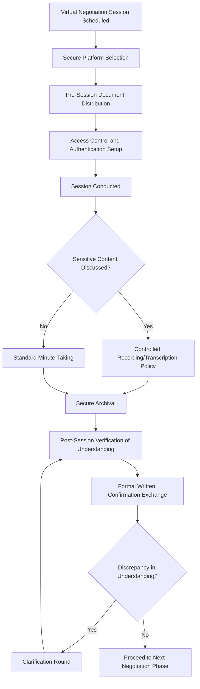

## Virtual Negotiation and E-Diplomacy

### Overview

Virtual negotiation and e-diplomacy encompass the conduct of formal diplomatic negotiation, consultation, and relationship-building through digital and virtual channels rather than exclusively in-person settings. This domain addresses the specific procedural, technical, and relational adaptations required when negotiation — traditionally dependent on physical presence, informal corridor conversation, and face-to-face trust-building — moves partially or fully into video conferencing, secure digital platforms, and emerging virtual/augmented reality environments.

### Conceptual Foundations

#### E-Diplomacy as an Umbrella Term

- **E-Diplomacy Scope**: The broader practice of conducting diplomatic functions through digital tools and channels, of which virtual negotiation is the specific subset addressing formal negotiation and consultation processes rather than public communication or information gathering
- **Relationship to Adjacent Domains**: E-diplomacy shares infrastructure and institutional logic with data-driven diplomacy (analytical support) and social media statecraft (public-facing communication), but virtual negotiation specifically concerns closed, often confidential, state-to-state or multilateral deliberative processes
- **Virtuality Scenario Connection**: Academic scenario frameworks for AI-driven diplomacy identify a distinct "Virtuality scenario," in which AI and virtual reality facilitate interpersonal communication and negotiations between diplomats — positioning virtual negotiation as a plausible medium-term trajectory rather than a settled end-state

#### Distinguishing Virtual Negotiation from Traditional Negotiation

| Dimension | Traditional In-Person Negotiation | Virtual Negotiation |
| --- | --- | --- |
| Informal relationship-building | Corridor conversations, shared meals, physical proximity | Structurally limited or requires deliberate design |
| Non-verbal cue access | Full-spectrum body language, room dynamics | Partial (video) or absent (text/audio-only) |
| Trust calibration | Built through sustained physical co-presence | Requires alternative or compensating mechanisms |
| Logistics and access | High cost, travel and visa constraints | Lower cost, broader participation access |
| Confidentiality assurance | Controlled physical environment | Dependent on technical security infrastructure |
| Documentation | Often manual, negotiator-controlled | Often automatically logged, raising new retention questions |

**Key Points**

- Virtual negotiation does not simply relocate traditional negotiation into a digital channel; it changes the available toolkit for trust-building, signaling, and informal consensus-testing that experienced negotiators rely on
- The loss of informal, unstructured interaction time is widely regarded in practitioner reflection as one of the most consequential and least easily replicated features of in-person negotiation

### Technical and Procedural Infrastructure

#### Platform and Security Requirements

- **Secure Communication Channels**: Diplomatic negotiation, particularly on sensitive matters, requires platforms with security assurances substantially exceeding standard commercial video conferencing tools, connecting directly to the cybersecurity policy considerations covering diplomatic communications infrastructure
- **Multi-Party Coordination Infrastructure**: Multilateral virtual negotiation requires technical infrastructure supporting simultaneous interpretation, breakout sessions, and controlled document sharing at a level of reliability that a bilateral video call does not demand
- **Redundancy and Continuity Planning**: Technical failure during a sensitive negotiation session carries disproportionate diplomatic risk relative to an ordinary business call, requiring institutional redundancy protocols (backup channels, pre-agreed fallback procedures) not typically necessary for routine virtual meetings

#### Document and Record Management

- **Recording and Transcription Policy**: Institutional policy governing whether and how virtual negotiation sessions are recorded or transcribed, balancing the value of accurate record-keeping against the chilling effect recording may have on candid exchange, and against data security risk of storing sensitive negotiation content digitally
- **Automatic Logging Risk**: Standard virtual meeting platforms often generate automatic transcripts, chat logs, or metadata by default, requiring explicit institutional policy to disable or control such features for sensitive sessions to avoid inadvertent record creation beyond what negotiators intend
- **Formal Confirmation Protocols**: Given the reduced richness of virtual interaction, greater reliance on explicit written confirmation of understanding after each session becomes standard practice, compensating for the higher risk of ambiguity or misunderstanding relative to in-person negotiation

### Negotiation Dynamics in Virtual Settings

#### Trust and Relationship-Building Adaptations

- **Structured Informal Time**: Deliberate scheduling of unstructured video conversation time, analogous to a coffee break, to partially compensate for the loss of organic corridor interaction that traditional negotiation relies upon for relationship development
- **Pre-Existing Relationship Dependency**: [Inference] Practitioner reflection broadly suggests that virtual negotiation functions considerably better when negotiators have an existing in-person relationship foundation to draw upon, compared to entirely new relationships attempted purely through virtual channels
- **Hybrid Model Adoption**: Many negotiation processes have converged toward a hybrid model — establishing or renewing relationships through periodic in-person sessions while using virtual channels for higher-frequency, lower-stakes follow-up and technical-level consultation

#### Communication and Signaling Challenges

- **Non-Verbal Cue Reduction**: Video conferencing conveys substantially less non-verbal information than in-person interaction (reduced peripheral body language, camera framing limitations, lag-induced timing distortion), complicating the subtle signaling and reading of counterpart reaction that experienced negotiators rely upon
- **Silence and Pause Interpretation**: Technical latency and turn-taking friction inherent to video platforms can distort the interpretation of pauses or silences, which carry meaningful signaling value in traditional negotiation but become ambiguous (technical delay vs. deliberate pause) in virtual settings
- **Multi-Party Turn-Taking Complexity**: Multilateral virtual negotiation faces amplified turn-taking and floor-management challenges compared to in-person multilateral settings, where physical seating arrangement and visual cues typically help manage speaking order more fluidly

#### Cultural and Cross-Timezone Considerations

- **Timezone Equity**: Virtual multilateral negotiation scheduling raises equity considerations around which participating states' delegations face off-hours participation, a consideration less salient when all parties travel to a common physical venue
- **Cultural Variation in Virtual Communication Norms**: Cultural norms around eye contact, silence, formality, and turn-taking vary and interact differently when mediated through video technology, requiring negotiators to account for an additional layer of cross-cultural interpretation complexity beyond traditional in-person negotiation training

### Applications Across Diplomatic Functions

#### Formal Treaty and Agreement Negotiation

- **Technical-Level Working Groups**: Virtual channels are widely used for technical-level, lower-political-sensitivity working group sessions that refine treaty language or technical annexes between higher-level in-person negotiating rounds
- **Crisis-Driven Virtual Summitry**: Rapid convening of virtual leader-level engagement during crises where in-person summit logistics would introduce unacceptable delay, leveraging the speed advantage virtual channels offer over traditional summit scheduling

#### Consular and Bilateral Consultation

- **Routine Bilateral Consultation**: Lower-stakes, recurring bilateral consultation increasingly conducted virtually as standard practice, reserving in-person engagement for higher-significance occasions
- **Emergency Consultation Channels**: Virtual channels supporting rapid emergency consultation between counterpart officials during fast-moving situations, connecting to the crisis communication infrastructure discussed under cyber diplomacy and social media statecraft

#### Multilateral Institutional Engagement

- **Hybrid Multilateral Sessions**: Many multilateral bodies now operate hybrid formats allowing remote participation alongside in-person attendance, raising procedural questions about equivalence of participation and voting/consensus mechanics between in-person and remote delegates
- **Reduced-Barrier Participation for Smaller Delegations**: Virtual participation options can reduce the resource barrier that has historically limited smaller or less-resourced states' capacity to participate fully in multilateral processes requiring extensive in-person travel, echoing the equalizing potential noted for AI tools among smaller diplomatic services

### Emerging Virtual and Augmented Reality Applications

- **Immersive Negotiation Environments**: [Unverified — emerging and not widely deployed] Experimental use of virtual reality environments intended to more closely simulate shared physical presence during negotiation is an area of active exploration in digital diplomacy scholarship, though widespread operational deployment for formal diplomatic negotiation does not appear to be established current practice, and specific tool adoption should be verified against current institutional practice
- **Avatar-Mediated Interaction**: Proposed use of avatar or virtual-presence technology to provide richer non-verbal signaling than standard video conferencing, remaining at an early and largely exploratory stage of diplomatic application

### Risks and Failure Modes

- **Misunderstanding Amplification**: Reduced communication bandwidth in virtual settings increases the risk that ambiguous statements are misinterpreted, with less opportunity for the informal, low-stakes clarification that in-person settings naturally afford
- **Security and Confidentiality Compromise**: Virtual channels introduce cyber vulnerability surface area not present in physically controlled in-person negotiation venues, requiring the same attribution, incident response, and defensive posture considerations covered under cyber diplomacy
- **Relationship Erosion Over Purely Virtual Engagement**: Extended reliance on virtual-only engagement without periodic in-person renewal risks gradual relationship erosion, particularly in negotiations requiring sustained trust over multi-year processes
- **Technical Inequity Between Parties**: Disparities in participating states' technical infrastructure and connectivity quality can create asymmetric participation experience, with better-resourced delegations experiencing smoother engagement than less-resourced counterparts, a fairness consideration particularly relevant in multilateral settings
- **False Sense of Informality**: Video conferencing's domestic and casual associations can inadvertently reduce the perceived formality and gravity negotiators bring to consequential sessions, a subtle behavioral risk requiring deliberate institutional countermeasures (structured agendas, formal opening protocols) to preserve appropriate negotiation discipline

### Institutional Best Practices

- **Hybrid Sequencing Design**: Deliberately structuring negotiation processes to combine in-person relationship-establishing sessions with virtual technical follow-up, rather than defaulting entirely to one mode
- **Explicit Confirmation Culture**: Building institutional habit of written post-session confirmation of understanding to compensate for virtual communication's reduced bandwidth and higher misunderstanding risk
- **Security-First Platform Selection**: Selecting negotiation platforms based on security assurance appropriate to the sensitivity level of the specific negotiation, rather than defaulting to whichever commercial tool is most commonly used for routine business
- **Equity-Aware Scheduling and Access**: Actively accounting for timezone equity and technical infrastructure disparities when designing virtual multilateral negotiation processes, rather than allowing convenience for better-resourced participants to become the default standard

### Example

**Scenario**: A multilateral technical working group must finalize annex language for an agreement ahead of a summit, with the full negotiating parties unable to convene in person before the summit date due to schedule constraints, while the underlying political relationship between key parties remains sensitive.

**Virtual negotiation approach**:

1. Select a secure platform meeting the confidentiality requirements appropriate to the sensitivity of the annex content, rather than a standard commercial video tool, consistent with cybersecurity policy standards for diplomatic communication
2. Explicitly disable or control automatic transcription and chat-logging features by default, establishing a deliberate institutional policy on what record is created rather than allowing platform defaults to determine data retention
3. Schedule sessions accounting for timezone equity across all participating delegations, avoiding a default schedule convenient only for the best-resourced or most centrally located parties
4. Build in brief unstructured time before or after formal sessions to partially compensate for the relationship-building function that in-person interaction would normally provide
5. Follow each session with formal written confirmation of the understanding reached, given the higher ambiguity risk inherent to virtual communication, and flag any discrepancy for a dedicated clarification round rather than allowing ambiguity to persist into the next negotiating phase
6. Plan for an in-person session at the summit itself specifically to finalize and formally conclude the process, using the virtual sessions to prepare technical groundwork rather than attempting the entire negotiation purely virtually

This illustrates the hybrid sequencing approach that current practice broadly favors — using virtual channels for their speed and access advantages on technical-level work, while preserving in-person engagement for the relationship-dependent and politically consequential closing stages of a negotiation process.

**Next Steps**

- Designing secure platform selection criteria calibrated to negotiation sensitivity levels
- Studying documented case studies of successful versus strained purely-virtual negotiation processes
- Building institutional recording and transcription policy frameworks for sensitive virtual sessions
- Examining timezone and technical-infrastructure equity considerations in multilateral virtual format design
- Comparing hybrid multilateral participation models and their procedural equivalence implications
- Exploring emerging virtual/augmented reality negotiation environment research and prospective application