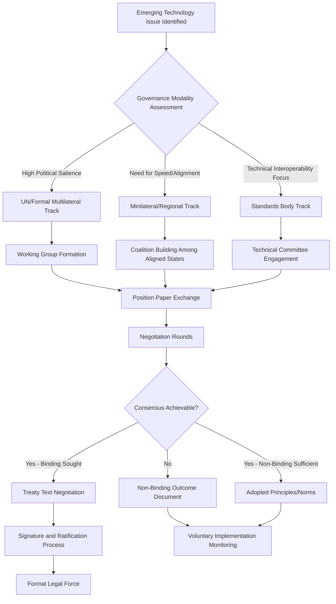

## Technology Governance in International Forums

### Overview

Technology governance in international forums encompasses the diplomatic processes, institutional venues, and negotiation dynamics through which states collectively establish norms, standards, and regulatory frameworks for emerging technologies. This domain synthesizes and extends the norm-setting and multilateral processes introduced under cyber diplomacy into a broader treatment covering AI governance, data governance, biotechnology, and other emerging technology domains as they enter formal and informal international deliberation.

### Conceptual Foundations

#### The Governance Gap Problem

- **Technology-Policy Velocity Mismatch**: Emerging technology capability typically advances faster than the multilateral negotiation and ratification processes traditionally used to establish binding international governance, creating a persistent structural gap between technical reality and governing framework
- **Jurisdictional Fragmentation**: In the absence of settled multilateral frameworks, individual states and regional blocs frequently establish unilateral or regional regulatory approaches, producing a fragmented governance landscape that multinational actors and cross-border technology flows must navigate
- **Dual-Use and Civilian-Military Ambiguity**: Many emerging technologies (AI, biotechnology, advanced computing) share the dual-use characteristic already noted in cyber diplomacy, complicating governance frameworks that depend on clear civilian/military distinctions

#### Governance Modalities

| Modality | Binding Force | Typical Venue | Example Domain |
| --- | --- | --- | --- |
| Binding treaty | Legally binding | Formal treaty negotiation | Established domains (e.g., nuclear, some environmental) |
| Non-binding norms/principles | Political commitment only | UN working groups, expert groups | Cyber behavior norms, early AI principles |
| Technical standards | Binding upon adoption/certification | Standards-setting bodies | Interoperability, safety specifications |
| Regulatory harmonization agreements | Binding between signatories | Bilateral/regional agreements | Data adequacy, mutual recognition |
| Voluntary industry commitments | Non-binding, reputational | Multi-stakeholder forums, summits | Early-stage AI safety commitments |

**Key Points**

- Most emerging technology governance currently operates through non-binding or voluntary modalities rather than binding treaty law, reflecting states' general preference for negotiating flexibility during periods of rapid technical change, consistent with the pattern already observed in cyber norm development
- The choice of governance modality is itself a diplomatic negotiation outcome, not a neutral technical decision — states with different strategic interests often favor different modalities for the same underlying technology domain

### Institutional Venues

#### United Nations System

- **General Assembly and Committee Processes**: Broad-based multilateral venues where technology governance issues are raised, debated, and sometimes formalized into resolutions or negotiated outcome documents, offering near-universal participation but correspondingly slower consensus-building
- **Specialized Working Groups**: Issue-specific negotiating bodies (analogous to the cyber-specific GGE/OEWG processes) convened for particular technology domains, allowing more focused expert-level negotiation than plenary UN processes
- **Specialized Agencies**: UN-affiliated technical agencies with domain-specific mandates relevant to particular technology governance questions (telecommunications standards, health-related biotechnology, etc.), providing technical expertise embedded within the broader UN institutional architecture

#### Minilateral and Regional Forums

- **G7/G20-Style Groupings**: Smaller groupings of major economies used to develop coordinated positions or voluntary frameworks more rapidly than universal UN processes allow, often serving as a precursor to broader multilateral adoption or as a standalone coordination mechanism among aligned states
- **Regional Economic and Political Blocs**: Regional organizations increasingly developing their own technology governance frameworks, which can either complement or compete with global standard-setting efforts depending on the degree of interoperability designed into regional approaches
- **AI Safety and Technology Summits**: Dedicated high-level summit processes convened specifically around a single emerging technology domain, functioning as a minilateral venue for rapid political-level engagement distinct from standing institutional processes

#### Technical Standards Bodies

- **International Standards Organizations**: Technical standards-setting bodies where diplomatic engagement matters significantly because standards adopted carry substantial downstream strategic and commercial consequence, directly extending the "standards diplomacy" concept introduced under cyber diplomacy
- **Industry Consortium Standards Processes**: Multi-stakeholder technical bodies, often industry-led with government and civil society participation, developing de facto technical standards that can become governance-relevant even without formal state endorsement

### Negotiation Process Architecture

#### Coalition and Bloc Dynamics

- **Like-Minded State Coalitions**: States with aligned strategic and values positions frequently coordinate negotiating positions in advance of and during formal sessions, a practice extending the alliance coordination function noted in cyber diplomacy into the broader technology governance space
- **Developing State Coalition Dynamics**: Developing states frequently coordinate to ensure technology governance frameworks account for capacity asymmetries and development considerations, connecting to the digital divide concerns raised under cyber capacity building
- **Cross-Cutting Issue Coalitions**: Coalition patterns on technology governance issues do not always mirror traditional geopolitical blocs, since specific technology domains can create novel alignment patterns based on domestic industry interests, technical capacity, or regulatory philosophy rather than conventional diplomatic alignment

#### Private Sector and Civil Society Participation

- **Multi-Stakeholder Input Mechanisms**: Structured processes for incorporating technology company, civil society, and technical community expertise into formal governance negotiations, extending the multi-stakeholder governance debate already introduced under cyber diplomacy into the broader technology governance landscape
- **Private Sector as Consequential Actor**: Given private ownership and development of most emerging technology infrastructure and capability, effective technology governance negotiation increasingly requires direct engagement with major technology companies as substantive actors rather than purely regulated subjects
- **Legitimacy and Representation Debates**: Ongoing tension over how much formal influence non-state technical and corporate actors should hold in state-led governance processes, balancing valuable technical expertise input against democratic legitimacy concerns about non-elected actors shaping binding or quasi-binding international norms

### Cross-Domain Governance Challenges

#### Interoperability with Existing Governance Frameworks

- **Legacy Framework Applicability Debates**: Persistent diplomatic and legal debate over whether and how existing international law frameworks (analogous to the sovereignty and use-of-force debates in cyber diplomacy) apply to newer technology domains not originally contemplated by those frameworks
- **Cross-Domain Regulatory Conflict**: Different technology domains' governance frameworks can create friction where they overlap (e.g., AI governance intersecting with data governance and cybersecurity policy simultaneously), requiring coordination across what are often institutionally separate negotiating tracks
- **Sequencing and Precedent Effects**: Governance approaches established in one technology domain frequently function as reference precedent for subsequent negotiations in adjacent domains, meaning early governance decisions carry disproportionate long-term influence on the overall technology governance landscape

#### Verification and Compliance Assessment

- **Monitoring Capacity Limitations**: Assessing compliance with non-binding technology governance norms faces significant practical difficulty, echoing the norm compliance assessment challenges already identified in cyber diplomacy
- **Self-Reporting Dependency**: Many technology governance frameworks currently rely substantially on self-reporting by states or companies rather than independent verification mechanisms, a structural limitation shared with several other non-binding international governance domains
- **Technical Verification Requirements**: Where verification is attempted, it often requires specialized technical capacity that not all participating states or oversight bodies possess, reinforcing the capacity asymmetry concerns raised throughout this technology governance domain

### Diplomatic Strategy Considerations

#### First-Mover and Standard-Setting Advantage

- **Early Framework Influence**: States and blocs that develop comprehensive governance frameworks early often gain disproportionate influence over subsequent international norm development, as other jurisdictions reference or adapt early frameworks rather than building entirely independent approaches
- **Regulatory Export Dynamics**: [Inference] Comparative policy literature broadly observes that major regulatory blocs' domestic frameworks can gain de facto extraterritorial influence when global companies choose to apply the most stringent applicable standard across all markets rather than maintaining separate jurisdiction-specific compliance regimes — a dynamic relevant to technology governance diplomacy even though its precise scope and mechanism vary by domain and company

#### Balancing Innovation and Precaution

- **Precautionary vs. Permissive Governance Philosophy**: States and blocs vary in their underlying regulatory philosophy toward emerging technology, ranging from precautionary approaches prioritizing risk mitigation before widespread deployment to more permissive approaches prioritizing innovation speed with governance developing alongside deployment
- **Competitive Governance Dynamics**: Perceived competitive disadvantage from more stringent domestic governance frameworks relative to less-regulated jurisdictions is a recurring diplomatic tension point, influencing both domestic regulatory design and international negotiating positions

### Measurement and Evaluation

- **Norm Adoption Tracking**: Assessing the degree to which negotiated non-binding norms or principles are subsequently reflected in domestic legal and regulatory frameworks across participating states, as an indicator of practical governance effectiveness
- **Forum Effectiveness Assessment**: Evaluating whether a given institutional venue is producing timely, implementable governance outcomes relative to the pace of underlying technology development, informing future diplomatic resource allocation across competing venues
- **Coalition Durability Tracking**: Assessing whether negotiating coalitions formed around a specific technology governance issue persist into subsequent related negotiations, indicating whether genuine alignment or issue-specific convenience underlies coalition formation

### Example

**Scenario**: A foreign ministry must decide where to prioritize diplomatic engagement on an emerging technology governance issue that intersects both AI safety and data governance, with multiple potential venues (a UN working group, a minilateral summit process, and a relevant technical standards body) simultaneously active.

**Strategic approach**:

1. Assess governance modality fit for the specific issue: given the issue's technical interoperability dimension, prioritize sustained technical committee engagement at the relevant standards body while treating the UN working group as the appropriate venue for the issue's broader normative and rights-based dimensions
2. Build coalition with like-minded states ahead of formal sessions across all active venues, recognizing that coalition dynamics on this cross-cutting issue may not mirror the ministry's traditional diplomatic alignment patterns given the issue's novel domestic-industry-interest dimension
3. Engage directly with relevant technology companies as substantive stakeholders given their central role in the underlying technical infrastructure, while managing the legitimacy and representation considerations inherent in multi-stakeholder engagement
4. Track how framework choices in the currently most-advanced venue may create precedent effects for the other two, informing sequencing strategy for where to concentrate the most senior diplomatic resources first
5. Build monitoring capacity for whatever compliance or verification mechanism ultimately emerges, recognizing the self-reporting dependency and technical verification capacity limitations common across current technology governance frameworks

This illustrates the multi-venue strategic assessment increasingly required in technology governance diplomacy, where a single substantive issue may simultaneously implicate several institutionally distinct negotiating tracks requiring coordinated rather than siloed diplomatic engagement.

**Next Steps**

- Mapping active institutional venues for a specific emerging technology governance issue
- Studying precedent effects between early and subsequent technology governance frameworks
- Examining multi-stakeholder legitimacy debates in specific ongoing negotiation processes
- Building a coalition-tracking framework for cross-cutting technology governance issues
- Comparing precautionary versus permissive regulatory philosophy across major state and bloc approaches
- Reviewing verification and compliance assessment mechanisms across existing technology governance frameworks