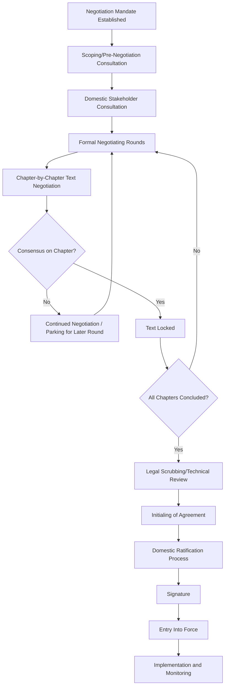

## Trade Negotiation Fundamentals

### Overview

Trade negotiation fundamentals encompass the core concepts, institutional frameworks, and procedural mechanics underlying the negotiation of agreements governing the exchange of goods, services, investment, and related economic activity between states. As the foundational topic within economic and commercial diplomacy, this domain establishes the conceptual vocabulary and structural knowledge that subsequent, more specialized trade and investment topics build upon.

### Conceptual Foundations

#### Why States Negotiate Trade Agreements

- **Market Access**: Securing preferential or guaranteed access to a partner's market for a state's exporters, typically the primary offensive objective in trade negotiation
- **Rule Predictability**: Establishing binding, predictable rules governing trade conduct, reducing uncertainty for businesses operating across the agreement's covered jurisdictions
- **Tariff and Non-Tariff Barrier Reduction**: Direct reduction of the cost and friction associated with cross-border trade, benefiting both exporting industries and importing consumers through increased competition and choice
- **Strategic and Geopolitical Objectives**: Trade agreements frequently serve broader diplomatic and strategic purposes beyond pure economic gain, including relationship deepening, strategic alignment signaling, and regional influence positioning

#### Levels of Trade Agreement

| Level | Scope | Example Structure |
| --- | --- | --- |
| Bilateral | Two states | Free trade agreement (FTA) between two countries |
| Plurilateral | Subset of states, often issue-specific | Agreement among willing parties within a broader forum |
| Regional | Defined geographic grouping | Regional trade bloc or regional FTA |
| Multilateral | Broad, often near-universal | WTO-administered agreements |

**Key Points**

- The choice of negotiating level involves trade-offs: multilateral agreements offer the broadest market access but require the most complex consensus-building and typically the longest negotiation timelines, while bilateral agreements move faster but yield narrower coverage
- Many states pursue a "multi-track" strategy, simultaneously engaging in bilateral, regional, and multilateral processes rather than committing exclusively to one level

### Core Substantive Areas

#### Tariff Negotiation

- **Tariff Schedules**: Negotiated, product-by-product lists of tariff rates (or reduction commitments) that form the core market-access outcome of most trade agreements
- **Tariff Rate Quotas**: Hybrid mechanisms allowing a set volume of imports at a preferential tariff rate, with higher tariffs applying beyond that volume, often used for politically sensitive sectors such as agriculture
- **Sensitive Sector Carve-Outs**: Negotiated exceptions or extended phase-in periods for domestically sensitive industries, reflecting the political economy reality that full and immediate liberalization is often domestically unachievable

#### Non-Tariff Measures

- **Technical Barriers to Trade**: Product standards, testing, and certification requirements that can function as trade barriers even absent formal tariffs, requiring negotiated mutual recognition or harmonization provisions
- **Sanitary and Phytosanitary Measures**: Health and safety-related import requirements (particularly for agricultural and food products), negotiated to balance legitimate health protection against their potential use as disguised protectionism
- **Rules of Origin**: Provisions determining what proportion of a product's value or production process must originate within agreement-covered territories for that product to qualify for preferential tariff treatment, a technically complex area with substantial strategic implication for supply chain structuring

#### Services and Investment

- **Services Trade Liberalization**: Negotiated commitments opening specific services sectors (financial services, telecommunications, professional services) to foreign competition, structurally distinct from goods trade due to services' often non-physical and regulation-intensive nature
- **Investment Protection Provisions**: Commitments protecting foreign investors from expropriation, discriminatory treatment, and other investment risks, often including dispute resolution mechanisms distinct from general trade dispute processes
- **Intellectual Property Provisions**: Negotiated standards for intellectual property protection and enforcement, frequently among the most contentious chapters in modern trade agreements given divergent national interests between IP-exporting and IP-importing economies

### Negotiation Process Architecture

#### Mandate and Preparation

- **Negotiating Mandate**: Formal authorization, typically granted by a state's executive or legislature, defining the scope, objectives, and constraints within which negotiators are authorized to negotiate
- **Domestic Stakeholder Consultation**: Structured engagement with domestic industry, labor, civil society, and other affected constituencies prior to and during negotiation, both to inform negotiating positions and to build the domestic political coalition necessary for eventual ratification
- **Interagency Coordination**: Trade negotiation typically requires coordination across multiple government agencies (trade ministry, foreign ministry, sector-specific regulators), given that outcomes affect domains beyond trade policy narrowly defined

#### Negotiating Techniques

- **Single Undertaking Principle**: Negotiating approach in which nothing is agreed until everything is agreed, allowing trade-offs across different chapters and sectors rather than locking in early concessions without corresponding gains elsewhere
- **Offensive and Defensive Interest Balancing**: Negotiators typically pursue offensive interests (market access gains sought) while managing defensive interests (protecting sensitive domestic sectors from excessive liberalization), with the overall negotiating strategy reflecting the balance between the two
- **Request-Offer Process**: Structured exchange in which parties submit specific market-access requests to counterparts and receive corresponding offers, iteratively narrowing toward mutually acceptable commitments
- **Linkage and Package Deals**: Strategic linking of concessions across different substantive areas or even across different negotiating processes entirely, allowing a state to accept a loss in one area in exchange for a gain in another

### Institutional Framework: The WTO System

#### Multilateral Trade Rules Foundation

- **Most-Favored-Nation Principle**: Core WTO principle requiring that any trade advantage granted to one trading partner generally be extended to all other WTO members, with negotiated exceptions (including regional trade agreements) as the primary mechanism for departing from strict MFN treatment
- **National Treatment Principle**: Principle requiring imported goods and services be treated no less favorably than domestically produced equivalents once they have entered a market, distinct from and complementary to MFN treatment
- **Binding Commitments and Schedules**: WTO members' negotiated tariff and services commitments are formally bound, creating a ceiling that subsequent unilateral action cannot exceed without triggering compensation obligations to affected trading partners

#### Dispute Resolution

- **Formal Dispute Settlement Process**: Structured mechanism for resolving disputes over whether a member's trade measures comply with agreed obligations, providing a rules-based alternative to unilateral retaliatory action
- **Panel and Appellate Review**: [Unverified — institutional status subject to change] The WTO dispute settlement system's appellate function has faced documented operational challenges in recent years; the current functional status of appellate review should be verified against current WTO institutional reporting given the evolving nature of this issue
- **Compliance and Retaliation Mechanisms**: Structured processes for assessing compliance with dispute rulings and, where compliance is not achieved, authorizing proportionate retaliatory measures by the prevailing party

### Regional and Preferential Trade Agreements

- **FTA Proliferation**: The substantial growth in bilateral and regional free trade agreements alongside the multilateral system, often explained by the relatively slower pace of new multilateral liberalization compared to the negotiating speed achievable in smaller groupings
- **Spaghetti Bowl Effect**: The complexity and potential inefficiency created by overlapping bilateral and regional trade agreements with differing rules of origin and provisions, requiring businesses to navigate a complex patchwork rather than a single consistent rule set
- **Mega-Regional Agreements**: Large plurilateral agreements involving multiple significant economies, occupying an intermediate position between traditional bilateral FTAs and full multilateral negotiation, often setting influential precedent for subsequent agreements

### Political Economy Considerations

#### Domestic Ratification Dynamics

- **Legislative Approval Requirements**: Most trade agreements require some form of domestic legislative ratification or ratification-equivalent process before entry into force, meaning negotiators must anticipate domestic political feasibility throughout the negotiation, not only at its conclusion
- **Distributional Impact Management**: Trade liberalization typically produces concentrated costs for import-competing sectors alongside more diffuse benefits for consumers and export sectors, a political economy dynamic requiring deliberate management (adjustment assistance programs, phased implementation) to sustain domestic political support
- **Civil Society and Public Consultation**: Increasing expectation of transparency and public consultation during trade negotiation, reflecting broader public diplomacy and legitimacy considerations even in a technically specialized negotiation domain

#### Strategic Sequencing and Timing

- **Electoral Cycle Considerations**: Negotiation timelines are frequently influenced by domestic and counterpart electoral calendars, since political capital and negotiating authority can shift significantly around elections
- **Fast-Track/Trade Promotion Authority Mechanisms**: [Unverified — jurisdiction-specific] Some jurisdictions employ expedited legislative procedures for trade agreement approval, limiting legislative amendment power in exchange for up-or-down approval votes; the specific current mechanism, its legal basis, and renewal status vary by jurisdiction and should be verified against current domestic legislative practice

### Example

**Scenario**: A mid-sized economy's trade ministry is preparing to launch bilateral free trade negotiations with a significantly larger trading partner, seeking improved market access for its agricultural exports while facing domestic political sensitivity around protecting its own manufacturing sector.

**Negotiation preparation approach**:

1. Establish a negotiating mandate clearly defining priority offensive interests (agricultural market access) and defensive red lines (manufacturing sector protection), providing negotiators clear boundaries before formal rounds begin
2. Conduct domestic stakeholder consultation with both agricultural export industry representatives and manufacturing sector representatives, building the political coalition needed for eventual ratification while gathering technical input on specific tariff line sensitivities
3. Apply the single undertaking principle throughout negotiation, using potential manufacturing sector protections as a negotiating chip against agricultural market access gains, rather than conceding either issue in isolation
4. Anticipate rules of origin complexity given the agricultural sector's frequent reliance on imported inputs, ensuring origin requirements don't inadvertently undermine the practical value of tariff preferences being negotiated
5. Sequence the negotiation with awareness of both countries' electoral calendars, aiming to conclude technical negotiation during a window of stable negotiating authority on both sides rather than risking a change in counterpart negotiating mandate mid-process

This illustrates how trade negotiation preparation requires integrating substantive technical knowledge (tariffs, rules of origin), negotiating strategy (single undertaking, linkage), and political economy management (domestic coalition-building, electoral timing) into a coherent preparation process before formal negotiation begins.

**Next Steps**

- Studying WTO dispute settlement mechanics and current appellate body functional status
- Comparing negotiating mandate structures and domestic ratification requirements across jurisdictions
- Examining rules of origin design and its strategic supply chain implications
- Building a domestic stakeholder consultation framework for a specific sectoral negotiation
- Analyzing mega-regional agreement case studies and their precedent-setting effects
- Reviewing distributional impact management and trade adjustment assistance program models