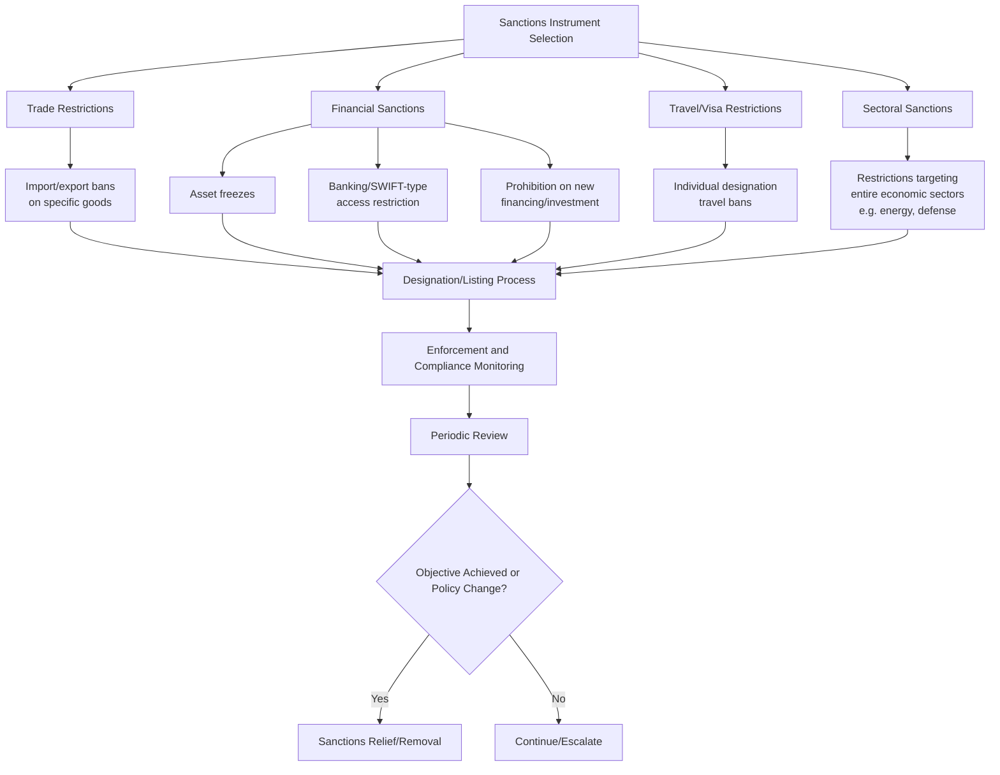

## Economic Statecraft and Sanctions

### Overview

Economic statecraft is the use of economic instruments — sanctions, trade restrictions, financial measures, and economic inducements — to pursue foreign policy and national security objectives. Sanctions represent the most prominent coercive instrument within this domain, functioning as a policy tool positioned between diplomatic protest and military action, intended to impose costs on a target sufficient to change behavior without resorting to armed force.

### Conceptual Foundations

#### Economic Statecraft as a Spectrum of Instruments

| Instrument Type | Character | Example Function |
| --- | --- | --- |
| Positive inducements | Reward-based | Trade preferences, aid, investment incentives offered for desired behavior |
| Sanctions (negative) | Punitive/coercive | Trade restrictions, asset freezes, financial exclusion imposed for undesired behavior |
| Export controls | Restrictive/preventive | Limiting access to specific goods or technology, often dual-use |
| Economic dependency management | Structural/strategic | Reducing or leveraging economic interdependence for strategic positioning |

**Key Points**

- Sanctions are the coercive subset of a broader economic statecraft toolkit that also includes positive economic inducements, meaning effective economic statecraft strategy typically considers both punitive and reward-based instruments in combination
- The same economic relationship that creates leverage for sanctions also creates vulnerability to counter-sanctions or retaliation, meaning economic statecraft is inherently a two-way strategic consideration, not a unilateral tool exercised without cost to the sender

#### Objectives of Sanctions

- **Behavior Change (Coercion)**: Compelling a target to alter a specific policy or action, the most commonly stated objective though often the hardest to achieve and measure
- **Constraint**: Limiting a target's capability to pursue a particular activity (weapons proliferation, military buildup) regardless of whether the target's underlying intent changes
- **Signaling**: Communicating disapproval or establishing a normative red line, serving a diplomatic and reputational function independent of the sanctions' direct economic effect on the target
- **Subversion/Regime Change**: [Contested objective] Some sanctions regimes are understood, explicitly or implicitly, to aim at weakening a target government's domestic political position; this objective is more diplomatically and legally contested than the others and is not always openly stated even where it may be an underlying motivation

### Sanctions Typology

#### By Scope

- **Comprehensive Sanctions**: Broad restrictions covering most or all economic activity with a target state, historically more common but increasingly disfavored due to significant humanitarian impact on general populations
- **Targeted/Smart Sanctions**: Restrictions focused on specific individuals, entities, sectors, or transaction types, designed to impose cost on responsible actors while minimizing broader humanitarian impact — the now-dominant sanctions design approach in most contemporary practice

#### By Mechanism

- **Trade Restrictions**: Import and export bans targeting specific goods, often including dual-use items with both civilian and military application relevance
- **Financial Sanctions**: Asset freezes, banking access restrictions, and prohibitions on new financing or investment, frequently the most economically consequential mechanism given modern economies' dependence on integrated financial systems
- **Secondary Sanctions**: Measures targeting third-country actors who conduct business with a sanctioned target, extending sanctions' practical reach beyond the sanctioning state's direct jurisdiction and creating significant diplomatic friction with third states who view such measures as extraterritorial overreach
- **Sectoral Sanctions**: Restrictions targeting specific economic sectors (energy, defense, finance) rather than the full economy, allowing calibrated pressure on strategically significant sectors while limiting broader economic damage

#### By Multilateral Character

- **Unilateral Sanctions**: Imposed by a single state acting alone, offering speed and policy flexibility but generally lower economic impact and higher risk of undermining the sanctioning state's credibility if the target can substitute alternative trading partners
- **Multilateral Sanctions**: Coordinated among multiple states or imposed through an international body, generally more economically effective due to reduced substitution opportunity for the target, but requiring more complex coalition-building and consensus, connecting directly to the coordinated multilateral response patterns already discussed in cyber diplomacy

### Institutional and Legal Architecture

#### Authorization Frameworks

- **UN Security Council Sanctions**: Sanctions authorized through UN Security Council resolution, carrying the broadest international legal legitimacy and binding obligation on all UN member states, though subject to permanent member veto constraints that limit their availability for many geopolitically sensitive situations
- **National Sanctions Authorities**: Domestic legal frameworks empowering a state's executive branch to impose sanctions, varying significantly in procedural requirements, judicial review availability, and designation criteria across jurisdictions
- **Regional Bloc Sanctions**: Sanctions imposed through regional political or economic organizations, occupying an intermediate position between unilateral and full multilateral UN-authorized measures

#### Designation and Listing Process

- **Evidentiary Standards**: Institutional processes for determining what evidence justifies designating a specific individual, entity, or sector for sanctions, with due process and evidentiary standard requirements varying by jurisdiction and sanctions authority
- **Delisting and Appeal Mechanisms**: Procedures allowing designated parties to challenge or seek removal from sanctions lists, an area of ongoing legal and diplomatic contention regarding adequacy of due process, particularly for UN-level designations
- **Dynamic List Maintenance**: Ongoing institutional processes for updating sanctions lists as circumstances change, adding newly relevant targets and removing those no longer meeting designation criteria

### Diplomatic Dimensions of Sanctions

#### Coalition-Building for Multilateral Sanctions

- **Diplomatic Coordination Requirements**: Achieving meaningful multilateral sanctions coordination requires sustained diplomatic engagement to align designation criteria, scope, and timing across participating states, a process-intensive undertaking distinct from the underlying substantive sanctions policy decision itself
- **Burden-Sharing Considerations**: Sanctions frequently impose asymmetric economic costs on different sanctioning states depending on their pre-existing economic relationship with the target, requiring diplomatic management of burden-sharing concerns among coalition partners
- **Exemption and Carve-Out Negotiation**: Multilateral sanctions coordination typically involves negotiation over humanitarian exemptions and other carve-outs, balancing coalition unity against individual members' specific humanitarian, economic, or strategic concerns

#### Sanctions as Signaling and Attribution Tool

- **Designation as Formal Attribution**: The act of sanctioning a specific individual or entity functions as a form of formal attribution and public statement, connecting directly to the attribution-as-diplomatic-signal function already discussed in cyber diplomacy practice
- **Graduated Response Signaling**: Sanctions are frequently deployed in graduated fashion, with initial, narrower measures signaling seriousness while preserving room for escalation, allowing diplomatic flexibility to calibrate pressure to evolving circumstances
- **Sanctions Relief as Negotiating Leverage**: The prospect of sanctions relief itself functions as a diplomatic negotiating tool, providing an incentive structure for behavior change that operates alongside the punitive function of the sanctions themselves

### Effectiveness and Evaluation Challenges

#### The Effectiveness Debate

- **Mixed Empirical Evidence**: [Inference] Academic and policy literature on sanctions effectiveness broadly reflects substantial disagreement, with outcomes varying significantly based on sanctions design, target regime characteristics, multilateral coordination degree, and the specificity of the demanded behavior change — meaning general claims about sanctions effectiveness should be treated with caution absent case-specific analysis
- **Target Regime Adaptation**: Sanctioned states and entities frequently develop adaptive strategies (alternative trading partners, sanctions evasion networks, domestic substitution) that erode sanctions effectiveness over time, requiring sanctions design and enforcement to evolve correspondingly
- **Distinguishing Constraint from Coercion Success**: Evaluation should distinguish whether sanctions successfully constrained a target's capability (a more measurable outcome) from whether they achieved the harder-to-verify objective of changing underlying target intent or policy

#### Humanitarian and Unintended Consequence Considerations

- **Humanitarian Impact Assessment**: Even targeted sanctions can produce broader humanitarian consequences through economic spillover effects, requiring ongoing assessment and adjustment of exemption mechanisms
- **Third-Country Spillover Effects**: Sanctions can impose unintended economic costs on third countries with trade or financial relationships connected to the target, requiring diplomatic management of these spillover relationships separate from the primary sanctions objective
- **Domestic Political Consolidation Risk**: [Inference] Some analysis suggests sanctions can, in certain contexts, inadvertently strengthen a target regime's domestic political position by enabling a external-blame narrative, though this dynamic is highly context-dependent and not a uniform outcome across sanctions cases

### Sanctions Evasion and Enforcement

- **Evasion Network Detection**: Ongoing institutional effort required to identify and disrupt networks designed to circumvent sanctions restrictions, connecting to broader financial intelligence and OSINT-style analytical methodology
- **Third-Party Facilitator Targeting**: Enforcement increasingly targets intermediaries and facilitators enabling evasion, rather than only the originally designated primary targets, an approach paralleling the expanding liability scope trend noted in other technology and information governance domains
- **Compliance Cost on Private Sector**: Sanctions enforcement imposes substantial compliance burden on financial institutions and businesses required to screen transactions against sanctions lists, creating a private-sector compliance ecosystem that functions as a de facto enforcement extension of government sanctions authority

### Interaction with Broader Diplomatic Strategy

- **Sanctions as Part of Integrated Strategy**: Effective economic statecraft typically treats sanctions as one component within a broader diplomatic strategy combining coercive and diplomatic engagement tracks, rather than as a standalone substitute for sustained diplomatic effort
- **Exit Ramp Design**: Deliberately building clear, achievable conditions for sanctions relief into sanctions policy design, providing the target a diplomatically credible path to compliance rather than an open-ended punitive measure with no defined resolution mechanism
- **Reputational and Precedent Considerations**: Sanctions decisions carry precedent-setting weight for how a sanctioning state's economic statecraft credibility is perceived in future situations, an important but often underweighted consideration relative to the immediate case at hand

### Example

**Scenario**: A coalition of states is considering a coordinated sanctions response to a target state's violation of an international agreement, weighing unilateral versus multilateral approaches and needing to design a sanctions package that imposes meaningful pressure while preserving a viable diplomatic path to resolution.

**Economic statecraft design approach**:

1. Assess multilateral coordination feasibility, recognizing that multilateral sanctions generally achieve greater economic impact due to reduced substitution opportunity for the target, and invest diplomatic effort in coalition-building accordingly rather than defaulting to faster but less effective unilateral action
2. Design targeted rather than comprehensive sanctions, focusing on sectors and individuals most directly connected to the violation, minimizing broader humanitarian impact while maintaining meaningful pressure
3. Negotiate burden-sharing and exemption terms among coalition partners in advance, addressing the asymmetric economic cost different partners will bear given their varying pre-existing economic relationships with the target
4. Build a graduated escalation structure, beginning with narrower measures that leave room for further escalation if the target does not respond, rather than deploying maximum pressure immediately
5. Explicitly define achievable conditions for sanctions relief as part of the initial package design, providing a credible diplomatic exit ramp rather than an open-ended punitive measure, consistent with using sanctions relief itself as negotiating leverage toward the desired behavior change
6. Establish sanctions evasion monitoring capacity from the outset, anticipating target adaptation strategies rather than treating initial sanctions design as a static, one-time measure

This illustrates how effective sanctions design integrates coalition diplomacy, targeting precision, humanitarian consideration, and a defined resolution pathway — treating sanctions as a calibrated diplomatic instrument within a broader strategy rather than a blunt, standalone punitive action.

**Next Steps**

- Studying UN Security Council sanctions authorization mechanics and permanent member veto dynamics
- Comparing unilateral versus multilateral sanctions effectiveness in documented case studies
- Examining secondary sanctions extraterritoriality disputes and third-state diplomatic responses
- Building a sanctions evasion detection framework using financial intelligence and OSINT methodology
- Designing exit-ramp and sanctions relief negotiation frameworks for specific case scenarios
- Reviewing humanitarian exemption design and unintended consequence mitigation approaches