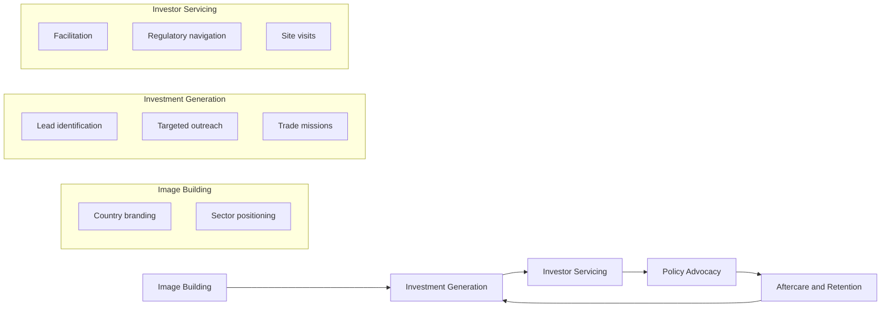

## Investment Promotion and Commercial Diplomacy

### Definition and Scope

Investment promotion and commercial diplomacy refers to the set of state-directed activities that use diplomatic channels, personnel, and instruments to attract foreign direct investment (FDI), expand export markets, and support the international commercial interests of a country's firms. It sits at the intersection of foreign policy and economic policy, and is typically executed by a combination of foreign ministries, dedicated investment promotion agencies (IPAs), trade commissioners, and embassy commercial sections.

**Key Points**

- Investment promotion targets inbound capital flows (attracting FDI into the home country).
- Commercial diplomacy is the broader umbrella: it includes investment promotion, export promotion, market access negotiation, and dispute mediation for firms operating abroad.
- Economic diplomacy is the superset that also covers macroeconomic coordination, sanctions, development finance, and multilateral trade policy — commercial diplomacy is its firm-facing subset.

### Historical Development

Commercial diplomacy has roots in the consular systems of trading empires (Venetian, Hanseatic, British), where consuls doubled as trade facilitators. The modern institutional form emerged post-1945 alongside the Bretton Woods system, GATT, and the proliferation of bilateral investment treaties (BITs) from the 1960s onward. The 1990s–2000s saw a wave of dedicated IPA creation (e.g., UK's Invest in Britain Bureau evolving into what is now the Department for Business and Trade's investment arm, Ireland's IDA, Singapore's EDB) as globalization intensified competition for mobile capital.

### Core Actors and Institutional Architecture

**Key Points**

- **Foreign Ministry Economic/Commercial Sections**: Embassies and consulates house commercial officers who conduct market intelligence, matchmaking, and advocacy for home-country firms.
- **Investment Promotion Agencies (IPAs)**: Semi-autonomous or ministry-linked bodies (e.g., JETRO in Japan, InvestHK in Hong Kong, Board of Investments in the Philippines) that market the home jurisdiction to foreign investors and provide aftercare services.
- **Trade Commissioners / Export Credit Agencies**: Distinct from IPAs, these focus on outbound trade support — export financing, insurance, and market entry assistance (e.g., EXIM Bank models, UK Export Finance).
- **Sovereign Wealth Funds and Development Finance Institutions**: Increasingly used as commercial diplomacy tools, deploying capital abroad in ways aligned with strategic interests.
- **Chambers of Commerce and Business Councils**: Quasi-official bodies that supplement state efforts, often co-located with embassies (e.g., AmChams, bilateral business councils).

### Functional Toolkit

**Key Points**

- **Investor targeting and lead generation**: Sector-specific outreach based on comparative advantage mapping.
- **Aftercare and reinvestment services**: Retaining and expanding existing FDI stock, often yielding higher returns than new investor acquisition.
- **Trade missions and state visits**: High-level diplomatic events used to sign framework agreements and generate business-to-business introductions.
- **Investment treaties and dispute resolution**: BITs, double taxation avoidance agreements (DTAs), and mechanisms like ICSID arbitration.
- **Economic statecraft instruments**: Export controls, tariffs, and market access conditionality used as leverage.
- **Digital and data-driven promotion**: Investment monitors, GIS-based site selection tools, and CRM systems for lead tracking.

### The Investment Promotion Value Chain

A standard operational model used by IPAs globally:

This cyclical model (image building → generation → servicing → advocacy → aftercare) is the framework used by UNCTAD and the World Association of Investment Promotion Agencies (WAIPA) to benchmark IPA performance.

### Legal and Institutional Instruments

**Key Points**

- **Bilateral Investment Treaties (BITs)**: Provide investor protections (fair and equitable treatment, expropriation safeguards, most-favored-nation clauses).
- **Free Trade Agreements (FTAs) with Investment Chapters**: Increasingly replace standalone BITs (e.g., USMCA, CPTPP investment provisions).
- **Investor-State Dispute Settlement (ISDS)**: Mechanism allowing foreign investors to sue host states, administered through bodies like ICSID or UNCITRAL rules.
- **Double Taxation Avoidance Agreements (DTAs)**: Reduce tax friction on cross-border investment income.
- **Special Economic Zones (SEZs) and Investment Codes**: Domestic legal frameworks offering tax holidays, streamlined permitting, and repatriation guarantees.

[Inference] The global trend toward FTA-embedded investment chapters over standalone BITs reflects a preference among major economies for consolidated trade-investment governance, though a large stock of legacy BITs remains in force and continues to generate ISDS cases.

### Metrics and Evaluation Frameworks

Commercial diplomacy effectiveness is commonly assessed via:

- **FDI inflow/outflow data**: UNCTAD's World Investment Report is the standard reference dataset.
- **Ease of Doing Business proxies**: Though the World Bank discontinued its flagship index in 2021, successor frameworks (e.g., Business Ready, "B-READY") serve similar benchmarking functions.
- **Jobs created / capital committed per IPA lead**: Standard KPI used in agency performance reviews.
- **Return on Investment Promotion (ROIP)**: Ratio of investment facilitated to agency operating budget.
- **Export diversification indices**: Herfindahl-Hirschman Index (HHI) applied to export basket composition.

### Case Illustration: Comparative IPA Models

| Model | Example | Characteristics |
| --- | --- | --- |
| Centralized national agency | Ireland (IDA Ireland) | Single agency, strong sectoral focus (tech, pharma), long-term investor relationships |
| Decentralized/federal | United States (SelectUSA + state EDCs) | State-level competition alongside federal coordination |
| Embassy-embedded | Japan (JETRO) | Integrated into diplomatic missions with dual trade/investment mandate |
| Sector-specific hybrid | Philippines (Board of Investments + PEZA) | Separate bodies for general investment incentives vs. export-zone administration |

### Contemporary Challenges

**Key Points**

- **Geoeconomic fragmentation**: Rising use of investment screening mechanisms (e.g., CFIUS in the US, EU FDI Screening Regulation) for national security review, slowing traditionally liberalized investment flows.
- **ISDS reform pressure**: Growing criticism of investor-state arbitration's perceived bias toward capital, driving reform efforts within UNCITRAL Working Group III.
- **Digital economy taxation disputes**: Diplomatic friction over digital services taxes and the OECD's Pillar One/Two framework.
- **Climate-conditioned investment**: ESG screening and green industrial policy (e.g., US Inflation Reduction Act, EU Green Deal Industrial Plan) reshaping where FDI flows.
- **Competitive subsidy races**: Semiconductor and EV battery subsidy competition among the US, EU, and Asian economies as a form of investment diplomacy.

[Unverified] The long-term net welfare effect of subsidy-driven investment competition (versus market-based location decisions) remains actively debated among trade economists and is not settled by consensus empirical findings.

### Diagram: Commercial Diplomacy Ecosystem

<svg xmlns="http://www.w3.org/2000/svg" viewBox="0 0 800 500">
<text x="400" y="30" font-size="18" font-weight="bold" text-anchor="middle" fill="#1a1a1a">Commercial Diplomacy Ecosystem (svg_diagram)</text>
<circle cx="400" cy="260" r="70" fill="#2c5f8a" stroke="#1a1a1a" stroke-width="2" />
<text x="400" y="255" font-size="13" text-anchor="middle" fill="#fff">Foreign</text>
<text x="400" y="272" font-size="13" text-anchor="middle" fill="#fff">Ministry</text>
<circle cx="180" cy="140" r="60" fill="#3d8361" stroke="#1a1a1a" stroke-width="2" />
<text x="180" y="135" font-size="12" text-anchor="middle" fill="#fff">Investment</text>
<text x="180" y="152" font-size="12" text-anchor="middle" fill="#fff">Promotion</text>
<text x="180" y="169" font-size="12" text-anchor="middle" fill="#fff">Agency</text>
<circle cx="620" cy="140" r="60" fill="#a8763e" stroke="#1a1a1a" stroke-width="2" />
<text x="620" y="135" font-size="12" text-anchor="middle" fill="#fff">Export Credit</text>
<text x="620" y="152" font-size="12" text-anchor="middle" fill="#fff">/ Trade</text>
<text x="620" y="169" font-size="12" text-anchor="middle" fill="#fff">Commission</text>
<circle cx="180" cy="400" r="60" fill="#7a3e8a" stroke="#1a1a1a" stroke-width="2" />
<text x="180" y="395" font-size="12" text-anchor="middle" fill="#fff">Chambers of</text>
<text x="180" y="412" font-size="12" text-anchor="middle" fill="#fff">Commerce</text>
<circle cx="620" cy="400" r="60" fill="#8a3e3e" stroke="#1a1a1a" stroke-width="2" />
<text x="620" y="395" font-size="12" text-anchor="middle" fill="#fff">Sovereign</text>
<text x="620" y="412" font-size="12" text-anchor="middle" fill="#fff">Wealth /</text>
<text x="620" y="429" font-size="12" text-anchor="middle" fill="#fff">DFI</text>
<line x1="340" y1="220" x2="230" y2="175" stroke="#555" stroke-width="2" />
<line x1="460" y1="220" x2="570" y2="175" stroke="#555" stroke-width="2" />
<line x1="340" y1="300" x2="230" y2="360" stroke="#555" stroke-width="2" />
<line x1="460" y1="300" x2="570" y2="360" stroke="#555" stroke-width="2" />

<text x="400" y="475" font-size="11" text-anchor="middle" fill="#555" font-style="italic">Coordinated diplomatic-commercial architecture (simplified)</text>

</svg>

### Practical Example: Trade Mission Workflow

A typical outbound trade mission organized by a commercial diplomacy unit follows this sequence:

1. **Pre-mission market research** — embassy commercial officers identify sectors of mutual interest using bilateral trade statistics.
2. **Investor/exporter matchmaking** — IPA compiles a delegation list matched against host-market demand signals.
3. **Mission execution** — includes B2B meetings, government-to-government MOU signings, and site visits.
4. **Follow-up and aftercare** — IPA or embassy tracks deal conversion over 6–24 months post-mission.

**Example**

A mid-sized manufacturing firm joins a state-organized trade mission to a target market. The embassy commercial section arranges meetings with three pre-vetted local distributors; the IPA of the host country simultaneously offers the firm site visits to an SEZ, since inbound investment interest was flagged during pre-mission screening. This dual-track engagement (export facilitation + inbound investment interest) illustrates how commercial diplomacy functions can overlap in a single mission.

### Related Topics

- Sanctions and Economic Statecraft
- Trade Negotiation and Multilateral Trade Policy (WTO Mechanisms)
- Sovereign Wealth Funds as Diplomatic Instruments
- Special Economic Zones: Legal and Regulatory Design
- Investor-State Dispute Settlement (ISDS) Reform
- Economic Sanctions vs. Investment Screening as Policy Tools
- Digital Trade and Cross-Border Data Governance
- Export Credit Agencies and Development Finance Institutions