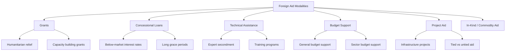

## Development Diplomacy and Foreign Aid

### Definition and Scope

Development diplomacy is the use of foreign aid, development finance, and technical cooperation as instruments of statecraft — pursuing donor-country foreign policy goals (influence, security, market access, normative alignment) alongside stated humanitarian and developmental objectives in recipient countries. Foreign aid is the operational currency of this diplomacy, delivered as Official Development Assistance (ODA), concessional loans, technical assistance, or in-kind support.

**Key Points**

- Development diplomacy differs from pure humanitarianism in that it is explicitly instrumentalized within broader foreign policy strategy.
- ODA is formally defined and tracked by the OECD's Development Assistance Committee (DAC), which sets eligibility criteria (concessionality thresholds, recipient country lists).
- Aid can be bilateral (state-to-state) or multilateral (channeled through institutions like the World Bank, UN agencies, or regional development banks).

### Historical Development

Modern development diplomacy traces to the post-WWII Marshall Plan (1948), which fused reconstruction aid with strategic containment of Soviet influence in Western Europe. The Cold War period (1950s–1980s) saw aid become a central instrument of superpower competition, with the US, USSR, and later China courting non-aligned states through infrastructure and military assistance. The 1990s–2000s shifted rhetoric toward poverty reduction (Millennium Development Goals, 2000) and aid effectiveness (Paris Declaration, 2005; Busan Partnership, 2011). The 2010s–2020s have seen renewed strategic competition, particularly around China's Belt and Road Initiative (BRI) and Western responses such as the G7's Partnership for Global Infrastructure and Investment (PGII) and the EU's Global Gateway.

### Core Actors and Institutional Architecture

**Key Points**

- **Bilateral Aid Agencies**: USAID (United States), FCDO (United Kingdom, merged with DFID in 2020), JICA (Japan), GIZ (Germany), AFD (France).
- **Multilateral Development Banks (MDBs)**: World Bank Group (IBRD, IDA, IFC), regional counterparts (ADB, AfDB, IDB, EBRD).
- **UN Development System**: UNDP, UNICEF, WFP, and specialized agencies coordinating technical cooperation and humanitarian response.
- **OECD Development Assistance Committee (DAC)**: Sets ODA reporting standards and tracks donor performance against the 0.7% GNI aid target (agreed 1970, met by only a handful of donors).
- **Emerging/Non-DAC Donors**: China (via China Development Bank, Export-Import Bank of China), Gulf states (Saudi Fund for Development, Kuwait Fund), India, and others operating outside traditional DAC reporting frameworks.

### The Aid Modalities Spectrum

### Strategic Functions of Aid in Diplomacy

**Key Points**

- **Influence-building**: Aid used to secure diplomatic alignment (UN voting behavior, basing rights, resource access).
- **Soft power projection**: Visible infrastructure and humanitarian projects build favorable national image (a core Joseph Nye soft power mechanism).
- **Conditionality and leverage**: Aid tied to governance reforms, human rights benchmarks, or policy alignment (structural adjustment programs historically; contemporary governance conditionalities).
- **Commercial linkage**: "Tied aid" requiring procurement from donor-country firms, blending development diplomacy with commercial diplomacy.
- **Crisis and stabilization tool**: Rapid humanitarian aid deployment as a diplomatic signal during disasters or conflict.

[Inference] The degree to which aid conditionality actually produces durable governance reform versus superficial compliance is contested in the development economics literature, with mixed empirical findings across country contexts.

### Tied vs. Untied Aid

| Dimension | Tied Aid | Untied Aid |
| --- | --- | --- |
| Procurement | Restricted to donor-country goods/services | Open international competitive bidding |
| Cost efficiency | Generally lower (OECD estimates 15–30% cost premium) | Generally higher |
| Donor commercial benefit | High | Low |
| DAC policy stance | Discouraged since 2001 Recommendation on Untying ODA | Encouraged |
| Prevalence | Declining among DAC members; common among non-DAC donors | Majority of DAC-reported ODA |

### Comparative Model: Traditional DAC Aid vs. China's Development Finance

**Key Points**

- **Transparency and reporting**: DAC donors report through standardized OECD statistical systems (CRS - Creditor Reporting System); China's overseas lending is tracked primarily through independent research initiatives (e.g., AidData at William & Mary) rather than official multilateral disclosure.
- **Conditionality type**: DAC aid often carries governance/human rights conditions; Chinese state financing has historically emphasized non-interference in domestic political affairs, with commercial/collateral conditions (resource-backed loans) instead.
- **Instrument mix**: DAC donors favor grants and concessional IDA-style loans; Chinese finance leans toward non-concessional, market-rate-adjacent loans through policy banks, often bundled with state-owned enterprise construction contracts.
- **Debt sustainability debate**: The "debt-trap diplomacy" framing of Chinese lending is widely used in Western policy discourse but is disputed by researchers who find more heterogeneous outcomes across cases (Sri Lanka's Hambantota Port is the most-cited example; empirical generalization beyond it is debated).

[Unverified] Whether "debt-trap diplomacy" constitutes a deliberate strategic pattern versus a byproduct of weak due diligence and recipient-country fiscal mismanagement remains an actively disputed empirical question among China-development finance researchers.

### Aid Effectiveness Frameworks

**Key Points**

- **Paris Declaration on Aid Effectiveness (2005)**: Established five principles — ownership, alignment, harmonization, managing for results, mutual accountability.
- **Accra Agenda for Action (2008)**: Reinforced Paris principles, added predictability and country systems use.
- **Busan Partnership for Effective Development Cooperation (2011)**: Broadened the framework to include non-DAC actors, private sector, and civil society; shifted terminology from "aid effectiveness" to "development effectiveness."
- **Sustainable Development Goals (SDGs, 2015)**: Reframed aid within a universal 17-goal agenda extending beyond traditional poverty metrics.

### Measurement and Evaluation

Standard metrics used to evaluate development diplomacy outcomes:

- **ODA/GNI ratio**: Tracks donor commitment against the 0.7% UN target.
- **Aid predictability index**: Measures gap between committed and disbursed aid over time.
- **Recipient government ownership indicators**: Proportion of aid channeled through country public financial management systems vs. parallel donor structures.
- **Results-based indicators**: Health/education/infrastructure outcome metrics tied to specific program logic models (logframes, Theory of Change).

$$\text{ODA Ratio} = \frac{\text{Net ODA Disbursed}}{\text{Gross National Income}} \times 100$$

### Diagram: Development Diplomacy Flow

<svg xmlns="http://www.w3.org/2000/svg" viewBox="0 0 800 450">
<text x="400" y="30" font-size="18" font-weight="bold" text-anchor="middle" fill="#1a1a1a">Development Diplomacy Flow (svg_diagram)</text>
<rect x="40" y="80" width="180" height="80" rx="8" fill="#2c5f8a" stroke="#1a1a1a" stroke-width="2" />
<text x="130" y="115" font-size="13" text-anchor="middle" fill="#fff">Donor Government</text>
<text x="130" y="135" font-size="12" text-anchor="middle" fill="#fff">(Foreign Ministry /</text>
<text x="130" y="152" font-size="12" text-anchor="middle" fill="#fff">Aid Agency)</text>
<rect x="310" y="80" width="180" height="80" rx="8" fill="#3d8361" stroke="#1a1a1a" stroke-width="2" />
<text x="400" y="115" font-size="13" text-anchor="middle" fill="#fff">Multilateral</text>
<text x="400" y="135" font-size="12" text-anchor="middle" fill="#fff">Channel</text>
<text x="400" y="152" font-size="12" text-anchor="middle" fill="#fff">(MDB / UN Agency)</text>
<rect x="580" y="80" width="180" height="80" rx="8" fill="#a8763e" stroke="#1a1a1a" stroke-width="2" />
<text x="670" y="115" font-size="13" text-anchor="middle" fill="#fff">Recipient</text>
<text x="670" y="135" font-size="12" text-anchor="middle" fill="#fff">Government /</text>
<text x="670" y="152" font-size="12" text-anchor="middle" fill="#fff">Implementing Body</text>
<line x1="220" y1="120" x2="310" y2="120" stroke="#555" stroke-width="2" marker-end="url(#arrow)" />
<line x1="490" y1="120" x2="580" y2="120" stroke="#555" stroke-width="2" marker-end="url(#arrow)" />
<line x1="130" y1="160" x2="670" y2="160" stroke="#999" stroke-width="1.5" stroke-dasharray="4,4" />
<text x="400" y="185" font-size="11" text-anchor="middle" fill="#777">Direct bilateral channel (bypassing multilateral)</text>
<rect x="220" y="260" width="360" height="100" rx="8" fill="#7a3e8a" stroke="#1a1a1a" stroke-width="2" />
<text x="400" y="295" font-size="13" text-anchor="middle" fill="#fff">Diplomatic Returns to Donor</text>
<text x="400" y="318" font-size="12" text-anchor="middle" fill="#fff">Influence · Soft Power · Voting Alignment</text>
<text x="400" y="338" font-size="12" text-anchor="middle" fill="#fff">Market Access · Security Cooperation</text>
<line x1="670" y1="160" x2="500" y2="260" stroke="#555" stroke-width="2" marker-end="url(#arrow)" />
</svg>

### Practical Example: Vaccine Diplomacy During a Health Crisis

A donor country facing a global health emergency donates vaccine doses directly to a recipient government rather than routing exclusively through the multilateral COVAX-style mechanism. The bilateral delivery is accompanied by a high-visibility diplomatic event (flag-branded shipment, joint press statement), generating immediate soft power returns distinct from the slower, less visible multilateral channel. This dual-track pattern — participating in multilateral pooling while also running parallel bilateral bilateral channels for visibility — is a recurring feature of contemporary development diplomacy observed during the COVID-19 pandemic vaccine rollout.

**Key Points**

- Bilateral channels maximize diplomatic visibility and attribution.
- Multilateral channels maximize perceived neutrality and equitable distribution, but dilute donor-specific credit.
- States frequently pursue both simultaneously to balance these tradeoffs.

### Contemporary Challenges

- **Aid fragmentation**: Proliferation of donors and earmarked funding streams increasing recipient-country transaction costs.
- **Securitization of aid**: Post-9/11 and renewed great-power competition trends toward framing aid explicitly around security objectives (counterterrorism, migration control).
- **Climate finance overlap**: Blurring lines between traditional ODA and climate adaptation/mitigation finance commitments (e.g., the $100 billion/year climate finance pledge under the UNFCCC).
- **Domestic political backlash**: Aid budget cuts in several major donor states (e.g., significant USAID restructuring and UK ODA reductions in the 2020s) creating diplomatic credibility gaps.
- **Private capital mobilization**: Shift toward blended finance models using ODA to de-risk private investment rather than fund projects directly.

### Related Topics

- Soft Power and Public Diplomacy
- China's Belt and Road Initiative: Strategic Analysis
- Multilateral Development Bank Governance (World Bank, IMF)
- Humanitarian Diplomacy and Crisis Response Coordination
- Blended Finance and Development Impact Bonds
- Debt Sustainability Analysis in Developing Economies
- Sanctions, Aid Conditionality, and Coercive Economic Diplomacy
- Sustainable Development Goals (SDGs) Monitoring Frameworks