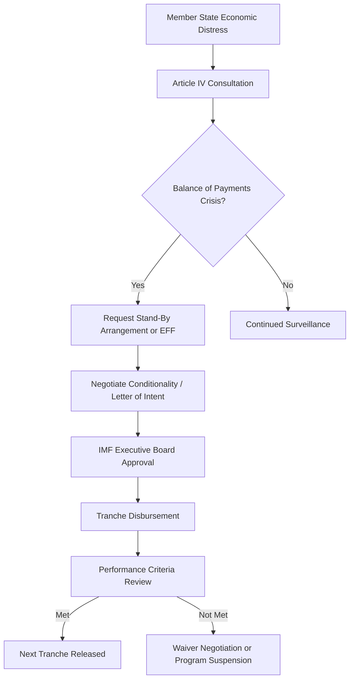

## International Financial Institutions

### Definition and Scope

International Financial Institutions (IFIs) are multilateral organizations established by treaty or intergovernmental agreement to provide financial and technical support for economic development, monetary stability, and crisis management across member states. They serve as key venues and instruments of economic diplomacy, translating collective state action into lending, surveillance, and standard-setting functions that individual states cannot achieve unilaterally.

**Key Points**

- IFIs are distinct from private international banks in that they are owned and governed by member states, typically through weighted voting or shareholding structures.
- The category includes global institutions (IMF, World Bank Group), regional development banks (ADB, AfDB, IDB, EBRD), and specialized/newer entities (AIIB, NDB).
- IFIs function simultaneously as technical financial bodies and as diplomatic arenas where great-power competition, coalition-building, and normative contestation occur.

### Historical Development

The Bretton Woods Conference (July 1944) established the IMF and the International Bank for Reconstruction and Development (IBRD, now part of the World Bank Group), designed to prevent a repeat of the competitive devaluations and financial instability of the interwar period. The original Bretton Woods system pegged currencies to the US dollar (convertible to gold), which collapsed in 1971 (the "Nixon Shock"), after which the IMF's role shifted toward surveillance, balance-of-payments support, and structural adjustment lending. Regional development banks emerged later — the IDB (1959), ADB (1966), AfDB (1964), EBRD (1991, post-Soviet transition) — reflecting decolonization and regional integration dynamics. The 2010s saw a new wave of institution-building led by emerging powers, notably China's Asian Infrastructure Investment Bank (AIIB, 2016) and the BRICS-founded New Development Bank (NDB, 2015), widely interpreted as responses to perceived underrepresentation in existing governance structures.

### Core Institutional Landscape

**Key Points**

- **International Monetary Fund (IMF)**: 191 member states; focuses on macroeconomic surveillance, balance-of-payments crisis lending, and technical assistance on fiscal/monetary policy.
- **World Bank Group**: Comprises IBRD (middle-income lending), IDA (concessional lending to low-income countries), IFC (private sector investment), MIGA (political risk insurance), and ICSID (investment dispute arbitration).
- **Regional Development Banks**: Asian Development Bank (ADB), African Development Bank (AfDB), Inter-American Development Bank (IDB), European Bank for Reconstruction and Development (EBRD).
- **Newer Multilateral Entities**: Asian Infrastructure Investment Bank (AIIB, headquartered in Beijing), New Development Bank (NDB, headquartered in Shanghai, founded by Brazil, Russia, India, China, South Africa).
- **Bank for International Settlements (BIS)**: The "central bank of central banks," focused on monetary and financial stability cooperation rather than development lending.

### Governance Structures and Voting Power

IFI governance is a central point of diplomatic contestation because voting shares typically correlate with capital contribution (quota), which in turn shapes influence over lending decisions and leadership selection.

| Institution | Governance Basis | Notable Feature |
| --- | --- | --- |
| IMF | Quota-based voting, reviewed periodically | US retains effective veto power over major decisions requiring 85% supermajority (holds ~16-17% of votes) |
| World Bank | Shareholding-based voting | Traditionally headed by a US national (informal convention) |
| AIIB | Capital subscription-based, weighted toward founding members | China holds largest voting share; explicitly designed with lower entry barriers for developing members |
| NDB | Equal shareholding among BRICS founders | Departure from capital-weighted model; explicit equality framing |
| EBRD | Shareholding-based | Mandate tied to transition-economy criteria, expanded scope in 2010s |

[Inference] The design of newer institutions like the NDB and AIIB to feature different governance models (equal shareholding, faster approval processes) reflects an explicit diplomatic strategy of positioning them as alternatives to perceived governance deficits in the Bretton Woods institutions, though the actual practical divergence in lending behavior compared to established IFIs is still debated among researchers.

### IMF Lending and Surveillance Architecture

**Key Points**

- **Article IV Consultations**: Annual bilateral surveillance of every member's economic policies, a core diplomatic touchpoint even absent crisis lending.
- **Conditionality**: IMF loans are typically tied to policy reforms (fiscal consolidation, monetary tightening, structural reforms), historically controversial for social and political costs in recipient states.
- **Special Drawing Rights (SDRs)**: The IMF's own reserve asset, allocated to members to supplement official reserves; SDR allocations (e.g., the 2021 $650 billion allocation) function as a diplomatic tool for global liquidity support without traditional conditionality.

### World Bank Lending Instruments

**Key Points**

- **Investment Project Financing (IPF)**: Traditional project-based lending for specific infrastructure, health, or education initiatives.
- **Development Policy Financing (DPF)**: Budget support tied to policy and institutional reform commitments, successor to earlier structural adjustment lending.
- **IDA Concessional Lending**: Interest-free or low-interest credits and grants for the world's poorest countries, replenished periodically through donor pledging rounds (IDA replenishment cycles).
- **IFC Private Sector Investment**: Equity and debt financing for private enterprises in developing markets, distinguishing it from the Bank's sovereign-lending arms.

### IFIs as Diplomatic Arenas

**Key Points**

- **Leadership selection politics**: Informal conventions (US nominates World Bank President, Europe nominates IMF Managing Director) have faced growing criticism from emerging economies as inconsistent with shifting global economic weight.
- **Quota and voting reform negotiations**: Periodic IMF quota reviews are prolonged diplomatic negotiations balancing legitimacy concerns against incumbent power preservation.
- **Coalition formation**: Regional blocs and voting groups (e.g., G24 representing developing country interests) coordinate positions within IFI governance structures.
- **Sanctions and exclusion**: IFI membership suspension or lending restriction can function as a diplomatic sanction tool (e.g., restricted lending to states under certain UN sanctions regimes).
- **Competitive institution-building**: The creation of parallel institutions (AIIB, NDB) as a diplomatic signal of dissatisfaction with existing governance, while in practice often complementing rather than fully substituting for Bretton Woods institutions.

### Comparative Snapshot: Bretton Woods vs. Emerging Multilateral Banks

| Dimension | IMF / World Bank | AIIB / NDB |
| --- | --- | --- |
| Founding era | 1944 | 2015-2016 |
| Dominant shareholder influence | US / Western Europe | China (AIIB) / Equal BRICS shares (NDB) |
| Conditionality approach | Extensive policy conditionality historically | Marketed as more streamlined, less politically conditional |
| Primary sectoral focus | Broad (macro stability, poverty reduction, sectoral development) | Infrastructure-heavy |
| Membership breadth | Near-universal | Growing but more limited (though AIIB has expanded significantly beyond Asia) |

[Unverified] Claims that AIIB and NDB lending is meaningfully less conditional or more efficient in practice than comparable Bretton Woods lending are disputed; some comparative studies find substantial procedural similarity once the institutions matured, while others note genuine differences in approval speed for infrastructure projects specifically.

### Crisis Response Case Pattern

A recurring diplomatic sequence during sovereign debt or balance-of-payments crises:

1. **Bilateral warning signs** — deteriorating reserves or currency pressure prompt informal diplomatic contact between the distressed state and IMF staff.
2. **Formal program request** — the government requests a Stand-By Arrangement (SBA) or Extended Fund Facility (EFF).
3. **Negotiation of conditionality** — often accompanied by parallel bilateral diplomatic engagement from major shareholder states with strategic interests in the outcome.
4. **Debt restructuring coordination** — where sovereign debt is unsustainable, IMF program approval is frequently coordinated with the Paris Club (official bilateral creditors) and, increasingly, non-Paris Club creditors like China under initiatives such as the G20 Common Framework for Debt Treatment.

**Example**

A country facing a currency crisis approaches the IMF for an EFF program. Because a significant share of its external debt is held bilaterally by a non-Paris Club creditor, IMF program approval is delayed pending "financing assurances" — a diplomatic negotiation process requiring that major creditor to commit to debt treatment terms before the IMF Executive Board will approve disbursement. This illustrates how IFI technical lending processes are frequently gated by underlying bilateral diplomatic negotiations among creditor states.

### Diagram: IFI Governance and Influence Map

<svg xmlns="http://www.w3.org/2000/svg" viewBox="0 0 800 480">
<text x="400" y="30" font-size="18" font-weight="bold" text-anchor="middle" fill="#1a1a1a">IFI Governance and Influence Map (svg_diagram)</text>
<circle cx="400" cy="240" r="75" fill="#2c5f8a" stroke="#1a1a1a" stroke-width="2" />
<text x="400" y="235" font-size="13" text-anchor="middle" fill="#fff">IMF /</text>
<text x="400" y="252" font-size="13" text-anchor="middle" fill="#fff">World Bank</text>
<rect x="40" y="90" width="160" height="70" rx="8" fill="#3d8361" stroke="#1a1a1a" stroke-width="2" />
<text x="120" y="120" font-size="12" text-anchor="middle" fill="#fff">Major Shareholder</text>
<text x="120" y="140" font-size="12" text-anchor="middle" fill="#fff">States (US, EU, JP)</text>
<rect x="600" y="90" width="160" height="70" rx="8" fill="#a8763e" stroke="#1a1a1a" stroke-width="2" />
<text x="680" y="120" font-size="12" text-anchor="middle" fill="#fff">Emerging Powers</text>
<text x="680" y="140" font-size="12" text-anchor="middle" fill="#fff">(voting reform push)</text>
<rect x="40" y="360" width="160" height="70" rx="8" fill="#7a3e8a" stroke="#1a1a1a" stroke-width="2" />
<text x="120" y="390" font-size="12" text-anchor="middle" fill="#fff">Borrowing /</text>
<text x="120" y="410" font-size="12" text-anchor="middle" fill="#fff">Recipient States</text>
<rect x="600" y="360" width="160" height="70" rx="8" fill="#8a3e3e" stroke="#1a1a1a" stroke-width="2" />
<text x="680" y="390" font-size="12" text-anchor="middle" fill="#fff">Parallel Institutions</text>
<text x="680" y="410" font-size="12" text-anchor="middle" fill="#fff">(AIIB, NDB)</text>
<line x1="200" y1="140" x2="335" y2="210" stroke="#555" stroke-width="2" />
<line x1="600" y1="140" x2="465" y2="210" stroke="#555" stroke-width="2" />
<line x1="200" y1="380" x2="335" y2="280" stroke="#555" stroke-width="2" />
<line x1="600" y1="380" x2="465" y2="270" stroke="#555" stroke-width="2" stroke-dasharray="5,5" />
<text x="680" y="345" font-size="10" text-anchor="middle" fill="#777">competitive/complementary</text>
</svg>

### Contemporary Challenges

- **Quota reform stagnation**: IMF quota reviews have repeatedly fallen short of fully rebalancing voting shares toward emerging-economy GDP weight, sustaining legitimacy criticisms.
- **Debt architecture gaps**: The rise of non-Paris Club bilateral creditors (particularly China) complicates coordinated debt restructuring, motivating the G20 Common Framework, which has faced implementation delays in practice.
- **Climate finance integration**: Growing pressure on MDBs to align lending portfolios with climate mitigation/adaptation goals while maintaining core development mandates (the "MDB reform agenda" debated at G20 and COP forums since the early 2020s).
- **Capital adequacy and balance sheet optimization**: Post-2022 reform discussions (echoing recommendations from the G20-commissioned Capital Adequacy Framework review) on how MDBs can expand lending capacity without new capital injections.
- **Geopolitical fragmentation risk**: Concerns that competing institutional ecosystems (Bretton Woods vs. China-led alternatives) could reduce coordinated global crisis response capacity.

### Related Topics

- IMF Conditionality and Structural Adjustment: Historical and Contemporary Debates
- Sovereign Debt Restructuring and the Paris Club / G20 Common Framework
- China's AIIB and NDB: Strategic Motivations and Institutional Design
- Special Drawing Rights (SDRs) and Global Liquidity Management
- Multilateral Development Bank Capital Adequacy Reform
- G7, G20, and BRICS as Economic Diplomacy Coordination Platforms
- Central Bank Cooperation and the Bank for International Settlements (BIS)
- Climate Finance and Just Transition Lending Frameworks