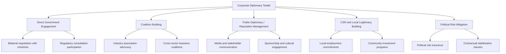

## Corporate and Business Diplomacy

### Definition and Scope

Corporate and business diplomacy refers to the deliberate cultivation of relationships, influence, and legitimacy by multinational enterprises (MNEs) with governments, international organizations, civil society, and other non-market stakeholders, in order to manage political risk, secure operating conditions, and shape the regulatory environments in which they operate. It is the mirror image of state-led commercial diplomacy: where states use diplomatic tools to advance firms' interests, firms increasingly conduct diplomacy-like activity on their own behalf, particularly when operating across jurisdictions with weak governance, contested politics, or fragmented regulatory authority.

**Key Points**

- Corporate diplomacy is distinct from conventional lobbying in that it is typically longer-horizon, relationship-based, and oriented toward maintaining a broad "social license to operate" rather than securing a single legislative outcome.
- The practice draws on international relations theory (particularly stakeholder theory and non-market strategy) rather than classical interstate diplomacy, but employs comparable tools: negotiation, coalition-building, public diplomacy, and track-two engagement.
- Large MNEs — especially in extractives, technology, and finance — increasingly maintain dedicated "government affairs," "geopolitical risk," or "corporate diplomacy" functions structurally analogous to a small foreign ministry.

### Historical Development

Corporate engagement with foreign governments has existed since chartered trading companies (the British and Dutch East India Companies) exercised quasi-sovereign diplomatic and military functions in the 17th–19th centuries. The modern, non-coercive form of corporate diplomacy emerged in the postwar era as MNEs expanded into decolonizing states and had to navigate nationalization risk, negotiating directly with new governments over resource concessions and operating terms. The field gained academic and practitioner recognition from the 1990s onward, associated with scholars like Huub Ruël and John Zerio, who formalized "corporate diplomacy" as a distinct discipline addressing how firms manage relationships with foreign publics and governments beyond traditional public affairs. The 2000s–2020s saw the rise of ESG (environmental, social, governance) frameworks, stakeholder capitalism debates, and heightened geopolitical fragmentation (US-China tech competition, sanctions regimes) that pushed corporate diplomacy from a niche extractives-sector practice into a mainstream function across technology, finance, and manufacturing sectors.

### Core Functions and Actors

**Key Points**

- **Government Affairs / Public Affairs Units**: Manage direct engagement with legislators, regulators, and executive agencies in host and home countries.
- **Corporate Political Risk / Geopolitical Risk Teams**: Assess and mitigate exposure to expropriation, sanctions, regulatory shifts, and conflict.
- **Corporate Social Responsibility (CSR) and Community Relations**: Build local legitimacy through development projects, employment commitments, and environmental stewardship — functioning as a firm-level analog to development diplomacy.
- **Industry Associations and Business Coalitions**: Aggregate firm interests for collective advocacy (e.g., US Chamber of Commerce, BusinessEurope, sector-specific bodies like the Semiconductor Industry Association).
- **Track-Two and Business Diplomacy Channels**: Informal business-to-business or business-to-government dialogues that operate alongside or ahead of formal state diplomacy (e.g., bilateral CEO councils, World Economic Forum engagements).

### Corporate Diplomacy Toolkit

### Political Risk Management Instruments

**Key Points**

- **Stabilization Clauses**: Contractual provisions in investment agreements (common in extractives) that freeze or compensate for adverse regulatory changes over a project's lifetime.
- **Political Risk Insurance (PRI)**: Coverage against expropriation, currency inconvertibility, and political violence, provided by entities like MIGA (World Bank Group), OPIC's successor DFC (US), and private insurers (e.g., Lloyd's syndicates).
- **Joint Ventures with State-Linked Partners**: Reduces expropriation risk by embedding host-government or state-owned enterprise equity stakes directly into project structure.
- **Investor-State Dispute Settlement (ISDS) Access**: Firms structure investments to qualify for treaty protection under applicable BITs, enabling recourse to international arbitration (ICSID) if diplomatic engagement fails to resolve disputes.

[Inference] The increasing use of stabilization clauses and treaty-shopping structures by MNEs reflects a broader trend of firms substituting legal/contractual protection for pure relationship-based diplomacy as political risk management has professionalized, though relationship-based engagement remains essential for day-to-day regulatory navigation.

### Corporate Diplomacy vs. Traditional Lobbying vs. State Commercial Diplomacy

| Dimension | Traditional Lobbying | Corporate Diplomacy | State Commercial Diplomacy |
| --- | --- | --- | --- |
| Primary actor | Firm or trade association | Firm (often via dedicated function) | Government ministry/agency |
| Time horizon | Short-term, issue-specific | Long-term, relationship-based | Medium-to-long term, policy-oriented |
| Target audience | Legislators/regulators | Governments, publics, civil society | Foreign governments and investors |
| Primary tool | Direct advocacy, campaign contributions (where legal) | Negotiation, CSR, coalition-building, reputation management | Treaties, trade missions, IPA facilitation |
| Legitimacy basis | Legal right to petition government | Social license to operate | Sovereign mandate |

### Sector-Specific Patterns

**Key Points**

- **Extractive Industries**: Longest-standing corporate diplomacy tradition; firms negotiate directly with host governments over concessions, royalties, and local content requirements, often engaging affected communities to secure a social license to operate.
- **Technology Sector**: Rapidly growing corporate diplomacy function driven by data governance, content regulation, antitrust scrutiny, and export control compliance (e.g., major tech firms maintaining substantial government affairs presence in Brussels, Washington, and Beijing simultaneously).
- **Financial Services**: Engagement centered on regulatory compliance diplomacy — navigating divergent capital, sanctions, and data-localization regimes across jurisdictions.
- **Defense and Dual-Use Technology**: Highly state-embedded corporate diplomacy given export control regimes (ITAR, EAR in the US context) and close government customer relationships.

### The Firm as a Quasi-Diplomatic Actor

A useful analytical frame treats large MNEs as operating a diplomatic-style apparatus in miniature:

| State Diplomacy Function | Corporate Analog |
| --- | --- |
| Embassy / Consulate | Country/regional government affairs office |
| Ambassador | Chief Government Affairs Officer / Country Manager |
| Foreign Aid | CSR programs, community investment |
| Treaty Negotiation | Investment agreements, regulatory consent decrees |
| Track-Two Diplomacy | Industry association dialogues, CEO forums |
| Intelligence/Risk Assessment | Geopolitical risk units |

[Unverified] Whether this quasi-diplomatic framing meaningfully predicts corporate behavior beyond serving as a useful descriptive analogy is not settled in the academic literature; some scholars argue firms lack the sovereign legitimacy that underpins genuine diplomatic authority, limiting the analogy's explanatory power.

### Practical Example: Market Entry Under Political Risk

A multinational firm planning entry into a resource-rich but politically volatile market conducts the following sequence, illustrating applied corporate diplomacy:

1. **Pre-entry political risk assessment** — engages specialized risk consultancies and reviews historical expropriation/nationalization patterns.
2. **Government relationship-building** — establishes direct contact with relevant ministries well before formal investment commitments, often via informal business delegations or industry association introductions.
3. **Contract structuring** — negotiates stabilization clauses and secures political risk insurance (e.g., through MIGA) to hedge against adverse regulatory shifts.
4. **Local legitimacy building** — commits to local employment quotas, community development projects, and environmental safeguards to build a social license to operate alongside the formal contractual relationship.
5. **Ongoing engagement** — maintains a permanent government affairs presence to monitor policy shifts and intervene diplomatically before disputes escalate to formal arbitration.

**Example**

A mining company entering a country with a history of resource nationalism negotiates a stabilization clause fixing the royalty rate for 15 years, simultaneously funds a local vocational training program (building community goodwill), and purchases MIGA political risk insurance covering expropriation. When a new government later proposes revising royalty terms, the firm's government affairs team — rather than immediately invoking ISDS arbitration — first pursues direct renegotiation, preserving the relationship while holding treaty-based arbitration in reserve as leverage.

### Diagram: Corporate Diplomacy Stakeholder Map

<svg xmlns="http://www.w3.org/2000/svg" viewBox="0 0 800 460">
<text x="400" y="30" font-size="18" font-weight="bold" text-anchor="middle" fill="#1a1a1a">Corporate Diplomacy Stakeholder Map (svg_diagram)</text>
<circle cx="400" cy="240" r="70" fill="#2c5f8a" stroke="#1a1a1a" stroke-width="2" />
<text x="400" y="235" font-size="13" text-anchor="middle" fill="#fff">Multinational</text>
<text x="400" y="252" font-size="13" text-anchor="middle" fill="#fff">Enterprise</text>
<rect x="50" y="80" width="170" height="70" rx="8" fill="#3d8361" stroke="#1a1a1a" stroke-width="2" />
<text x="135" y="110" font-size="12" text-anchor="middle" fill="#fff">Host Government</text>
<text x="135" y="130" font-size="12" text-anchor="middle" fill="#fff">Ministries / Regulators</text>
<rect x="580" y="80" width="170" height="70" rx="8" fill="#a8763e" stroke="#1a1a1a" stroke-width="2" />
<text x="665" y="110" font-size="12" text-anchor="middle" fill="#fff">Home Government</text>
<text x="665" y="130" font-size="12" text-anchor="middle" fill="#fff">(Diplomatic Support)</text>
<rect x="50" y="360" width="170" height="70" rx="8" fill="#7a3e8a" stroke="#1a1a1a" stroke-width="2" />
<text x="135" y="390" font-size="12" text-anchor="middle" fill="#fff">Local Communities</text>
<text x="135" y="410" font-size="12" text-anchor="middle" fill="#fff">/ Civil Society</text>
<rect x="580" y="360" width="170" height="70" rx="8" fill="#8a3e3e" stroke="#1a1a1a" stroke-width="2" />
<text x="665" y="390" font-size="12" text-anchor="middle" fill="#fff">Industry Associations</text>
<text x="665" y="410" font-size="12" text-anchor="middle" fill="#fff">/ Peer Firms</text>
<line x1="220" y1="130" x2="345" y2="205" stroke="#555" stroke-width="2" />
<line x1="580" y1="130" x2="455" y2="205" stroke="#555" stroke-width="2" />
<line x1="220" y1="390" x2="345" y2="280" stroke="#555" stroke-width="2" />
<line x1="580" y1="390" x2="455" y2="280" stroke="#555" stroke-width="2" />
</svg>

### Contemporary Challenges

- **Geopolitical bifurcation**: Firms operating across US-China rivalry lines increasingly face incompatible compliance demands (export controls, data localization), requiring parallel diplomatic strategies for each jurisdiction.
- **ESG and stakeholder capitalism scrutiny**: Growing pressure for genuine (versus performative) community engagement, with reputational risk from perceived "greenwashing" or superficial CSR.
- **Sanctions compliance complexity**: Multinational firms must navigate diplomatically sensitive sanctions regimes (US, EU, UN) that frequently diverge, creating legal and reputational exposure.
- **Digital sovereignty and data governance**: Technology firms face mounting diplomatic pressure from multiple governments simultaneously over data localization, content moderation, and antitrust enforcement.
- **Erosion of the "apolitical corporation" norm**: Increasing societal and shareholder expectation that firms take explicit public positions on political and social issues, complicating traditional neutral corporate diplomacy postures.

### Related Topics

- Political Risk Insurance and MIGA Mechanisms
- Investor-State Dispute Settlement (ISDS) and Treaty-Based Arbitration
- ESG Frameworks and Stakeholder Capitalism
- Sanctions Compliance and Extraterritorial Regulatory Regimes
- Track-Two Diplomacy and Business-to-Business Dialogue Mechanisms
- Digital Sovereignty and Big Tech Government Relations
- Resource Nationalism and Extractive Industry Governance
- Corporate Social Responsibility as Soft Power