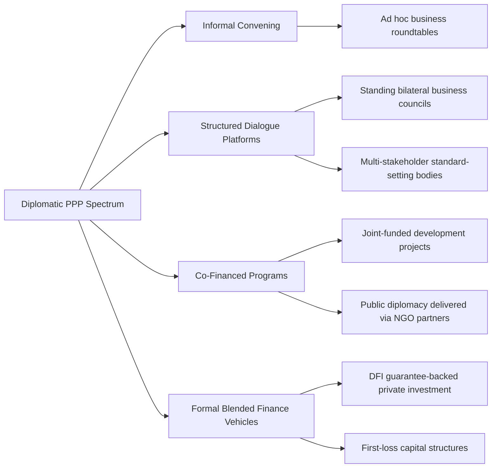

## Public-Private Partnerships in Diplomacy

### Definition and Scope

Public-private partnerships (PPPs) in diplomacy refer to structured collaborative arrangements between government diplomatic actors (foreign ministries, embassies, aid agencies) and private-sector or non-state entities (corporations, foundations, NGOs, universities) to pursue shared foreign policy, development, or commercial objectives. This differs from the general infrastructure-finance meaning of "PPP" common in public administration; in the diplomatic context, PPPs are cooperative governance arrangements that leverage private capital, expertise, or networks to extend the reach and resourcing of state diplomatic instruments.

**Key Points**

- Diplomatic PPPs span a spectrum from formal co-financed programs (e.g., blended finance development projects) to looser convening arrangements (e.g., government-private sector dialogue platforms).
- The rationale is typically resource leverage (stretching constrained aid/diplomatic budgets), expertise access (private sector technical capacity), and legitimacy (multi-stakeholder buy-in for policy initiatives).
- PPPs are distinct from corporate diplomacy (firm-led engagement with governments) in that they are explicitly co-designed and jointly governed, rather than unilateral firm-side outreach.

### Historical Development

The concept traces to broader 1990s public administration reforms favoring PPP models for domestic infrastructure delivery, which diplomatic and development actors adapted through the 2000s as aid budgets faced pressure and private capital pools grew relative to official development assistance. The UN's Global Compact (2000) formalized one of the earliest large-scale diplomatic PPP frameworks, inviting corporations to align with UN principles on human rights, labor, environment, and anti-corruption. The 2015 Addis Ababa Action Agenda on Financing for Development and the SDGs (2015) explicitly enshrined private-sector partnership as a pillar of the global development finance architecture, formalizing the shift from aid-only models toward "blended finance" combining concessional and private capital. The 2010s–2020s saw further institutionalization through vehicles like the US International Development Finance Corporation (DFC, created 2019, succeeding OPIC with expanded equity-investment authority) and the EU's Global Gateway (2021), both explicitly structured to mobilize private capital alongside diplomatic and development objectives.

### Core Institutional Forms

**Key Points**

- **Blended Finance Vehicles**: Development finance institutions (DFIs) use concessional public capital to de-risk private investment in emerging markets (first-loss guarantees, subordinated debt tranches).
- **Multi-Stakeholder Initiatives (MSIs)**: Formal platforms convening governments, firms, and civil society around shared standards (e.g., the Extractive Industries Transparency Initiative, Kimberley Process for conflict diamonds).
- **Public Diplomacy Partnerships**: Government-funded programs delivered through private or civil-society intermediaries (e.g., exchange programs, cultural diplomacy initiatives run through NGO partners).
- **Track-1.5 / Track-2 Convening Platforms**: Government-adjacent dialogues involving private sector and academic participants alongside officials (e.g., World Economic Forum sessions, bilateral business councils with government co-sponsorship).
- **Foundation-Government Collaborations**: Large philanthropic foundations (e.g., Gates Foundation) co-funding and co-designing programs with bilateral aid agencies and multilateral bodies.

### PPP Structuring Spectrum in Diplomacy

### Blended Finance Mechanics

Blended finance is the most technically structured form of diplomatic PPP, combining official development finance with private capital to fund projects that would not attract private investment on market terms alone.

**Key Points**

- **First-Loss Capital**: Public or philanthropic capital absorbs initial losses, reducing effective risk for private co-investors.
- **Guarantees**: DFIs (e.g., US DFC, MIGA) issue partial credit or political risk guarantees to reduce private lender exposure.
- **Technical Assistance Facilities**: Grant-funded advisory support paired with investment to improve project bankability.
- **Results-Based Financing**: Payment tied to verified development outcomes rather than input disbursement, aligning private investor incentives with development goals.

$$\text{Leverage Ratio} = \frac{\text{Private Capital Mobilized}}{\text{Public/Concessional Capital Committed}}$$

[Inference] Blended finance leverage ratios reported by DFIs and multilateral development banks vary substantially by sector and instrument type; aggregate industry-wide averages should be treated cautiously since methodology for counting "mobilized" private capital differs across reporting institutions.

### Comparative Model: Diplomatic PPP Types

| Type | Example | Primary Government Role | Primary Private Role |
| --- | --- | --- | --- |
| Blended finance vehicle | US DFC co-investment in emerging market infrastructure | Risk absorption, capital provision | Capital deployment, project execution |
| Multi-stakeholder standard body | Extractive Industries Transparency Initiative (EITI) | Convening, regulatory backing | Compliance, transparency reporting |
| Public diplomacy delivery partner | State-funded cultural exchange run via NGO | Funding, strategic direction | Program delivery, local relationships |
| Standing business council | Bilateral Chamber of Commerce with government patronage | Diplomatic endorsement, market access facilitation | Business-to-business matchmaking |
| Track-1.5 convening platform | World Economic Forum regional dialogues | Informal policy signaling | Agenda-setting, informal negotiation space |

### Governance and Accountability Considerations

**Key Points**

- **Legitimacy tension**: Private actors participating in diplomatic PPPs are not democratically accountable in the way state diplomatic actors formally are, raising governance questions about whose interests such partnerships ultimately serve.
- **Capture risk**: Close PPP integration can create conflicts of interest where private partners shape policy outcomes disproportionate to their stakeholder standing.
- **Additionality requirement**: A core design principle in blended finance is that public capital should fund only what would not otherwise attract private investment ("additionality"), avoiding subsidization of already-viable private projects.
- **Measurement and reporting standards**: OECD DAC and the Development Finance Institutions' harmonized methodology attempt to standardize how "mobilized private finance" is counted, though inconsistencies persist across reporting institutions.

[Unverified] The extent to which additionality is rigorously verified in practice, versus asserted post hoc to justify already-planned public capital deployment, is a subject of ongoing methodological debate among development finance researchers and is not uniformly resolved across institutions.

### Practical Example: Infrastructure PPP as Diplomatic Instrument

A donor government's development finance institution partners with a private infrastructure firm and a multilateral development bank to fund a renewable energy project in a strategically significant developing country, structured as follows:

1. **Government diplomatic framing** — the project is announced during a bilateral state visit, embedding it within a broader strategic partnership narrative (e.g., countering a rival power's competing infrastructure offer).
2. **Risk-sharing structure** — the DFI provides a political risk guarantee and subordinated debt tranche; the private firm provides equity and technical execution capacity; the multilateral bank provides senior debt.
3. **Local stakeholder engagement** — a technical assistance grant funds community consultation and environmental compliance work, managed jointly by government aid personnel and the private firm's sustainability team.
4. **Diplomatic follow-through** — project milestones are used as touchpoints for ongoing bilateral diplomatic engagement (ministerial visits, joint press events at groundbreaking and completion).

**Example**

This pattern closely mirrors initiatives under frameworks like the G7's Partnership for Global Infrastructure and Investment (PGII) and the EU's Global Gateway, both explicitly designed to combine diplomatic signaling, DFI risk capital, and private execution capacity as a coordinated alternative to purely state-financed infrastructure diplomacy models.

### Diagram: Diplomatic PPP Structure

<svg xmlns="http://www.w3.org/2000/svg" viewBox="0 0 800 460">
<text x="400" y="30" font-size="18" font-weight="bold" text-anchor="middle" fill="#1a1a1a">Diplomatic PPP Structure (svg_diagram)</text>
<rect x="40" y="90" width="200" height="90" rx="8" fill="#2c5f8a" stroke="#1a1a1a" stroke-width="2" />
<text x="140" y="125" font-size="13" text-anchor="middle" fill="#fff">Government / DFI</text>
<text x="140" y="145" font-size="12" text-anchor="middle" fill="#fff">Guarantees,</text>
<text x="140" y="163" font-size="12" text-anchor="middle" fill="#fff">First-Loss Capital</text>
<rect x="300" y="90" width="200" height="90" rx="8" fill="#3d8361" stroke="#1a1a1a" stroke-width="2" />
<text x="400" y="125" font-size="13" text-anchor="middle" fill="#fff">Multilateral Bank</text>
<text x="400" y="145" font-size="12" text-anchor="middle" fill="#fff">Senior Debt,</text>
<text x="400" y="163" font-size="12" text-anchor="middle" fill="#fff">Technical Standards</text>
<rect x="560" y="90" width="200" height="90" rx="8" fill="#a8763e" stroke="#1a1a1a" stroke-width="2" />
<text x="660" y="125" font-size="13" text-anchor="middle" fill="#fff">Private Firm</text>
<text x="660" y="145" font-size="12" text-anchor="middle" fill="#fff">Equity, Execution,</text>
<text x="660" y="163" font-size="12" text-anchor="middle" fill="#fff">Technical Capacity</text>
<rect x="300" y="300" width="200" height="90" rx="8" fill="#7a3e8a" stroke="#1a1a1a" stroke-width="2" />
<text x="400" y="335" font-size="13" text-anchor="middle" fill="#fff">Joint Project</text>
<text x="400" y="355" font-size="12" text-anchor="middle" fill="#fff">(e.g., Infrastructure,</text>
<text x="400" y="373" font-size="12" text-anchor="middle" fill="#fff">Development Program)</text>
<line x1="140" y1="180" x2="360" y2="300" stroke="#555" stroke-width="2" />
<line x1="400" y1="180" x2="400" y2="300" stroke="#555" stroke-width="2" />
<line x1="660" y1="180" x2="440" y2="300" stroke="#555" stroke-width="2" />

<text x="400" y="430" font-size="11" text-anchor="middle" fill="#777" font-style="italic">Risk-sharing tripartite structure with diplomatic framing overlay</text>

</svg>

### Contemporary Challenges

- **Competitive infrastructure diplomacy**: PPP-based initiatives (PGII, Global Gateway) are explicitly framed as responses to state-led alternatives such as China's Belt and Road Initiative, raising questions about whether PPP structures can match the speed and scale of purely state-financed competitors.
- **Standardization gaps**: Lack of universally accepted methodology for measuring "mobilized" private capital undermines cross-program comparability and accountability.
- **Civil society scrutiny**: NGOs and watchdog groups increasingly scrutinize diplomatic PPPs for insufficient transparency around private partner selection and benefit distribution.
- **Private sector risk appetite volatility**: Private capital mobilization is procyclical and sensitive to broader market conditions, creating unreliability in PPP-dependent diplomatic initiatives during downturns.
- **Coordination complexity**: Multi-actor governance (government, DFI, multilateral bank, private firm, local government) increases transaction costs and slows project execution relative to simpler bilateral aid delivery.

### Related Topics

- Blended Finance and Development Impact Bonds
- G7 Partnership for Global Infrastructure and Investment (PGII) vs. Belt and Road Initiative
- Development Finance Institutions and Political Risk Guarantees
- Multi-Stakeholder Governance Initiatives (EITI, Kimberley Process)
- Corporate and Business Diplomacy
- Track-Two Diplomacy and Informal Convening Platforms
- Development Diplomacy and Foreign Aid
- Sustainable Development Goals (SDGs) Financing Architecture