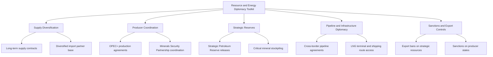

## Resource and Energy Diplomacy

### Definition and Scope

Resource and energy diplomacy is the conduct of foreign policy and international negotiation aimed at securing access to, controlling the flow of, or leveraging strategic natural resources — principally hydrocarbons (oil, natural gas), critical minerals, and increasingly water and food commodities — as instruments of national power. It encompasses both supply-security diplomacy (importing states seeking reliable access) and leverage diplomacy (resource-rich or transit states using control over supply as strategic influence).

**Key Points**

- Energy diplomacy traditionally centers on oil and gas; resource diplomacy has expanded significantly to cover critical minerals essential for the energy transition (lithium, cobalt, rare earth elements, copper, nickel).
- The field operates simultaneously at the level of state-to-state negotiation, multilateral cartel/producer coordination (OPEC+), and increasingly private-sector-mediated supply chain diplomacy.
- Resource diplomacy is closely intertwined with development diplomacy and commercial diplomacy, since resource extraction agreements frequently combine investment terms with broader strategic partnership frameworks.

### Historical Development

Modern energy diplomacy crystallized around the 1973 oil crisis, when Arab OPEC members imposed an oil embargo on states supporting Israel during the Yom Kippur War, quadrupling oil prices and demonstrating hydrocarbon supply as a coercive diplomatic instrument for the first time at global scale. This prompted the creation of the International Energy Agency (IEA, 1974) among OECD importing states to coordinate strategic petroleum reserves and demand-response mechanisms. The 1990s–2000s saw energy diplomacy expand with post-Soviet pipeline politics (Caspian and Central Asian energy corridors) and China's accelerating resource-security diplomacy in Africa and Latin America. The 2010s–2020s marked a decisive shift toward critical minerals diplomacy, driven by the electric vehicle and renewable energy transition's dependence on lithium, cobalt, and rare earths, alongside renewed hydrocarbon leverage dynamics following Russia's 2022 invasion of Ukraine and the subsequent European energy security crisis.

### Core Institutional Architecture

**Key Points**

- **OPEC and OPEC+**: Cartel-like coordination among oil-exporting states (OPEC founded 1960; OPEC+ expanded coordination with Russia and other non-OPEC producers from 2016) to manage production quotas and influence global prices.
- **International Energy Agency (IEA)**: Importer-state coordination body maintaining strategic petroleum reserves and energy market surveillance among (primarily OECD) member states.
- **International Energy Forum (IEF)**: Broader producer-consumer dialogue platform bridging OPEC and IEA perspectives.
- **Critical minerals coalitions**: Newer groupings such as the Minerals Security Partnership (MSP, launched 2022 by the US and partner states) coordinating supply chain diversification away from concentrated sources.
- **Bilateral resource diplomacy units**: Foreign ministries and specialized agencies (e.g., US State Department's Bureau of Energy Resources) dedicated to energy/resource-focused diplomatic engagement.

### Energy Diplomacy Toolkit

### Hydrocarbon Diplomacy Mechanics

**Key Points**

- **Producer cartel coordination**: OPEC+ production quota negotiations function as recurring high-stakes diplomatic events, with individual member compliance monitored and occasionally contested (e.g., historical disputes over Saudi-Russia coordination during price wars).
- **Pipeline politics**: Cross-border pipeline routing decisions (e.g., historical Nord Stream disputes, Caspian pipeline corridor competition) function as long-horizon geopolitical instruments, since pipeline infrastructure creates multi-decade dependency relationships.
- **LNG flexibility**: The growth of liquefied natural gas (LNG) shipping has reduced pipeline-based dependency lock-in, enabling more flexible energy diplomacy compared to the fixed-infrastructure gas relationships of earlier decades.
- **Strategic reserve diplomacy**: Coordinated releases from strategic petroleum reserves (e.g., IEA member coordinated releases) function as market-stabilization and geopolitical-signaling tools during supply shocks.

[Inference] The shift toward LNG-based gas trade is generally understood to reduce the coercive leverage available through fixed pipeline infrastructure, since importing states can more readily substitute suppliers; however, LNG infrastructure (terminals, long-term contracts) still creates meaningful, if more flexible, dependency relationships that some analysts argue retain significant diplomatic leverage potential.

### Critical Minerals Diplomacy

**Key Points**

- **Supply concentration risk**: A small number of states (notably China for rare earth processing, the Democratic Republic of Congo for cobalt mining, and a handful of others for lithium) control disproportionate shares of critical mineral extraction or processing, creating acute strategic vulnerability for importing states.
- **Processing vs. extraction distinction**: Diplomatic and policy attention increasingly focuses on midstream processing capacity (where China holds particularly concentrated dominance) rather than raw extraction alone, since processing bottlenecks can constrain supply even when raw ore sources are diversified.
- **Friend-shoring and coalition building**: Initiatives like the Minerals Security Partnership explicitly aim to build diversified, allied-country supply chains as a hedge against concentrated dependency.
- **Resource nationalism responses**: Mineral-rich developing states (e.g., Indonesia's nickel export ban policies, various African cobalt/lithium producers) increasingly demand domestic value-added processing requirements as a condition of resource access, reshaping the terms of extraction diplomacy.

### Comparative Model: Oil Diplomacy vs. Critical Minerals Diplomacy

| Dimension | Oil/Gas Diplomacy | Critical Minerals Diplomacy |
| --- | --- | --- |
| Market structure | Established cartel coordination (OPEC+) | Fragmented, less formal producer coordination |
| Substitutability | Moderate (LNG flexibility, alternative crude grades) | Low to moderate, varies by mineral |
| Key chokepoint | Transport routes, pipeline infrastructure | Processing/refining capacity concentration |
| Strategic reserve mechanism | Well-established (IEA-coordinated SPRs) | Nascent, still developing (national stockpiling programs) |
| Dominant leverage actor | OPEC+ producer states | China (processing dominance), DRC (cobalt extraction) |

### Water and Food Resource Diplomacy

**Key Points**

- **Transboundary water agreements**: River basin treaties (e.g., historically the Indus Waters Treaty, Nile Basin negotiations involving the Grand Ethiopian Renaissance Dam) function as a distinct but related resource diplomacy domain given water's non-substitutable, existential character for downstream states.
- **Food security diplomacy**: Grain export restrictions and agricultural trade agreements increasingly function as strategic instruments, highlighted by disruptions to global wheat and fertilizer markets following the 2022 Russia-Ukraine conflict.
- **Overlap with climate diplomacy**: Water and food resource diplomacy increasingly intersects with climate adaptation negotiations as scarcity pressures intensify in vulnerable regions.

[Unverified] The precise degree to which water scarcity alone (versus combined with broader political and economic factors) drives interstate conflict risk is contested in the conflict-resource literature; some researchers find cooperative water-sharing arrangements more common historically than water-driven interstate war.

### Practical Example: Critical Mineral Supply Chain Diplomacy

An importing state facing acute dependency on a single foreign source for a battery-critical mineral pursues the following sequence:

1. **Vulnerability assessment** — government agencies map supply chain concentration and identify chokepoints (extraction, processing, or both).
2. **Coalition formation** — joins or initiates a minerals-focused diplomatic coalition (e.g., Minerals Security Partnership-style grouping) with allied states facing similar exposure.
3. **Bilateral resource agreements** — negotiates direct extraction/processing investment agreements with alternative resource-rich states, often bundling development finance and technical assistance as part of the package.
4. **Domestic processing capacity investment** — uses industrial policy instruments (subsidies, tax incentives) to build midstream processing capacity domestically or among allied states, reducing dependency on the dominant processor.
5. **Strategic stockpiling** — establishes or expands a national stockpile of the critical mineral as a buffer against short-term supply disruption.

**Example**

This sequence closely parallels the diplomatic and industrial policy response many Western economies have undertaken since the early 2020s regarding lithium, cobalt, and rare earth supply chains — combining new bilateral mining investment agreements in resource-rich states with domestic and allied-country processing capacity build-out, motivated explicitly by concentration risk in existing supply chains.

### Diagram: Resource Diplomacy Leverage Map

<svg xmlns="http://www.w3.org/2000/svg" viewBox="0 0 800 480">
<text x="400" y="30" font-size="18" font-weight="bold" text-anchor="middle" fill="#1a1a1a">Resource Diplomacy Leverage Map (svg_diagram)</text>
<rect x="40" y="90" width="200" height="90" rx="8" fill="#2c5f8a" stroke="#1a1a1a" stroke-width="2" />
<text x="140" y="125" font-size="13" text-anchor="middle" fill="#fff">Producer / Exporting</text>
<text x="140" y="145" font-size="12" text-anchor="middle" fill="#fff">States</text>
<text x="140" y="163" font-size="11" text-anchor="middle" fill="#cde">(OPEC+, DRC, etc.)</text>
<rect x="560" y="90" width="200" height="90" rx="8" fill="#3d8361" stroke="#1a1a1a" stroke-width="2" />
<text x="660" y="125" font-size="13" text-anchor="middle" fill="#fff">Importing / Consumer</text>
<text x="660" y="145" font-size="12" text-anchor="middle" fill="#fff">States</text>
<text x="660" y="163" font-size="11" text-anchor="middle" fill="#cde">(IEA members, allies)</text>
<rect x="300" y="90" width="200" height="90" rx="8" fill="#a8763e" stroke="#1a1a1a" stroke-width="2" />
<text x="400" y="120" font-size="13" text-anchor="middle" fill="#fff">Transit / Processing</text>
<text x="400" y="140" font-size="12" text-anchor="middle" fill="#fff">Chokepoints</text>
<text x="400" y="160" font-size="11" text-anchor="middle" fill="#eee">(pipelines, refineries)</text>
<line x1="240" y1="135" x2="300" y2="135" stroke="#555" stroke-width="2" marker-end="url(#arrow2)" />
<line x1="500" y1="135" x2="560" y2="135" stroke="#555" stroke-width="2" marker-end="url(#arrow2)" />
<rect x="300" y="320" width="200" height="90" rx="8" fill="#7a3e8a" stroke="#1a1a1a" stroke-width="2" />
<text x="400" y="355" font-size="13" text-anchor="middle" fill="#fff">Diplomatic Coalitions</text>
<text x="400" y="375" font-size="12" text-anchor="middle" fill="#fff">(IEA, MSP, OPEC+)</text>
<line x1="400" y1="180" x2="400" y2="320" stroke="#999" stroke-width="1.5" stroke-dasharray="4,4" />
</svg>

### Contemporary Challenges

- **Energy transition dependency shift**: The move from hydrocarbon to critical-mineral-based energy systems is relocating strategic dependency risk rather than eliminating it, requiring new diplomatic frameworks distinct from legacy oil/gas institutions.
- **Weaponization of interdependence**: The 2022 European gas crisis demonstrated how deeply embedded energy dependency can be rapidly weaponized during geopolitical conflict, prompting accelerated diversification efforts.
- **Resource nationalism resurgence**: Growing insistence by resource-rich developing states on domestic value-added processing and renegotiated extraction terms is reshaping the bargaining balance in resource diplomacy.
- **Coordination gaps in minerals governance**: Unlike hydrocarbons, critical minerals lack a mature equivalent to the IEA/OPEC dual institutional architecture, leaving coordination more ad hoc and coalition-based.
- **Climate policy tension**: Resource diplomacy increasingly must reconcile energy security imperatives with decarbonization commitments, creating policy tradeoffs (e.g., continued fossil fuel investment for security vs. climate targets).

### Related Topics

- OPEC+ Production Diplomacy and Oil Market Coordination
- Minerals Security Partnership and Critical Minerals Supply Chains
- Sanctions and Export Controls on Strategic Resources
- Transboundary Water Diplomacy and River Basin Governance
- Pipeline Politics and Energy Infrastructure Geopolitics
- Climate Diplomacy and the Just Energy Transition
- Resource Nationalism in Extractive Industry Governance
- Food Security Diplomacy and Agricultural Trade Policy