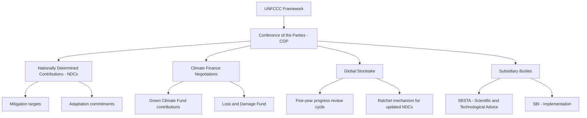

## Environmental and Climate Diplomacy

### Definition and Scope

Environmental and climate diplomacy is the conduct of international negotiation, treaty-making, and coalition-building aimed at addressing transboundary and global environmental challenges — most prominently anthropogenic climate change, but also biodiversity loss, ozone depletion, marine pollution, and desertification. It is distinguished from other diplomatic domains by its reliance on scientific consensus-building as a precondition for political negotiation, and by the collective-action problem structure of its core subject matter (global commons governance, where individual state incentives to free-ride complicate cooperation).

**Key Points**

- Climate diplomacy is a subset of the broader environmental diplomacy field, but has grown to dominate it in institutional scale and diplomatic prominence since the 1990s.
- The field operates through multilateral treaty frameworks (conventions, protocols, agreements), supplemented by minilateral coalitions, subnational and non-state actor engagement, and bilateral climate partnerships.
- Environmental diplomacy is structurally distinct from most other diplomatic domains in requiring near-universal participation to be effective, since atmospheric and ecological systems do not respect sovereign boundaries.

### Historical Development

Environmental diplomacy's institutional origins trace to the 1972 UN Conference on the Human Environment (Stockholm), which established the UN Environment Programme (UNEP) and marked the first major multilateral environmental governance framework. The Vienna Convention (1985) and Montreal Protocol (1987) on ozone-depleting substances are frequently cited as the most successful multilateral environmental agreement to date, demonstrating that binding global environmental cooperation with real compliance was achievable. Climate diplomacy specifically emerged from the 1992 Rio Earth Summit, which produced the UN Framework Convention on Climate Change (UNFCCC), establishing the annual Conference of the Parties (COP) process that remains the central climate diplomacy venue. The Kyoto Protocol (1997) introduced binding emissions targets for developed countries but excluded major developing emitters, a structural limitation that contributed to its incomplete implementation (notably the US never ratified it). The Paris Agreement (2015) marked a paradigm shift toward a bottom-up model of Nationally Determined Contributions (NDCs), abandoning binding top-down targets in favor of near-universal participation with progressively strengthened voluntary commitments and a "ratchet mechanism" for periodic review.

### Core Institutional Architecture

**Key Points**

- **UNFCCC and COP Process**: The central treaty body and its annual Conference of the Parties, where climate negotiations, NDC updates, and financing commitments are negotiated.
- **Intergovernmental Panel on Climate Change (IPCC)**: The scientific assessment body providing the evidentiary basis for negotiations, operating on a consensus-based synthesis of peer-reviewed climate science rather than conducting original research itself.
- **UN Environment Programme (UNEP)**: Coordinates broader environmental governance beyond climate specifically, including biodiversity and pollution frameworks.
- **Convention on Biological Diversity (CBD)**: Parallel treaty framework addressing biodiversity loss, operating its own COP process distinct from the climate UNFCCC COP.
- **Green Climate Fund (GCF)**: The principal multilateral climate finance mechanism under the UNFCCC, channeling funds to developing countries for mitigation and adaptation.

### The UNFCCC Negotiation Architecture

### Key Negotiating Blocs and Coalitions

**Key Points**

- **Umbrella Group**: Non-EU developed countries (historically including the US, Japan, Canada, Australia) generally favoring flexible, market-based mitigation mechanisms.
- **European Union**: Typically negotiates as a bloc with a unified position, often pushing for more ambitious binding targets.
- **G77 plus China**: The largest developing-country coalition, emphasizing the principle of "common but differentiated responsibilities" (CBDR) and demanding climate finance commitments from developed nations.
- **Alliance of Small Island States (AOSIS)**: Represents states facing existential sea-level rise threats, a key advocacy voice for ambitious mitigation targets and the Loss and Damage Fund.
- **Like-Minded Developing Countries (LMDC)**: A more assertive developing-country bloc (including India, China, and others) resistant to mitigation commitments perceived as shifting historical responsibility away from developed economies.
- **OPEC bloc within negotiations**: Oil-exporting states with distinct interests in slowing fossil fuel phase-out language.

### Common but Differentiated Responsibilities (CBDR)

**Key Points**

- CBDR is the foundational normative principle distinguishing climate diplomacy from most other multilateral negotiation, holding that all states share responsibility for addressing climate change but developed countries bear greater responsibility given historical emissions and greater capacity.
- The principle has been a persistent source of negotiating friction, particularly regarding the binary developed/developing country classification established in 1992, which many argue no longer reflects contemporary emissions realities (e.g., China's current status as the largest annual emitter despite classification as a developing country under UNFCCC).
- The Paris Agreement's shift to NDCs partially sidesteps the rigid CBDR binary by allowing self-differentiated national commitments, though finance and equity debates continue to invoke CBDR extensively.

[Inference] The tension between the 1992-era developed/developing country classification and current emissions realities is widely acknowledged in the negotiating literature as an unresolved structural issue, though there is no negotiated consensus on how or whether to formally revise the classification given the political sensitivities involved.

### Climate Finance Architecture

**Key Points**

- **$100 Billion Pledge**: Developed countries committed at COP15 (2009) to mobilize $100 billion annually by 2020 for developing country climate action; this target was met with delay (achieved in 2022 according to OECD tracking) and remained a persistent trust deficit in negotiations.
- **New Collective Quantified Goal (NCQG)**: Agreed at COP29 (2024), establishing a new climate finance target (a floor of $300 billion annually by 2035 from developed countries, within a broader $1.3 trillion mobilization goal from all sources) succeeding the $100 billion pledge.
- **Loss and Damage Fund**: Established at COP27 (2022) and operationalized at COP28 (2023), addressing compensation for climate impacts already occurring in vulnerable states, distinct from mitigation/adaptation finance.
- **Green Climate Fund (GCF)**: Primary operational entity for channeling multilateral climate finance, though replenishment negotiations remain diplomatically contentious.

### Comparative Model: Kyoto Protocol vs. Paris Agreement

| Dimension | Kyoto Protocol (1997) | Paris Agreement (2015) |
| --- | --- | --- |
| Structure | Top-down binding targets | Bottom-up voluntary NDCs |
| Participation | Developed countries only (Annex I) | Near-universal (developing and developed) |
| Enforcement | Binding, with compliance mechanisms | Non-binding targets; procedural transparency requirements |
| Ambition mechanism | Fixed commitment periods | Five-year ratchet cycle (Global Stocktake) |
| US participation | Never ratified | Ratified, withdrew (2017), rejoined (2021), withdrew again (2025) |

[Unverified] The long-term aggregate emissions trajectory impact of the Paris Agreement's voluntary NDC model compared to a hypothetical continuation of binding Kyoto-style targets is difficult to assess empirically and remains a subject of ongoing analysis; current NDC trajectories are widely assessed by the UNEP Emissions Gap Report series as insufficient to meet the 1.5°C or well-below-2°C goals, though this reflects NDC ambition levels rather than a definitive judgment on the treaty architecture itself.

### The Global Stocktake and Ratchet Mechanism

The Paris Agreement's core innovation for maintaining long-term ambition without binding targets is a periodic review-and-strengthen cycle:

1. **NDC submission** — each party submits its nationally determined mitigation and adaptation commitments.
2. **Implementation and monitoring** — parties report progress through an Enhanced Transparency Framework.
3. **Global Stocktake** — every five years, the collective progress of all NDCs is assessed against the Agreement's temperature goals (first stocktake concluded at COP28, 2023).
4. **Ratchet** — findings from the stocktake are intended to inform more ambitious NDC submissions in the subsequent cycle, creating a "ratchet" of progressively increasing ambition.

**Example**

Following the first Global Stocktake at COP28, which found collective NDCs insufficient to limit warming to 1.5°C, parties were expected to submit strengthened NDCs (due in 2025) reflecting the stocktake's call for actions including tripling renewable energy capacity and transitioning away from fossil fuels — illustrating how the stocktake mechanism functions as a diplomatic pressure point without imposing binding legal obligations on individual states.

### Diagram: Climate Diplomacy Negotiating Landscape

<svg xmlns="http://www.w3.org/2000/svg" viewBox="0 0 800 480">
<text x="400" y="30" font-size="18" font-weight="bold" text-anchor="middle" fill="#1a1a1a">Climate Diplomacy Negotiating Landscape (svg_diagram)</text>
<circle cx="400" cy="250" r="65" fill="#2c5f8a" stroke="#1a1a1a" stroke-width="2" />
<text x="400" y="245" font-size="12" text-anchor="middle" fill="#fff">UNFCCC</text>
<text x="400" y="262" font-size="12" text-anchor="middle" fill="#fff">COP Process</text>
<rect x="40" y="100" width="160" height="70" rx="8" fill="#3d8361" stroke="#1a1a1a" stroke-width="2" />
<text x="120" y="130" font-size="12" text-anchor="middle" fill="#fff">EU Bloc</text>
<text x="120" y="150" font-size="11" text-anchor="middle" fill="#dfd">Ambitious targets</text>
<rect x="600" y="100" width="160" height="70" rx="8" fill="#a8763e" stroke="#1a1a1a" stroke-width="2" />
<text x="680" y="130" font-size="12" text-anchor="middle" fill="#fff">Umbrella Group</text>
<text x="680" y="150" font-size="11" text-anchor="middle" fill="#eee">Market mechanisms</text>
<rect x="40" y="380" width="160" height="70" rx="8" fill="#7a3e8a" stroke="#1a1a1a" stroke-width="2" />
<text x="120" y="410" font-size="12" text-anchor="middle" fill="#fff">AOSIS</text>
<text x="120" y="430" font-size="11" text-anchor="middle" fill="#eee">Existential risk advocacy</text>
<rect x="600" y="380" width="160" height="70" rx="8" fill="#8a3e3e" stroke="#1a1a1a" stroke-width="2" />
<text x="680" y="410" font-size="12" text-anchor="middle" fill="#fff">G77 + China / LMDC</text>
<text x="680" y="430" font-size="11" text-anchor="middle" fill="#eee">CBDR, finance demands</text>
<line x1="200" y1="150" x2="345" y2="220" stroke="#555" stroke-width="2" />
<line x1="600" y1="150" x2="455" y2="220" stroke="#555" stroke-width="2" />
<line x1="200" y1="400" x2="345" y2="280" stroke="#555" stroke-width="2" />
<line x1="600" y1="400" x2="455" y2="280" stroke="#555" stroke-width="2" />
</svg>

### Non-State and Subnational Climate Diplomacy

**Key Points**

- **City and regional diplomacy**: Networks like C40 Cities and the Under2 Coalition enable subnational governments to make and coordinate climate commitments independent of, or complementary to, national positions.
- **Corporate net-zero commitments**: Private-sector pledges (Science Based Targets initiative, Race to Zero campaign) function as a parallel diplomatic layer, though subject to criticism regarding enforceability and greenwashing risk.
- **Civil society and youth movements**: Advocacy networks exert diplomatic pressure through COP side events, public campaigns, and direct engagement with negotiating delegations.
- **"Paradiplomacy" significance**: Subnational and non-state climate action gained particular diplomatic prominence during the 2017-2021 period when the US federal government withdrew from the Paris Agreement, as state, city, and corporate actors organized parallel commitment tracking (e.g., the "We Are Still In" coalition) to maintain international credibility.

### Contemporary Challenges

- **Ambition-implementation gap**: Persistent gap between aggregate NDC ambition and the emissions trajectory required for 1.5°C, as tracked annually by the UNEP Emissions Gap Report.
- **Climate finance trust deficit**: Recurring disputes over whether developed countries are meeting finance commitments, and disagreements over what counts as "new and additional" finance versus rebadged existing aid.
- **Fossil fuel phase-out language contestation**: The COP28 (2023) agreement's "transitioning away from fossil fuels" language represented a hard-won but heavily negotiated compromise, reflecting ongoing tension between fossil-fuel-dependent economies and mitigation-focused coalitions.
- **US policy volatility**: Repeated US withdrawal and re-entry into the Paris Agreement (2017 withdrawal, 2021 rejoining, 2025 withdrawal) has introduced significant diplomatic unpredictability into the process, complicating other parties' long-term planning.
- **Overlap with trade policy**: Emerging carbon border adjustment mechanisms (e.g., the EU's CBAM) are increasingly intersecting climate diplomacy with trade diplomacy, raising WTO-compatibility and developing-country equity concerns.

### Related Topics

- Paris Agreement NDC Architecture and the Global Stocktake
- Climate Finance: Green Climate Fund and Loss and Damage Fund
- Common but Differentiated Responsibilities (CBDR) in International Law
- Carbon Border Adjustment Mechanisms and Trade-Climate Policy Overlap
- Biodiversity Diplomacy and the Convention on Biological Diversity
- Subnational and Corporate Climate Diplomacy (C40, Race to Zero)
- Resource and Energy Diplomacy
- IPCC Scientific Assessment Process and Science-Policy Interface