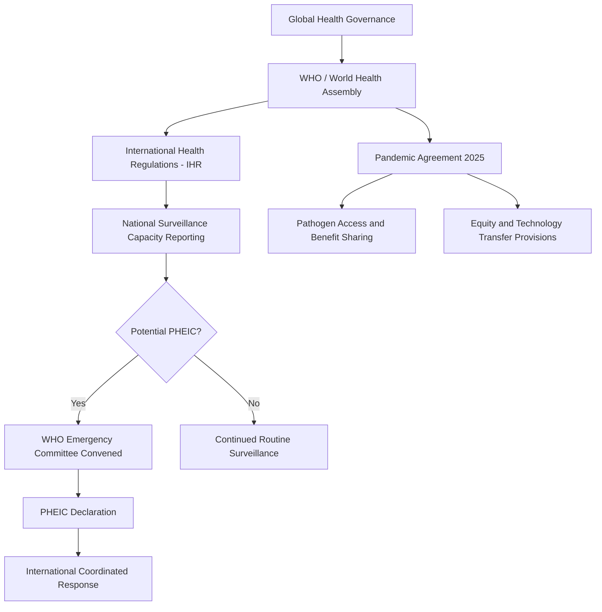

## Health and Pandemic Diplomacy

### Definition and Scope

Health and pandemic diplomacy is the conduct of international negotiation, cooperation, and institutional coordination aimed at addressing cross-border health threats, building global health governance capacity, and using health-related engagement as an instrument of broader foreign policy. It spans routine multilateral health governance (disease surveillance, health system strengthening) and acute crisis diplomacy during pandemics and health emergencies, and increasingly functions as both a humanitarian domain and a soft-power/geopolitical instrument.

**Key Points**

- Global health diplomacy operates at the intersection of public health, international law, and foreign policy, requiring technical epidemiological expertise alongside conventional diplomatic negotiation skill.
- The field distinguishes between routine health diplomacy (ongoing multilateral governance, disease surveillance norms, health system capacity building) and crisis health diplomacy (acute pandemic response coordination).
- Health diplomacy has a well-documented dual character: genuine humanitarian cooperation coexists with its instrumental use for soft power projection, market access, and strategic influence-building ("vaccine diplomacy" being the most visible recent example).

### Historical Development

International health cooperation traces to the International Sanitary Conferences beginning in 1851, convened to coordinate quarantine policy amid recurring cholera epidemics and transnational trade disruption — among the earliest examples of multilateral technical diplomacy predating the modern UN system. The World Health Organization (WHO) was established in 1948 as a UN specialized agency, consolidating fragmented prior health bodies. The International Health Regulations (IHR), first adopted in 1969 and substantially revised in 2005 following the SARS outbreak, created the binding legal framework requiring states to report public health emergencies of international concern (PHEIC) to the WHO. The HIV/AIDS crisis of the 1990s-2000s catalyzed major global health financing diplomacy, producing institutions like the Global Fund to Fight AIDS, Tuberculosis and Malaria (2002) and PEPFAR (the US President's Emergency Plan for AIDS Relief, 2003), demonstrating health diplomacy's capacity to mobilize large-scale bilateral and multilateral financing. The COVID-19 pandemic (2020-2023) represented the most consequential recent stress test of global health diplomacy, exposing both the value of coordinated mechanisms (COVAX) and significant fragmentation in vaccine access, culminating in the 2025 adoption of the WHO Pandemic Agreement after several years of negotiation.

### Core Institutional Architecture

**Key Points**

- **World Health Organization (WHO)**: The central multilateral health governance body, operating through the World Health Assembly (its governing body) and regional offices; sets normative standards, coordinates emergency response, and declares Public Health Emergencies of International Concern (PHEICs).
- **International Health Regulations (IHR, 2005)**: The binding legal instrument requiring member states to develop core surveillance and response capacities and report qualifying health events to WHO.
- **Global Fund and Gavi (Vaccine Alliance)**: Major multilateral health financing mechanisms for infectious disease programs and immunization respectively, blending public and philanthropic (notably Gates Foundation) funding.
- **COVAX Facility**: The COVID-19-era multilateral vaccine equity mechanism, co-led by Gavi, CEPI (Coalition for Epidemic Preparedness Innovations), and WHO, designed to pool procurement and ensure equitable global vaccine distribution.
- **Bilateral health agencies**: National public health bodies (US CDC, China CDC, Africa CDC) increasingly engage in direct bilateral and regional health diplomacy alongside WHO-centered multilateralism.

### Global Health Governance Architecture

### The PHEIC Declaration Process

**Key Points**

- **Emergency Committee Convening**: WHO Director-General convenes an independent expert Emergency Committee to assess whether an event constitutes a Public Health Emergency of International Concern.
- **Declaration authority**: The WHO Director-General holds sole formal authority to declare a PHEIC, based on Emergency Committee advice — a notable concentration of decision authority within an international organization.
- **Temporary Recommendations**: Accompanying a PHEIC declaration, WHO issues non-binding recommendations to states regarding travel, trade, and surveillance measures.
- **Compliance limitations**: IHR implementation has historically suffered from inconsistent state compliance with reporting obligations and Temporary Recommendations, since the framework carries no binding enforcement mechanism beyond reputational pressure.

[Inference] The IHR's reliance on reputational rather than binding enforcement mechanisms is widely identified in the global health governance literature as a structural weakness, though attempts to introduce stronger binding elements have faced sustained sovereignty-related resistance from member states during negotiation processes.

### Vaccine and Pandemic Diplomacy

**Key Points**

- **Vaccine diplomacy**: The strategic use of vaccine donation, sale, or technology-sharing to build diplomatic goodwill and influence, prominently exercised during COVID-19 by China (Sinovac/Sinopharm), Russia (Sputnik V), India (Vaccine Maitri initiative), and Western manufacturers through both bilateral deals and COVAX contributions.
- **COVAX performance and limitations**: Despite its equity-oriented design, COVAX faced significant supply shortfalls in 2021 due to export restrictions by major manufacturing states and bilateral "vaccine nationalism" that diverted early supply toward wealthy countries' bilateral deals.
- **TRIPS waiver debate**: A prolonged and diplomatically contentious negotiation over waiving WTO intellectual property protections (TRIPS Agreement) for COVID-19 vaccines, pitting developing countries and generic manufacturers against pharmaceutical-industry-aligned developed states; a limited waiver was eventually agreed at the WTO in 2022, though its practical impact on manufacturing capacity expansion is debated.
- **mRNA technology transfer hubs**: WHO-backed initiatives (e.g., the mRNA vaccine technology transfer hub in South Africa) aimed at building developing-country manufacturing capacity independent of original patent holders.

### Comparative Model: Bilateral Vaccine Diplomacy vs. Multilateral Pooling

| Dimension | Bilateral Vaccine Diplomacy | Multilateral Pooling (COVAX) |
| --- | --- | --- |
| Diplomatic visibility | High (flag-branded, attributable) | Lower (pooled, less donor-specific credit) |
| Equity outcome | Skewed toward donor's strategic priorities | Designed for need-based, proportional allocation |
| Speed of deployment | Often faster (direct negotiation) | Slower (multi-stakeholder coordination overhead) |
| Soft power return | Concentrated, immediate | Diffuse, harder to attribute to individual donors |
| Historical performance (COVID-19) | Significant early-stage supply capture by wealthy/producing states | Achieved substantial total doses delivered but fell short of original equity targets |

### The WHO Pandemic Agreement (2025)

**Key Points**

- Adopted by the World Health Assembly in 2025 following approximately three years of negotiation launched in the wake of COVID-19's exposed governance gaps.
- Establishes a Pathogen Access and Benefit-Sharing (PABS) system intended to ensure that countries sharing pathogen samples and genomic data receive guaranteed access to resulting vaccines, diagnostics, and therapeutics.
- Includes provisions on technology transfer, though the precise binding character and implementation mechanisms of these provisions were among the most contested negotiating points.
- Represents the most significant addition to binding global health law since the 2005 IHR revision, though its ultimate effectiveness depends on subsequent ratification and implementation by member states.

[Unverified] The practical implementation strength of the WHO Pandemic Agreement's technology transfer and benefit-sharing provisions — particularly whether they will function as genuinely binding obligations or largely aspirational commitments — remains to be demonstrated through actual crisis application, since the agreement had not yet been tested by a major pandemic event at the time of adoption.

### Health Diplomacy as Soft Power Instrument

**Key Points**

- **Medical missions and personnel diplomacy**: Long-standing practice (most prominently associated with Cuba's international medical brigades) of deploying health professionals abroad as a soft power and solidarity-building instrument.
- **Hospital and health infrastructure diplomacy**: State-funded hospital construction and health system capacity building abroad function similarly to broader development diplomacy infrastructure projects, often carrying donor-country branding.
- **Health security cooperation as alliance-building**: Joint disease surveillance and biosecurity cooperation agreements increasingly function as a component of broader strategic partnership frameworks, particularly in regions of geopolitical competition.

### Practical Example: Cross-Border Outbreak Response Coordination

A cross-border disease outbreak with pandemic potential triggers the following diplomatic sequence:

1. **Initial detection and IHR reporting** — the affected state's national health authority detects the outbreak and is legally obligated under IHR to report it to WHO if it meets PHEIC-qualifying criteria.
2. **WHO Emergency Committee assessment** — independent experts assess transmissibility, severity, and international spread risk.
3. **PHEIC declaration and coordinated response** — if declared, affected and neighboring states coordinate surveillance, travel measure harmonization, and resource-sharing, often supplemented by bilateral assistance from better-resourced states.
4. **Vaccine/therapeutic development diplomacy** — if a novel pathogen requires new medical countermeasures, parallel diplomatic negotiation over research collaboration, manufacturing capacity allocation, and equitable access begins, often invoking PABS-type mechanisms under the Pandemic Agreement framework.
5. **Post-crisis review** — WHO and member states conduct after-action reviews, feeding into ongoing IHR and Pandemic Agreement implementation refinement.

**Example**

This sequence mirrors, in simplified form, the actual institutional pathway followed during the COVID-19 pandemic's early phase — from China's initial reporting and WHO's January 2020 PHEIC declaration, through the subsequent fragmented bilateral and multilateral vaccine diplomacy period, to the eventual post-crisis negotiation of the 2025 Pandemic Agreement intended to address the gaps exposed during that response.

### Diagram: Health Diplomacy Actor Network

<svg xmlns="http://www.w3.org/2000/svg" viewBox="0 0 800 460">
<text x="400" y="30" font-size="18" font-weight="bold" text-anchor="middle" fill="#1a1a1a">Health Diplomacy Actor Network (svg_diagram)</text>
<circle cx="400" cy="240" r="70" fill="#2c5f8a" stroke="#1a1a1a" stroke-width="2" />
<text x="400" y="235" font-size="12" text-anchor="middle" fill="#fff">WHO /</text>
<text x="400" y="252" font-size="12" text-anchor="middle" fill="#fff">World Health Assembly</text>
<rect x="40" y="90" width="180" height="70" rx="8" fill="#3d8361" stroke="#1a1a1a" stroke-width="2" />
<text x="130" y="120" font-size="12" text-anchor="middle" fill="#fff">Bilateral Health</text>
<text x="130" y="140" font-size="12" text-anchor="middle" fill="#fff">Agencies (CDC-type)</text>
<rect x="580" y="90" width="180" height="70" rx="8" fill="#a8763e" stroke="#1a1a1a" stroke-width="2" />
<text x="670" y="120" font-size="12" text-anchor="middle" fill="#fff">Gavi / Global Fund /</text>
<text x="670" y="140" font-size="12" text-anchor="middle" fill="#fff">CEPI (COVAX)</text>
<rect x="40" y="370" width="180" height="70" rx="8" fill="#7a3e8a" stroke="#1a1a1a" stroke-width="2" />
<text x="130" y="400" font-size="12" text-anchor="middle" fill="#fff">Pharmaceutical</text>
<text x="130" y="420" font-size="12" text-anchor="middle" fill="#fff">Manufacturers</text>
<rect x="580" y="370" width="180" height="70" rx="8" fill="#8a3e3e" stroke="#1a1a1a" stroke-width="2" />
<text x="670" y="400" font-size="12" text-anchor="middle" fill="#fff">Affected / Recipient</text>
<text x="670" y="420" font-size="12" text-anchor="middle" fill="#fff">Member States</text>
<line x1="220" y1="130" x2="345" y2="205" stroke="#555" stroke-width="2" />
<line x1="580" y1="130" x2="455" y2="205" stroke="#555" stroke-width="2" />
<line x1="220" y1="400" x2="345" y2="280" stroke="#555" stroke-width="2" />
<line x1="580" y1="400" x2="455" y2="280" stroke="#555" stroke-width="2" />
</svg>

### Contemporary Challenges

- **Sovereignty vs. binding enforcement tension**: Ongoing resistance among member states to accepting binding surveillance and response obligations, limiting the strength achievable in instruments like the IHR and Pandemic Agreement.
- **Vaccine and therapeutic equity gaps**: Persistent structural disadvantage for lower-income countries in accessing novel medical countermeasures during acute crises, despite mechanisms like COVAX and the PABS system designed to address this.
- **Geopoliticization of health cooperation**: Growing politicization of WHO governance and health diplomacy generally amid broader great-power competition, including funding volatility from major contributing states.
- **Pandemic Agreement implementation uncertainty**: The 2025 agreement's practical effectiveness remains unproven pending an actual major health emergency test case.
- **One Health integration**: Growing diplomatic emphasis on the "One Health" approach linking human, animal, and environmental health governance, given the zoonotic origin of most major pandemic threats, though institutionalizing this cross-sectoral coordination remains complex.

### Related Topics

- International Health Regulations (IHR) and PHEIC Declaration Mechanics
- WHO Pandemic Agreement: Pathogen Access and Benefit-Sharing
- Vaccine Diplomacy and COVAX Equity Outcomes
- TRIPS Waiver Debates and Intellectual Property in Global Health
- One Health Governance and Zoonotic Disease Surveillance
- Development Diplomacy and Foreign Aid
- Humanitarian Diplomacy and Crisis Response Coordination
- Global Health Financing: Global Fund, Gavi, and PEPFAR Models