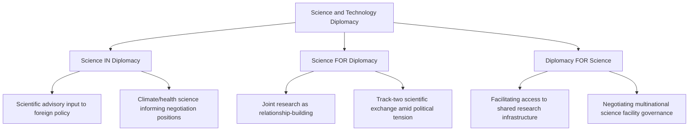

## Science and Technology Diplomacy

### Definition and Scope

Science and technology diplomacy is the conduct of international relations at the intersection of scientific research, technological development, and foreign policy. The field is conventionally analyzed through a tripartite framework — science *in* diplomacy (scientific advice informing foreign policy), science *for* diplomacy (using scientific cooperation to build or repair international relationships), and diplomacy *for* science (using diplomatic tools to facilitate international scientific collaboration and infrastructure access). Contemporary usage has expanded significantly to include technology governance and competition — export controls, standard-setting, and strategic technology denial — reflecting the growing weight of frontier technologies (AI, semiconductors, quantum computing, biotechnology) in geopolitical competition.

**Key Points**

- The science-diplomacy-diplomacy-science tripartite framework (popularized by the Royal Society and AAAS in a widely cited 2010 report) remains the standard analytical taxonomy in the field.
- Technology diplomacy has grown to encompass both cooperative dimensions (joint research, standard-setting) and competitive/coercive dimensions (export controls, technology denial, digital sovereignty disputes).
- The field sits institutionally across foreign ministries (increasingly with dedicated science and technology envoys or attaché positions), national science agencies, and multilateral standard-setting bodies.

### Historical Development

Science diplomacy has deep roots in practices like the exchange of astronomical data during the Enlightenment and Cold War-era scientific cooperation used deliberately to maintain communication channels between rival blocs despite political tension — the US-Soviet space cooperation culminating in the 1975 Apollo-Soyuz mission is a frequently cited example of "science for diplomacy" bridging ideological divides. The post-Cold War period saw expansion of multilateral "big science" diplomacy, exemplified by CERN's multinational governance model and the International Space Station's unusual continuation of US-Russia technical cooperation even amid broader political friction. The 2010s marked a structural shift as digital technology, artificial intelligence, and semiconductor manufacturing became central to great-power competition, particularly between the US and China, transforming technology diplomacy from a primarily cooperative/scientific-exchange field into one substantially concerned with export controls, technology denial, and techno-nationalist industrial policy. The 2020s have seen rapid institutionalization of AI governance diplomacy specifically, marked by initiatives such as the UK-hosted Bletchley Declaration (2023), the EU AI Act's extraterritorial influence, and ongoing UN and G7 processes on AI governance frameworks.

### The Tripartite Science Diplomacy Framework

### Core Institutional Actors

**Key Points**

- **Science and Technology Envoys/Attachés**: Diplomatic personnel embedded in embassies or foreign ministries specifically to manage scientific cooperation and technology policy engagement (a role pioneered extensively by the US State Department's Science Envoy Program, established 2010).
- **National Science Academies and Research Councils**: Often engage in parallel "Track 1.5" scientific diplomacy alongside formal government channels (e.g., the InterAcademy Partnership network).
- **Multinational Research Infrastructure Governance Bodies**: CERN, the International Space Station partnership, ITER (nuclear fusion), and the Square Kilometre Array Observatory each operate distinct multinational governance and funding-sharing frameworks.
- **Export Control and Technology Security Agencies**: Bodies like the US Bureau of Industry and Security (BIS), administering export control regimes (Export Administration Regulations) increasingly central to technology diplomacy's competitive dimension.
- **Multilateral Technology Governance Forums**: Emerging bodies addressing AI governance specifically, including the UN's AI advisory processes, the OECD AI Policy Observatory, and summit-based initiatives (UK AI Safety Summit/Bletchley Declaration, subsequent AI Seoul and Paris summits).

### Technology Denial and Export Control Diplomacy

**Key Points**

- **Export control regimes**: Legal frameworks (US Export Administration Regulations/EAR, International Traffic in Arms Regulations/ITAR) restricting export of dual-use and military technologies, increasingly extended to advanced semiconductors and AI-relevant computing hardware.
- **Multilateral export control coordination**: Regimes like the Wassenaar Arrangement coordinate conventional arms and dual-use technology export controls among member states, though consensus-based decision-making has limited its responsiveness to rapidly evolving technology categories like AI chips.
- **Extraterritorial reach**: US export controls increasingly apply extraterritorially through mechanisms like the Foreign Direct Product Rule, requiring foreign manufacturers using US-origin technology or tooling to comply with US restrictions even absent direct US commercial involvement — a significant and diplomatically contentious expansion of jurisdictional reach.
- **Allied coordination on technology denial**: The US has pursued increasingly coordinated multilateral technology restriction diplomacy with allies (notably Japan and the Netherlands regarding semiconductor lithography equipment export controls on China) rather than acting unilaterally, reflecting recognition that unilateral controls are less effective given globally distributed supply chains.

[Inference] The shift toward allied-coordinated rather than purely unilateral technology export controls reflects an assessment, widely discussed in trade and technology policy analysis, that globally distributed semiconductor supply chains make unilateral restriction less effective; the durability and depth of this allied coordination across differing national economic interests remains subject to ongoing diplomatic negotiation.

### Comparative Model: Cooperative vs. Competitive Technology Diplomacy

| Dimension | Cooperative Science Diplomacy | Competitive Technology Diplomacy |
| --- | --- | --- |
| Primary objective | Joint research advancement, relationship-building | Strategic advantage, technology denial |
| Typical instruments | Research MOUs, shared infrastructure agreements, exchange programs | Export controls, investment screening, standard-setting influence |
| Representative venues | CERN, ISS partnership, bilateral science cooperation agreements | Wassenaar Arrangement, BIS entity lists, allied semiconductor coordination |
| Historical exemplar | Apollo-Soyuz (1975) | US-China semiconductor export control escalation (2018-present) |
| Diplomatic tone | Confidence-building, track-two engagement | Adversarial, national-security-framed |

### AI Governance Diplomacy

**Key Points**

- **Bletchley Declaration (2023)**: The first major multilateral statement on frontier AI safety, signed by 28 countries including the US and China at the UK-hosted AI Safety Summit, establishing shared acknowledgment of AI risks despite differing regulatory philosophies.
- **Divergent regulatory models**: The EU's risk-based, binding regulatory approach (EU AI Act) contrasts with the US's more sector-specific and voluntary-commitment-oriented approach and China's state-directed AI governance model, creating a fragmented global regulatory landscape that technology diplomacy must navigate.
- **Standard-setting competition**: International technical standard-setting bodies (ISO, IEC, ITU) have become diplomatically significant venues as AI and telecommunications standards increasingly carry strategic and commercial weight, with sustained competition over standard-setting influence between US-aligned and China-aligned coalitions.
- **UN and G7 coordination efforts**: Ongoing processes seeking baseline multilateral AI governance principles, though substantive binding agreement remains limited given the pace of technological change relative to treaty-negotiation timelines.

[Unverified] Whether AI governance diplomacy will converge toward a coherent multilateral framework or remain permanently fragmented along competing regulatory blocs is an open and actively debated question among technology policy analysts, without clear empirical precedent given the AI governance field's recency.

### Big Science Diplomacy: Multinational Research Infrastructure

**Key Points**

- **CERN**: Operates under a unique intergovernmental treaty structure enabling sustained scientific collaboration among member states with otherwise divergent political relationships, frequently cited as a model for depoliticized scientific infrastructure governance.
- **International Space Station (ISS)**: Notable for maintaining substantial US-Russia technical cooperation even through periods of severe broader diplomatic deterioration (including post-2014 and post-2022 sanctions contexts), illustrating how embedded technical interdependency can create diplomatic continuity pressure distinct from general political relations.
- **ITER (International Thermonuclear Experimental Reactor)**: A seven-party (EU, US, China, Russia, Japan, South Korea, India) fusion energy research collaboration requiring sustained multilateral cost-sharing and technical coordination despite significant political differences among participants.
- **Square Kilometre Array Observatory**: A newer multinational radio astronomy infrastructure project requiring host-country negotiation (South Africa and Australia) and international funding-share diplomacy.

### Practical Example: Semiconductor Technology Diplomacy Sequence

A state seeking to restrict a strategic competitor's access to advanced semiconductor manufacturing capability typically pursues the following sequence:

1. **Unilateral control design** — the restricting state's export control agency designs regulations targeting specific technology categories (e.g., advanced lithography equipment, high-performance computing chips).
2. **Allied diplomatic coordination** — recognizing that unilateral controls are circumventable given globally distributed supply chains, the restricting state engages key allied manufacturing states diplomatically to align equivalent restrictions.
3. **Extraterritorial rule application** — where allied alignment is incomplete, the restricting state may apply extraterritorial rules (e.g., a Foreign Direct Product Rule) to capture foreign-made products incorporating the restricting state's underlying technology.
4. **Target-state response and retaliation diplomacy** — the restricted state typically responds with its own export restrictions on inputs where it holds market power (e.g., critical mineral processing restrictions), escalating into broader technology-trade diplomatic friction.
5. **Ongoing multilateral forum contestation** — both sides continue to contest standard-setting influence and multilateral technology governance framing in parallel forums (ISO, ITU, UN processes).

**Example**

This sequence closely mirrors the actual pattern observed in US semiconductor export controls targeting China from 2018 onward — unilateral BIS entity-list and export rule actions, followed by diplomatic coordination with the Netherlands (ASML lithography equipment) and Japan (semiconductor manufacturing equipment), followed by China's retaliatory export restrictions on gallium and germanium, illustrating how technology diplomacy escalation sequences unfold across multiple diplomatic and economic policy layers simultaneously.

### Diagram: Science and Technology Diplomacy Landscape

<svg xmlns="http://www.w3.org/2000/svg" viewBox="0 0 800 480">
<text x="400" y="30" font-size="18" font-weight="bold" text-anchor="middle" fill="#1a1a1a">Science and Technology Diplomacy Landscape (svg_diagram)</text>
<rect x="40" y="90" width="220" height="90" rx="8" fill="#2c5f8a" stroke="#1a1a1a" stroke-width="2" />
<text x="150" y="125" font-size="13" text-anchor="middle" fill="#fff">Cooperative Track</text>
<text x="150" y="145" font-size="12" text-anchor="middle" fill="#fff">CERN, ISS, ITER,</text>
<text x="150" y="163" font-size="12" text-anchor="middle" fill="#fff">Science Envoys</text>
<rect x="540" y="90" width="220" height="90" rx="8" fill="#8a3e3e" stroke="#1a1a1a" stroke-width="2" />
<text x="650" y="125" font-size="13" text-anchor="middle" fill="#fff">Competitive Track</text>
<text x="650" y="145" font-size="12" text-anchor="middle" fill="#fff">Export Controls,</text>
<text x="650" y="163" font-size="12" text-anchor="middle" fill="#fff">Technology Denial</text>
<rect x="290" y="280" width="220" height="90" rx="8" fill="#3d8361" stroke="#1a1a1a" stroke-width="2" />
<text x="400" y="315" font-size="13" text-anchor="middle" fill="#fff">Standard-Setting</text>
<text x="400" y="335" font-size="12" text-anchor="middle" fill="#fff">Bodies (ISO, ITU, IEC)</text>
<text x="400" y="353" font-size="12" text-anchor="middle" fill="#fff">and AI Governance Forums</text>
<line x1="260" y1="150" x2="400" y2="280" stroke="#555" stroke-width="2" />
<line x1="540" y1="150" x2="400" y2="280" stroke="#555" stroke-width="2" />

<text x="400" y="430" font-size="11" text-anchor="middle" fill="#777" font-style="italic">Both tracks compete for influence in shared standard-setting venues</text>

</svg>

### Contemporary Challenges

- **Pace mismatch**: Rapid technological change (particularly in AI) consistently outpaces traditional treaty-negotiation timelines, creating persistent governance gaps.
- **Bifurcation risk**: Growing US-China technology decoupling raises concerns about a fragmenting global technology ecosystem with divergent standards, supply chains, and governance norms, potentially reducing interoperability and increasing costs globally.
- **Dual-use ambiguity**: Distinguishing legitimate civilian research collaboration from potential military-applicable technology transfer remains diplomatically and technically contentious, complicating academic and research exchange policy.
- **Talent and research security tension**: Rising security-driven restrictions on international academic collaboration and researcher mobility create friction with the traditional openness norms of the global scientific community.
- **Standard-setting body politicization**: Historically technical, consensus-driven standard-setting forums face growing politicization as strategic competitors seek to embed favorable technical standards for commercial and security advantage.

### Related Topics

- Export Control Regimes and the Wassenaar Arrangement
- AI Governance Diplomacy and the Bletchley Declaration Process
- Semiconductor Supply Chain Diplomacy and the CHIPS Ecosystem
- Big Science Governance: CERN, ITER, and International Space Station Models
- Standard-Setting Diplomacy in ISO, IEC, and ITU
- Resource and Energy Diplomacy (Critical Minerals Overlap)
- Research Security and Academic Collaboration Policy
- Digital Sovereignty and Cross-Border Data Governance