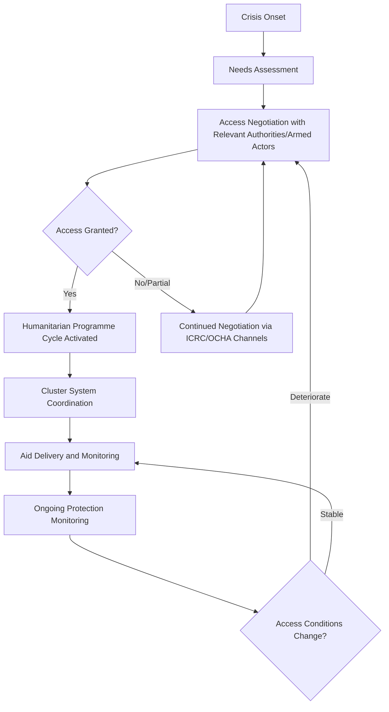

## Humanitarian Diplomacy

### Definition and Scope

Humanitarian diplomacy is the practice of persuading governments, armed actors, and other stakeholders to act, always in the interests of vulnerable populations and with full respect for fundamental humanitarian principles — enabling access to affected populations, mobilizing resources, and securing protection during armed conflict, disaster, and displacement crises. It is distinguished from other diplomatic domains by its explicit grounding in International Humanitarian Law (IHL) and core humanitarian principles, and by the frequent involvement of non-state actors (the International Committee of the Red Cross, UN humanitarian agencies, and NGOs) operating alongside or independently of formal state diplomacy.

**Key Points**

- Humanitarian diplomacy operates across three overlapping domains: negotiating humanitarian access in conflict zones, coordinating disaster response across borders, and advocating for protection of civilians and displaced populations.
- Unlike most diplomatic fields, key humanitarian diplomacy actors (ICRC, UN OCHA, humanitarian NGOs) are frequently non-state or quasi-state entities operating under distinct legal mandates rather than sovereign state representatives.
- The field is structured around four core humanitarian principles — humanity, neutrality, impartiality, and independence — which function simultaneously as ethical commitments and practical negotiating tools for securing access from armed actors.

### Historical Development

Humanitarian diplomacy's institutional origins trace to Henry Dunant's advocacy following the 1859 Battle of Solferino, leading to the founding of the International Committee of the Red Cross (1863) and the first Geneva Convention (1864), establishing the foundational legal and institutional architecture for wartime humanitarian protection. The Geneva Conventions were substantially expanded in 1949 (four conventions covering wounded combatants, shipwrecked personnel, prisoners of war, and civilians) and further developed through the 1977 Additional Protocols addressing non-international armed conflict. The modern multilateral humanitarian coordination system emerged significantly through UN General Assembly Resolution 46/182 (1991), which established the UN Department of Humanitarian Affairs (later reorganized as OCHA, the Office for the Coordination of Humanitarian Affairs) and created the Consolidated Appeals Process for coordinated international response. The 2005 Humanitarian Reform Agenda introduced the "cluster system" for sectoral coordination among humanitarian actors, and the 2016 World Humanitarian Summit produced the "Grand Bargain" commitment aimed at improving aid efficiency and localization of humanitarian response.

### Core Institutional Architecture

**Key Points**

- **International Committee of the Red Cross (ICRC)**: Holds a unique legal mandate under the Geneva Conventions as the guardian and promoter of International Humanitarian Law, maintaining a distinctive strict neutrality that enables access negotiations with all parties to a conflict, including non-state armed groups.
- **UN Office for the Coordination of Humanitarian Affairs (OCHA)**: Coordinates the broader UN humanitarian system, manages the Humanitarian Programme Cycle, and administers pooled funding mechanisms like the Central Emergency Response Fund (CERF).
- **UN Cluster System**: Sectoral coordination mechanism (health, shelter, food security, protection, WASH, etc.) organizing the multi-agency humanitarian response architecture within major crises.
- **International Red Cross and Red Crescent Movement**: Encompasses the ICRC, the International Federation of Red Cross and Red Crescent Societies (IFRC), and national Red Cross/Red Crescent societies, each with distinct but coordinated mandates.
- **Humanitarian NGOs and Consortia**: Major operational NGOs (MSF, Save the Children, Oxfam, and others) and coordination bodies (InterAction, ICVA) that both deliver aid and engage in humanitarian diplomacy and advocacy.

### The Humanitarian Access Negotiation Process

### Core Humanitarian Principles

**Key Points**

- **Humanity**: The foundational commitment to prevent and alleviate human suffering wherever found, protecting life and health and ensuring respect for the human being.
- **Neutrality**: Humanitarian actors do not take sides in hostilities or engage in controversies of a political, racial, religious, or ideological nature — a principle that functions practically as a negotiating tool, since perceived neutrality is often a precondition for armed actors granting access.
- **Impartiality**: Aid is provided based solely on need, without discrimination, giving priority to the most urgent cases of distress.
- **Independence**: Humanitarian action must remain autonomous from the political, economic, military, or other objectives that any actor may hold with regard to the areas where humanitarian action is being implemented.

[Inference] The practical tension between strict adherence to neutrality/independence principles and the operational necessity of engaging with donor governments (who often have their own strategic interests in a crisis) is widely discussed in humanitarian studies literature as a persistent structural challenge, particularly as major bilateral donors increasingly attach political conditions to humanitarian funding.

### International Humanitarian Law Foundations

**Key Points**

- **Geneva Conventions (1949) and Additional Protocols (1977)**: Establish binding legal protections for combatants hors de combat, civilians, and humanitarian personnel during armed conflict, and regulate means and methods of warfare.
- **Distinction, proportionality, and precaution**: Core IHL principles requiring parties to a conflict to distinguish combatants from civilians, avoid disproportionate civilian harm, and take feasible precautions to minimize civilian impact.
- **Humanitarian access as a legal obligation**: IHL establishes that parties to a conflict must allow and facilitate rapid and unimpeded passage of humanitarian relief for civilians in need, subject to their right of control over the modalities of passage.
- **Accountability mechanisms**: International Criminal Court jurisdiction over war crimes, alongside UN Commission of Inquiry mechanisms, provide (contested and often slow) accountability pathways for IHL violations affecting humanitarian access and civilian protection.

### Comparative Model: ICRC vs. UN Humanitarian System

| Dimension | ICRC | UN Humanitarian System (OCHA-coordinated) |
| --- | --- | --- |
| Legal basis | Unique mandate under Geneva Conventions | UN General Assembly resolutions, Humanitarian Programme Cycle |
| Neutrality posture | Strictest interpretation; avoids public advocacy in most cases | More willing to publicly advocate and name violators |
| Access to armed groups | Direct, confidential engagement with all parties including non-state armed groups | More variable; often mediated through host government relationships |
| Funding model | Voluntary state and private contributions | Pooled funds (CERF), country-based pooled funds, direct agency appeals |
| Typical role | Protection, detention visits, IHL dissemination, direct relief | Broad coordination, needs assessment, multi-sector response coordination |

### Negotiating Humanitarian Access

**Key Points**

- **Confidential bilateral engagement**: The ICRC's model relies heavily on confidential, direct dialogue with all parties to a conflict — including non-state armed groups — avoiding public criticism to preserve continued access, a distinctive approach compared to more public UN advocacy postures.
- **Humanitarian notification and deconfliction mechanisms**: Systems for sharing the coordinates of hospitals, aid convoys, and humanitarian facilities with warring parties to reduce (though not eliminate) risk of strikes on protected sites.
- **Local intermediary engagement**: Increasing reliance on local civil society and community-based organizations for access negotiation in contexts where international actors face security or political constraints.
- **Sanctions and counter-terrorism financing tension**: Humanitarian exemptions in sanctions regimes and counter-terrorism financing laws have become a significant diplomatic friction point, since overly broad restrictions can inadvertently criminalize legitimate humanitarian engagement with UN-designated entities controlling access to affected populations.

[Unverified] The degree to which counter-terrorism financing restrictions have measurably reduced humanitarian access in practice (versus primarily creating compliance burden and risk-aversion among aid organizations) is debated in humanitarian policy research, with mixed empirical findings across different sanctions contexts.

### Practical Example: Negotiating Access in an Active Conflict Zone

A humanitarian response to a crisis involving multiple armed actors follows this general sequence:

1. **Initial needs assessment** — OCHA and operational agencies conduct rapid assessment of affected population needs, often hampered by insecurity.
2. **Multi-track access negotiation** — the ICRC engages non-state armed groups through confidential channels while OCHA and UN agencies negotiate with the recognized government authority, running parallel rather than unified tracks given differing principles and relationships.
3. **Deconfliction and notification** — coordinates of hospitals, aid convoys, and displacement camps are shared through established deconfliction mechanisms with all parties to reduce (though not guarantee against) attack risk.
4. **Conditional and partial access management** — where full access is denied, humanitarian actors negotiate partial access (specific corridors, time-limited ceasefires for aid delivery, or besieged-area evacuation arrangements).
5. **Ongoing renegotiation** — access conditions are continuously renegotiated as conflict dynamics shift, often requiring repeated engagement rather than a single durable agreement.

**Example**

This pattern reflects the general dynamics observed across major protracted conflicts where humanitarian access has required sustained, multi-track diplomatic engagement — separate ICRC channels with non-state armed actors, parallel UN engagement with government authorities, and periodic negotiated humanitarian pauses or corridors — illustrating why humanitarian diplomacy in active conflict typically involves multiple simultaneous, non-unified negotiating tracks rather than a single comprehensive access agreement.

### Diagram: Humanitarian Diplomacy Actor Network

<svg xmlns="http://www.w3.org/2000/svg" viewBox="0 0 800 460">
<text x="400" y="30" font-size="18" font-weight="bold" text-anchor="middle" fill="#1a1a1a">Humanitarian Diplomacy Actor Network (svg_diagram)</text>
<circle cx="400" cy="240" r="65" fill="#2c5f8a" stroke="#1a1a1a" stroke-width="2" />
<text x="400" y="235" font-size="12" text-anchor="middle" fill="#fff">Affected</text>
<text x="400" y="252" font-size="12" text-anchor="middle" fill="#fff">Civilian Population</text>
<rect x="40" y="90" width="180" height="70" rx="8" fill="#3d8361" stroke="#1a1a1a" stroke-width="2" />
<text x="130" y="120" font-size="12" text-anchor="middle" fill="#fff">ICRC</text>
<text x="130" y="140" font-size="11" text-anchor="middle" fill="#dfd">Confidential access negotiation</text>
<rect x="580" y="90" width="180" height="70" rx="8" fill="#a8763e" stroke="#1a1a1a" stroke-width="2" />
<text x="670" y="120" font-size="12" text-anchor="middle" fill="#fff">OCHA / UN Cluster</text>
<text x="670" y="140" font-size="11" text-anchor="middle" fill="#eee">Multi-agency coordination</text>
<rect x="40" y="370" width="180" height="70" rx="8" fill="#8a3e3e" stroke="#1a1a1a" stroke-width="2" />
<text x="130" y="400" font-size="12" text-anchor="middle" fill="#fff">Non-State Armed</text>
<text x="130" y="420" font-size="12" text-anchor="middle" fill="#fff">Groups</text>
<rect x="580" y="370" width="180" height="70" rx="8" fill="#7a3e8a" stroke="#1a1a1a" stroke-width="2" />
<text x="670" y="400" font-size="12" text-anchor="middle" fill="#fff">Host Government /</text>
<text x="670" y="420" font-size="12" text-anchor="middle" fill="#fff">State Authorities</text>
<line x1="220" y1="130" x2="345" y2="215" stroke="#555" stroke-width="2" />
<line x1="580" y1="130" x2="455" y2="215" stroke="#555" stroke-width="2" />
<line x1="130" y1="160" x2="130" y2="370" stroke="#999" stroke-width="1.5" stroke-dasharray="4,4" />
<line x1="670" y1="160" x2="670" y2="370" stroke="#999" stroke-width="1.5" stroke-dasharray="4,4" />
<text x="130" y="270" font-size="10" text-anchor="middle" fill="#777">direct channel</text>
<text x="670" y="270" font-size="10" text-anchor="middle" fill="#777">state channel</text>
</svg>

### Contemporary Challenges

- **Shrinking humanitarian space**: Increasing attacks on humanitarian workers and facilities, alongside growing state and armed-group restrictions on access, have measurably increased operational risk across major conflict contexts in recent years.
- **Politicization and instrumentalization of aid**: Growing donor-state tendency to attach political conditions to humanitarian funding, creating tension with the independence principle.
- **Funding gaps and the "Grand Bargain" localization agenda**: Persistent shortfall between UN-coordinated appeal targets and actual funding received, alongside slow progress on the 2016 Grand Bargain commitment to channel more funding directly to local and national responders.
- **Sanctions and counter-terrorism compliance burden**: Ongoing diplomatic effort to secure workable humanitarian exemptions in sanctions regimes without creating loopholes exploitable by designated entities.
- **Climate-driven displacement**: Growing overlap between humanitarian diplomacy and climate diplomacy as climate-related disasters increasingly drive displacement and resource competition, straining traditional conflict-focused humanitarian response frameworks.

### Related Topics

- International Humanitarian Law and the Geneva Conventions Framework
- UN Humanitarian Programme Cycle and the Cluster Coordination System
- ICRC Neutral Intermediary Role and Confidential Diplomacy
- Sanctions, Counter-Terrorism Financing, and Humanitarian Exemptions
- Protection of Civilians in Armed Conflict (UN Security Council Agenda)
- Refugee and Displacement Diplomacy (UNHCR Mandate)
- Development Diplomacy and Foreign Aid
- Grand Bargain Localization Agenda and Humanitarian Financing Reform