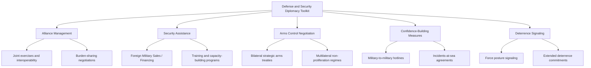

## Defense, Security, and Military Diplomacy

### Definition and Scope

Defense, security, and military diplomacy refers to the peacetime application of military and security-sector resources, personnel, and relationships to achieve foreign policy objectives — building alliances, deterring adversaries, managing crises short of war, and shaping the security posture of partner states. It encompasses formal alliance management, bilateral defense cooperation, arms control negotiation, security assistance programs, and confidence-building measures, distinguishing itself from combat operations by its focus on relationship-building and deterrence rather than the direct application of force.

**Key Points**

- Military diplomacy is conducted primarily by defense attachés, military officers in diplomatic roles, and defense ministry officials, operating alongside but distinct from traditional foreign ministry diplomatic staff.
- The field spans a spectrum from routine peacetime engagement (attaché relationships, joint exercises, officer exchange programs) to high-stakes crisis diplomacy (deterrence signaling, arms control negotiation, de-escalation channels during confrontation).
- Security diplomacy increasingly extends beyond conventional military cooperation to encompass cyber security cooperation, intelligence-sharing arrangements, and hybrid/gray-zone threat coordination.

### Historical Development

Military diplomacy in its modern institutional form traces to the establishment of permanent military attaché systems in the late 19th century, as European powers formalized dedicated military representation within embassies to gather intelligence and manage bilateral defense relationships. The Cold War fundamentally shaped the contemporary field, producing formal alliance structures (NATO, 1949; the Warsaw Pact, 1955) and extensive superpower-aligned security assistance programs as instruments of bloc competition. Arms control diplomacy matured significantly during this period through bilateral US-Soviet negotiations (SALT I and II, the 1972 Anti-Ballistic Missile Treaty, the 1987 Intermediate-Range Nuclear Forces Treaty) alongside multilateral frameworks like the Nuclear Non-Proliferation Treaty (NPT, 1968). The post-Cold War period saw expansion of confidence-building measures and cooperative security frameworks (NATO's Partnership for Peace, 1994) alongside growing security assistance to fragile and post-conflict states. The 2010s-2020s marked renewed great-power military diplomacy intensity, including NATO enlargement and reinforcement following Russia's actions in Ukraine (2014 and 2022), the erosion of several major bilateral arms control agreements (US withdrawal from the INF Treaty in 2019, uncertainty around New START's future), and growing attention to cyber and space domains as new arenas for security diplomacy and deterrence signaling.

### Core Institutional Architecture

**Key Points**

- **Defense Attachés and Military Diplomatic Missions**: Uniformed officers posted to embassies, managing bilateral military relationships, intelligence liaison, and defense cooperation program administration, operating under diplomatic status but reporting through defense ministry channels.
- **Formal Alliance Structures**: Treaty-based collective defense arrangements (NATO's Article 5 mutual defense commitment, various bilateral defense treaties) requiring ongoing diplomatic maintenance of interoperability, burden-sharing, and political cohesion.
- **Security Assistance and Foreign Military Sales Programs**: State-administered programs (e.g., US Foreign Military Sales/FMS and Foreign Military Financing/FMF) providing partner states with equipment, training, and financing, functioning simultaneously as capability-building and influence-building instruments.
- **Arms Control Verification Bodies**: Specialized institutions overseeing treaty compliance (e.g., the Organisation for the Prohibition of Chemical Weapons/OPCW under the Chemical Weapons Convention, the International Atomic Energy Agency's/IAEA's nuclear safeguards role).
- **Multilateral Security Dialogue Forums**: Track-1 and track-1.5 platforms (Shangri-La Dialogue, Munich Security Conference, ASEAN Regional Forum) providing structured venues for defense officials and experts to engage across adversarial and allied relationships alike.

### The Military Diplomacy Toolkit

### Alliance Diplomacy Mechanics

**Key Points**

- **Collective defense commitment maintenance**: Formal mutual defense treaties (e.g., NATO Article 5, the US-Japan Security Treaty) require continuous diplomatic reinforcement of credibility, since deterrence value depends heavily on adversary and ally perception of genuine commitment.
- **Burden-sharing negotiation**: Recurring diplomatic friction over defense spending contributions among allies (e.g., NATO's 2% GDP defense spending guideline, subsequently raised toward higher targets at recent summits), reflecting persistent tension between collective benefit and individual member cost-bearing incentives.
- **Interoperability diplomacy**: Joint military exercises and standardization agreements (e.g., NATO STANAGs) serve a dual technical and diplomatic function — building actual operational capability while signaling alliance cohesion to both allies and adversaries.
- **Extended deterrence assurance**: Nuclear-armed allies' extended deterrence commitments to non-nuclear allies (e.g., US extended deterrence to NATO members and to Japan/South Korea) require ongoing diplomatic reassurance mechanisms (nuclear planning consultations, forward-deployed capability discussions) to maintain credibility.

[Inference] The relationship between formal defense spending targets (like NATO's 2% guideline) and actual military capability or alliance cohesion is a subject of ongoing debate among defense analysts; spending levels are a commonly used proxy metric but do not by themselves fully capture capability contribution or interoperability quality.

### Arms Control and Non-Proliferation Diplomacy

**Key Points**

- **Bilateral strategic arms control**: US-Russia nuclear arms control agreements (START series, New START) have historically provided the most extensive verification and limitation framework for the world's largest nuclear arsenals, though the framework has faced growing strain and uncertainty regarding extension or replacement.
- **Multilateral non-proliferation regimes**: The Nuclear Non-Proliferation Treaty (NPT) remains the foundational multilateral instrument, built around a three-pillar structure (non-proliferation, disarmament, peaceful nuclear energy access), administered with IAEA safeguards verification.
- **Chemical and biological weapons regimes**: The Chemical Weapons Convention (CWC, 1993) and Biological Weapons Convention (BWC, 1972) establish prohibition norms, though the BWC notably lacks a formal verification mechanism comparable to the OPCW's role under the CWC.
- **Regional and issue-specific frameworks**: Nuclear-weapon-free zone treaties (e.g., Treaty of Tlatelolco for Latin America), missile technology control regimes (MTCR), and export control coordination bodies (Wassenaar Arrangement, Australia Group) supplement the core global non-proliferation architecture.

### Comparative Model: Alliance Diplomacy vs. Arms Control Diplomacy

| Dimension | Alliance Diplomacy | Arms Control Diplomacy |
| --- | --- | --- |
| Primary objective | Build/maintain cohesive deterrent capability among partners | Limit or reduce capability, often among adversaries |
| Typical relationship | Cooperative among allies | Adversarial or competitive, requiring verification trust-building |
| Core mechanism | Joint exercises, interoperability standards, burden-sharing | Treaty negotiation, verification regimes, confidence-building measures |
| Representative institution | NATO, bilateral defense treaties | New START, NPT, CWC/OPCW |
| Key vulnerability | Burden-sharing disputes, credibility erosion | Verification disputes, treaty withdrawal risk |

### Confidence-Building and Crisis Communication Mechanisms

**Key Points**

- **Military-to-military hotlines**: Direct communication channels (originating with the 1963 US-Soviet Moscow-Washington hotline established after the Cuban Missile Crisis) designed to reduce miscalculation risk during crises.
- **Incidents at Sea and Air agreements**: Bilateral protocols (e.g., the 1972 US-Soviet Incidents at Sea Agreement) establishing operational safety procedures to prevent military encounters from escalating unintentionally.
- **Pre-notification of military exercises**: Confidence-building measures under frameworks like the OSCE's Vienna Document requiring advance notification of significant military activities to reduce surprise-attack fears.
- **Track-1.5 and Track-2 defense dialogues**: Informal or semi-official dialogues involving retired officials, academics, and current officials in a personal capacity, used to maintain communication channels during periods of formal diplomatic tension.

### Practical Example: Security Assistance as Alliance-Building Instrument

A state seeking to deepen a strategic partnership with a developing-country partner typically structures security assistance diplomacy as follows:

1. **Needs and interoperability assessment** — defense attachés and security cooperation officials assess the partner's existing capability gaps and strategic priorities.
2. **Foreign Military Sales/Financing negotiation** — equipment transfer terms are negotiated, often bundled with financing arrangements (grants, concessional loans, or financing guarantees) to make acquisition feasible for the partner state.
3. **Training and joint exercise program design** — officer exchange programs, joint exercises, and technical training build both operational capability and personal relationships between officer corps that persist across political transitions.
4. **Ongoing diplomatic reinforcement** — regular defense ministerial dialogues and attaché engagement maintain the relationship, often paired with broader diplomatic and economic engagement to reinforce the strategic partnership.

**Example**

This sequence closely parallels standard practice under programs like US Foreign Military Sales combined with International Military Education and Training (IMET) — equipment transfer paired with officer training programs designed to build both technical interoperability and long-term relationship capital with a partner state's future military leadership, a pattern widely documented in security cooperation literature as a durable influence-building mechanism independent of any single arms transaction.

### Diagram: Defense and Security Diplomacy Actor Network

<svg xmlns="http://www.w3.org/2000/svg" viewBox="0 0 800 460">
<text x="400" y="30" font-size="18" font-weight="bold" text-anchor="middle" fill="#1a1a1a">Defense and Security Diplomacy Actor Network (svg_diagram)</text>
<circle cx="400" cy="240" r="70" fill="#2c5f8a" stroke="#1a1a1a" stroke-width="2" />
<text x="400" y="235" font-size="12" text-anchor="middle" fill="#fff">Defense</text>
<text x="400" y="252" font-size="12" text-anchor="middle" fill="#fff">Ministry / Attachés</text>
<rect x="40" y="90" width="180" height="70" rx="8" fill="#3d8361" stroke="#1a1a1a" stroke-width="2" />
<text x="130" y="120" font-size="12" text-anchor="middle" fill="#fff">Allied States</text>
<text x="130" y="140" font-size="11" text-anchor="middle" fill="#dfd">Alliance / interoperability</text>
<rect x="580" y="90" width="180" height="70" rx="8" fill="#8a3e3e" stroke="#1a1a1a" stroke-width="2" />
<text x="670" y="120" font-size="12" text-anchor="middle" fill="#fff">Adversary States</text>
<text x="670" y="140" font-size="11" text-anchor="middle" fill="#eee">Arms control / deterrence</text>
<rect x="40" y="370" width="180" height="70" rx="8" fill="#a8763e" stroke="#1a1a1a" stroke-width="2" />
<text x="130" y="400" font-size="12" text-anchor="middle" fill="#fff">Partner States</text>
<text x="130" y="420" font-size="11" text-anchor="middle" fill="#eee">Security assistance recipients</text>
<rect x="580" y="370" width="180" height="70" rx="8" fill="#7a3e8a" stroke="#1a1a1a" stroke-width="2" />
<text x="670" y="400" font-size="12" text-anchor="middle" fill="#fff">Verification Bodies</text>
<text x="670" y="420" font-size="11" text-anchor="middle" fill="#eee">IAEA, OPCW</text>
<line x1="220" y1="130" x2="345" y2="215" stroke="#555" stroke-width="2" />
<line x1="580" y1="130" x2="455" y2="215" stroke="#555" stroke-width="2" stroke-dasharray="5,5" />
<line x1="220" y1="400" x2="345" y2="270" stroke="#555" stroke-width="2" />
<line x1="580" y1="400" x2="455" y2="270" stroke="#555" stroke-width="2" />
</svg>

### Contemporary Challenges

- **Arms control architecture erosion**: The lapse or withdrawal from several major bilateral arms control treaties (INF Treaty withdrawal in 2019) and uncertainty surrounding New START's future has reduced the verified-limitation architecture between the world's two largest nuclear arsenals.
- **Emerging domain governance gaps**: Cyber and space domains lack mature arms control or confidence-building frameworks comparable to nuclear and conventional weapons regimes, creating governance gaps as these domains grow in strategic significance.
- **Burden-sharing friction within alliances**: Persistent political tension over defense spending contribution levels among allied states, complicating alliance cohesion messaging to adversaries.
- **Proliferation risk amid regional tensions**: Renewed proliferation concerns in regions with heightened security competition, testing the durability of the NPT framework's normative and verification architecture.
- **Gray-zone and hybrid threat ambiguity**: Growing use of below-threshold hybrid tactics (cyber operations, disinformation, proxy forces) complicates traditional deterrence and alliance-response diplomacy, since such actions often fall short of triggering formal collective defense mechanisms.

### Related Topics

- NATO Alliance Management and Burden-Sharing Diplomacy
- Nuclear Arms Control: New START, NPT, and Verification Regimes
- Foreign Military Sales and Security Assistance Program Design
- Confidence-Building Measures and Crisis Communication Hotlines
- Cyber Security Diplomacy and Gray-Zone Threat Coordination
- Resource and Energy Diplomacy (Strategic Overlap in Deterrence Contexts)
- Track-Two Defense Dialogues and Informal Security Engagement
- Extended Deterrence and Alliance Credibility Management