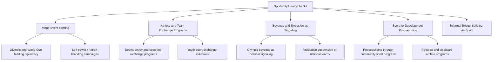

## Sports Diplomacy

### Definition and Scope

Sports diplomacy is the deliberate use of sporting events, athletes, and sport-related exchange programs as instruments of foreign policy — building international goodwill, projecting soft power, opening communication channels between estranged states, and pursuing broader diplomatic or commercial objectives through the medium of sport. It functions both as a form of public diplomacy (engaging foreign publics directly) and, in specific historical instances, as a substantive channel for track-two or even formal state-to-state contact where conventional diplomatic relations are limited or absent.

**Key Points**

- Sports diplomacy operates at multiple levels: mega-event hosting diplomacy (Olympics, World Cup), athlete exchange and "sport for development" programming, and crisis-adjacent uses of sport as a communication bridge between adversarial states.
- The field draws heavily on soft power theory, treating sport's broad cultural resonance and emotional engagement as an unusually effective vehicle for national image projection compared to more conventional diplomatic messaging.
- Sports diplomacy is frequently state-sponsored but executed through nominally independent bodies (national Olympic committees, sports federations), creating a degree of plausible deniability and normative insulation from direct government control that governments often find diplomatically useful.

### Historical Development

Modern sports diplomacy is often traced to the revival of the Olympic Games in 1896 under Pierre de Coubertin, explicitly framed around internationalist ideals of peaceful competition transcending national rivalry, though the Games have simultaneously functioned as an arena for nationalist prestige projection since their inception. The most frequently cited landmark case is "Ping-Pong Diplomacy" (1971), in which an unplanned exchange between American and Chinese table tennis players at the World Championships in Japan led to a formal invitation for the US team to visit China, providing the public opening that preceded Henry Kissinger's secret diplomatic visit and Nixon's subsequent 1972 China visit — widely regarded as the canonical example of sport creating diplomatic opening where formal channels were closed. The Cold War period more broadly saw the Olympics repeatedly weaponized for political messaging, including the US-led boycott of the 1980 Moscow Olympics (following the Soviet invasion of Afghanistan) and the Soviet-led retaliatory boycott of the 1984 Los Angeles Olympics. The post-Cold War period saw growing attention to "sport for development and peace" programming (formalized through UN recognition, including the 2001 establishment of the UN Office on Sport for Development and Peace) and increasingly sophisticated state investment in mega-event hosting as a soft power and, in some analyses, "sportswashing" strategy.

### Core Institutional Architecture

**Key Points**

- **International Olympic Committee (IOC) and International Sports Federations**: Nominally apolitical governing bodies (IOC, FIFA, and sport-specific federations) that nonetheless make consequential diplomatically significant decisions (host selection, athlete eligibility, national team recognition/suspension).
- **National Olympic Committees and Sports Ministries**: State or quasi-state bodies managing national team participation and, increasingly, explicit sports diplomacy strategy coordination with foreign ministries.
- **UN Office on Sport for Development and Peace (legacy function, since absorbed into broader UN mechanisms)**: Historically coordinated sport-based development programming as a soft, cooperative diplomatic tool distinct from mega-event hosting diplomacy.
- **Government Sports Diplomacy Units**: Some foreign ministries maintain dedicated sports diplomacy programming (e.g., the US State Department's Sports Diplomacy Division, administering athlete exchange and Sports Envoy programs).
- **Host City/Country Organizing Committees**: Ad hoc bodies created for specific mega-events, operating at the intersection of sporting logistics and significant diplomatic and commercial negotiation with the IOC/FIFA and participating nations.

### The Sports Diplomacy Toolkit

### Mega-Event Hosting Diplomacy

**Key Points**

- **Bidding as diplomatic competition**: Olympic and World Cup host selection processes involve extensive diplomatic lobbying of IOC/FIFA voting members, often intertwined with broader bilateral relationship-building and, in some documented historical cases, corruption scandals affecting bid integrity.
- **Nation-branding function**: Successful hosting is used to project a curated national image to a global audience, particularly valuable for states seeking to reshape international perception (e.g., post-authoritarian transition states, rapidly developing economies establishing global standing).
- **"Sportswashing" critique**: A now widely used (though contested) term describing the use of high-profile sports event hosting or sponsorship to divert attention from, or improve international perception despite, a state's human rights record or other reputationally damaging conduct; the term itself carries normative judgment and its application to specific cases remains subject to genuine political and scholarly debate.
- **Legacy and cost controversy**: Mega-event hosting frequently generates substantial public expenditure with contested long-term economic benefit, creating a recurring domestic political tension between diplomatic/soft-power objectives and fiscal accountability critiques.

[Inference] Empirical research on mega-event hosting's actual soft power return on investment is mixed; while hosting demonstrably increases short-term media visibility and can shift some perception metrics, the durability and diplomatic conversion of that visibility into concrete foreign policy outcomes is difficult to isolate from other concurrent factors and remains a genuinely contested question among soft power researchers.

### Sport as Diplomatic Bridge-Building

**Key Points**

- **Ping-Pong Diplomacy (1971)**: The archetypal case of an ostensibly apolitical sporting exchange providing the public cover and confidence-building signal that enabled a subsequent major diplomatic breakthrough (US-China rapprochement) between states with no formal diplomatic relations at the time.
- **Cricket diplomacy**: India-Pakistan cricket matches have repeatedly served as informal diplomatic touchpoints, with head-of-state attendance at matches used as a signal of thaw during periods of otherwise frozen formal relations.
- **Korean unification symbolism**: Joint or unified Korean teams at various international sporting events (including instances at the Olympics) have functioned as high-visibility, low-commitment symbolic gestures during periods of inter-Korean diplomatic engagement.
- **Structural limitation**: Sport-based diplomatic openings are generally understood in the literature as most effective at creating symbolic openings and public permission structures for elites to pursue formal diplomacy, rather than substituting for substantive negotiation itself.

### Comparative Model: Sports Diplomacy Functions

| Function | Mechanism | Representative Example |
| --- | --- | --- |
| Bridge-building between estranged states | Athlete/team exchange creating public opening for formal contact | Ping-Pong Diplomacy (US-China, 1971) |
| Soft power / nation-branding | Mega-event hosting and associated media coverage | Olympic and World Cup hosting campaigns |
| Political signaling / sanction | Boycotts, exclusions, or team suspensions | 1980/1984 Olympic boycotts; federation suspensions |
| Development and peacebuilding | Community-level sport programming | UN-affiliated sport for development initiatives |
| Reputational management | High-visibility hosting/sponsorship amid reputational concerns | Contested "sportswashing" cases across various recent mega-events |

### Boycotts and Exclusion as Diplomatic Signaling

**Key Points**

- **State-led boycotts**: Politically motivated national withdrawal from participation in a sporting event, most prominently the reciprocal 1980 Moscow and 1984 Los Angeles Olympic boycotts during the Cold War, used as a low-cost (relative to more severe options) diplomatic signal of disapproval.
- **Federation-imposed exclusion**: International sports federations independently suspending or excluding a national federation or team, often in response to state conduct (armed conflict, governance violations, doping scandals), functioning as a form of normative sanction distinct from state-level diplomatic action.
- **Athlete-level accommodation mechanisms**: Frameworks allowing individual athletes from excluded or stateless populations to compete under neutral status (e.g., IOC Refugee Olympic Team, neutral-flag competition arrangements) attempt to separate athlete-level participation from state-level political signaling.

[Unverified] The actual diplomatic effectiveness of sporting boycotts in achieving their stated policy objectives (as opposed to symbolic value alone) is contested in the historical and political science literature; the 1980/1984 boycotts, for instance, are generally not credited with altering the underlying policies (Soviet withdrawal timeline from Afghanistan) they were intended to protest.

### Practical Example: Sports Diplomacy Sequence During Diplomatic Thaw

A pattern observed across multiple historical cases of using sport to advance a broader diplomatic opening:

1. **Low-risk symbolic gesture** — an invitation or exchange involving athletes (rather than officials) is arranged, providing plausible deniability and low political cost if the gesture does not lead anywhere.
2. **Public and media framing** — the exchange receives significant media coverage, building domestic public constituency and international goodwill signal ahead of any formal political announcement.
3. **Elite-level follow-through** — having tested public reaction and established a communication channel, senior officials pursue substantive diplomatic engagement, often initially informal or secret before a public announcement.
4. **Institutionalization**: Successful diplomatic openings are frequently followed by expanded formal sports and cultural exchange programming as part of routinizing the improved relationship.

**Example**

This sequence maps closely onto the historical Ping-Pong Diplomacy case: the 1971 table tennis exchange (low-risk symbolic gesture with extensive media coverage) preceded Kissinger's secret 1971 visit to Beijing (elite-level follow-through), which in turn preceded Nixon's public 1972 visit and the subsequent normalization process — illustrating how sport-based diplomatic openings typically function as a preliminary confidence-building signal rather than a substitute for the substantive diplomatic negotiation that follows.

### Diagram: Sports Diplomacy Function Map

<svg xmlns="http://www.w3.org/2000/svg" viewBox="0 0 800 460">
<text x="400" y="30" font-size="18" font-weight="bold" text-anchor="middle" fill="#1a1a1a">Sports Diplomacy Function Map (svg_diagram)</text>
<circle cx="400" cy="240" r="70" fill="#2c5f8a" stroke="#1a1a1a" stroke-width="2" />
<text x="400" y="235" font-size="12" text-anchor="middle" fill="#fff">Sport as</text>
<text x="400" y="252" font-size="12" text-anchor="middle" fill="#fff">Diplomatic Vehicle</text>
<rect x="40" y="90" width="180" height="70" rx="8" fill="#3d8361" stroke="#1a1a1a" stroke-width="2" />
<text x="130" y="120" font-size="12" text-anchor="middle" fill="#fff">Bridge-Building</text>
<text x="130" y="140" font-size="11" text-anchor="middle" fill="#dfd">Ping-Pong Diplomacy model</text>
<rect x="580" y="90" width="180" height="70" rx="8" fill="#a8763e" stroke="#1a1a1a" stroke-width="2" />
<text x="670" y="120" font-size="12" text-anchor="middle" fill="#fff">Soft Power / Branding</text>
<text x="670" y="140" font-size="11" text-anchor="middle" fill="#eee">Mega-event hosting</text>
<rect x="40" y="370" width="180" height="70" rx="8" fill="#8a3e3e" stroke="#1a1a1a" stroke-width="2" />
<text x="130" y="400" font-size="12" text-anchor="middle" fill="#fff">Political Signaling</text>
<text x="130" y="420" font-size="11" text-anchor="middle" fill="#eee">Boycotts / exclusions</text>
<rect x="580" y="370" width="180" height="70" rx="8" fill="#7a3e8a" stroke="#1a1a1a" stroke-width="2" />
<text x="670" y="400" font-size="12" text-anchor="middle" fill="#fff">Development / Peace</text>
<text x="670" y="420" font-size="11" text-anchor="middle" fill="#eee">Community sport programs</text>
<line x1="220" y1="130" x2="345" y2="215" stroke="#555" stroke-width="2" />
<line x1="580" y1="130" x2="455" y2="215" stroke="#555" stroke-width="2" />
<line x1="220" y1="400" x2="345" y2="270" stroke="#555" stroke-width="2" />
<line x1="580" y1="400" x2="455" y2="270" stroke="#555" stroke-width="2" />
</svg>

### Contemporary Challenges

- **"Sportswashing" scrutiny intensification**: Growing media, civil society, and academic scrutiny of state and state-linked investment in sport hosting, sponsorship, and club ownership as a reputational management strategy, creating reputational risk for both host states and sporting institutions perceived as facilitating it.
- **Governance and corruption concerns in host selection**: Persistent scandals affecting IOC and FIFA bid processes have complicated the credibility of mega-event hosting as a clean diplomatic instrument.
- **Athlete activism and political neutrality tension**: Growing athlete willingness to make political statements during competition creates tension with traditional sport-governing-body neutrality norms and complicates state-level diplomatic messaging control.
- **Geopolitical fragmentation risk**: Rising great-power tension increases risk of politically motivated boycotts or exclusions affecting future mega-events, potentially undermining sport's claimed function as a neutral bridging space.
- **Refugee and statelessness representation**: Ongoing institutional development required to meaningfully represent stateless and displaced athlete populations within a state-centric international sporting competition structure.

### Related Topics

- Ping-Pong Diplomacy and Cold War Sport-Based Diplomatic Openings
- Olympic Boycotts and Political Signaling Through Sport
- "Sportswashing" Debates and Reputational Diplomacy
- Mega-Event Hosting Bids and IOC/FIFA Governance
- Sport for Development and Peace Programming
- Cultural Diplomacy and Soft Power Projection
- Public Diplomacy and Nation Branding
- Athlete Activism and the Politics of Sporting Neutrality