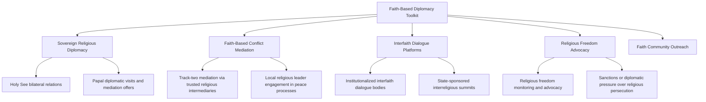

## Religious and Faith-Based Diplomacy

### Definition and Scope

Religious and faith-based diplomacy is the deliberate engagement of religious actors, institutions, and identity as instruments and venues of international relations — encompassing state outreach to religious communities as a foreign policy tool, faith-based organizations acting as independent or quasi-diplomatic mediators, and the strategic use of religious freedom, interfaith dialogue, and religious leader engagement to advance broader diplomatic objectives. It operates alongside, and is analytically distinct from, the study of religion as a driver of conflict; faith-based diplomacy specifically addresses religion's constructive and instrumental deployment in diplomatic practice.

**Key Points**

- The field spans state-led religious engagement (government offices dedicated to religious freedom or faith community outreach), religious institution-led diplomacy (the Holy See's diplomatic corps, faith-based mediation of conflicts), and track-two interfaith dialogue initiatives.
- Faith-based diplomacy is frequently deployed where formal state-to-state channels are constrained, leveraging religious leaders' perceived moral authority and cross-border community trust networks unavailable to conventional diplomats.
- The Holy See (Vatican) represents a unique case of a religious institution possessing full sovereign diplomatic status, maintaining formal diplomatic relations with the majority of UN member states and conducting conventional state-to-state diplomacy alongside its religious mission.

### Historical Development

Religious actors have functioned as diplomatic intermediaries since antiquity, but the modern institutional form of faith-based diplomacy is most clearly traceable through the Holy See's continuous diplomatic tradition, formalized through the 1929 Lateran Treaty establishing Vatican City's sovereign status and enabling its extensive modern diplomatic corps. The post-Cold War period saw significant academic and policy attention to "religious peacebuilding" following high-profile faith-based mediation successes, notably the Community of Sant'Egidio's role in mediating the 1992 Mozambique peace accords, frequently cited as a landmark case demonstrating non-state religious actors' capacity for substantive conflict mediation. The September 11, 2001 attacks and subsequent "War on Terror" period prompted substantial growth in government attention to religious engagement as a security and diplomatic priority, including the establishment of dedicated government religious engagement offices (such as the US State Department's Office of International Religious Freedom, formalized through the 1998 International Religious Freedom Act, and subsequently a broader Religion and Global Affairs office). Interfaith diplomatic initiatives expanded further through the 2000s-2010s, including institutionalized dialogues such as the KAICIID (King Abdullah bin Abdulaziz International Centre for Interreligious and Intercultural Dialogue, established 2012) and growing Gulf-state religious diplomacy initiatives.

### Core Institutional Architecture

**Key Points**

- **The Holy See's Diplomatic Corps**: A fully sovereign diplomatic service maintaining formal bilateral relations with the majority of world states, including papal nuncios (ambassadors) and active participation in multilateral forums, uniquely combining religious authority with conventional sovereign diplomatic status.
- **Faith-Based Mediation Organizations**: Non-state religious bodies conducting conflict mediation, most notably the Community of Sant'Egidio (Catholic lay organization active in numerous African and other conflict mediations) and various Quaker, Mennonite, and interfaith mediation networks operating on principles of impartial moral engagement.
- **Government Religious Engagement Offices**: State bodies dedicated to religious freedom advocacy and faith community diplomatic outreach (e.g., the US State Department's international religious freedom apparatus, the UK's Freedom of Religion or Belief envoy).
- **Interfaith Dialogue Institutions**: Formal multilateral or state-sponsored interfaith platforms (KAICIID, the Parliament of the World's Religions, various UN-affiliated interfaith initiatives) providing structured venues for religious leader engagement across traditions.
- **Religious NGO Networks**: Faith-based humanitarian and development organizations (Catholic Relief Services, Islamic Relief, World Vision) that frequently possess uniquely trusted access in conflict and crisis contexts due to community-level religious legitimacy.

### The Faith-Based Diplomacy Toolkit

### The Holy See as a Unique Diplomatic Actor

**Key Points**

- **Sovereign status basis**: Vatican City's sovereignty, established by the 1929 Lateran Treaty with Italy, provides the Holy See (distinct from Vatican City State itself, as the Holy See is the governing authority recognized in international law) with full diplomatic personality, including treaty-making capacity and UN observer status.
- **Moral authority as diplomatic asset**: Papal moral authority, extending across a global Catholic population, provides distinctive leverage for diplomatic interventions on issues like poverty, migration, and conflict, exemplified by papal roles in facilitating dialogue during periods of political transition or conflict.
- **Historical mediation role**: The Holy See has periodically played direct mediation roles in interstate disputes (most notably Vatican mediation of the Beagle Channel dispute between Argentina and Chile in the late 1970s-1980s, a widely cited successful case of papal diplomatic mediation preventing armed conflict).
- **Multilateral engagement**: The Holy See maintains permanent observer status at the UN and active engagement in international negotiations on issues aligned with Catholic social teaching (development, disarmament, migration, environmental policy).

[Inference] The Holy See's combination of full diplomatic sovereignty with a globally distributed religious constituency is frequently described in diplomatic studies as structurally unique among world actors, though the practical diplomatic influence this combination confers varies significantly by issue area and geopolitical context, and should not be overstated as uniformly decisive across all cases where the Holy See engages.

### Faith-Based Conflict Mediation

**Key Points**

- **Trust and access advantages**: Religious mediators often possess community-level trust and physical access in conflict zones that conventional state or international organization diplomats lack, particularly where conflict has religious or communal dimensions.
- **Sant'Egidio model**: The Community of Sant'Egidio's mediation approach, most prominently in the 1992 Mozambique peace process (ending a 16-year civil war), is frequently analyzed as a template for non-state religious mediation combining sustained relationship-building, strict impartiality, and patient, low-profile engagement over extended timeframes.
- **Limitations and risks**: Faith-based mediators can face credibility challenges in conflicts where the mediator's own religious affiliation is perceived as partial to one side, requiring careful selection of mediating actors whose specific tradition or reputation provides cross-communal trust rather than reinforcing division.
- **Complementarity with formal diplomacy**: Faith-based mediation is generally most effective as a complement to, rather than substitute for, formal state and multilateral diplomatic processes, often operating in preparatory or parallel tracks that create conditions for eventual formal negotiation.

### Comparative Model: State Religious Engagement vs. Faith-Based Mediation

| Dimension | State Religious Engagement Diplomacy | Faith-Based Conflict Mediation |
| --- | --- | --- |
| Primary actor | Government religious freedom/engagement offices | Non-state religious organizations (Sant'Egidio, Holy See) |
| Primary objective | Religious freedom advocacy, faith community outreach | Direct conflict resolution facilitation |
| Legitimacy basis | State authority and international human rights norms | Community trust, perceived moral neutrality |
| Typical venue | Bilateral diplomatic engagement, multilateral human rights forums | Direct, often confidential engagement with conflict parties |
| Representative case | US International Religious Freedom monitoring and advocacy | Sant'Egidio's Mozambique mediation (1992) |

### Religious Freedom as a Diplomatic Priority

**Key Points**

- **International Religious Freedom Act (1998, US)**: Established formal US government mechanisms for monitoring and responding to religious freedom violations globally, including designation of "Countries of Particular Concern" subject to potential diplomatic or economic consequences.
- **UN and multilateral frameworks**: Article 18 of the Universal Declaration of Human Rights and subsequent covenants establish the normative international human rights basis for religious freedom advocacy, though enforcement mechanisms remain limited to diplomatic pressure and reporting rather than binding sanctions in most cases.
- **Religious persecution as diplomatic friction point**: State treatment of religious minorities frequently becomes a significant bilateral diplomatic issue, occasionally triggering formal diplomatic protest, sanctions consideration, or asylum/refugee policy responses in affected third countries.
- **Tension with sovereignty norms**: Religious freedom advocacy diplomacy regularly encounters host-government resistance framed around non-interference in domestic affairs, creating recurring diplomatic friction similar to broader human rights diplomacy dynamics.

[Unverified] The comparative effectiveness of religious freedom-focused diplomatic pressure (such as Countries of Particular Concern designations) in producing actual policy change within targeted states, versus primarily serving a symbolic or domestic political signaling function, is disputed in the human rights diplomacy literature, with mixed case-specific findings.

### Practical Example: Faith-Based Track-Two Mediation Sequence

A pattern commonly observed in faith-based conflict mediation initiatives:

1. **Relationship pre-positioning** — a religious mediating organization builds long-term, low-visibility relationships with conflict parties well before active mediation begins, often through humanitarian or pastoral presence rather than explicit political engagement.
2. **Trust-based access negotiation** — the mediator's perceived impartiality and community standing enable access to conflict party leadership that formal diplomatic channels may lack, particularly with non-state armed actors wary of state-affiliated mediators.
3. **Confidential facilitated dialogue** — extended, patient, often confidential negotiation sessions are convened, distinct from the more time-pressured and publicly visible format of formal state-led peace conferences.
4. **Handoff or parallel engagement with formal diplomacy** — successful faith-based mediation frequently transitions into or runs parallel with formal international-community-backed peace processes, providing the substantive groundwork for eventual formal agreement signing.

**Example**

This sequence closely mirrors the documented Sant'Egidio-facilitated Mozambique peace process: years of relationship-building and humanitarian presence preceded formal mediation sessions in Rome, which were conducted with sustained confidentiality and patience over roughly two years before producing the 1992 General Peace Agreement — illustrating how faith-based mediation's distinctive value often lies in sustained, low-profile trust-building that complements rather than replaces eventual formal diplomatic agreement processes.

### Diagram: Faith-Based Diplomacy Actor Network

<svg xmlns="http://www.w3.org/2000/svg" viewBox="0 0 800 460">
<text x="400" y="30" font-size="18" font-weight="bold" text-anchor="middle" fill="#1a1a1a">Faith-Based Diplomacy Actor Network (svg_diagram)</text>
<circle cx="400" cy="240" r="70" fill="#2c5f8a" stroke="#1a1a1a" stroke-width="2" />
<text x="400" y="235" font-size="12" text-anchor="middle" fill="#fff">Conflict Parties /</text>
<text x="400" y="252" font-size="12" text-anchor="middle" fill="#fff">Host States</text>
<rect x="40" y="90" width="180" height="70" rx="8" fill="#3d8361" stroke="#1a1a1a" stroke-width="2" />
<text x="130" y="120" font-size="12" text-anchor="middle" fill="#fff">Holy See</text>
<text x="130" y="140" font-size="11" text-anchor="middle" fill="#dfd">Sovereign diplomatic status</text>
<rect x="580" y="90" width="180" height="70" rx="8" fill="#a8763e" stroke="#1a1a1a" stroke-width="2" />
<text x="670" y="120" font-size="12" text-anchor="middle" fill="#fff">Sant'Egidio / Faith</text>
<text x="670" y="140" font-size="11" text-anchor="middle" fill="#eee">Mediation NGOs</text>
<rect x="40" y="370" width="180" height="70" rx="8" fill="#8a3e3e" stroke="#1a1a1a" stroke-width="2" />
<text x="130" y="400" font-size="12" text-anchor="middle" fill="#fff">Government Religious</text>
<text x="130" y="420" font-size="11" text-anchor="middle" fill="#eee">Engagement Offices</text>
<rect x="580" y="370" width="180" height="70" rx="8" fill="#7a3e8a" stroke="#1a1a1a" stroke-width="2" />
<text x="670" y="400" font-size="12" text-anchor="middle" fill="#fff">Interfaith Dialogue</text>
<text x="670" y="420" font-size="11" text-anchor="middle" fill="#eee">Platforms (KAICIID)</text>
<line x1="220" y1="130" x2="345" y2="215" stroke="#555" stroke-width="2" />
<line x1="580" y1="130" x2="455" y2="215" stroke="#555" stroke-width="2" />
<line x1="220" y1="400" x2="345" y2="270" stroke="#555" stroke-width="2" />
<line x1="580" y1="400" x2="455" y2="270" stroke="#555" stroke-width="2" />
</svg>

### Contemporary Challenges

- **Instrumentalization risk**: Growing scrutiny of whether state-sponsored interfaith initiatives serve genuine dialogue objectives or function primarily as reputational management amid other human rights or governance concerns.
- **Rising religious persecution amid limited enforcement tools**: Documented rise in religious minority persecution in multiple regions continues to outpace the practical diplomatic and legal tools available to address it effectively.
- **Religious nationalism and diplomatic complication**: Growing entanglement of religious identity with nationalist politics in several states complicates traditional faith-based diplomatic engagement premised on religion's capacity to transcend narrow political division.
- **Mediator neutrality maintenance**: As faith-based mediation organizations become more prominent and internationally visible, maintaining the perceived neutrality that underpins their access and effectiveness becomes more challenging.
- **Digital-era religious extremism and diplomacy**: Growing need for faith-based diplomatic engagement to address online radicalization and transnational religious extremist networks, a domain requiring new tools beyond traditional interfaith dialogue models.

### Related Topics

- The Holy See's Diplomatic Corps and Sovereign Status
- Faith-Based Conflict Mediation: The Sant'Egidio Model
- International Religious Freedom Policy and Countries of Particular Concern
- Interfaith Dialogue Institutions (KAICIID and Comparable Bodies)
- Humanitarian Diplomacy and Faith-Based NGO Networks
- Track-Two Diplomacy and Informal Mediation Channels
- Public Diplomacy and Soft Power Projection
- Religious Nationalism and Its Diplomatic Implications