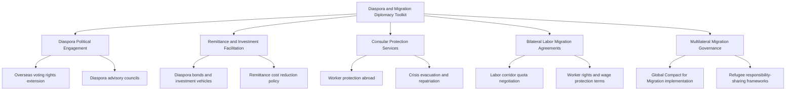

## Diaspora and Migration Diplomacy

### Definition and Scope

Diaspora and migration diplomacy encompasses two interconnected but analytically distinct fields: diaspora diplomacy, the deliberate engagement by home states with their overseas diaspora communities as instruments of soft power, economic development, and political influence; and migration diplomacy, the interstate negotiation of migration flows, labor mobility, border management, and refugee protection as a substantive foreign policy domain in its own right. Together they address how population movement and diasporic identity shape and are shaped by international relations.

**Key Points**

- Diaspora diplomacy is primarily home-state-initiated, focused on maintaining or building affective, economic, and political ties with citizens and co-ethnics abroad.
- Migration diplomacy is primarily interstate, focused on negotiating the terms, volume, and management of population movement between origin, transit, and destination states.
- Both fields have grown substantially in diplomatic prominence as remittance flows have become a major development finance source and as migration has become an increasingly salient and often contentious domestic political issue in destination states.

### Historical Development

Diaspora engagement by home states has historical antecedents in various emigrant-sending nations' consular support networks, but the field's modern institutionalization accelerated significantly from the 1990s-2000s as sending states recognized the scale of diaspora remittances and potential investment/lobbying capacity. India's establishment of the Ministry of Overseas Indian Affairs (2004, later merged into the Ministry of External Affairs) and the Philippines' longstanding, highly developed Overseas Filipino Worker (OFW) support and remittance-facilitation apparatus are frequently cited as mature examples of institutionalized diaspora engagement. Migration diplomacy's modern multilateral architecture developed more slowly given persistent state sovereignty sensitivities around migration policy; the 1951 Refugee Convention and its 1967 Protocol established the foundational international refugee protection framework, while broader labor migration and mixed-migration governance remained largely bilateral or regional until the 2018 adoption of the Global Compact for Safe, Orderly and Regular Migration (GCM) and the parallel Global Compact on Refugees, representing the first comprehensive (though non-binding) global migration governance frameworks negotiated under UN auspices.

### Core Institutional Architecture

**Key Points**

- **Dedicated Diaspora Ministries/Agencies**: State bodies specifically managing diaspora engagement (e.g., India's diaspora affairs functions within the Ministry of External Affairs, the Philippines' Department of Migrant Workers, established 2022, consolidating prior OFW support functions).
- **UN Migration Agencies**: The International Organization for Migration (IOM, a UN-affiliated body since 2016) coordinates migration management support and humanitarian assistance; UNHCR holds the core mandate for refugee protection under the 1951 Convention framework.
- **Bilateral Labor Migration Agreements**: Formal government-to-government agreements governing labor migration corridors, particularly prominent in Gulf state-South/Southeast Asian labor migration relationships and various seasonal agricultural worker programs.
- **Remittance and Diaspora Investment Facilitation Bodies**: Specialized financial and policy mechanisms (diaspora bonds, remittance-linked development finance instruments) designed to channel diaspora economic capacity toward home-country development objectives.
- **Regional Migration Governance Frameworks**: Regional consultative processes (e.g., the Colombo Process for Asian labor migration, the Rabat Process for Euro-African migration dialogue) providing structured, non-binding venues for regional migration policy coordination.

### The Diaspora and Migration Diplomacy Toolkit

### Diaspora Engagement Mechanisms

**Key Points**

- **Extended political rights**: Many sending states extend overseas voting rights, dual citizenship provisions, or diaspora parliamentary representation to formalize diaspora political inclusion and cultivate ongoing political loyalty.
- **Diaspora bonds and investment vehicles**: Sovereign debt instruments marketed specifically to diaspora investors (India and Israel are frequently cited as having issued diaspora bonds successfully) leveraging affective ties for below-market-rate development financing.
- **Remittance facilitation and cost reduction**: Given remittances' scale as a development finance source (frequently exceeding official development assistance in aggregate value for many sending states), governments and multilateral bodies (World Bank remittance price monitoring) actively pursue policies to reduce transfer costs and formalize remittance channels.
- **Return migration and skills transfer programs**: Initiatives encouraging diaspora professionals to return temporarily or permanently, or to contribute expertise remotely, addressing "brain drain" concerns through structured "brain circulation" programming.

[Inference] The empirical relationship between diaspora political engagement mechanisms (such as overseas voting) and measurable increases in diaspora investment or remittance behavior is not conclusively established in the migration and development literature; while frequently assumed to be mutually reinforcing, rigorous causal evidence connecting specific political engagement policies to economic outcomes is limited.

### Migration Diplomacy as Interstate Negotiation

**Key Points**

- **Labor migration corridor negotiation**: Bilateral agreements governing structured labor migration flows (particularly prominent in Gulf Cooperation Council states' relationships with South and Southeast Asian labor-sending countries) balance sending-state worker protection demands against receiving-state labor market and quota preferences.
- **Border and transit cooperation agreements**: Diplomatic arrangements (often controversial) in which destination or transit states negotiate migration control cooperation with origin or intermediate transit states, sometimes linked to development aid or trade concessions as diplomatic leverage.
- **Refugee responsibility-sharing negotiations**: Persistent diplomatic difficulty in achieving equitable international burden-sharing for refugee protection, with the substantial majority of global refugee populations hosted by neighboring low- and middle-income states rather than wealthier states more distant from crisis origins.
- **Return and readmission agreements**: Bilateral agreements governing the return of migrants without legal status to their origin states, frequently a diplomatically sensitive negotiation point given asymmetric power dynamics between destination and origin states.

### Comparative Model: Diaspora Diplomacy vs. Migration Diplomacy

| Dimension | Diaspora Diplomacy | Migration Diplomacy |
| --- | --- | --- |
| Primary direction | Home state toward its emigrant population | Interstate negotiation of movement terms |
| Core objective | Maintain loyalty, mobilize remittances/investment, extend political community | Manage flows, protect migrants/refugees, negotiate labor mobility |
| Primary instruments | Diaspora bonds, overseas voting, consular services | Bilateral labor agreements, border cooperation, refugee frameworks |
| Key tension | Balancing diaspora inclusion with host-country integration expectations | Balancing sovereignty control with humanitarian and labor mobility interests |
| Representative case | Philippines' OFW support apparatus, India's diaspora bonds | GCC-South Asia labor corridors, EU-Turkey migration cooperation |

### Global Migration Governance Architecture

**Key Points**

- **Global Compact for Safe, Orderly and Regular Migration (GCM, 2018)**: The first comprehensive, non-binding UN framework addressing migration governance holistically, covering labor mobility, migrant rights, and cooperative governance principles, though several major destination states declined to formally adopt it, reflecting persistent sovereignty sensitivities.
- **Global Compact on Refugees (2018)**: A parallel, complementary framework focused specifically on refugee responsibility-sharing and building more predictable and equitable international support mechanisms for major refugee-hosting states.
- **1951 Refugee Convention and 1967 Protocol**: The foundational binding legal framework establishing refugee status determination and the principle of non-refoulement (prohibition on returning refugees to situations of persecution).
- **Regional Consultative Processes (RCPs)**: Non-binding regional dialogue mechanisms (Colombo Process, Rabat Process, Bali Process) providing structured but voluntary venues for migration policy coordination among origin, transit, and destination states within a region.

[Unverified] The practical policy impact of non-binding frameworks like the GCM on actual state migration practice, as distinct from their normative and coordination value, remains difficult to assess empirically and is a subject of ongoing debate among migration governance scholars, given the frameworks' explicitly non-binding character and highly uneven state engagement.

### Practical Example: Labor Migration Corridor Diplomacy

A sending state negotiating improved terms for its overseas workers in a major labor-receiving state typically pursues the following sequence:

1. **Bilateral labor agreement negotiation** — the sending state negotiates minimum wage protections, working condition standards, and recruitment fee regulations with the receiving state's labor ministry.
2. **Consular protection infrastructure** — the sending state establishes or expands labor attaché and consular support capacity in major destination cities to handle worker disputes, health emergencies, and repatriation needs.
3. **Remittance channel formalization** — parallel financial diplomacy addresses formal banking and remittance transfer arrangements to reduce transfer costs and encourage use of formal (rather than informal, less protected) remittance channels.
4. **Crisis response coordination** — the sending state maintains standing evacuation and repatriation protocols for crisis scenarios (regional conflict, natural disaster, pandemic-related disruption) affecting its overseas worker population.

**Example**

This sequence closely mirrors the well-documented institutional apparatus the Philippines has developed for its overseas Filipino worker population — encompassing bilateral labor agreements with Gulf states and other major host countries, an extensive network of labor attachés, dedicated remittance facilitation programs, and demonstrated large-scale repatriation capacity exercised during various regional crises — illustrating how migration and diaspora diplomacy function as integrated rather than separate policy domains for major labor-sending states.

### Diagram: Diaspora and Migration Diplomacy Flow

<svg xmlns="http://www.w3.org/2000/svg" viewBox="0 0 800 460">
<text x="400" y="30" font-size="18" font-weight="bold" text-anchor="middle" fill="#1a1a1a">Diaspora and Migration Diplomacy Flow (svg_diagram)</text>
<rect x="40" y="90" width="200" height="90" rx="8" fill="#2c5f8a" stroke="#1a1a1a" stroke-width="2" />
<text x="140" y="125" font-size="13" text-anchor="middle" fill="#fff">Origin / Sending</text>
<text x="140" y="145" font-size="12" text-anchor="middle" fill="#fff">State</text>
<text x="140" y="163" font-size="11" text-anchor="middle" fill="#cde">Diaspora engagement</text>
<rect x="300" y="90" width="200" height="90" rx="8" fill="#3d8361" stroke="#1a1a1a" stroke-width="2" />
<text x="400" y="125" font-size="13" text-anchor="middle" fill="#fff">Diaspora / Migrant</text>
<text x="400" y="145" font-size="12" text-anchor="middle" fill="#fff">Population</text>
<text x="400" y="163" font-size="11" text-anchor="middle" fill="#dfd">Remittances, investment</text>
<rect x="560" y="90" width="200" height="90" rx="8" fill="#a8763e" stroke="#1a1a1a" stroke-width="2" />
<text x="660" y="125" font-size="13" text-anchor="middle" fill="#fff">Destination /</text>
<text x="660" y="145" font-size="12" text-anchor="middle" fill="#fff">Receiving State</text>
<text x="660" y="163" font-size="11" text-anchor="middle" fill="#eee">Labor migration terms</text>
<line x1="240" y1="135" x2="300" y2="135" stroke="#555" stroke-width="2" marker-end="url(#arrow3)" />
<line x1="500" y1="135" x2="560" y2="135" stroke="#555" stroke-width="2" marker-end="url(#arrow3)" />
<line x1="140" y1="180" x2="660" y2="180" stroke="#999" stroke-width="1.5" stroke-dasharray="4,4" />
<text x="400" y="205" font-size="11" text-anchor="middle" fill="#777">Direct bilateral labor migration agreement</text>
</svg>

### Contemporary Challenges

- **Securitization of migration policy**: Growing framing of migration as a security concern in many destination states complicates cooperative migration diplomacy and increases reliance on border externalization arrangements with transit states.
- **Refugee responsibility-sharing imbalance**: Persistent concentration of refugee hosting responsibility among neighboring low- and middle-income states, with limited progress on more equitable international burden-sharing despite the Global Compact on Refugees framework.
- **Migrant worker protection gaps**: Continued documented labor rights violations in several major labor migration corridors despite bilateral agreement frameworks, reflecting enforcement and monitoring capacity limitations.
- **Climate-driven displacement governance gap**: Existing international legal frameworks (centered on the 1951 Refugee Convention's persecution-based definition) do not clearly encompass climate-driven displacement, creating an acknowledged governance gap as climate-related displacement grows.
- **Diaspora political engagement double-edged nature**: Home-state diaspora engagement can generate destination-state suspicion regarding dual loyalty or foreign influence concerns, particularly amid heightened geopolitical competition, complicating diaspora communities' integration and diplomatic utility simultaneously.

### Related Topics

- Global Compact for Migration and Global Compact on Refugees
- Remittance Economics and Diaspora Bond Financing
- Bilateral Labor Migration Agreements (Gulf-South Asia Corridor Model)
- 1951 Refugee Convention and Non-Refoulement Principle
- Climate-Induced Displacement and Governance Gaps
- Consular Protection and Crisis Repatriation Diplomacy
- Development Diplomacy and Foreign Aid (Remittance Overlap)
- Border Externalization and Transit-State Migration Cooperation