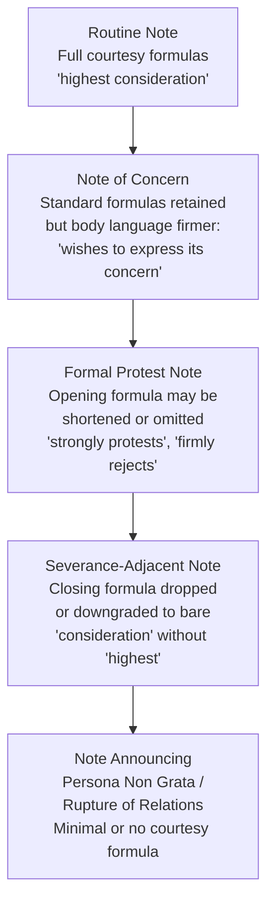

## Diplomatic Correspondence and Note Verbale Conventions

### Overview

Diplomatic correspondence is the formal written communication system used between states, international organizations, and their representatives. It is governed by centuries of custom, codified partly in the Vienna Convention on Diplomatic Relations (1961), and enforced through strict conventions of form, tone, and protocol. The note verbale ("verbal note," despite being written) is the most common instrument within this system, used for routine, procedural, and formal communication between a diplomatic mission and a Ministry of Foreign Affairs (MFA), or between missions.

The core principle governing all diplomatic correspondence is that **form carries meaning**. Deviations from expected format, salutation, or courtesy phrasing are read as deliberate signals — of displeasure, urgency, or a shift in relations — even when the substantive content is neutral.

### Categories of Diplomatic Correspondence

**Key Points**

- **Note Verbale** — third-person, unsigned, most frequent instrument for routine business (visa requests, protests, notifications, scheduling)
- **Diplomatic Note (First-Person Note / Letter)** — signed, first-person, used for more personal or substantive communication from one head of mission to another or to a foreign minister
- **Aide-Mémoire** — an unsigned memorandum left after a meeting, summarizing points discussed or positions taken, to avoid misunderstanding
- **Non-Paper (Food-for-Thought Paper)** — informal, unofficial, unattributable document used to float ideas or positions without binding either side
- **Démarche** — not a document type per se, but an official representation or protest delivered orally and often followed up or accompanied by a note verbale
- **Circular Note** — a note verbale sent identically to multiple missions simultaneously (e.g., notifying all embassies of a national holiday closure)
- **Letters of Credence / Recall** — formal instruments accrediting or withdrawing an ambassador, presented to the head of state
- **Full Powers (Pleins Pouvoirs)** — formal authorization for a named individual to negotiate or sign a treaty on behalf of a state

### Note Verbale: Structural Conventions

A note verbale follows a rigid, near-invariant structure. Deviation from this structure is itself a form of communication.

**Standard Components**

1. **Heading/Reference** — issuing mission or ministry name, note number (e.g., No. 145/2026), date
2. **Opening Compliment (Courtesy Formula)** — the mandatory opening sentence identifying sender and recipient in the third person
3. **Body** — the substantive content, written entirely in the third person, typically opening with "has the honour to..."
4. **Closing Compliment** — mandatory closing courtesy formula, echoing the opening
5. **Signature Block** — no personal signature; instead the seal/stamp of the mission or ministry, sometimes an initial
6. **Enclosures** — noted if applicable

**Example**

> No. 214/2026
>
> The Embassy of [State A] presents its compliments to the Ministry of Foreign Affairs of [State B] and has the honour to inform the Ministry that Mr. John A. Smith has been appointed First Secretary at the Embassy, effective 1 October 2026.
>
> The Embassy of [State A] avails itself of this opportunity to renew to the Ministry of Foreign Affairs of [State B] the assurances of its highest consideration.
>
> [Seal of the Embassy of State A]
>
> Ministry of Foreign Affairs
>
> [City], [Date]

### The Grammar of Courtesy Formulas

Courtesy formulas are not decorative — they are a graduated scale of formality and rank-sensitivity, and using the wrong tier is a protocol error.

**Key Points**

- "Presents its compliments" — standard opening between missions and ministries (institution-to-institution)
- "Has the honour to" — standard verb of action preceding substantive content; omitting "the honour" in a context where it is expected can read as a snub
- "Avails itself of this opportunity to renew... the assurances of its highest consideration" — standard closing between missions and MFAs
- "Assurances of its highest consideration" (highest) vs. "assurances of its consideration" (lower, used between officials of unequal but not extreme rank difference) — the degree of the closing formula is calibrated to relative rank and relationship
- Between individuals (first-person notes), "with the assurance of my highest esteem" or "sincerely" variants apply instead

[Inference] The precise register of closing formula (e.g., "highest consideration" vs. plain "consideration") varies by national foreign ministry style guide, and mismatches are more likely to be noticed by career protocol officers than by general diplomatic staff.

### Tone and the Third-Person Convention

The note verbale's defining grammatical feature is impersonal, institutional voice:

- The **sender is the institution** (Embassy, Ministry, Mission), not the individual official
- No first-person pronouns ("I," "we") appear in the body
- The subject performing actions is the institution itself: "The Ministry regrets to inform..." / "The Embassy wishes to draw attention to..."
- This depersonalizes disputes: a protest note voices institutional displeasure without personally indicting an official, preserving room for future engagement

This convention allows diplomatic correspondence to carry firm — even harsh — substantive content while the *form* remains scrupulously polite, a hallmark of the system: **hostility of content, courtesy of form**.

### Escalation Through Register: Reading a Protest Note

Diplomatic protests are graded by omission and phrasing rather than by explicit escalation language.

**Key Points**

- Dropping "highest" from the closing formula, while retaining the rest, is a recognized and deliberate signal of displeasure
- Omitting the opening compliment entirely (rare) signals a severe rupture
- The word "protest" itself ("presents its protest" rather than "compliments") replaces the courtesy opening in strong protest notes
- Even hostile notes typically retain *some* closing formula, since its complete absence approaches signaling breakdown of relations

[Inference] The exact threshold at which a formula downgrade is "noticed" as intentional versus dismissed as stylistic variation depends on the sophistication of the receiving ministry's protocol office and the existing state of bilateral relations.

### Aide-Mémoire Conventions

An aide-mémoire is left behind after an oral communication (often a démarche) to ensure the other side has an accurate written record, reducing the risk of "lost in translation" disputes.

**Structural Features**

- No letterhead salutation/compliment formulas (unlike note verbale)
- No signature or seal — deliberately informal to emphasize it is a memory aid, not a binding instrument
- Often begins directly with the substantive point: "During the meeting of [date], [Minister] stated that..."
- Can be handed over unofficially, sometimes without formal receipt acknowledgment

**Example**

> Aide-Mémoire
>
> During the meeting held on 12 September 2026 between the Foreign Minister of State A and the Ambassador of State B, the following points were raised:
>
> 1. State A reiterated its concerns regarding the delimitation of the maritime boundary in Sector 7.
> 2. State A requested that State B suspend further survey activity pending bilateral technical consultations.
> 3. State A proposed that technical talks begin no later than 15 October 2026.

### Non-Papers (Food-for-Thought Papers)

Non-papers occupy a deliberately ambiguous status: they carry no official letterhead, no signature, and are explicitly "unofficial" — allowing negotiators to explore positions without committing their government.

**Key Points**

- No institutional markings (letterhead, seal, reference number)
- Often literally titled "Non-Paper" at the top
- Used to test reactions to a proposal before formal tabling
- Deniable: a state can distance itself from content in a non-paper without a formal retraction, since it was never "officially" presented
- Frequently used in multilateral negotiation settings (UN working groups, trade negotiations) to advance compromise language anonymously

[Inference] While widely used, the legal non-attributability of non-papers is a matter of diplomatic custom rather than codified international law, and their evidentiary weight in later disputes may be contested.

### Circular Notes

A circular note is a note verbale distributed identically to all or a defined class of missions accredited to a capital, typically for administrative or ceremonial matters.

**Example Use Cases**

- Notification of a national holiday and office closure
- General announcement of protocol changes (e.g., new procedures for diplomatic plates)
- Uniform notification of exchange rate for representation allowances
- Invitation to a multilateral ceremonial event

Circular notes retain full note verbale structural conventions but are addressed generically ("The Ministry of Foreign Affairs presents its compliments to the Diplomatic Missions accredited to [Capital]...").

### Numbering, Filing, and Reference Systems

**Key Points**

- Each note verbale carries a sequential reference number, typically reset annually (e.g., No. 001/2026)
- Reply notes cite the reference number of the note being answered ("with reference to Note No. 214/2026 of 15 September 2026...")
- Missing or incorrect reference citation can cause administrative confusion and, in politically sensitive exchanges, may itself be scrutinized for intent
- Archival copies are retained for treaty-interpretation and historical-record purposes; note verbale exchanges frequently constitute part of the *travaux préparatoires* or evidentiary record in international dispute resolution

### Language and Translation Protocol

**Key Points**

- Correspondence is typically issued in the sender's official language, sometimes with a courtesy translation attached
- Bilateral treaties and formal notes between states without a shared working language often specify an authoritative third language (historically French, increasingly English) for interpretation in case of textual divergence
- The UN and many multilateral bodies operate with designated official/working languages (Arabic, Chinese, English, French, Russian, Spanish at the UN), and note verbale practice within these bodies follows the organization's own house style rather than bilateral custom
- Mistranslation or ambiguous phrasing in a note verbale has historically been a source of genuine interstate dispute, reinforcing the premium placed on precise, formulaic language that minimizes interpretive latitude

### Digital-Era Adaptations

**Key Points**

- Many MFAs now transmit notes verbale via secure diplomatic email or dedicated portals rather than exclusively via physical delivery (note verbale by hand remains standard for the most formal or sensitive communications)
- Electronic notes verbale typically preserve the full traditional textual structure (compliments, third person, closing formula) even when delivered as a PDF attachment or through a diplomatic communication platform
- Time-stamping and delivery confirmation take on added evidentiary importance in electronic transmission, particularly for notes establishing legal notice (e.g., treaty withdrawal notifications, termination of agreements)

[Inference] Practice varies significantly by ministry; some foreign services still require original hard-copy note verbale for anything with legal effect (treaty notifications, boundary matters), reserving electronic transmission for routine administrative matters.

### Common Errors and Protocol Pitfalls

**Key Points**

- Using first-person voice in a note verbale (a first-person-note convention) blurs the personal/institutional distinction and is considered a drafting error
- Omitting the closing compliment in a routine (non-protest) note reads as an unintended slight
- Incorrect or outdated titulature (e.g., addressing a note to a minister who has left office, or using an incorrect honorific) is a frequently cited protocol embarrassment
- Failing to cite the reference number of the note being replied to
- Inconsistent formality register within a single note (mixing highly formal opening with casual body language)
- Sending a note verbale where a signed first-person note was protocolly expected (e.g., certain condolence or congratulatory communications customarily require a personal signature)

### Diplomatic Correspondence Register Comparison

| Instrument | Person | Signed | Formality | Typical Use |
| --- | --- | --- | --- | --- |
| Note Verbale | Third person | No (sealed) | High, formulaic | Routine/procedural business, protests |
| First-Person Note | First person | Yes | High, personal | Substantive communication between officials |
| Aide-Mémoire | Third person, direct | No | Medium | Written record of oral exchange |
| Non-Paper | Neutral/impersonal | No | Low, deniable | Exploratory position-testing |
| Circular Note | Third person | No (sealed) | High, formulaic | Identical mass notification |
| Démarche (oral, often followed by note) | N/A (oral) | N/A | High | Formal representation/protest |

### Sample Escalation Comparison: Routine vs. Protest Note Verbale

**Routine Note**

> The Embassy of [State A] presents its compliments to the Ministry of Foreign Affairs of [State B] and has the honour to request that a visa be issued to Mr. X, bearer of diplomatic passport No. 12345, for an official visit from 1–5 October 2026.
>
> The Embassy of [State A] avails itself of this opportunity to renew to the Ministry of Foreign Affairs of [State B] the assurances of its highest consideration.

**Protest Note**

> The Ministry of Foreign Affairs of [State B] presents its compliments to the Embassy of [State A] and has the honour to protest in the strongest terms the incursion of vessels flying the flag of [State A] into the territorial waters of [State B] on 10 September 2026, in violation of [relevant convention/agreement].
>
> The Ministry of Foreign Affairs of [State B] demands that the Government of [State A] take immediate steps to prevent recurrence of such incidents and reserves all rights under international law.
>
> The Ministry of Foreign Affairs of [State B] avails itself of this opportunity to renew to the Embassy of [State A] the assurances of its consideration.

Note the downgrade from "highest consideration" to plain "consideration" in the protest note's closing — a deliberate, calibrated signal.

### Practical Drafting Checklist

**Next Steps**

1. Confirm correct third-person institutional voice throughout the body
2. Verify recipient's exact current title and correct spelling/transliteration of names
3. Match courtesy formula register to the relationship and message intent (routine vs. protest)
4. Include correct reference number and cite any note being replied to
5. Confirm enclosures are listed and physically/digitally attached
6. Route through the mission's protocol or chancery section for review before transmission, particularly for politically sensitive content
7. Retain a dated, numbered copy in the mission's diplomatic archive

**Related Topics**

- Vienna Convention on Diplomatic Relations (1961) — legal framework underpinning mission privileges and communication norms
- Démarches and Formal Protest Procedures
- Diplomatic Titulature and Forms of Address
- Treaty Drafting and Authentic Text Conventions
- Diplomatic Immunity and Inviolability of Correspondence
- Protocol and Precedence in Multilateral Settings
- Crisis Communication and Back-Channel Diplomacy
- The Role of the Chancery/Protocol Office in Mission Operations