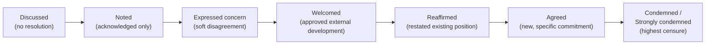
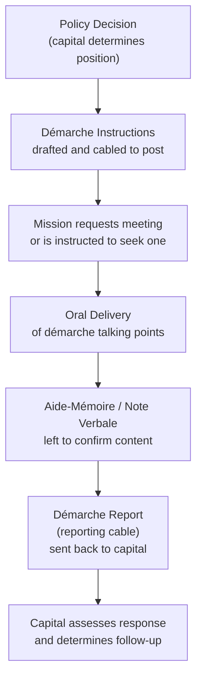

## Drafting Communiqués, Démarches, and Position Papers

### Overview

Communiqués, démarches, and position papers are three distinct instruments in the diplomatic toolkit, each serving a different function: the **communiqué** publicizes an outcome or joint stance, the **démarche** delivers and records an official representation or protest, and the **position paper** articulates and justifies a state's substantive stance for internal coordination or interlocutor persuasion. Where note verbale conventions (covered separately) govern routine institutional correspondence, these three instruments are higher-stakes, purpose-built documents that shape or record diplomatic outcomes.

### Communiqués

#### Definition and Function

A communiqué is a formal statement, typically issued jointly by two or more parties (or unilaterally by one), announcing the outcome, agreed positions, or conclusions of a meeting, summit, or negotiation. It is a **public-facing** instrument — its audience is not only the other party but domestic constituencies, third states, media, and international observers.

**Key Points**

- Distinguished from a treaty or agreement: a communiqué is generally **not legally binding** unless it explicitly creates obligations (rare, and usually accompanied by careful legal caveats)
- Serves as the authoritative public record of what was discussed and agreed, shaping how the meeting is interpreted after the fact
- Can be **joint** (issued by all parties, requiring line-by-line negotiation of every clause) or a **chair's statement / chair's summary** (issued unilaterally by the host, used when full consensus on a joint text is unachievable)
- The **absence** of a joint communiqué at the end of an expected summit is itself a diplomatically significant signal (often reported as "failure to reach consensus")

#### Structural Conventions

1. **Title/Heading** — identifies the parties, event, date, location (e.g., "Joint Communiqué of the [Nth] [Summit Name], [City], [Date]")
2. **Preambular Paragraphs** — context-setting: who met, why, under what auspices, reaffirming prior commitments or relationships
3. **Operative Paragraphs** — the substantive content: what was discussed, agreed, welcomed, condemned, or noted
4. **Forward-Looking Paragraph(s)** — next steps, future meetings, follow-up mechanisms
5. **Closing** — often no signature block (unlike a treaty); authenticated instead by simultaneous release from all parties' official channels

**Example (Joint Communiqué excerpt)**

> Joint Communiqué of the 14th Bilateral Strategic Dialogue, [City], [Date]
>
> 1. The delegations of [State A] and [State B] met on [date] for the 14th round of the Strategic Dialogue, co-chaired by [Title/Name] and [Title/Name].
> 2. The two sides reviewed progress on cooperation in the areas of trade, climate, and regional security, and reaffirmed their commitment to the principles set out in the [Year] Framework Agreement.
> 3. The two sides welcomed the conclusion of technical consultations on [issue] and agreed to convene a follow-up working group before the end of [year].
> 4. The two sides exchanged views on regional developments in [region] and agreed to maintain close consultation through existing channels.

#### The Diplomacy of Communiqué Drafting: Verb Calibration

Communiqué language is negotiated word-by-word, because the operative verb governing each paragraph signals the actual depth of agreement.

**Key Points**

- "Agreed" — genuine, specific consensus on an action or commitment
- "Welcomed" — approval of something already happening or decided elsewhere, without new commitment
- "Noted" — the weakest form of acknowledgment; records that a topic was raised without endorsing or opposing it — frequently used to paper over disagreement
- "Reaffirmed" — restates a pre-existing position, signaling continuity rather than new movement
- "Discussed" — even weaker than "noted" in some drafting traditions; indicates the topic came up with no resolution
- "Expressed concern regarding" — records disagreement or criticism without a full "condemned"
- "Condemned" / "strongly condemned" — highest register of censure in communiqué language, used deliberately and sparingly

[Inference] The precise hierarchy and connotation of these verbs varies somewhat by diplomatic tradition and language of drafting (English-language UN practice differs subtly from, e.g., ASEAN or EU communiqué conventions), so the ordering above reflects general international practice rather than a universally fixed protocol.

#### Communiqué Drafting Process

**Next Steps**

1. Pre-negotiation of a **draft skeleton** by working-level officials, often weeks in advance
2. Paragraph-by-paragraph negotiation, frequently continuing through the summit itself ("scrubbing" sessions)
3. Bracketing of disputed language `[text in brackets]` during drafting to indicate unresolved wording
4. Legal/linguistic review to ensure translated versions carry equivalent weight (a persistent risk area — see Language and Translation Protocol below)
5. Final sign-off at head-of-delegation level, often literally overnight before a summit's conclusion
6. Simultaneous release across all parties' official channels to prevent any single party from "getting ahead" of the announcement

### Démarches

#### Definition and Function

A démarche is a formal diplomatic approach made by a state (through its ambassador or a designated official) to the government of another state, to deliver an official position, request, protest, or warning. Unlike a communiqué, a démarche is typically **bilateral, often confidential**, and delivered orally, frequently accompanied or followed by a written aide-mémoire or note verbale to create a documentary record.

**Key Points**

- A démarche is an **action** (the act of approaching and delivering the message), not strictly a document type — but "démarche instructions" and the "démarche report" are standard written artifacts in the process
- Ranges in purpose from routine advocacy (urging a vote, requesting information) to serious protest (formal objection to a policy or action) to warning (signaling consequences if behavior continues)
- Delivered by the appropriate-rank official: routine démarches by desk officers or political counselors; serious démarches by the ambassador personally, sometimes summoned to the host MFA or summoning the other side's ambassador
- The **manner of delivery** (summoned vs. requesting a meeting; delivered by the ambassador vs. a subordinate) itself communicates the gravity of the message, parallel to the courtesy-formula grading in note verbale practice

#### The Démarche Document Lifecycle

#### Démarche Instructions: Structure

Démarche instructions are cabled from the capital (foreign ministry) to the field (embassy/mission) and typically contain:

1. **Classification and Precedence** — security classification, urgency level (e.g., ROUTINE, PRIORITY, IMMEDIATE)
2. **Subject Line** — concise statement of the démarche's purpose
3. **Background** — context the diplomat needs to understand the issue
4. **Talking Points** — the exact or near-exact language to be delivered, often numbered
5. **Points to Avoid / Do Not Say** — explicit guidance on language or commitments the diplomat must not make
6. **Requested Timing** — deadline by which the démarche should be delivered
7. **Reporting Instructions** — requirement and deadline to report back on the host government's reaction

**Example (Démarche Talking Points excerpt)**

> Subject: Démarche on [Issue] — Talking Points
>
> 1. [State A] takes note of recent developments regarding [issue] and wishes to convey the following concerns directly to the Government of [State B].
> 2. [State A] considers that [specific action/policy] is inconsistent with [relevant agreement/norm].
> 3. [State A] urges the Government of [State B] to [specific requested action] before [date/event].
> 4. [State A] wishes to be clear that failure to address this matter may affect [consequence, stated carefully].
>
> Points to Avoid: Do not speculate on specific retaliatory measures. Do not characterize this as an ultimatum.

#### Démarche Reporting Cable: Structure

After delivery, the diplomat reports back, typically including:

- Date, time, and setting of delivery; who was present on both sides
- Summary of how the démarche was delivered (verbatim or close paraphrase of key points made)
- The interlocutor's **reaction** — verbal response, body language, any counter-arguments offered
- Diplomat's own **assessment** of receptivity, likely follow-through, or risk of escalation
- Recommendations for next steps

[Inference] Exact cable formatting (headers, classification markings, cable numbering conventions) is ministry-specific and often itself classified; the structure above reflects commonly described general practice rather than any single service's mandated template.

### Position Papers

#### Definition and Function

A position paper is an internal or semi-public document that articulates a state's (or delegation's) substantive stance on an issue, along with the reasoning, evidence, and context supporting that stance. Unlike a communiqué (announces outcome) or démarche (delivers a message to another party), a position paper primarily serves **preparation, coordination, and persuasion** — briefing one's own negotiators, coordinating interagency positions, or being tabled at a multilateral forum to influence other delegations.

**Key Points**

- **Internal position papers** brief a state's own delegation/negotiators ahead of talks; not shared with counterparts
- **National position papers tabled at multilateral fora** (e.g., UN working groups, treaty negotiations) are explicitly shared to advocate a stance and shape the negotiating text
- Distinguished from a non-paper by attribution: a position paper is **officially attributed** to the issuing state, whereas a non-paper is deliberately unattributed/deniable
- Must be internally consistent with prior public statements and other states' known positions, since inconsistency can be exploited by adversarial delegations

#### Standard Structure

1. **Title and Issuing Authority** — clear statement of the issue and which state/delegation is issuing the paper
2. **Executive Summary** — the position stated in one or two sentences upfront
3. **Background/Context** — factual and legal context necessary to understand the issue
4. **Statement of Position** — the substantive stance, stated as clearly and unambiguously as possible
5. **Supporting Rationale** — legal, factual, historical, or strategic justification
6. **Response to Counter-Arguments** (optional but common in contested issues) — anticipatory rebuttal of the most likely opposing arguments
7. **Recommended Action / Call to Action** — what the paper asks the reader (own negotiators or other delegations) to do
8. **Annexes** — supporting data, legal citations, prior relevant statements

**Example (Position Paper excerpt, tabled format)**

> Position Paper of [State A] on [Agenda Item], submitted to [Forum/Committee], [Date]
>
> **I. Summary of Position**
>
> [State A] supports the inclusion of [specific provision] in the draft outcome document and opposes the alternative formulation proposed in document [reference].
>
> **II. Background**
>
> [Contextual and legal background, 2–4 paragraphs]
>
> **III. Rationale**
>
> [State A]'s position is grounded in [legal instrument/precedent], and is consistent with the approach adopted in [prior agreement/resolution].
>
> **IV. Recommendation**
>
> [State A] recommends that the Committee adopt the language contained in paragraph [X] of document [reference], and stands ready to engage in further consultations.

#### Position Paper Drafting Process

**Next Steps**

1. Interagency coordination (foreign ministry, relevant technical ministries, legal advisors) to establish the substantive position
2. Legal review to ensure consistency with existing treaty obligations and prior statements
3. Drafting by working-level desk officers, typically iterated through multiple internal drafts
4. Senior-level or ministerial approval before external circulation (if the paper is to be tabled)
5. Translation and terminology-consistency check if circulated multilingually
6. Distribution — either restricted to own delegation, or formally tabled/circulated to other delegations

### Comparative Summary

| Instrument | Primary Audience | Public? | Legally Binding? | Core Function |
| --- | --- | --- | --- | --- |
| Communiqué | Public, other party, third states | Yes (usually) | No (generally) | Announce outcome/agreed stance |
| Démarche | Foreign government (bilateral) | No (often confidential) | No | Deliver protest, request, or warning |
| Position Paper | Own delegation or other delegations | Sometimes (context-dependent) | No | Justify and coordinate substantive stance |

### Cross-Cutting Drafting Principles

**Key Points**

- **Precision over eloquence**: every word in these instruments may be parsed by legal advisors, media, or opposing negotiators; ambiguity is either a deliberate drafting tool (constructive ambiguity) or a serious error, never a neutral stylistic choice
- **Constructive ambiguity**: deliberately vague language used in communiqués and position papers to allow parties with differing underlying positions to accept the same text — a recognized and legitimate technique, but one that stores up interpretive disputes for later
- **Consistency across instruments**: a démarche's talking points should not contradict the country's position paper on the same issue tabled elsewhere; inconsistency is a diplomatic vulnerability
- **Register discipline**: position papers and démarche talking points are typically drafted in more direct, analytical prose than the formulaic courtesy language of note verbale, but démarche talking points still often open and close with note-verbale-style courtesy framing when delivered in writing

### Language and Translation Protocol

**Key Points**

- Communiqués issued jointly in multiple languages require a **terminology reconciliation** process, since a single English verb like "welcomed" may have several plausible translations of differing strength in another language
- Disputes over the "authentic" language version of a communiqué (which text controls in case of divergence) are rare but documented; specifying an authoritative language, or stating that all versions are equally authentic, is a standard drafting decision explicitly addressed in the document's closing lines
- Démarche talking points delivered orally in a third language (interpreter-mediated) carry particular translation risk; experienced practice includes providing the interpreter with the written talking points in advance to minimize on-the-spot paraphrase drift

[Inference] The degree of formal terminology reconciliation applied varies by the political sensitivity of the communiqué; low-stakes routine communiqués may not undergo the same rigorous multilingual scrubbing as summit-level joint statements.

### Common Errors and Pitfalls

**Key Points**

- Using a stronger operative verb ("agreed") than was actually achieved in negotiation, creating a false impression of consensus that surfaces later as a dispute
- Démarche talking points that stray from cabled instructions, creating a gap between what capital intended and what was delivered
- Position papers that ignore or fail to address the strongest counter-arguments, weakening persuasive credibility at the negotiating table
- Communiqué drafts left with unresolved bracketed text too close to release, forcing last-minute language that has not been properly vetted
- Failure to align position paper language with a state's own prior public statements, creating exploitable inconsistency

**Related Topics**

- Note Verbale and Diplomatic Correspondence Conventions
- Treaty Drafting and Authentic Text Conventions
- Constructive Ambiguity in International Agreements
- Multilateral Negotiation Procedure and Consensus-Building
- Diplomatic Cable Writing and Reporting Standards
- Crisis Communication and Back-Channel Diplomacy
- Interagency Coordination in Foreign Policy Formulation
- Summit Diplomacy and Joint Statement Negotiation