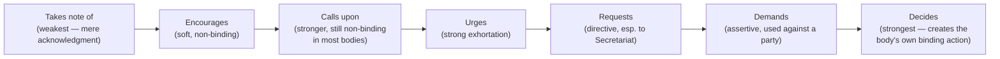
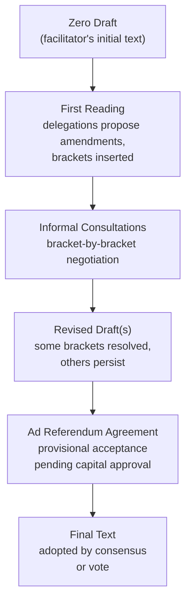

## Effective Writing for Multilateral Settings

### Overview

Multilateral writing differs fundamentally from bilateral diplomatic correspondence in its audience structure: instead of one sender addressing one recipient, a single text must be readable, translatable, and acceptable to dozens or hundreds of delegations simultaneously, often across multiple official languages, legal traditions, and negotiating blocs. Effective multilateral writing therefore optimizes for **clarity across translation, procedural durability, and negotiability** — the capacity of a text to survive amendment, compromise, and consensus-building without collapsing into contradiction.

This applies across the core multilateral document types: resolutions, decisions, draft outcome documents, statements delivered on behalf of groups, negotiating text with bracketed alternatives, and explanations of position/vote.

### Core Principles of Multilateral Drafting

**Key Points**

- **Translatability first**: sentences must survive translation into all working languages of the forum without losing legal precision — idioms, culturally specific metaphors, and complex subordinate clauses are avoided
- **Modularity**: paragraphs are drafted as self-contained units (operative paragraphs, preambular paragraphs) that can be individually amended, deleted, or voted on without disturbing the rest of the text
- **Precedent-consciousness**: language is frequently drawn from or deliberately echoes prior agreed texts (resolutions, communiqués) because previously agreed language is easier to get accepted again than novel phrasing
- **Neutral drafting for maximum acceptability**: especially in preambular material, language is chosen to be acceptable to the widest possible range of political positions, often through **constructive ambiguity**
- **Numbered, referenceable structure**: every paragraph is numbered so it can be individually cited, amended, or voted on during negotiation

### Anatomy of a Multilateral Resolution/Decision

Multilateral resolutions (UN General Assembly, Security Council, and most other multilateral bodies) follow a highly standardized two-part structure.

#### 1. Preambular Paragraphs (PPs)

- Establish context, legal basis, and prior relevant action
- Each paragraph typically begins with a **present or past participle** or introductory phrase, not a full independent verb
- Do not create binding obligations — they explain *why* the operative section follows
- Common opening formulas: *Recalling*, *Reaffirming*, *Noting*, *Noting with concern*, *Bearing in mind*, *Guided by*, *Convinced that*, *Having considered*, *Taking into account*, *Deeply concerned*, *Alarmed by*, *Welcoming*, *Expressing its appreciation*

#### 2. Operative Paragraphs (OPs)

- Contain the actual decisions, requests, or calls to action
- Each paragraph begins with a **present-tense active verb**, and paragraphs are numbered sequentially
- Common opening formulas: *Decides*, *Calls upon*, *Urges*, *Requests*, *Encourages*, *Reaffirms*, *Condemns*, *Demands*, *Welcomes*, *Invites*, *Takes note of*, *Recommends*, *Expresses its intention to*, *Authorizes*

**Example (Resolution Skeleton)**

> The [Body],
>
> *Recalling* its previous resolutions on [topic],
>
> *Reaffirming* the principles set out in [prior instrument],
>
> *Noting with concern* the continued [situation],
>
> 1. *Calls upon* all parties to [action];
> 2. *Requests* the Secretary-General to report on implementation within [timeframe];
> 3. *Decides* to remain seized of the matter.

#### Verb Strength Hierarchy in Operative Paragraphs

[Inference] The binding force of terms like "decides" or "demands" depends entirely on the legal character of the issuing body (e.g., UN Security Council Chapter VII resolutions are binding under the UN Charter, while General Assembly resolutions are generally recommendatory) — the verb itself does not confer binding force absent that underlying legal authority.

### Drafting for Consensus: Negotiating Text Conventions

Multilateral texts are drafted iteratively across many rounds of negotiation, using specific typographic and procedural conventions to track disagreement.

**Key Points**

- **Bracketed text** `[text]` — indicates language proposed but not yet agreed; a document "full of brackets" signals significant unresolved disagreement
- **Footnoted reservations** — a delegation's objection to specific language recorded without blocking the rest of the text from proceeding
- **Alternative formulations presented in parallel** — "Option 1 / Option 2" text blocks used when consensus has not converged on single wording
- **Ad referendum** — a delegation's provisional agreement to text pending final instructions from capital; text agreed "ad ref" can still be reopened
- **Silence procedure** — a text is considered adopted if no objection is raised by a stated deadline, commonly used for lower-stakes or time-pressured decisions
- **Package deals** — bundling multiple contested paragraphs together so concessions in one area are traded against gains in another, common in final-stage negotiations

### Statements Delivered on Behalf of Groups

Multilateral fora frequently feature statements made by one delegation on behalf of a negotiating bloc (e.g., the EU, the African Group, the Non-Aligned Movement, ASEAN, small island developing states groupings).

**Key Points**

- Group statements require **internal coordination and consensus-drafting** among all group members before delivery — often the most time-consuming part of preparing for a session
- Language must be acceptable to every member of the group, frequently resulting in more generalized or lowest-common-denominator phrasing than a national statement would use
- A delegation may deliver a **national statement in addition to** a group statement, to register nuances or emphases the group text could not capture
- Group statements typically open with an explicit self-identification formula: "I have the honour to speak on behalf of [Group]" or "On behalf of the [Group], I would like to..."

### Explanation of Position / Explanation of Vote

After a text is adopted (or voted on), delegations frequently deliver or submit a written **Explanation of Position (EOP)** or **Explanation of Vote (EOV)** to formally record reservations, interpretive understandings, or the reasons for their vote (yes/no/abstain), without blocking consensus or altering the adopted text itself.

**Key Points**

- Used when a delegation joins consensus but wants to record a caveat, differing interpretation, or dissociation from specific language
- Distinguished from a vote itself: an EOV can accompany any vote (including "yes"), clarifying *why* a delegation voted as it did
- Becomes part of the official meeting record and can be cited in future disputes over how a provision should be interpreted
- Typically structured: (1) statement of overall position (support/opposition/abstention and reason), (2) specific paragraphs of concern, (3) the delegation's understanding of ambiguous language, (4) forward-looking statement on implementation expectations

**Example (Explanation of Position excerpt)**

> [State A] joins consensus on this resolution but wishes to place on record its understanding that the reference to [term] in operative paragraph 5 does not create new obligations beyond those already assumed under [existing instrument]. [State A] further notes its continuing concern regarding the absence of a clear reporting mechanism in paragraph 7.

### Drafting Style Conventions

**Key Points**

- **Short, declarative sentences** are preferred over long compound constructions, both for translatability and for reducing ambiguity during line-by-line negotiation
- **Consistent terminology**: once a term is defined or used in a specific sense, it must be used identically throughout the document — synonyms introduce interpretive risk (a persistent drafting discipline distinct from ordinary prose style, where varied vocabulary is often valued)
- **Avoiding culturally specific idiom and metaphor**, which may not translate cleanly or may carry unintended connotations in another language
- **Gender-neutral and inclusive language** conventions are increasingly standard across UN and most contemporary multilateral drafting practice
- **Cross-referencing discipline**: paragraph and document references must be exact (correct symbol/document number, correct paragraph number) since multilateral texts are frequently amended across many drafts, and stale cross-references are a common drafting error

### Common Terminology and Document Symbols (UN Context)

**Key Points**

- **A/RES/[session]/[number]** — General Assembly resolution symbol
- **S/RES/[number]** — Security Council resolution symbol
- **PP / OP** — shorthand used by drafters themselves for Preambular Paragraph / Operative Paragraph during internal coordination
- **Non-paper**, **zero draft**, **revision 1/2/3 (Rev.1, Rev.2)** — successive iterations of a negotiating text
- **L-document** — a "limited distribution" draft resolution before formal adoption and renumbering

[Inference] Document symbol conventions above reflect standard UN practice; other multilateral bodies (WTO, regional organizations, treaty conference secretariats) use their own distinct symbol systems, though the underlying drafting logic (preamble/operative structure, iterative revision) is broadly comparable.

### Register and Tone Considerations

**Key Points**

- Multilateral drafting favors **institutional, impersonal voice** similar to note verbale convention, but the grammatical subject is the deliberative body itself ("The Assembly decides...") rather than a state or mission
- Persuasive or rhetorical flourish, common in national statements delivered orally, is generally stripped out of the adopted written text itself — rhetorical content belongs in the oral statement accompanying the vote, not the operative text
- Even sharply divided political issues are typically rendered in flat, procedural language in the adopted text, with genuine political disagreement pushed into explanations of position rather than the resolution's own wording

### Practical Drafting Workflow

**Next Steps**

1. Study precedent text: identify the closest prior agreed resolution/decision on the same or an adjacent topic to use as a drafting base
2. Draft preambular paragraphs establishing context and legal basis, using recognized introductory formulas
3. Draft operative paragraphs with carefully calibrated verbs matching the actual level of commitment sought
4. Circulate informally to gauge reaction before formal tabling, adjusting language proactively to preempt objections
5. Track brackets and alternative formulations systematically through each negotiating round
6. Coordinate with allied delegations/groups to build a supporting coalition before the text is finalized
7. Prepare an Explanation of Position in parallel, in case full agreement with the final text is not reached
8. Verify all cross-references, document symbols, and numbering are current in the final version before adoption

### Common Errors and Pitfalls

**Key Points**

- Using an operative verb stronger than the actual political consensus supports, provoking objections that could have been avoided with calibrated language
- Inconsistent terminology across paragraphs, creating ambiguity exploitable during implementation disputes
- Overly long, subordinate-clause-heavy sentences that translate poorly and slow consensus-building
- Failing to track which brackets were resolved in which negotiating round, leading to reintroduction of settled disputes
- Drafting a group statement without securing genuine buy-in from all group members, resulting in a public split during delivery
- Stale cross-references to earlier document revisions after renumbering

**Related Topics**

- Note Verbale and Diplomatic Correspondence Conventions
- Drafting Communiqués, Démarches, and Position Papers
- Multilateral Negotiation Procedure and Consensus-Building
- Treaty Drafting and Authentic Text Conventions
- Rules of Procedure in Multilateral Bodies (UNGA, UNSC, Specialized Agencies)
- Coalition-Building and Regional Group Coordination
- Interpretation and Translation in Multilateral Diplomacy
- Explanation of Vote Practice Across International Organizations