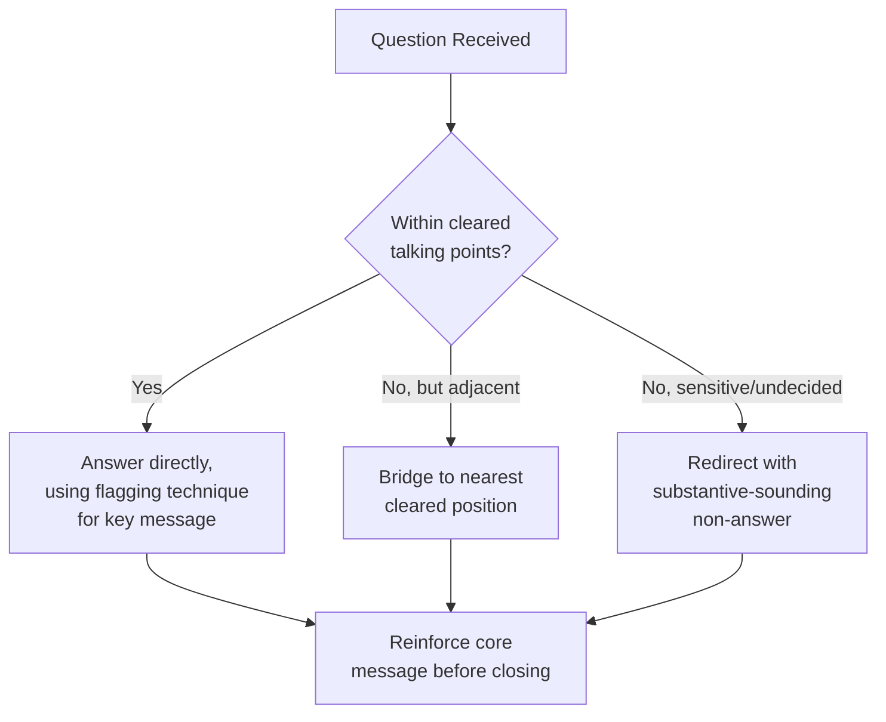

## Public Speaking and Presentation Skills for Diplomats

### Overview

Diplomatic public speaking differs from general public speaking in a critical respect: the speaker is rarely, if ever, speaking purely as an individual. Every word is heard as an expression of a government's position, and can be quoted, cited in future negotiations, reported by media, or used as precedent in later disputes. Effective diplomatic speaking therefore requires mastery of two simultaneous registers — **rhetorical craft** (clarity, persuasion, presence) and **institutional discipline** (precision, deniability management, consistency with prior statements). This item covers oral delivery, presentation structure, and the behavioral/protocol skills that distinguish diplomatic speaking from other professional public speaking contexts.

### Core Contexts for Diplomatic Speaking

**Key Points**

- **Formal statements at multilateral fora** — delivered from a prepared, cleared text, read closely to the approved wording (see Effective Writing for Multilateral Settings)
- **Bilateral meeting remarks** — often semi-scripted opening remarks followed by less formal exchange
- **Press conferences and media stakeouts** — high-risk, less controlled, frequently featuring hostile or probing questions
- **Toasts and ceremonial remarks** — a distinct genre with its own conventions (see below)
- **Briefings and internal presentations** — to own government, interagency counterparts, or visiting delegations; more analytically dense, less rhetorically constrained
- **Panel discussions and public diplomacy events** — think tanks, universities, cultural events, where the diplomat represents their country to a non-governmental audience

### The Discipline of "On/Off the Record" and Attribution Levels

Before any diplomatic speaking engagement, the attribution ground rules must be understood and respected, since violating them (by the diplomat or, when speaking, in noting the ground rules for others) causes real diplomatic harm.

**Key Points**

- **On the record** — statements may be quoted and attributed by name/title
- **On background** — content may be used but attributed only to a general source ("a senior [State] official," "a diplomat familiar with the talks")
- **Deep background** — content may be used without any attribution at all, often as unattributed context for a journalist's own analysis
- **Off the record** — content may not be published or used in any form; understood as purely informational for the listener
- Diplomats are trained to know which register applies at every moment of an engagement, including transitions (e.g., a press conference ends "on the record" but casual conversation afterward may shift registers, and diplomats must proactively clarify rather than assume)

[Inference] The precise terminology and its boundaries (particularly the line between "on background" and "deep background") vary somewhat by media culture and jurisdiction, and are sometimes explicitly negotiated with journalists at the start of an engagement rather than assumed as universally fixed.

### Structuring a Diplomatic Statement or Speech

#### Standard Structural Template

1. **Opening/Courtesies** — acknowledgment of host, chair, fellow delegates/dignitaries, in correct order of precedence
2. **Framing Statement** — establishes why the speaker's state is engaging with this topic, often linking to broader principle or prior commitment
3. **Substantive Body** — the core message, structured around a small number of clear points (three is a common convention for retention and clarity)
4. **National Position Statement** — explicit articulation of the state's stance, calibrated in strength to match cleared instructions
5. **Forward-Looking Close** — call to action, expression of continued engagement, or procedural next step
6. **Closing Courtesies** — thanks to chair/host, reiteration of goodwill where appropriate

**Example (Statement Opening, Multilateral Forum)**

> Mr./Madam Chair, distinguished delegates,
>
> My delegation wishes to thank the Secretariat for the comprehensive report before us today, and to align itself with the statement delivered earlier by [Group], while making the following additional remarks in its national capacity.

#### The "Rule of Three" and Message Discipline

**Key Points**

- Limiting core arguments to three memorable points improves audience retention and reduces the risk of diluting the state's key message
- Each point should be independently defensible if quoted in isolation, since press and other delegations frequently extract single lines from a longer statement
- Repetition of the core message (a "message triangle": state it, support it, restate it) increases the likelihood the intended takeaway survives media compression and translation

### Delivery Skills

#### Vocal and Physical Presence

**Key Points**

- **Pacing** — deliberate, moderate pace; diplomatic statements are frequently interpreted simultaneously, and speaking too quickly degrades interpretation quality and can distort the state's message in other languages
- **Pausing for interpretation** — in consecutive-interpretation settings, speakers must pause at natural clause boundaries to allow accurate rendering; failing to do so is a common and avoidable error by inexperienced diplomatic speakers
- **Volume and articulation** — consistent, controlled projection; avoiding filler words, which are particularly disruptive to interpreters
- **Eye contact and body language** — calibrated to be respectful within the cultural context of the audience; norms vary significantly (e.g., direct eye contact conventions differ across cultures) and diplomats are trained to adapt
- **Composure under pressure** — maintaining neutral, controlled affect even when provoked by a hostile question or a rival delegation's inflammatory remarks; visible anger or flustered response is read as a loss of control over the state's position

#### Working with Interpreters

**Key Points**

- Sharing a written text or talking points with interpreters in advance substantially improves rendering accuracy, particularly for technical or legal terminology
- Speaking in complete, grammatically self-contained sentences (rather than long run-on constructions) assists consecutive interpretation
- Avoiding idiom, wordplay, and culturally specific humor, which frequently do not survive interpretation and can create confusion or unintended offense
- In simultaneous interpretation settings, maintaining a steady pace (neither rushing nor pausing erratically) helps interpreters maintain the lag/lead time needed to render accurately

### Extemporaneous and Q&A Skills

Formal statements are typically read from cleared text, but press conferences, panel discussions, and Q&A sessions require the ability to speak from **talking points** rather than a full script, while remaining within cleared policy boundaries.

**Key Points**

- **Bridging technique** — acknowledging a question, then pivoting to the prepared key message, even when the literal question is not directly answered (a widely used, deliberate technique, not evasion by accident)
- **Flagging technique** — explicitly signaling the most important point before stating it ("The key point I want to leave you with is...") to ensure it survives media editing
- **Non-answer discipline** — recognizing questions that cannot be answered on the available instructions (e.g., matters still under internal deliberation, classified information, speculation about another state's internal politics) and redirecting without appearing evasive or hostile
- **"No comment" avoidance** — a bare "no comment" is often read as confirming sensitivity around a topic; trained diplomats typically use a substantive-sounding redirect instead ("That's a matter I'd refer you to [appropriate authority] on" / "We don't comment on hypotheticals")

### Toasts and Ceremonial Remarks

Ceremonial speaking (state dinners, signing ceremonies, commemorative events) follows its own distinct conventions, blending warmth with protocol precision.

**Key Points**

- Typically brief (often under three to five minutes), warmer in tone than a policy statement, but still requires correct titulature and order of precedence in addressing guests
- Standard structure: welcome/occasion framing → reflection on the bilateral relationship or shared history → forward-looking sentiment → toast proposal ("I ask you to join me in raising a glass to...")
- Genuine personal or historical color (anecdotes, shared cultural references) is more acceptable here than in formal policy statements, but must still avoid anything that could be read as a substantive policy commitment
- Reciprocal toasts (host toasts guest, guest toasts host in return) follow an expected order that mirrors precedence protocol

### Presentation Skills for Briefings

Internal or interagency briefings differ from public statements: they prioritize analytical clarity and actionable content over persuasive or ceremonial register.

**Key Points**

- Front-loaded structure ("bottom line up front" / BLUF) — the key assessment or recommendation stated at the outset, followed by supporting detail, rather than built up to at the end
- Clear separation of **fact, assessment, and recommendation**, so the audience can distinguish what is known, what is judged, and what is proposed
- Visual aids (maps, timelines, organization charts) used sparingly and only where they add clarity beyond what prose can convey
- Anticipation of likely follow-up questions, with supporting detail prepared but not necessarily included in the primary briefing to keep it concise

### Managing Hostile or Adversarial Settings

**Key Points**

- Maintaining composure and courteous tone even when directly provoked or insulted by a counterpart, since a public loss of composure damages the state's standing more than the original provocation
- Declining to respond in kind to personal attacks, redirecting instead to substantive position
- Recognizing when walking out, declining to respond, or requesting a point of order (in a formal multilateral session) is the calibrated response versus continuing to engage
- Awareness that hostile exchanges are frequently being recorded/reported, and that the diplomat's response is itself part of the public record that may be assessed later

[Inference] The appropriate threshold for walking out or invoking a formal point of order versus continuing to engage is highly context- and instruction-dependent, and experienced practitioners generally describe this as a judgment call informed by specific guidance from capital rather than a fixed rule.

### Preparation Workflow

**Next Steps**

1. Obtain and thoroughly internalize cleared talking points/instructions before any public engagement
2. Anticipate likely questions, including hostile or off-message ones, and rehearse bridging responses
3. Coordinate with interpreters in advance where relevant, sharing text or key terminology
4. Rehearse timing, particularly for formal statements subject to strict time limits in multilateral settings
5. Confirm protocol details in advance (order of precedence, correct titles for those being acknowledged, seating/staging arrangements)
6. Debrief after the engagement, reporting back to capital on how the statement was received and any follow-up required

### Common Errors and Pitfalls

**Key Points**

- Departing from cleared talking points in ways that create an unintended policy commitment or contradiction with prior statements
- Speaking too quickly for effective interpretation, distorting the message as received by other delegations
- Using idiom, humor, or culturally specific references that do not translate or that risk causing offense
- Visible loss of composure in response to a hostile question or provocation
- Bare "no comment" responses that inadvertently signal sensitivity
- Incorrect order of precedence or titulature in opening courtesies, which is noticed and can be read as a slight

**Related Topics**

- Diplomatic Correspondence and Note Verbale Conventions
- Effective Writing for Multilateral Settings
- Protocol and Precedence in Diplomatic Events
- Crisis Communication and Media Relations for Diplomats
- Working with Interpreters and Translators in Diplomacy
- Cross-Cultural Communication in Diplomatic Practice
- Public Diplomacy and Strategic Communication
- Negotiation Body Language and Nonverbal Communication