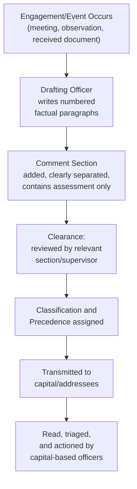

## Reporting and Cable-Writing Conventions

### Overview

The diplomatic cable (also called a dispatch, telegram, or reporting cable depending on service and era) is the core internal reporting instrument through which missions communicate with their capital, and through which capitals communicate instructions back to missions. Unlike note verbale or communiqués, cables are **internal government-to-government-within-the-same-government** documents — not addressed to a foreign counterpart, but written by field officers for readers in the home foreign ministry, and increasingly for wide interagency circulation. Cable-writing has its own settled conventions of structure, classification, precedence marking, and style, developed to allow large volumes of reporting to be triaged, read quickly, and acted upon reliably under time pressure.

### Historical and Technical Background

**Key Points**

- The term "cable" derives from the historical use of telegraph cables for diplomatic communication; the term persists in most foreign services even though transmission is now electronic
- Cables were traditionally transmitted in a fixed, terse telegraphic style to economize on transmission cost and time; this legacy still shapes cable style conventions (short paragraphs, numbered points, abbreviated syntax) even though transmission cost is no longer the binding constraint
- Modern cable systems are digital, integrated with classification and routing metadata, and typically searchable within a ministry's internal records system
- [Inference] Exact current transmission architecture (dedicated diplomatic networks vs. secure email-based systems) varies by foreign ministry and is generally not publicly documented in detail for security reasons; the structural and stylistic conventions described here reflect widely described general practice rather than any single service's specific technical system

### Cable Classification and Precedence

Every cable carries metadata governing who may read it and how urgently it must be handled.

**Key Points**

- **Classification levels** — typically a hierarchy such as Unclassified, Restricted/Confidential, Secret, Top Secret (exact terminology and thresholds vary by country), determining distribution and handling requirements
- **Precedence/priority markings** — indicate how quickly the cable must be transmitted and read, commonly a scale such as Routine, Priority, Immediate, Flash/Niact (night action — requires waking staff to act regardless of local time)
- **Distribution/routing lines** — specify which offices, bureaus, or individuals receive the cable, often including both the primary addressee (usually the capital's relevant regional or functional bureau) and information copies to other interested offices
- **Caveat/handling markings** — additional restrictions (e.g., no distribution to certain categories of personnel, or restrictions tied to intelligence-sharing arrangements) layered onto the base classification

[Inference] Specific classification terminology and precedence taxonomy differ by country; the categories above reflect commonly described general international practice rather than any single service's mandated system.

### Standard Cable Structure

1. **Header/Routing Block** — classification, precedence, originating post, date-time group, subject line, addressee(s)
2. **Summary Paragraph** — a "bottom line up front" (BLUF) opening, stating the cable's core point in one to three sentences before any supporting detail
3. **Numbered Substantive Paragraphs** — the body, broken into short, numbered paragraphs each covering a discrete point, following the telegraphic style tradition
4. **Comment/Assessment Section** — clearly separated from the factual reporting, containing the post's interpretation, confidence level, and significance judgment (mirroring the fact/assessment discipline central to debriefing practice)
5. **Action Requested/Recommendation** — explicit statement of what the capital is being asked to do, decide, or note, if anything
6. **Drafting/Clearance Line** — identifies the drafting officer and which other officers/sections cleared the cable before transmission, establishing accountability and institutional buy-in

**Example (Cable Skeleton)**

> CONFIDENTIAL — PRIORITY
>
> FROM: [Post]
>
> TO: [Ministry/Bureau], INFO: [Other addressees]
>
> SUBJECT: [Country] Foreign Minister Signals Openness to Resuming Trade Talks
>
> 1. SUMMARY: Foreign Minister [Name] told Ambassador on September 15 that [Country] is prepared to resume technical-level trade talks, though he declined to commit to a specific date. End summary.
> 2. [Substantive paragraph — factual account of the meeting]
> 3. [Additional substantive paragraph]
> 4. COMMENT: Post assesses the Minister's statement reflects genuine movement rather than a rhetorical gesture, given [supporting reasoning]. End comment.
> 5. ACTION REQUESTED: Department guidance requested on whether Post should propose specific dates for a first round of talks.

### The "Bottom Line Up Front" (BLUF) Convention

**Key Points**

- Cables are read by busy officials who may only have time to read the summary paragraph; the entire substantive judgment must therefore be recoverable from the opening lines alone
- The summary states the single most important conclusion or development, not simply a topic label ("Discusses trade relations" is a weak summary; "Minister signals openness to resuming trade talks but avoids committing to timeline" is a strong one)
- This convention is structurally distinct from narrative or chronological writing styles, and represents one of the most consistently emphasized skills in cable-writing training across foreign services

### Fact/Comment Separation

As in debriefing more broadly, cable-writing enforces a strict distinction between what was directly observed/said and the drafting officer's interpretation.

**Key Points**

- Substantive paragraphs report what occurred: statements made, actions observed, documents received
- The **Comment** section (sometimes literally bracketed as "Comment:" ... "End comment.") is where the post's own analysis, confidence level, and significance judgment belong
- This separation allows readers in the capital, who may have access to other reporting streams or context the field officer lacks, to weigh the raw facts independently of the post's interpretation
- Confidence-qualifying language in the Comment section ("we assess," "credible but unconfirmed," "consistent with prior reporting from [other source]") is a deliberate, trained convention rather than incidental hedging

### Style Conventions Specific to Cable Writing

**Key Points**

- **Short paragraphs, numbered sequentially** — a legacy of telegraphic transmission, retained because it allows precise cross-referencing ("see para 4") in follow-up correspondence
- **Active voice and concrete verbs** — preferred over passive constructions, both for clarity and to keep the actor of each statement unambiguous
- **Minimal adjectival/adverbial language** — cables favor factual precision over descriptive color; where a judgment about significance is warranted, it belongs explicitly in the Comment section rather than embedded through word choice in the factual narrative
- **Standardized abbreviations and acronyms** — many foreign services maintain an internal glossary of standard abbreviations for frequently referenced entities, reducing length while remaining unambiguous to trained readers
- **Explicit sourcing** — cables reporting information from a contact or third party typically characterize the reliability and access of the source ("per a working-level contact with direct knowledge of the negotiations" vs. "per press reporting, unconfirmed")

### Instruction Cables (Capital to Post)

Cables flow in both directions. Instruction cables, sent from the capital to a mission, direct action rather than report information.

**Key Points**

- Typically contain background/context, specific instructions (e.g., démarche talking points — see Drafting Communiqués, Démarches, and Position Papers), and explicit reporting requirements for the response
- Often specify a deadline by which the instructed action must be completed and reported back
- May include "points to avoid" or "do not exceed instructions" language constraining how much latitude the field officer has to improvise if the conversation goes beyond the anticipated script
- A mission's response cable reporting back on execution of an instruction cable typically opens by explicitly referencing the instruction cable's reference number, mirroring the cross-referencing discipline seen in note verbale practice

### Routine vs. Analytical Reporting

**Key Points**

- **Spot reports** — short, fast-turnaround cables covering a single discrete event or piece of information, prioritizing speed over depth
- **Periodic/trend reporting** — longer analytical cables synthesizing patterns over time (e.g., a quarterly political or economic assessment), read less urgently but valued for depth and pattern recognition
- **Biographic reporting** — cables profiling individual foreign officials, useful for briefing purposes and relationship continuity across personnel rotations
- The appropriate format and depth is calibrated to the audience's actual decision-making need — a spot report answering "should we be worried about this today" is not the place for extended historical background better suited to a periodic assessment

### Common Errors and Pitfalls

**Key Points**

- Burying the key finding deep in the cable rather than in the summary paragraph, risking that time-pressed readers miss it entirely
- Blending factual reporting and personal assessment within the same paragraph rather than clearly separating them into distinct sections
- Overusing passive voice or vague sourcing ("it is understood that...") without characterizing the reliability of the source
- Failing to specify precedence accurately — marking routine information as urgent dilutes the signal value of genuine priority/flash traffic, while under-marking genuinely urgent information risks delayed action
- Omitting an explicit "action requested" line when the cable does in fact require a decision from the capital, leaving the ask implicit and easily missed
- Inconsistent or missing cross-references to prior related cables, making it difficult for readers to locate the full context of an evolving issue

**Related Topics**

- Briefing and Debriefing Techniques
- Diplomatic Correspondence and Note Verbale Conventions
- Drafting Communiqués, Démarches, and Position Papers
- Crisis Communication and Back-Channel Diplomacy
- Institutional Memory and Knowledge Management in Foreign Ministries
- Classification, Security, and Information-Handling Protocols in Diplomacy
- Interagency Coordination in Foreign Policy Formulation
- Source Evaluation and Reporting Reliability Standards