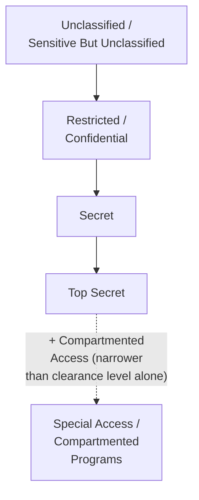

## Managing Classified and Sensitive Information

### Overview

Diplomatic work routinely generates and handles information whose unauthorized disclosure could damage national security, bilateral relationships, ongoing negotiations, or the safety of individuals (sources, local staff, dissidents in contact with a mission). Managing classified and sensitive information is therefore a foundational competency underlying every other diplomatic writing and communication skill covered in this chapter — cable-writing, briefing, correspondence, and public speaking all operate within a classification and handling framework that determines what can be said, written, shared, or published, and to whom. This item covers the general architecture of classification systems, handling protocols, and the practical judgment diplomats must exercise in day-to-day information management.

### Foundational Concepts

**Key Points**

- **Classification** is the formal designation of a document or piece of information according to the degree of damage its unauthorized disclosure could cause, which in turn determines handling, storage, and distribution requirements
- **Sensitivity** is a broader concept than classification: information can be diplomatically sensitive (embarrassing, relationship-damaging, or premature if disclosed) without meeting the formal threshold for security classification — sensitive-but-unclassified handling protocols exist precisely to cover this space
- **Need-to-know** is the governing distribution principle layered on top of classification level: holding an appropriate clearance is necessary but not sufficient to access classified material — the recipient must also have a legitimate operational need for that specific information
- **Compartmentation** restricts especially sensitive information to a narrow, explicitly designated group, even among personnel who hold the requisite general clearance level

[Inference] Exact classification terminology, thresholds, and legal frameworks are established by each state's own domestic law and vary considerably; the concepts described here reflect widely shared general practice across foreign services rather than any single country's specific legal classification scheme.

### Typical Classification Hierarchy

While terminology differs by country, most classification systems share a broadly comparable tiered structure.

1. **Unclassified / Public** — no restriction on disclosure; often still marked "Sensitive But Unclassified" (SBU) or equivalent if release could still cause diplomatic friction despite not meeting formal classification thresholds
2. **Restricted / Confidential** — disclosure could cause damage to national interests or relationships; the lowest formal classification tier in most systems
3. **Secret** — disclosure could cause serious damage to national security or international relations
4. **Top Secret** — disclosure could cause exceptionally grave damage; typically reserved for the most sensitive intelligence, defense, or high-stakes negotiating material

[Inference] The specific labels, thresholds, and legal consequences attached to each tier vary by jurisdiction; this hierarchy represents a generalized composite for orientation purposes rather than a description of any single national system.

### What Triggers Higher Classification in Diplomatic Reporting

**Key Points**

- Identification of a confidential source, contact, or intermediary whose safety or position could be jeopardized by disclosure (frequently the single most sensitive element of diplomatic reporting, and often requiring higher protection than the substantive content itself)
- Ongoing negotiating positions, fallback positions, or "walk-away" points not yet disclosed to a counterpart
- Candid assessments of foreign officials' character, reliability, or internal political vulnerabilities
- Information shared by a foreign government under an explicit confidentiality understanding
- Material relating to national security, defense cooperation, or intelligence-sharing arrangements
- Pre-decisional internal deliberation whose premature disclosure could constrain policy options or embarrass the government

### Source Protection

Protecting the identity and safety of human sources — contacts, local staff, dissidents, whistleblowers, or officials speaking candidly outside authorized channels — is a distinct and especially weighted obligation within information handling.

**Key Points**

- Cables and reports frequently use source-characterization language ("a contact with access to," "an official speaking in a personal capacity") rather than naming individuals directly, particularly in lower-classification-tier traffic that may have wider distribution
- Physical and digital security of contact lists, meeting notes, and correspondence referencing sensitive sources requires handling above and beyond the classification level of the substantive content itself
- The risk calculus for source protection is not static: a source's risk profile can change with local political developments even if the underlying reported information does not change in sensitivity
- Compromise of a source's identity can have consequences ranging from professional damage to physical danger, particularly in authoritarian or conflict-affected contexts

[Inference] Specific source-protection tradecraft is generally not publicly documented in detail by foreign services for obvious security reasons; the general principles above reflect widely acknowledged practice rather than any specific service's operational procedures.

### Handling and Storage Protocols

**Key Points**

- Classified material is generally restricted to approved secure systems and physical facilities (e.g., secure communication rooms, approved safes/containers), with transmission over unclassified or commercial channels prohibited regardless of urgency
- Discussion of classified substance in unsecured settings (open offices, public spaces, unclassified phone lines, personal devices) is a common and serious violation category, often described in training as the most frequent real-world compliance failure
- Document marking conventions (banner markings, portion markings within a document indicating which specific paragraphs carry which classification level) allow mixed-sensitivity documents to be partially releasable or partially shared without full declassification
- Destruction and retention schedules are formally governed — classified waste requires secure destruction, and retention periods are set by records-management policy rather than individual discretion

### The Sensitive-But-Unclassified Space

A significant proportion of diplomatically consequential information falls below formal classification thresholds while still requiring careful handling.

**Key Points**

- Draft communiqué language before public release, internal position papers ahead of formal tabling, and pre-decisional policy options are frequently unclassified but diplomatically sensitive if leaked prematurely
- Premature disclosure of such material can pre-empt negotiating leverage, embarrass a counterpart government, or create public expectations before a decision is finalized — even though no formal security classification applies
- This space is often governed by internal handling caveats (e.g., "Sensitive," "For Official Use Only," "Diplomatically Sensitive") rather than formal classification law, but violation still carries real professional and relationship consequences

### Declassification and Historical Release

**Key Points**

- Most classification systems provide for automatic or scheduled declassification review after a set number of years, balancing ongoing protection needs against historical transparency and public accountability
- Archived diplomatic correspondence (including cables and note verbale exchanges referenced elsewhere in this chapter) frequently becomes part of the public historical record once declassified, which is one reason drafting discipline and accuracy matter even in real time — today's cable may become tomorrow's historical source
- Declassification review typically applies redaction to still-sensitive elements (particularly source-identifying information) even when the broader document is released

[Inference] Declassification timelines and review procedures vary substantially by country, and some categories of material (ongoing intelligence equities, information provided by third-party governments) may be withheld indefinitely even after standard review periods have elapsed.

### Practical Judgment in Day-to-Day Information Handling

Beyond formal classification rules, diplomats exercise continuous situational judgment about what can be discussed, where, and with whom.

**Key Points**

- **Compartmentalizing conversations by setting** — a topic appropriate for a secure internal briefing may not be appropriate for a semi-public reception, even among colleagues, due to overhearing risk
- **Awareness of technical and physical surveillance risk** — particularly relevant when traveling or meeting in certain jurisdictions, where personal devices, hotel rooms, or meeting venues may not be secure
- **Caution in informal settings** — social events, receptions, and casual conversations with foreign counterparts are recognized vectors for both legitimate information-gathering and inadvertent overdisclosure, requiring active discipline rather than assuming informality implies lower stakes
- **Written vs. oral risk trade-offs** — sensitive material conveyed orally (with no durable record) versus in writing (creating a discoverable, potentially leakable record) involves a deliberate trade-off diplomats are trained to weigh

### Leaks, Breaches, and Their Consequences

**Key Points**

- Unauthorized disclosure of classified diplomatic material — whether through hacking, insider leak, or inadvertent mishandling — can cause direct damage to bilateral relationships, particularly when candid internal assessments of foreign officials become public
- High-profile historical leaks of diplomatic cables have demonstrated the reputational and relationship cost of exposed candid reporting, reinforcing training emphasis on both security discipline and awareness that all written reporting could eventually become public
- Breach response protocols typically involve immediate containment (identifying scope of compromise), damage assessment (which relationships, sources, or operations are affected), and notification procedures (informing affected parties and leadership through defined channels)
- The reputational and operational cost of a breach frequently extends well beyond the immediate content disclosed, as it can also damage a service's credibility with foreign partners who shared information in confidence

### Training and Institutional Culture

**Next Steps**

1. Complete mandatory classification and handling training before assuming duties involving classified material
2. Internalize marking conventions (banner and portion marking) sufficiently to apply them correctly and quickly during drafting
3. Practice situational awareness habits for discussing sensitive topics only in approved settings
4. Understand and follow source-characterization conventions when drafting reports referencing sensitive contacts
5. Know the reporting/notification procedure for a suspected or actual security incident, and report promptly rather than attempting informal remediation
6. Periodically refresh training, as classification guidance and handling technology evolve over a career

### Common Errors and Pitfalls

**Key Points**

- Discussing classified substance on unclassified phone lines, personal devices, or in public/semi-public settings due to time pressure or convenience
- Over-classifying routine material, which degrades the signal value of genuine high-sensitivity markings and creates unnecessary handling burden
- Under-classifying material that reveals source identity or ongoing negotiating positions, exposing real risk
- Failing to apply portion marking in mixed-sensitivity documents, forcing unnecessarily restrictive handling of the entire document
- Treating informal or social settings as automatically low-risk for discussing sensitive topics
- Delayed or informal handling of a suspected security incident instead of prompt formal reporting

**Related Topics**

- Reporting and Cable-Writing Conventions
- Briefing and Debriefing Techniques
- Crisis Communication and Back-Channel Diplomacy
- Diplomatic Correspondence and Note Verbale Conventions
- Institutional Memory and Knowledge Management in Foreign Ministries
- Source Evaluation and Reporting Reliability Standards
- Cybersecurity and Digital Risk in Diplomatic Practice
- Legal and Ethical Frameworks Governing Diplomatic Conduct